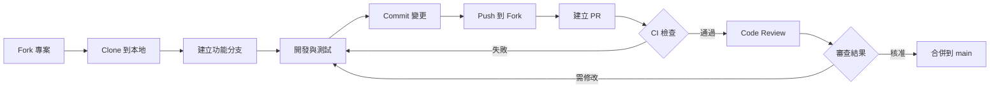
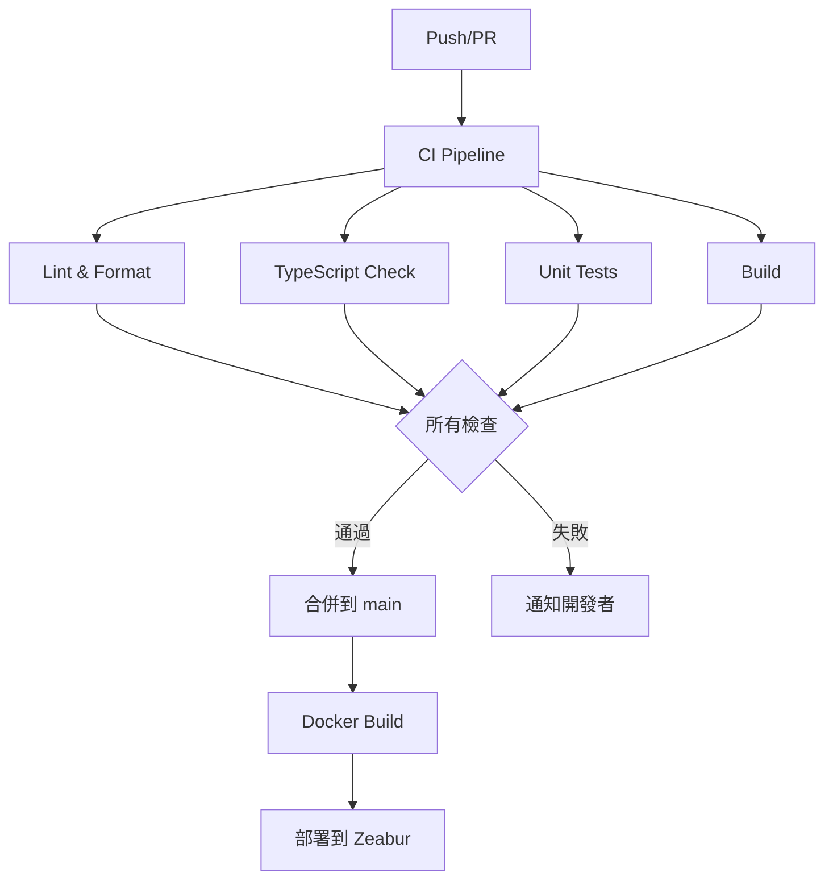

# 專案架構說明

## 📁 目錄結構

```
app/
├── .github/                          # GitHub 配置
│   ├── ISSUE_TEMPLATE/              # Issue 範本
│   │   ├── bug_report.md            # Bug 回報
│   │   ├── feature_request.md       # 功能請求
│   │   └── documentation.md         # 文檔改善
│   ├── workflows/                   # GitHub Actions
│   │   ├── ci.yml                   # 持續整合
│   │   ├── pr-check.yml             # PR 自動檢查
│   │   └── update-exchange-rates-historical.yml  # 匯率更新
│   ├── pull_request_template.md     # PR 範本
│   └── PROJECT_STRUCTURE.md         # 本檔案
│
├── apps/                            # Monorepo 應用程式
│   ├── ratewise/                    # RateWise 主應用
│   │   ├── src/
│   │   │   ├── components/          # 共用元件
│   │   │   │   ├── ErrorBoundary.tsx
│   │   │   │   └── ErrorBoundary.test.tsx
│   │   │   ├── features/            # 功能模組
│   │   │   │   └── ratewise/        # 匯率轉換功能
│   │   │   │       ├── components/  # UI 元件
│   │   │   │       │   ├── SingleConverter.tsx
│   │   │   │       │   ├── MultiConverter.tsx
│   │   │   │       │   ├── CurrencyList.tsx
│   │   │   │       │   ├── FavoritesList.tsx
│   │   │   │       │   └── ConversionHistory.tsx
│   │   │   │       ├── hooks/       # Custom Hooks
│   │   │   │       │   ├── useCurrencyConverter.ts
│   │   │   │       │   └── useExchangeRates.ts
│   │   │   │       ├── RateWise.tsx # 主元件
│   │   │   │       ├── RateWise.test.tsx
│   │   │   │       ├── constants.ts # 常數定義
│   │   │   │       ├── types.ts     # 類型定義
│   │   │   │       └── storage.ts   # 本地儲存
│   │   │   ├── services/            # API 服務
│   │   │   │   ├── exchangeRateService.ts
│   │   │   │   └── exchangeRateHistoryService.ts
│   │   │   ├── utils/               # 工具函式
│   │   │   │   ├── logger.ts
│   │   │   │   └── logger.test.ts
│   │   │   ├── App.tsx              # 應用根元件
│   │   │   ├── main.tsx             # 應用入口
│   │   │   ├── index.css            # 全域樣式
│   │   │   └── setupTests.ts        # 測試設定
│   │   ├── public/                  # 靜態資源
│   │   ├── package.json             # 專案配置
│   │   ├── vite.config.ts           # Vite 配置
│   │   ├── vitest.config.ts         # Vitest 配置
│   │   ├── tailwind.config.ts       # Tailwind 配置
│   │   └── tsconfig.json            # TypeScript 配置
│   └── shared/                      # 共用程式碼（預留）
│
├── docs/                            # 文檔目錄
│   ├── dev/                         # 開發者文檔
│   │   ├── ARCHITECTURE_BASELINE.md # 架構設計
│   │   ├── CITATIONS.md             # 技術引用
│   │   ├── CHECKLISTS.md            # 檢查清單
│   │   └── DEPENDENCY_UPGRADE_PLAN.md  # 依賴升級
│   ├── SETUP.md                     # 快速開始
│   ├── DEPLOYMENT.md                # Docker 部署
│   ├── ZEABUR_DEPLOYMENT.md         # Zeabur 部署
│   ├── SECURITY_BASELINE.md         # 安全基線
│   ├── HISTORICAL_RATES_IMPLEMENTATION.md  # 歷史匯率實作
│   ├── QUICK_START_HISTORICAL_RATES.md     # 歷史匯率快速開始
│   └── EXCHANGE_RATE_UPDATE_STRATEGIES.md  # 匯率更新策略
│
├── scripts/                         # 自動化腳本
│   ├── fetch-taiwan-bank-rates.js  # 抓取匯率資料
│   ├── monitor-deployment.sh        # 監控部署
│   └── setup-historical-rates.sh    # 設定歷史匯率
│
├── tests/                           # 測試
│   └── e2e/                         # E2E 測試
│       └── README.md                # E2E 測試說明
│
├── public/                          # 公開資料
│   └── rates/                       # 匯率資料
│       └── latest.json              # 最新匯率
│
├── .gitignore                       # Git 忽略規則
├── .env.example                     # 環境變數範例
├── Dockerfile                       # Docker 建置配置
├── docker-compose.yml               # Docker Compose 配置
├── nginx.conf                       # Nginx 配置
├── package.json                     # Root package.json
├── pnpm-lock.yaml                   # pnpm 鎖定檔案
├── pnpm-workspace.yaml              # pnpm workspace 配置
├── tsconfig.base.json               # TypeScript 基礎配置
├── commitlint.config.cjs            # Commit 訊息規範
│
├── README.md                        # 專案說明
├── LICENSE                          # 授權條款
├── CHANGELOG.md                     # 變更日誌
├── CONTRIBUTING.md                  # 貢獻指南
├── CODE_OF_CONDUCT.md               # 行為準則
├── SECURITY.md                      # 安全政策
├── AGENTS.md                        # Agent 操作守則
└── LINUS_GUIDE.md                   # Linus 開發指南
```

## 🎯 架構設計原則

### 1. Monorepo 結構

使用 pnpm workspaces 管理多個應用程式和共用程式碼：

- **優點**：
  - 統一的依賴管理
  - 共用程式碼重用
  - 原子化的跨專案變更
  - 統一的建置與測試流程

### 2. 功能模組化 (Feature-Based)

按功能而非類型組織程式碼：

```
features/
└── ratewise/
    ├── components/    # 功能專屬元件
    ├── hooks/         # 功能專屬 hooks
    ├── RateWise.tsx   # 功能主元件
    ├── types.ts       # 功能類型
    └── storage.ts     # 功能資料
```

**優點**：

- 高內聚低耦合
- 易於理解與維護
- 便於功能拆分或移除

### 3. 分層架構

```
┌─────────────────────────────────┐
│         UI Components           │  ← 展示層
├─────────────────────────────────┤
│      Custom Hooks (State)       │  ← 邏輯層
├─────────────────────────────────┤
│     Services (API Calls)        │  ← 服務層
├─────────────────────────────────┤
│    Utils (Pure Functions)       │  ← 工具層
└─────────────────────────────────┘
```

### 4. KISS 原則

遵循 **Keep It Simple, Stupid** 哲學：

- 函數短小精悍（<50 行）
- 避免深層巢狀（<3 層）
- 消除特殊情況
- 實用主義優先

詳見 `LINUS_GUIDE.md`

## 📚 文檔分類

### 使用者文檔

面向最終使用者和部署者：

- `README.md` - 專案概覽與快速開始
- `docs/SETUP.md` - 環境設定
- `docs/DEPLOYMENT.md` - Docker 部署
- `docs/ZEABUR_DEPLOYMENT.md` - Zeabur 部署

### 開發者文檔

面向貢獻者和開發者：

- `CONTRIBUTING.md` - 貢獻指南
- `docs/dev/ARCHITECTURE_BASELINE.md` - 架構設計
- `docs/dev/CITATIONS.md` - 技術引用
- `docs/dev/CHECKLISTS.md` - 檢查清單

### Agent 文檔

面向自動化 Agent 和 AI 助手：

- `AGENTS.md` - Agent 操作守則
- `LINUS_GUIDE.md` - 開發哲學

### 治理文檔

專案管理與規範：

- `CODE_OF_CONDUCT.md` - 行為準則
- `SECURITY.md` - 安全政策
- `CHANGELOG.md` - 變更日誌
- `LICENSE` - 授權條款

## 🔄 工作流程

### 開發流程



### CI/CD 流程



## 🧪 測試策略

### 測試金字塔

```
    ┌────────┐
    │   E2E  │  ← 少量（關鍵流程）
    ├────────┤
    │ 整合測試 │  ← 中等（元件互動）
    ├────────┤
    │ 單元測試 │  ← 大量（函數與元件）
    └────────┘
```

### 測試覆蓋率目標

- **單元測試**: ≥ 80%
- **整合測試**: 主要功能 100%
- **E2E 測試**: 關鍵流程 100%

## 🔒 安全層級

### 多層防禦

```
┌───────────────────────────────┐
│   CDN/Edge (Cloudflare)       │  ← WAF, DDoS, Rate Limit
├───────────────────────────────┤
│   Container (Docker)          │  ← 非 root 使用者, 最小權限
├───────────────────────────────┤
│   Application (React)         │  ← Input 驗證, XSS 防護
├───────────────────────────────┤
│   Data (localStorage)         │  ← 僅非敏感資料
└───────────────────────────────┘
```

## 📦 建置與部署

### Docker 多階段建置

```dockerfile
# Stage 1: 建置
FROM node:24-alpine AS builder
→ 安裝依賴
→ 建置應用

# Stage 2: 生產
FROM nginx:alpine
→ 複製建置產物
→ 配置 Nginx
→ 使用非 root 使用者
```

### 部署目標

- **本地開發**: `pnpm dev`
- **Docker**: `docker-compose up`
- **Zeabur**: 自動部署（push to main）

## 🛠️ 工具鏈

### 核心工具

- **建置**: Vite 5
- **框架**: React 19
- **語言**: TypeScript 5
- **樣式**: Tailwind CSS 3
- **測試**: Vitest 2
- **Lint**: ESLint 8 + Prettier 3
- **包管理**: pnpm 9

### 開發工具

- **Git Hooks**: Husky
- **Pre-commit**: lint-staged
- **Commit 規範**: commitlint
- **CI/CD**: GitHub Actions

## 📊 品質指標

### 程式碼品質

- ✅ TypeScript 嚴格模式
- ✅ ESLint 零錯誤
- ✅ Prettier 格式化
- ✅ 測試覆蓋率 ≥ 80%

### 效能指標

- ✅ Build size < 500KB
- ✅ Lighthouse ≥ 90
- ✅ LCP ≤ 2.5s
- ✅ FID ≤ 100ms

### 安全指標

- ✅ pnpm audit 無高危漏洞
- ✅ 無密鑰外洩
- ✅ HTTPS 部署
- ✅ 安全標頭配置

---

## 🔗 相關連結

- [專案說明](../README.md)
- [貢獻指南](../CONTRIBUTING.md)
- [架構設計](../docs/dev/ARCHITECTURE_BASELINE.md)
- [開發哲學](../LINUS_GUIDE.md)

---

**最後更新**: 2025-10-13
**版本**: 1.0.0
