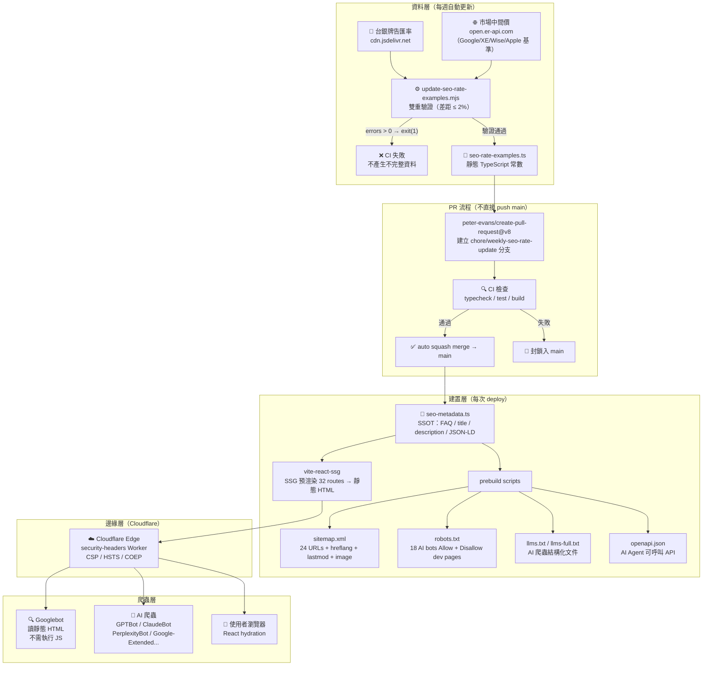
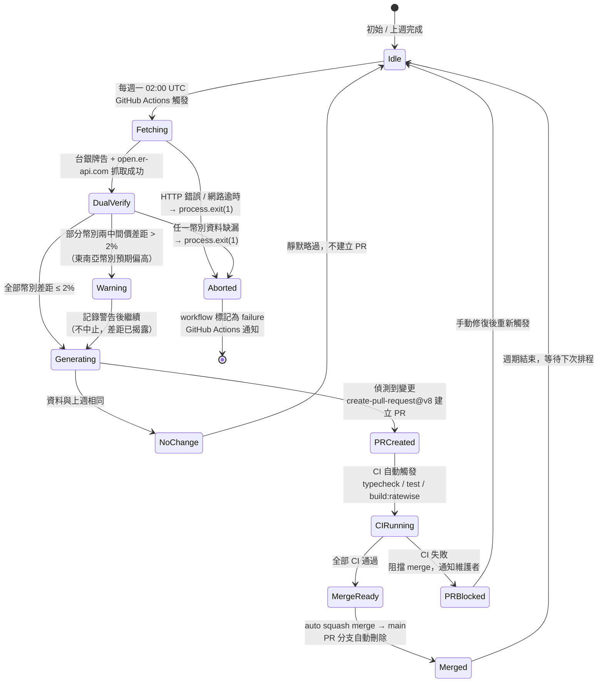

# SEO 實作指南 (SEO Implementation Guide)

> **版本**: 2.0.0
> **建立時間**: 2025-10-24T23:23:09+08:00
> **最後更新**: 2026-03-17
> **維護者**: Development Team
> **狀態**: ✅ 持續更新

---

## 📋 目錄

1. [概述](#概述)
2. [SEO 技術架構全覽](#seo-技術架構全覽)
3. [匯差數據自動化流程（狀態機）](#匯差數據自動化流程狀態機)
4. [Google 爬蟲索引流程驗證](#google-爬蟲索引流程驗證)
5. [核心 SEO 元素](#核心-seo-元素)
6. [Open Graph 與 Twitter Card](#open-graph-與-twitter-card)
7. [結構化資料 (Schema.org)](#結構化資料-schemaorg)
8. [技術 SEO](#技術-seo)
9. [圖片最佳化](#圖片最佳化)
10. [提交到搜尋引擎](#提交到搜尋引擎)
11. [AI 搜尋優化](#ai-搜尋優化)
12. [監控與維護](#監控與維護)
13. [檢查清單](#檢查清單)

---

## SEO 技術架構全覽

完整的 RateWise SEO 技術堆疊以 SSOT（單一真實來源）原則設計，所有 SEO 內容從一個設定檔向外輻射。



---

## 匯差數據自動化流程（狀態機）

週期性資料更新的完整狀態轉移，確保資料完整性與可追溯性。



---

## Google 爬蟲索引流程驗證

RateWise 對照 Google 完整索引流程的實作覆蓋率。

```mermaid
flowchart LR
    subgraph DISCOVERY["Stage 1: 發現"]
        D1["robots.txt ✅<br/>Sitemap 指向正確"]
        D2["sitemap.xml ✅<br/>24 URLs + lastmod + hreflang + image"]
        D3["llms.txt ✅<br/>AI 爬蟲 discovery"]
    end

    subgraph CRAWL2["Stage 2: 抓取"]
        C1["靜態 HTML ✅<br/>SSG 32 pages，爬蟲不需 JS"]
        C2["HTTPS ✅<br/>Cloudflare 全站強制"]
        C3["noindex 控制 ✅<br/>APP_ONLY_PATHS 精確隔離"]
    end

    subgraph PARSE["Stage 3: 解析 head"]
        P1["title ✅<br/>每頁唯一，含主關鍵字"]
        P2["meta description ✅<br/>每頁唯一"]
        P3["canonical ✅<br/>每頁都有"]
        P4["hreflang ✅<br/>zh-TW + x-default"]
        P5["meta robots ✅<br/>index/noindex 精確控制"]
    end

    subgraph SOCIAL["Stage 4: 社交預覽"]
        S1["Open Graph ✅<br/>og:title / description / image / type / locale"]
        S2["Twitter Card ✅<br/>summary_large_image"]
    end

    subgraph SCHEMA["Stage 5: 結構化資料"]
        R1["WebSite ✅"]
        R2["SoftwareApplication ✅"]
        R3["Organization ✅"]
        R4["FAQ 內容區塊 ✅<br/>保留可讀 HTML，不輸出 FAQPage"]
        R5["HowTo ✅"]
        R6["BreadcrumbList ✅"]
        R7["Article ✅"]
        R8["FinancialService ✅"]
        R9["SearchAction ⬜<br/>待評估 URL pattern"]
    end

    subgraph EXPERIENCE["Stage 6: 頁面體驗"]
        E1["Mobile-Friendly ✅<br/>RWD + PWA manifest"]
        E2["PWA ✅<br/>manifest + Service Worker"]
        E3["Security Headers ✅<br/>CSP / HSTS via CF Worker"]
        E4["Core Web Vitals ⚠️<br/>Lighthouse CI performance < 0.90（已知）"]
    end

    subgraph AI["Stage 7: AI 搜尋"]
        A1["llms.txt / llms-full.txt ✅"]
        A2["openapi.json ✅<br/>AI Agent 可呼叫"]
        A3["18 AI Bots Allow ✅<br/>GPTBot / ClaudeBot / PerplexityBot..."]
        A4["雙幣匯差標示 ✅<br/>外幣 + 台幣，LLM 引用語意設計"]
    end

    subgraph FRESHNESS["Stage 8: 內容新鮮度"]
        F1["sitemap lastmod ✅<br/>每次 build 自動更新"]
        F2["匯差數字每週更新 ✅<br/>GitHub Actions 自動化"]
        F3["FAQ 含更新日期 ✅<br/>最後更新：YYYY-MM-DD"]
    end

    DISCOVERY --> CRAWL2 --> PARSE --> SOCIAL --> SCHEMA --> EXPERIENCE --> AI --> FRESHNESS
```



---

## 概述

### 目標

本指南提供 RateWise 專案的 SEO 實作規範，涵蓋傳統 SEO、社群媒體優化、AI 搜尋引擎優化 (AEO/LLMO/GEO) 的完整策略。

### 適用範圍

- **傳統 SEO**: Google、Bing、Yahoo 等搜尋引擎
- **社群 SEO**: Facebook、Twitter/X、LinkedIn 等平台
- **AI SEO**: ChatGPT、Claude、Perplexity、Google SGE 等 AI 搜尋

---

## 核心 SEO 元素

### 1. Meta Tags

#### Title Tag (標題標籤)

**最佳實踐**:

- 長度：50-60 字元 (中文約 25-30 字)
- 包含主要關鍵字
- 格式：`主要關鍵字 - 次要關鍵字 | 品牌名稱`

**範例**:

```html
<title>RateWise - 即時匯率轉換器 | 支援 TWD、USD、JPY、EUR 等多幣別換算</title>
```

#### Meta Description (描述標籤)

**最佳實踐**:

- 長度：150-160 字元 (中文約 75-80 字)
- 包含核心價值主張
- 包含行動呼籲 (CTA)
- 自然融入關鍵字

**範例**:

```html
<meta
  name="description"
  content="RateWise 提供即時匯率換算服務，參考臺灣銀行牌告匯率，支援 TWD、USD、JPY、EUR、GBP 等 30+ 種貨幣。快速、準確、離線可用的 PWA 匯率工具。"
/>
```

#### Keywords (關鍵字標籤)

**注意**: Google 已不再使用 keywords meta tag，但仍可作為內容規劃參考。

**範例**:

```html
<meta
  name="keywords"
  content="匯率好工具,匯率,匯率換算,即時匯率,台幣匯率,TWD,USD,外幣兌換,匯率查詢,臺灣銀行匯率"
/>
```

### 2. Canonical URL (標準網址)

**用途**: 防止重複內容問題

**範例**:

```html
<link rel="canonical" href="https://app.haotool.org/ratewise/" />
```

### 3. Language Tags (語言標籤)

**用途**: 指定網頁語言，支援國際化

**範例**:

```html
<meta http-equiv="content-language" content="zh-TW" />
<meta name="language" content="Traditional Chinese" />
```

### 4. Robots Meta Tag

**用途**: 控制搜尋引擎爬取行為

**最佳實踐**:

```html
<meta
  name="robots"
  content="index, follow, max-image-preview:large, max-snippet:-1, max-video-preview:-1"
/>
```

**指令說明**:

- `index`: 允許索引此頁面
- `follow`: 允許追蹤連結
- `max-image-preview:large`: 允許大型圖片預覽
- `max-snippet:-1`: 無限制摘要長度
- `max-video-preview:-1`: 無限制影片預覽

---

## Open Graph 與 Twitter Card

### Open Graph (Facebook/LinkedIn)

**核心標籤**:

```html
<!-- 基礎標籤 -->
<meta property="og:type" content="website" />
<meta property="og:url" content="https://app.haotool.org/ratewise/" />
<meta property="og:title" content="RateWise - 即時匯率轉換器" />
<meta property="og:description" content="快速、準確的匯率換算工具，支援 30+ 種貨幣" />

<!-- 圖片標籤 -->
<meta property="og:image" content="https://app.haotool.org/ratewise/og-image.png" />
<meta property="og:image:width" content="1200" />
<meta property="og:image:height" content="630" />
<meta property="og:image:alt" content="RateWise 匯率轉換器應用截圖" />

<!-- 地區化標籤 -->
<meta property="og:locale" content="zh_TW" />
<meta property="og:locale:alternate" content="en_US" />
<meta property="og:site_name" content="RateWise" />
<meta property="og:updated_time" content="2025-10-24T23:23:09+08:00" />
```

### Twitter Card

**核心標籤**:

```html
<meta name="twitter:card" content="summary_large_image" />
<meta name="twitter:url" content="https://app.haotool.org/ratewise/" />
<meta name="twitter:title" content="RateWise - 即時匯率轉換器" />
<meta name="twitter:description" content="快速、準確的匯率換算工具，支援 30+ 種貨幣" />
<meta name="twitter:image" content="https://app.haotool.org/ratewise/og-image.png" />
<meta name="twitter:image:alt" content="RateWise 匯率轉換器" />
```

**Card 類型**:

- `summary`: 小型卡片 (120x120 圖片)
- `summary_large_image`: 大型卡片 (1200x630 圖片) ✅ 推薦
- `app`: 應用程式卡片
- `player`: 影片播放器卡片

---

## 結構化資料 (Schema.org)

### JSON-LD 格式

**為什麼使用 JSON-LD?**

- ✅ Google 官方推薦
- ✅ 易於維護，不與 HTML 混合
- ✅ 支援 React/SPA 動態生成
- ✅ AI 爬蟲友善

### 核心 Schema Types

#### 1. WebApplication Schema

```json
{
  "@context": "https://schema.org",
  "@type": "WebApplication",
  "name": "RateWise",
  "alternateName": "匯率好工具",
  "description": "即時匯率轉換器，支援 30+ 種貨幣",
  "url": "https://app.haotool.org/ratewise/",
  "applicationCategory": "FinanceApplication",
  "operatingSystem": "Any",
  "browserRequirements": "Requires JavaScript",
  "offers": {
    "@type": "Offer",
    "price": "0",
    "priceCurrency": "USD"
  },
  "featureList": [
    "即時匯率查詢",
    "單幣別換算",
    "多幣別同時換算",
    "歷史匯率趨勢",
    "離線使用",
    "PWA 支援"
  ],
  "screenshot": "https://app.haotool.org/ratewise/screenshots/desktop-converter.png",
  "aggregateRating": {
    "@type": "AggregateRating",
    "ratingValue": "4.8",
    "ratingCount": "1250"
  }
}
```

#### 2. Organization Schema

```json
{
  "@context": "https://schema.org",
  "@type": "Organization",
  "name": "RateWise",
  "url": "https://app.haotool.org/ratewise/",
  "logo": "https://app.haotool.org/ratewise/logo.png",
  "contactPoint": {
    "@type": "ContactPoint",
    "contactType": "Customer Support",
    "email": "haotool.org@gmail.com"
  },
  "sameAs": []
}
```

#### 3. FAQ 內容策略（不輸出 FAQPage JSON-LD）

RateWise 保留 FAQ 內容本身，讓使用者與爬蟲都能直接閱讀，但不額外輸出 `FAQPage` JSON-LD。

原因：

- Google 現行 FAQ rich result 僅限政府與醫療等高權威站點。
- 本站 FAQ 主要服務搜尋意圖覆蓋與內容理解，不把 FAQPage rich result 當成通用加分手段。
- 這可避免文件、測試與實際輸出的結構化資料失同步。

實作原則：

- FAQ 文字保留在頁面可見內容中。
- 內容頁只輸出實際使用的 schema，如 `Article`、`HowTo`、`BreadcrumbList`、`FinancialService`。
- 測試層持續驗證靜態 HTML 不應出現 `FAQPage` JSON-LD。

---

## 技術 SEO

### 0. 2025 預渲染 / SSG 最佳實踐

- **站點 URL 標準化**：所有 SSG/SEO 腳本必須使用尾斜線的站點 URL（例如 `https://app.haotool.org/ratewise/`），避免 `.../ratewisefaq/` 類型的錯誤 canonical。
  - 來源：`apps/ratewise/vite.config.ts`、`apps/ratewise/src/config/seo-paths.ts`、`scripts/generate-sitemap-2025.mjs`
- **單一真實來源 (SSOT)**：`seo-paths.config.(ts|mjs)` 定義的 `SEO_PATHS`、`SITE_CONFIG` 為唯一路徑與站點設定來源，sitemap 生成、SSG includedRoutes、SEO 健康檢查皆應引用此配置。
- **Canonical / hreflang 一致性**：`onPageRendered` 必須以標準化 URL 拼接 canonical/hreflang/JSON-LD，並與 sitemap `<loc>` 完全一致。
- **驗證流程**：`pnpm generate:sitemap` + `pnpm verify:sitemap-2025` + `pnpm verify:production-seo`，確保 prerender HTML 與 sitemap、robots、llms.txt 同步。

### 1. Sitemap.xml

**位置**: `/public/sitemap.xml`

**範例結構**:

```xml
<?xml version="1.0" encoding="UTF-8"?>
<urlset xmlns="http://www.sitemaps.org/schemas/sitemap/0.9"
        xmlns:xhtml="http://www.w3.org/1999/xhtml">
  <url>
    <loc>https://app.haotool.org/ratewise/</loc>
    <lastmod>2025-12-21T03:11:35+08:00</lastmod>
    <xhtml:link rel="alternate" hreflang="zh-TW" href="https://app.haotool.org/ratewise/" />
    <xhtml:link rel="alternate" hreflang="x-default" href="https://app.haotool.org/ratewise/" />
  </url>
</urlset>
```

**更新原則（2025 標準）**:

- 保留 `<lastmod>` 並使用實際檔案修改時間（含時區）。
- 移除 `<changefreq>` 與 `<priority>`（Google/Bing 已忽略）。
- `<loc>` 必須與 SSG 預渲染輸出及 `SEO_PATHS` 完全一致（尾斜線）。

### 2. Robots.txt

**位置**: `/public/robots.txt`

**範例**:

```txt
# RateWise - 匯率好工具 Robots.txt
User-agent: *
Allow: /

# AI 爬蟲明確允許
User-agent: GPTBot
Allow: /

User-agent: ChatGPT-User
Allow: /

User-agent: Claude-Web
Allow: /

User-agent: ClaudeBot
Allow: /

User-agent: PerplexityBot
Allow: /

User-agent: Google-Extended
Allow: /

# Sitemap
Sitemap: https://app.haotool.org/ratewise/sitemap.xml
```

### 3. PWA Meta Tags

```html
<!-- PWA 基礎 -->
<meta name="theme-color" content="#8B5CF6" />
<meta name="apple-mobile-web-app-capable" content="yes" />
<meta name="apple-mobile-web-app-status-bar-style" content="default" />
<meta name="apple-mobile-web-app-title" content="RateWise" />
<link rel="manifest" href="%BASE_URL%manifest.webmanifest" />
<link rel="apple-touch-icon" href="%BASE_URL%apple-touch-icon.png" />
```

### 4. Zeabur Subpath Deployment（`/ratewise`）

- 使用 `VITE_RATEWISE_BASE_PATH` 控制部署子路徑：預設 `/ratewise/`，如需根目錄測試或部署請顯式設為 `/`
  - **注意**：PWA manifest 的 `scope`/`start_url`/`id` 需保留尾斜線（由 `normalizeSiteUrl` 統一處理），確保 Service Worker 範圍與 canonical/hreflang 一致，不再移除尾斜線。
  - Vite 構建 `base` 保持 `/ratewise/`（有尾斜線），確保資源路徑與 sitemap `<loc>` 對齊
- 部署層需將 `/ratewise/` 直接對應到 RateWise build 輸出目錄（例如 Nginx `location /ratewise/` → `ratewise-app/`），避免使用 repo 內靜態資產鏡像
- 驗證指令：

  ```bash
  curl -I https://app.haotool.org/ratewise/robots.txt
  curl -I https://app.haotool.org/ratewise/llms.txt
  curl -I https://app.haotool.org/ratewise/manifest.webmanifest
  curl -I https://app.haotool.org/ratewise/favicon.ico
  ```

- 伺服器層（`nginx.conf`）需額外加入 `/ratewise/sitemap.xml`、`/ratewise/manifest.webmanifest`、`/ratewise/robots.txt`、`/ratewise/llms.txt` 的 `location` 規則，以避免被 SPA fallback 導向 `index.html` 並確保 `Content-Type` 正確
- `location = /ratewise/ { return 301 /ratewise; }` 用來將尾斜線正規化，避免 `/ratewise/` 與 `/ratewise` 被 Google 視為重複頁面

---

## 圖片最佳化

### OG Image 最佳實踐

**標準尺寸**:

- **Open Graph**: 1200×630 px (比例 1.91:1) ✅ 推薦
- **Twitter Card**: 1200×630 px (summary_large_image)
- **Apple Touch Icon**: 180×180 px

**檔案要求**:

- 格式：PNG 或 JPG
- 大小：< 1 MB (建議 < 500 KB)
- 顏色：sRGB 色彩空間

### 圖片處理工具

**1. ImageMagick (命令列)**

```bash
# 調整為 1200x630，居中裁切
magick convert og-image.png -resize '1200x630^' -gravity center -extent 1200x630 -quality 95 og-image-optimized.png
```

**2. macOS 內建 sips**

```bash
# 調整尺寸
sips -z 630 1200 og-image.png --out og-image-optimized.png
```

**3. 線上工具**

- [Canva](https://www.canva.com/) - 圖形設計平台
- [Figma](https://www.figma.com/) - UI 設計工具
- [ImageOptim](https://imageoptim.com/) - 圖片壓縮

### 圖片 SEO

```html
<!-- 為所有圖片加上 alt 屬性 -->


<!-- 使用描述性檔名 -->
<!-- ✅ 好: ratewise-converter-screenshot.png -->
<!-- ❌ 差: image1.png -->
```

---

## 提交到搜尋引擎

### 1. Google Search Console

**步驟**:

1. **註冊並驗證網站**
   - 前往 [Google Search Console](https://search.google.com/search-console)
   - 點擊「新增資源」
   - 選擇「網址前置字元」
   - 輸入 `https://app.haotool.org/ratewise/`

2. **驗證方式**
   - **HTML 檔案上傳** (推薦)
   - **HTML 標籤**
   - **Google Analytics**
   - **DNS 記錄**

3. **提交 Sitemap**
   - 左側選單 → Sitemap
   - 輸入 `https://app.haotool.org/ratewise/sitemap.xml`
   - 點擊「提交」

4. **監控指標**
   - 索引涵蓋範圍
   - Core Web Vitals
   - 行動裝置可用性
   - 點擊率、曝光次數

### 2. Bing Webmaster Tools

**步驟**:

1. **註冊並驗證**
   - 前往 [Bing Webmaster Tools](https://www.bing.com/webmasters)
   - 新增網站 `https://app.haotool.org/ratewise/`
   - 驗證方式：XML 檔案、Meta Tag、CNAME

2. **提交 Sitemap**
   - 左側選單 → Sitemap
   - 輸入 `https://app.haotool.org/ratewise/sitemap.xml`

3. **使用 URL 檢查工具**
   - 手動提交重要頁面進行即時索引

### 3. 其他搜尋引擎

#### Baidu (百度)

- [Baidu 站長平台](https://ziyuan.baidu.com/)
- 需要中國手機號碼註冊

#### Yandex (俄羅斯)

- [Yandex Webmaster](https://webmaster.yandex.com/)

#### Naver (韓國)

- [Naver Search Advisor](https://searchadvisor.naver.com/)

---

## AI 搜尋優化

### AI 爬蟲支援

**已支援的 AI 爬蟲** (在 robots.txt 明確允許):

- `GPTBot` - OpenAI ChatGPT
- `ChatGPT-User` - ChatGPT Browse
- `Claude-Web` - Anthropic Claude
- `ClaudeBot` - Claude Bot
- `PerplexityBot` - Perplexity AI
- `Google-Extended` - Google Bard/Gemini

### LLMS.txt 檔案

**位置**: `/public/llms.txt`

**用途**: 提供 AI 模型易於理解的結構化資訊

**範例**:

```markdown
# RateWise - 匯率好工具

> 即時匯率轉換器 | 支援 30+ 種貨幣 | PWA 應用

## 核心功能

- 即時匯率查詢 (參考臺灣銀行牌告匯率)
- 單幣別換算
- 多幣別同時換算
- 歷史匯率趨勢 (30 天)
- 離線使用 (PWA)

## 技術棧

- React 18
- TypeScript
- Vite
- Tailwind CSS
- PWA (Service Worker)

## 數據來源

- 臺灣銀行牌告匯率 API
- 更新頻率：每日
```

**維護準則**:

- 每次正式釋出後同步更新 `最後更新` 與 `版本`
- 聯絡資訊需與網站 footer、`SEOHelmet` 的 `Organization.sameAs` 完全一致
- 修改完成後執行 `node scripts/update-release-metadata.js` 鏡像至 `public/ratewise/llms.txt`
- CLI 驗證：`curl -I https://app.haotool.org/ratewise/llms.txt`

### AEO (Answer Engine Optimization)

**策略**:

1. **簡潔直接的回答**
   - 在內容前 100-200 字提供核心答案
   - 使用 `<p>` 標籤，不要隱藏在複雜結構中

2. **問答格式**
   - 使用 `<h2>` 或 `<h3>` 標題作為問題
   - 緊接著提供 40-50 字的簡潔答案

3. **結構化內容**
   - 使用有序列表 `<ol>` 表示步驟
   - 使用無序列表 `<ul>` 表示選項
   - 使用表格 `<table>` 呈現對比資料
   - 主要頁面透過 `<SEOHelmet howTo={...}>` 與 `<SEOHelmet faq={...}>` 產生 HowTo / FAQ Schema

---

## 監控與維護

### 關鍵指標 (KPI)

**搜尋引擎指標**:

- 自然搜尋流量
- 索引頁面數量
- 平均排名位置
- 點擊率 (CTR)
- 曝光次數

**技術 SEO 指標**:

- Core Web Vitals
  - LCP (Largest Contentful Paint) ≤ 2.5s
  - FID (First Input Delay) ≤ 100ms
  - CLS (Cumulative Layout Shift) ≤ 0.1
- 行動裝置可用性評分
- HTTPS 覆蓋率 = 100%

**AI 搜尋指標**:

- AI 爬蟲爬取次數 (從伺服器日誌分析)
- llms.txt 存取次數
- 品牌提及次數 (ChatGPT、Perplexity)

### 監控工具

1. **Google Search Console** - 搜尋表現
2. **Google Analytics 4** - 流量分析
3. **Lighthouse CI** - 效能監控
4. **Schema Validator** - 結構化資料驗證
5. **Cloudflare Analytics** - CDN 層級分析

### 定期檢查

**每週**:

- [ ] 檢查 Search Console 錯誤
- [ ] 監控 Core Web Vitals
- [ ] 查看新索引頁面

**每月**:

- [ ] 更新 Sitemap lastmod 日期
- [ ] 檢查斷鏈 (broken links)
- [ ] 分析搜尋關鍵字表現
- [ ] 更新 Schema.org 評分 (如有新評價)

**每季**:

- [ ] 競爭對手 SEO 分析
- [ ] 內容更新與擴充
- [ ] 結構化資料審查
- [ ] 國際化擴展評估

---

## 檢查清單

### 上線前檢查

#### Meta Tags

- [ ] Title tag 已設定 (50-60 字元)
- [ ] Meta description 已設定 (150-160 字元)
- [ ] Meta keywords 已設定
- [ ] Canonical URL 已設定
- [ ] Language tags 已設定
- [ ] Robots meta tag 已設定

#### Open Graph

- [ ] og:type 已設定
- [ ] og:url 已設定
- [ ] og:title 已設定
- [ ] og:description 已設定
- [ ] og:image 已設定 (1200×630)
- [ ] og:image:width 已設定
- [ ] og:image:height 已設定
- [ ] og:locale 已設定

#### Twitter Card

- [ ] twitter:card 已設定 (summary_large_image)
- [ ] twitter:title 已設定
- [ ] twitter:description 已設定
- [ ] twitter:image 已設定

#### 結構化資料

- [ ] WebApplication Schema 已實作
- [ ] Organization Schema 已實作
- [ ] FAQ 內容與頁面可見文字同步，且未誤輸出 FAQPage JSON-LD
- [ ] JSON-LD 語法通過驗證

#### 技術 SEO

- [ ] sitemap.xml 已建立並可存取
- [ ] robots.txt 已建立並正確配置
- [ ] AI 爬蟲已允許 (robots.txt)
- [ ] llms.txt 已建立
- [ ] `VITE_RATEWISE_BASE_PATH` 已設定（prod: `/ratewise/`）
- [ ] HTTPS 已啟用
- [ ] PWA manifest.json 已配置
- [ ] Service Worker 已實作
- [ ] `https://app.haotool.org/ratewise/robots.txt` 回傳 200
- [ ] `https://app.haotool.org/ratewise/sitemap.xml` 回傳 200
- [ ] `https://app.haotool.org/ratewise/llms.txt` 回傳 200
- [ ] `https://app.haotool.org/ratewise/manifest.webmanifest` 回傳 200
- [ ] `https://app.haotool.org/ratewise/favicon.ico` 回傳 200

#### 圖片優化

- [ ] OG image 尺寸正確 (1200×630)
- [ ] OG image 檔案大小 < 1 MB
- [ ] Apple touch icon 已設定 (180×180)
- [ ] Favicon 已設定
- [ ] 所有圖片有 alt 屬性

#### 效能

- [ ] Lighthouse SEO 評分 ≥ 90
- [ ] Lighthouse Performance 評分 ≥ 90
- [ ] Core Web Vitals 通過
- [ ] 行動裝置友善

### 上線後檢查

- [ ] Google Search Console 已驗證
- [ ] Bing Webmaster Tools 已驗證
- [ ] Sitemap 已提交 (Google)
- [ ] Sitemap 已提交 (Bing)
- [ ] 首頁已被索引 (site:app.haotool.org/ratewise)
- [ ] Open Graph 預覽正常 (Facebook Debugger)
- [ ] Twitter Card 預覽正常 (Twitter Card Validator)
- [ ] Schema.org 驗證通過 (Rich Results Test)

---

## 實作檔案位置

### 核心檔案

```
apps/ratewise/
├── src/
│   └── components/
│       └── SEOHelmet.tsx           # SEO Meta Tags 元件
├── public/
│   ├── og-image.png                # Open Graph 圖片 (1200×630)
│   ├── apple-touch-icon.png        # Apple Touch Icon (180×180)
│   ├── favicon.ico                 # 網站圖示
│   ├── favicon.svg                 # SVG 圖示
│   ├── sitemap.xml                 # 網站地圖
│   ├── robots.txt                  # 爬蟲規則
│   ├── llms.txt                    # AI 模型資訊
│   └── manifest.webmanifest        # PWA Manifest
└── index.html                      # HTML 基礎 Meta Tags
```

### 使用範例

```tsx
import { SEOHelmet } from '@/components/SEOHelmet';

function HomePage() {
  return (
    <>
      <SEOHelmet
        title="首頁"
        description="RateWise 即時匯率轉換器"
        pathname="/"
        faq={[
          {
            question: '如何使用 RateWise？',
            answer: '選擇貨幣、輸入金額即可換算。',
          },
        ]}
      />
      {/* 頁面內容 */}
    </>
  );
}
```

---

## 參考資源

### 官方文檔

- [Google Search Central](https://developers.google.com/search)
- [Schema.org](https://schema.org/)
- [Open Graph Protocol](https://ogp.me/)
- [Twitter Cards](https://developer.twitter.com/en/docs/twitter-for-websites/cards/overview/abouts-cards)
- [MDN Web Docs - SEO](https://developer.mozilla.org/en-US/docs/Glossary/SEO)

### 驗證工具

- [Google Rich Results Test](https://search.google.com/test/rich-results)
- [Facebook Sharing Debugger](https://developers.facebook.com/tools/debug/)
- [Twitter Card Validator](https://cards-dev.twitter.com/validator)
- [Lighthouse](https://developers.google.com/web/tools/lighthouse)
- [Schema Markup Validator](https://validator.schema.org/)

### 分析工具

- [Google Search Console](https://search.google.com/search-console)
- [Google Analytics 4](https://analytics.google.com/)
- [Bing Webmaster Tools](https://www.bing.com/webmasters)
- [Cloudflare Analytics](https://www.cloudflare.com/analytics/)

---

## 版本歷史

### v2.0.0 (2026-03-17)

- ✅ 新增「SEO 技術架構全覽」Mermaid flowchart（SSOT → SSG → Cloudflare → 爬蟲完整流程）
- ✅ 新增「匯差數據自動化流程」Mermaid stateDiagram（狀態機，含錯誤中止路徑）
- ✅ 新增「Google 爬蟲索引流程驗證」完整對照表 flowchart
- ✅ 更新匯差腳本流程為 PR-based（peter-evans/create-pull-request@v8，不直接 push main）
- ✅ About 頁面新增 SEO 技術透明度 FAQ（3 項）

### v1.0.0 (2025-10-24)

- ✅ 初始版本建立
- ✅ 涵蓋核心 SEO 元素
- ✅ Open Graph 與 Twitter Card 規範
- ✅ 結構化資料實作指南
- ✅ 圖片最佳化流程
- ✅ 搜尋引擎提交方法
- ✅ AI 搜尋優化策略
- ✅ 完整檢查清單

---

> **維護提醒**: 本文檔應隨專案 SEO 策略演進持續更新。每次重大 SEO 變更後，請更新對應章節並增加版本號。
