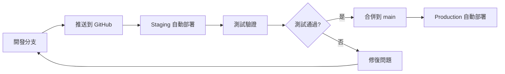

# Zeabur 測試環境設置指南

**文檔版本**: v1.0  
**建立時間**: 2025-11-06T12:15:00+08:00  
**狀態**: ✅ 實用指南  
**目的**: 避免在生產環境冒險部署，建立獨立的測試伺服器

---

## § 1 為什麼需要測試環境？

### 問題背景

- ❌ 直接在生產環境部署可能導致服務中斷（如 403 Forbidden 錯誤）
- ❌ 配置錯誤會影響真實用戶
- ❌ 回退操作需要時間，影響服務可用性

### 解決方案

✅ 在 Zeabur 上為每個測試分支部署獨立的測試伺服器  
✅ 驗證通過後再合併到生產環境  
✅ 零風險測試新功能和配置變更

---

## § 2 Zeabur 多環境部署策略

### 2.1 推薦架構

```
生產環境 (Production)
├── 專案: ratewise-production
├── 分支: main
├── 網域: app.haotool.org/ratewise
└── 自動部署: ✅ 啟用

測試環境 (Staging)
├── 專案: ratewise-staging
├── 分支: fix/403-forbidden-error (或其他測試分支)
├── 網域: staging-ratewise.zeabur.app (Zeabur 提供的免費網域)
└── 自動部署: ✅ 啟用

開發環境 (Development) - 可選
├── 專案: ratewise-dev
├── 分支: develop
├── 網域: dev-ratewise.zeabur.app
└── 自動部署: ✅ 啟用
```

### 2.2 環境隔離優勢

| 環境            | 用途               | 風險等級  | 更新頻率    |
| --------------- | ------------------ | --------- | ----------- |
| **Production**  | 真實用戶訪問       | 🔴 高風險 | 每週 1-2 次 |
| **Staging**     | 功能驗證、配置測試 | 🟡 中風險 | 每日多次    |
| **Development** | 開發測試           | 🟢 低風險 | 隨時        |

---

## § 3 設置步驟（詳細教學）

### 步驟 1: 創建測試專案

1. 登入 [Zeabur 控制台](https://dash.zeabur.com/)
2. 點擊 **「Create Project」** 按鈕
3. 專案命名建議：
   ```
   生產環境: ratewise-production
   測試環境: ratewise-staging
   開發環境: ratewise-dev
   ```
4. 選擇部署區域（建議與生產環境相同）
   - **Asia Pacific (Hong Kong)** - 適合台灣用戶
   - **Asia Pacific (Tokyo)** - 備選方案

### 步驟 2: 綁定 GitHub 倉庫

1. 在新專案中，點擊 **「Deploy New Service」**
2. 選擇 **「GitHub」**
3. 首次使用需要：
   - 點擊 **「Configure GitHub」**
   - 安裝 Zeabur GitHub App
   - 授權訪問 `haotool/app` 倉庫

### 步驟 3: 部署測試分支

1. **選擇倉庫**: `haotool/app`
2. **選擇分支**:
   ```
   測試環境: fix/403-forbidden-error
   生產環境: main
   ```
3. **服務名稱**: `ratewise-staging`
4. **自動部署設置**:
   ```yaml
   ✅ Watch Branches: fix/403-forbidden-error
   ✅ Auto Deploy: 啟用
   ✅ Production Mode: 啟用
   ```

### 步驟 4: 配置環境變數

#### 4.1 必要環境變數

```bash
# 基礎路徑配置（測試環境可以使用根路徑）
VITE_BASE_PATH=/

# 建置時間（自動生成）
BUILD_TIME=2025-11-06T12:15:00+08:00

# Git 資訊（Zeabur 自動提供）
GIT_COMMIT_HASH=<自動>
GIT_COMMIT_COUNT=<自動>

# Node 環境
NODE_ENV=production
CI=true
```

#### 4.2 測試環境特殊配置

```bash
# 標示測試環境
ENVIRONMENT=staging

# 可選：啟用除錯模式
VITE_SENTRY_DEBUG=true

# 可選：使用測試 API
VITE_API_ENDPOINT=https://api-staging.example.com
```

### 步驟 5: 配置網域

#### 5.1 使用 Zeabur 免費網域（推薦測試環境）

Zeabur 會自動提供免費網域：

```
https://<service-name>-<random-id>.zeabur.app
例如: https://ratewise-staging-abc123.zeabur.app
```

#### 5.2 使用自訂網域（可選）

如果您有額外的網域：

```
測試環境: staging.haotool.org
開發環境: dev.haotool.org
```

配置步驟：

1. 在 Zeabur 服務設置中，點擊 **「Networking」**
2. 點擊 **「Add Domain」**
3. 輸入網域名稱
4. 在 DNS 服務商（如 Cloudflare）添加 CNAME 記錄：
   ```
   CNAME staging -> <zeabur-provided-domain>
   ```

---

## § 4 部署流程最佳實踐

### 4.1 標準部署流程



### 4.2 測試檢查清單

在合併到 main 之前，確保在 Staging 環境完成：

#### 功能測試

- [ ] 所有頁面可正常訪問
- [ ] 匯率轉換功能正常
- [ ] 歷史資料圖表顯示正確
- [ ] PWA 安裝功能正常
- [ ] Service Worker 正常運作

#### 效能測試

- [ ] Lighthouse 分數 ≥ 90
- [ ] 首屏載入時間 < 3 秒
- [ ] API 回應時間 < 500ms

#### 安全測試

- [ ] 無 403/404/500 錯誤
- [ ] HTTPS 正常運作
- [ ] CSP 標頭正確配置
- [ ] 無 console 錯誤

#### 相容性測試

- [ ] Chrome/Edge 測試通過
- [ ] Firefox 測試通過
- [ ] Safari 測試通過
- [ ] 行動裝置測試通過

---

## § 5 常見問題與解決方案

### Q1: 如何切換測試分支？

**方法 1: 在 Zeabur 控制台切換**

1. 進入服務設置
2. 點擊 **「Source」** 標籤
3. 選擇 **「Change Branch」**
4. 選擇新分支並儲存
5. Zeabur 會自動重新部署

**方法 2: 使用 Git 標籤**

```bash
# 為測試分支打標籤
git tag -a staging-v1.0.0 -m "Staging release v1.0.0"
git push origin staging-v1.0.0

# 在 Zeabur 設置中選擇標籤部署
```

### Q2: 測試環境的資料庫怎麼辦？

**選項 1: 使用獨立測試資料庫**

```bash
# 在 Zeabur 專案中新增 PostgreSQL/MongoDB 服務
# 自動獲得獨立的資料庫連線字串
DATABASE_URL=<staging-database-url>
```

**選項 2: 使用生產資料庫的副本**

```bash
# 定期從生產環境複製資料到測試環境
# 注意：需要脫敏處理敏感資料
```

**選項 3: 使用 Mock 資料**

```bash
# 對於前端專案，可以使用 Mock API
VITE_USE_MOCK_DATA=true
```

### Q3: 測試環境會產生額外費用嗎？

Zeabur 計費方式：

- **Developer Plan (免費)**:
  - 1 個專案
  - 無限服務
  - 免費網域
  - ⚠️ 限制：只能有 1 個專案

- **Team Plan ($5/月)**:
  - 無限專案 ✅
  - 無限服務
  - 自訂網域
  - **推薦用於多環境部署**

- **按使用量計費**:
  - CPU/記憶體/流量
  - 測試環境通常流量很小，成本 < $1/月

### Q4: 如何防止測試環境被搜尋引擎索引？

**方法 1: robots.txt**

```txt
# 在測試環境的 public/robots.txt
User-agent: *
Disallow: /
```

**方法 2: Meta 標籤**

```html
<!-- 在測試環境的 index.html -->
<meta name="robots" content="noindex, nofollow" />
```

**方法 3: HTTP 標頭**

```nginx
# 在 nginx.conf 中添加
add_header X-Robots-Tag "noindex, nofollow" always;
```

### Q5: 如何同步生產環境的配置到測試環境？

**使用環境變數模板**:

1. 在專案根目錄創建 `.env.example`
2. 列出所有必要的環境變數
3. 在 Zeabur 控制台使用「Import from .env」功能
4. 修改測試環境特定的值

```bash
# .env.example
VITE_BASE_PATH=/ratewise/
VITE_SITE_URL=https://app.haotool.org
NODE_ENV=production
CI=true

# 測試環境需要修改的值：
# VITE_BASE_PATH=/
# VITE_SITE_URL=https://staging-ratewise.zeabur.app
```

---

## § 6 進階配置

### 6.1 使用 Zeabur CLI 部署

```bash
# 安裝 Zeabur CLI
npm install -g @zeabur/cli

# 登入
zeabur auth login

# 部署到測試環境
zeabur deploy --project ratewise-staging --branch fix/403-forbidden-error

# 查看部署日誌
zeabur logs --project ratewise-staging --service ratewise-staging
```

### 6.2 設置 GitHub Actions 自動化測試

```yaml
# .github/workflows/staging-deploy.yml
name: Deploy to Staging

on:
  push:
    branches:
      - 'fix/**'
      - 'feature/**'

jobs:
  deploy:
    runs-on: ubuntu-latest
    steps:
      - uses: actions/checkout@v3

      - name: Run Tests
        run: |
          pnpm install
          pnpm test
          pnpm build

      - name: Deploy to Zeabur Staging
        if: success()
        run: |
          # Zeabur 會自動部署，這裡可以添加通知
          echo "Staging deployment triggered"

      - name: Notify Deployment
        uses: 8398a7/action-slack@v3
        with:
          status: ${{ job.status }}
          text: 'Staging deployment completed'
```

### 6.3 Preview Deployments（預覽部署）

Zeabur 支援為每個 PR 創建臨時預覽環境：

1. 在 GitHub 倉庫設置中啟用 Zeabur GitHub App
2. 每個 PR 會自動獲得一個臨時網址
3. PR 合併後，預覽環境自動刪除

**優勢**:

- ✅ 每個 PR 都有獨立的測試環境
- ✅ 自動清理，不產生額外成本
- ✅ 方便 Code Review 時測試

---

## § 7 當前專案實施計畫

### 7.1 立即行動（處理 403 錯誤）

```bash
# 1. 確認當前在測試分支
git checkout fix/403-forbidden-error

# 2. 在 Zeabur 創建測試專案
# 專案名稱: ratewise-staging
# 分支: fix/403-forbidden-error

# 3. 修復問題並推送
git add .
git commit -m "fix: resolve 403 forbidden error"
git push origin fix/403-forbidden-error

# 4. 在 Staging 環境驗證
# 訪問: https://ratewise-staging-xxx.zeabur.app

# 5. 驗證通過後合併到 main
git checkout main
git merge fix/403-forbidden-error
git push origin main
```

### 7.2 長期維護策略

#### 環境配置

```
✅ Production (已存在)
  - 專案: ratewise-production
  - 分支: main
  - 網域: app.haotool.org/ratewise

🔄 Staging (需要創建)
  - 專案: ratewise-staging
  - 分支: 動態（任何測試分支）
  - 網域: staging.haotool.org 或 Zeabur 免費網域

📋 Development (可選)
  - 專案: ratewise-dev
  - 分支: develop
  - 網域: dev.haotool.org 或 Zeabur 免費網域
```

#### 部署流程

```
1. 開發新功能 → 創建 feature 分支
2. 推送到 GitHub → Staging 自動部署
3. 在 Staging 測試 → 通過所有檢查
4. 創建 PR → Code Review
5. 合併到 main → Production 自動部署
6. 監控生產環境 → 確認無問題
```

---

## § 8 參考資源

### 官方文檔

- [Zeabur 官方文檔](https://zeabur.com/docs)
- [GitHub 整合指南](https://zeabur.com/docs/deploy/github)
- [環境變數配置](https://zeabur.com/docs/deploy/variables)
- [自訂網域設置](https://zeabur.com/docs/deploy/domain)

### 最佳實踐

- [context7:zeabur/zeabur:2025-11-06T12:15:00+08:00] - 官方部署指南
- [12 Factor App](https://12factor.net/) - 現代應用部署原則
- [GitFlow 工作流程](https://www.atlassian.com/git/tutorials/comparing-workflows/gitflow-workflow)

### 相關工具

- [Zeabur CLI](https://www.npmjs.com/package/@zeabur/cli) - 命令列工具
- [Zeabur GitHub App](https://github.com/apps/zeabur) - GitHub 整合
- [Zeabur Status](https://status.zeabur.com/) - 服務狀態監控

---

## § 9 總結

### ✅ 核心優勢

1. **零風險測試**: 在獨立環境測試，不影響生產用戶
2. **快速迭代**: 推送即部署，幾分鐘內看到結果
3. **成本可控**: 測試環境流量小，成本極低
4. **易於管理**: Zeabur 控制台統一管理所有環境

### 📋 下一步行動

1. ✅ 立即在 Zeabur 創建 `ratewise-staging` 專案
2. ✅ 部署 `fix/403-forbidden-error` 分支到測試環境
3. ✅ 驗證 403 錯誤是否解決
4. ✅ 通過測試後合併到 main
5. ✅ 建立長期的多環境部署流程

---

**文檔維護**: 請在每次更新部署流程時同步更新本文檔  
**最後更新**: 2025-11-06T12:15:00+08:00  
**維護者**: LINUS_GUIDE Agent
