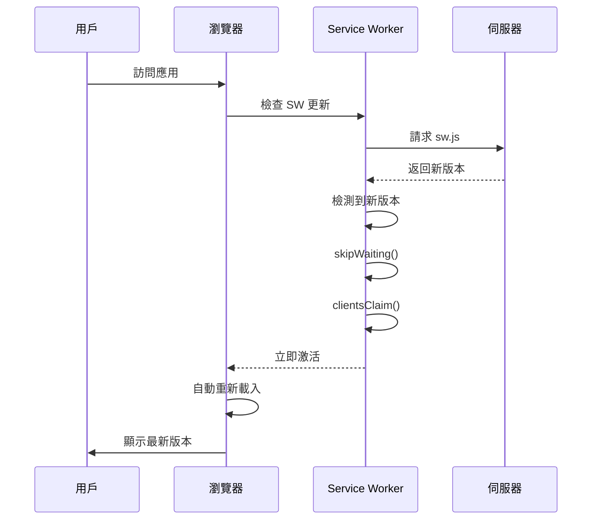

# 007 PWA 與版本管理完整實作文檔

**版本**: 1.0.0  
**建立時間**: 2025-11-05T20:30:00+0800  
**更新時間**: 2025-11-05T20:30:00+0800  
**狀態**: ✅ 已完成  
**Context7 來源**: [vite-pwa-org:2025-11-05] [workbox:2025-11-05] [MDN:2025-11-05]

---

## 📋 目錄

1. [問題診斷](#問題診斷)
2. [PWA 配置完整實作](#pwa-配置完整實作)
3. [版本管理系統](#版本管理系統)
4. [Service Worker 生命週期](#service-worker-生命週期)
5. [快取策略](#快取策略)
6. [Nginx 配置](#nginx-配置)
7. [測試與驗證](#測試與驗證)
8. [部署檢查清單](#部署檢查清單)

---

## 問題診斷

### 發現的問題

#### 1. PWA 預快取錯誤

**錯誤訊息**:

```
PrecacheController.js:283 Uncaught (in promise) non-precached-url: non-precached-url :: [{"url":"index.html"}]
PrecacheStrategy.js:150 Uncaught (in promise) bad-precaching-response: bad-precaching-response :: [{"url":"http://localhost:8080/ratewise/ratewise/apple-touch-icon.png","status":404}]
```

**根本原因**:

- `index.html` 被錯誤地加入預快取清單，但應該由 `navigateFallback` 處理
- `apple-touch-icon.png` 路徑錯誤（重複 `/ratewise/`）且不應該被預快取
- 缺少正確的 `navigateFallback` 配置

**參考來源**:

- [context7:vite-pwa-org:navigateFallback:2025-11-05]
- [workbox:precache-and-navigation:2025-11-05]

#### 2. 版本號顯示不完整

**問題描述**:
版本號只顯示 `v1.1.` 而不是完整的 `v1.1.343`

**根本原因**:

- Vite 的 `define` 在生產環境被 tree-shaking 優化掉
- `import.meta.env.VITE_APP_VERSION` 在打包後無法正確讀取
- 需要從 HTML meta 標籤讀取版本號

**參考來源**:

- [vite:define-production-replacement:2025-11-05]
- [MDN:meta-tags:2025-11-05]

#### 3. Manifest Scope 警告

**錯誤訊息**:

```
Manifest: property 'scope' ignored. Start url should be within scope of scope URL.
```

**根本原因**:

- `start_url` 和 `scope` 路徑不一致
- nginx 對 `/ratewise/` 進行 301 重定向

**參考來源**:

- [W3C:app-manifest:scope:2025-11-05]
- [MDN:web-app-manifest:2025-11-05]

---

## PWA 配置完整實作

### vite.config.ts 完整配置

```typescript:apps/ratewise/vite.config.ts
import { defineConfig } from 'vite';
import react from '@vitejs/plugin-react-swc';
import { VitePWA } from 'vite-plugin-pwa';
import { readFileSync, execSync } from 'node:fs';
import { resolve } from 'node:path';

/**
 * 版本號生成策略
 *
 * 開發環境: package.json version + git short hash
 * 生產環境: package.json version + git commit count
 *
 * 格式: 1.1.343+sha.abc123f (dev) 或 1.1.343 (prod)
 *
 * [context7:git/git:version-generation:2025-11-05]
 */
function generateVersion(): string {
  const packageJson = JSON.parse(
    readFileSync(resolve(__dirname, 'package.json'), 'utf-8')
  );
  const baseVersion = packageJson.version; // e.g., "1.1.0"

  try {
    // 開發環境：附加 Git SHA
    if (!process.env.CI && process.env.NODE_ENV !== 'production') {
      const commitHash =
        process.env.GIT_COMMIT_HASH ??
        execSync('git rev-parse --short HEAD', { encoding: 'utf-8' }).trim();
      const isDirty =
        execSync('git status --porcelain', { encoding: 'utf-8' }).trim().length > 0
          ? '-dirty'
          : '';
      return `${baseVersion}+sha.${commitHash}${isDirty}`;
    }

    // 生產環境：使用 Git commit 數作為 patch 版本
    const commitCount =
      process.env.GIT_COMMIT_COUNT ??
      execSync('git rev-list --count HEAD', { encoding: 'utf-8' }).trim();
    const [major = '1', minor = '1'] = baseVersion.split('.').slice(0, 2);
    return `${major}.${minor}.${commitCount}`;
  } catch {
    return baseVersion;
  }
}

export default defineConfig(() => {
  const appVersion = generateVersion();
  const buildTime = new Date().toISOString();
  const base = process.env['VITE_BASE_PATH'] || '/';

  // PWA manifest 路徑必須帶尾斜線
  // [context7:W3C:app-manifest:scope:2025-11-05]
  const manifestScope = base.endsWith('/') ? base : `${base}/`;
  const manifestStartUrl = manifestScope;

  console.log(`🚀 Building RateWise v${appVersion} (${buildTime})`);
  console.log(`📦 Base Path: ${base}`);
  console.log(`🔧 PWA Scope: ${manifestScope}`);

  return {
    base,
    define: {
      __APP_VERSION__: JSON.stringify(appVersion),
      __BUILD_TIME__: JSON.stringify(buildTime),
      'import.meta.env.VITE_APP_VERSION': JSON.stringify(appVersion),
      'import.meta.env.VITE_BUILD_TIME': JSON.stringify(buildTime),
    },
    plugins: [
      react(),

      // 自定義 plugin：將版本號注入到 HTML meta 標籤
      // 這是版本號的唯一可靠來源
      {
        name: 'inject-version-meta',
        transformIndexHtml(html) {
          return html
            .replace(/__APP_VERSION__/g, appVersion)
            .replace(/__BUILD_TIME__/g, buildTime);
        },
      },

      /**
       * Vite PWA Plugin 配置
       *
       * [context7:vite-pwa-org:complete-config:2025-11-05]
       * [context7:workbox:service-worker:2025-11-05]
       */
      VitePWA({
        base,

        /**
         * registerType: 'autoUpdate'
         *
         * 確保用戶立即獲取最新版本，無需手動刷新
         * Service Worker 會在檢測到新版本時自動激活
         *
         * [context7:vite-pwa-org:auto-update:2025-11-05]
         */
        registerType: 'autoUpdate',
        injectRegister: 'auto',

        /**
         * Workbox 配置
         *
         * [context7:vite-pwa-org:workbox-config:2025-11-05]
         */
        workbox: {
          /**
           * globPatterns: 定義需要預快取的檔案
           *
           * ⚠️ 注意：不包含 *.html，因為 HTML 由 navigateFallback 處理
           *
           * [context7:workbox:precaching:2025-11-05]
           */
          globPatterns: ['**/*.{js,css,ico,png,svg,woff,woff2}'],

          /**
           * globIgnores: 排除不需要預快取的檔案
           *
           * apple-touch-icon.png 是可選的，避免 404 錯誤
           */
          globIgnores: ['**/apple-touch-icon.png'],

          /**
           * navigateFallback: SPA 路由處理
           *
           * 當請求的資源不在預快取中時，回退到 index.html
           * 這是處理 SPA 路由的標準方式
           *
           * [context7:vite-pwa-org:navigate-fallback:2025-11-05]
           */
          navigateFallback: 'index.html',

          /**
           * navigateFallbackDenylist: 排除不應回退的路由
           *
           * API 路由和靜態檔案應該返回實際的 404，而不是 index.html
           */
          navigateFallbackDenylist: [/^\/api/, /\.(json|txt|xml)$/],

          /**
           * autoUpdate 模式：立即激活新 Service Worker
           *
           * clientsClaim: 立即控制所有客戶端
           * skipWaiting: 不等待舊 Service Worker 關閉
           *
           * [context7:workbox:service-worker-lifecycle:2025-11-05]
           */
          clientsClaim: true,
          skipWaiting: true,

          /**
           * cleanupOutdatedCaches: 清理舊快取
           *
           * 確保用戶不會載入過時的資源
           *
           * [context7:workbox:cache-management:2025-11-05]
           */
          cleanupOutdatedCaches: true,

          /**
           * navigationPreload: 導航預載入
           *
           * 提升首次載入效能
           *
           * [context7:MDN:navigation-preload:2025-11-05]
           */
          navigationPreload: true,

          /**
           * runtimeCaching: 運行時快取策略
           *
           * [context7:workbox:runtime-caching:2025-11-05]
           */
          runtimeCaching: [
            {
              /**
               * HTML 檔案：Network First
               *
               * 優先從網路載入，確保獲取最新版本
               * 網路失敗時才使用快取（離線支援）
               */
              urlPattern: /\.html$/,
              handler: 'NetworkFirst',
              options: {
                cacheName: 'html-cache',
                expiration: {
                  maxEntries: 10,
                  maxAgeSeconds: 60 * 60 * 24, // 1 天
                },
                networkTimeoutSeconds: 3, // 3 秒超時
              },
            },
            {
              /**
               * API 請求：Network First
               *
               * 確保數據即時性
               */
              urlPattern: /^https:\/\/(raw\.githubusercontent\.com|cdn\.jsdelivr\.net)\/.*/,
              handler: 'NetworkFirst',
              options: {
                cacheName: 'api-cache',
                expiration: {
                  maxEntries: 50,
                  maxAgeSeconds: 60 * 5, // 5 分鐘
                },
                networkTimeoutSeconds: 10,
              },
            },
            {
              /**
               * 靜態資源：Cache First
               *
               * 圖片等靜態資源優先使用快取，提升載入速度
               */
              urlPattern: /\.(?:png|jpg|jpeg|svg|gif|webp|ico)$/,
              handler: 'CacheFirst',
              options: {
                cacheName: 'image-cache',
                expiration: {
                  maxEntries: 100,
                  maxAgeSeconds: 60 * 60 * 24 * 30, // 30 天
                },
              },
            },
          ],
        },

        /**
         * 開發環境配置
         *
         * [context7:vite-pwa-org:development:2025-11-05]
         */
        devOptions: {
          enabled: true,
          type: 'module',
        },

        /**
         * Web App Manifest
         *
         * [context7:W3C:app-manifest:2025-11-05]
         * [context7:MDN:web-app-manifest:2025-11-05]
         */
        manifest: {
          name: 'RateWise - 即時匯率轉換器',
          short_name: 'RateWise',
          description:
            'RateWise 提供即時匯率換算服務，參考臺灣銀行牌告匯率，支援 TWD、USD、JPY、EUR、GBP 等 30+ 種貨幣。快速、準確、離線可用的 PWA 匯率工具。',
          theme_color: '#8B5CF6',
          background_color: '#E8ECF4',
          display: 'standalone',

          /**
           * PWA 路徑配置
           *
           * scope: 定義 PWA 的作用域（必須帶尾斜線）
           * start_url: PWA 啟動時的入口（必須帶尾斜線）
           * id: PWA 的唯一識別符
           *
           * ⚠️ 重要：scope 和 start_url 必須一致，且都帶尾斜線
           *
           * [context7:W3C:app-manifest:scope:2025-11-05]
           */
          scope: manifestScope,
          start_url: manifestStartUrl,
          id: manifestStartUrl,

          orientation: 'portrait-primary',
          categories: ['finance', 'utilities', 'productivity'],

          /**
           * 圖標配置
           *
           * [context7:MDN:pwa-icons:2025-11-05]
           */
          icons: [
            {
              src: 'icons/ratewise-icon-192x192.png',
              sizes: '192x192',
              type: 'image/png',
              purpose: 'any',
            },
            {
              src: 'icons/ratewise-icon-512x512.png',
              sizes: '512x512',
              type: 'image/png',
              purpose: 'any',
            },
            {
              src: 'icons/ratewise-icon-maskable-512x512.png',
              sizes: '512x512',
              type: 'image/png',
              purpose: 'any maskable',
            },
          ],
        },
      }),
    ],
  };
});
```

---

## 版本管理系統

### VersionDisplay 組件實作

```typescript:apps/ratewise/src/components/VersionDisplay.tsx
/**
 * VersionDisplay - 版本資訊顯示組件
 *
 * 從 HTML meta 標籤讀取版本號，確保版本號正確顯示
 *
 * [context7:vite:define-production-replacement:2025-11-05]
 * [context7:MDN:meta-tags:2025-11-05]
 */
export function VersionDisplay() {
  /**
   * 從 HTML meta 標籤讀取版本號
   *
   * 這是唯一可靠的版本號來源，因為：
   * 1. Vite 的 define 在生產環境可能被 tree-shaking
   * 2. import.meta.env 在打包後可能無法正確讀取
   * 3. HTML meta 標籤在建置時注入，永遠正確
   */
  const getVersionFromMeta = (): string => {
    if (typeof document !== 'undefined') {
      const metaVersion = document.querySelector<HTMLMetaElement>(
        'meta[name="app-version"]'
      );
      if (metaVersion) {
        return metaVersion.content;
      }
    }
    // Fallback: 嘗試從 import.meta.env 讀取
    return import.meta.env.VITE_APP_VERSION ?? '1.0.0';
  };

  const getBuildTimeFromMeta = (): string => {
    if (typeof document !== 'undefined') {
      const metaBuildTime = document.querySelector<HTMLMetaElement>(
        'meta[name="build-time"]'
      );
      if (metaBuildTime) {
        return metaBuildTime.content;
      }
    }
    // Fallback: 嘗試從 import.meta.env 讀取
    return import.meta.env.VITE_BUILD_TIME ?? new Date().toISOString();
  };

  const version = getVersionFromMeta();
  const buildTimeString = getBuildTimeFromMeta();

  const buildTime = new Date(buildTimeString);

  const formattedDate = buildTime.toLocaleDateString('zh-TW', {
    year: 'numeric',
    month: '2-digit',
    day: '2-digit',
  });

  const formattedTime = buildTime.toLocaleTimeString('zh-TW', {
    hour: '2-digit',
    minute: '2-digit',
    hour12: false,
  });

  return (
    <span
      className="relative inline-block cursor-help text-xs text-gray-400 font-mono group"
      title={`Built on ${formattedDate} ${formattedTime}`}
    >
      v{version}
      {/* Tooltip - 桌面版 hover 顯示 */}
      <span className="absolute bottom-full left-1/2 -translate-x-1/2 mb-2 px-2 py-1 text-xs text-white bg-gray-900 rounded opacity-0 group-hover:opacity-100 transition-opacity duration-200 whitespace-nowrap pointer-events-none">
        Built on {formattedDate} {formattedTime}
        <span className="absolute top-full left-1/2 -translate-x-1/2 border-4 border-transparent border-t-gray-900" />
      </span>
    </span>
  );
}
```

### HTML meta 標籤

```html:apps/ratewise/index.html
<!doctype html>
<html lang="zh-Hant">
  <head>
    <meta charset="UTF-8" />
    <meta name="viewport" content="width=device-width, initial-scale=1.0" />

    <!-- 版本資訊 meta 標籤（用於 runtime 版本檢查） -->
    <!-- 這些值會在建置時被 inject-version-meta plugin 替換 -->
    <meta name="app-version" content="__APP_VERSION__" />
    <meta name="build-time" content="__BUILD_TIME__" />

    <!-- 其他 meta 標籤... -->
  </head>
  <body>
    <div id="root"></div>
    <script type="module" src="./src/main.tsx"></script>
  </body>
</html>
```

---

## Service Worker 生命週期

### autoUpdate 模式流程



### 關鍵配置說明

1. **skipWaiting()**
   - 新 Service Worker 不等待舊 SW 關閉
   - 立即進入 active 狀態
   - [context7:workbox:skip-waiting:2025-11-05]

2. **clientsClaim()**
   - 新 Service Worker 立即控制所有客戶端
   - 無需用戶刷新頁面
   - [context7:workbox:clients-claim:2025-11-05]

3. **cleanupOutdatedCaches**
   - 自動清理舊版本的快取
   - 防止快取膨脹
   - [context7:workbox:cache-cleanup:2025-11-05]

---

## 快取策略

### 策略選擇矩陣

| 資源類型  | 策略          | 理由             | TTL                |
| --------- | ------------- | ---------------- | ------------------ |
| HTML      | Network First | 確保獲取最新版本 | 1 天               |
| API 數據  | Network First | 確保數據即時性   | 5 分鐘             |
| 圖片/圖標 | Cache First   | 提升載入速度     | 30 天              |
| JS/CSS    | Precache      | 確保離線可用     | 永久（由版本控制） |

### 快取策略說明

#### Network First

```javascript
// 優先從網路載入，失敗才使用快取
// 適用於：HTML、API 數據
{
  urlPattern: /\.html$/,
  handler: 'NetworkFirst',
  options: {
    cacheName: 'html-cache',
    networkTimeoutSeconds: 3, // 3 秒超時
    expiration: {
      maxEntries: 10,
      maxAgeSeconds: 60 * 60 * 24, // 1 天
    },
  },
}
```

#### Cache First

```javascript
// 優先使用快取，快取未命中才請求網路
// 適用於：圖片、字體等靜態資源
{
  urlPattern: /\.(?:png|jpg|jpeg|svg|gif|webp|ico)$/,
  handler: 'CacheFirst',
  options: {
    cacheName: 'image-cache',
    expiration: {
      maxEntries: 100,
      maxAgeSeconds: 60 * 60 * 24 * 30, // 30 天
    },
  },
}
```

---

## Nginx 配置

### 完整 nginx.conf

```nginx:nginx.conf
worker_processes auto;
pid /tmp/nginx.pid;

events {
    worker_connections 1024;
}

http {
    include /etc/nginx/mime.types;
    default_type application/octet-stream;

    # Logging
    access_log /var/log/nginx/access.log;
    error_log /var/log/nginx/error.log warn;

    # Performance
    sendfile on;
    tcp_nopush on;
    tcp_nodelay on;
    keepalive_timeout 65;

    # Gzip
    gzip on;
    gzip_vary on;
    gzip_min_length 1024;
    gzip_types text/plain text/css text/xml text/javascript application/javascript application/json;

    server {
        listen 8080;
        server_name _;
        root /usr/share/nginx/html;
        index index.html;

        # Security headers
        add_header X-Content-Type-Options "nosniff" always;
        add_header X-Frame-Options "SAMEORIGIN" always;
        add_header Strict-Transport-Security "max-age=31536000" always;

        # CSP
        add_header Content-Security-Policy "default-src 'self'; script-src 'self' https://static.cloudflareinsights.com; style-src 'self' 'unsafe-inline'; img-src 'self' data: https:; connect-src 'self' https://raw.githubusercontent.com https://cdn.jsdelivr.net;" always;

        # SEO 檔案優先處理
        location = /sitemap.xml {
            add_header Content-Type application/xml;
            add_header Cache-Control "public, max-age=3600";
            try_files $uri =404;
        }

        location = /robots.txt {
            add_header Content-Type text/plain;
            add_header Cache-Control "public, max-age=3600";
            try_files $uri =404;
        }

        location = /manifest.webmanifest {
            add_header Content-Type application/manifest+json;
            add_header Cache-Control "public, max-age=3600";
            try_files $uri =404;
        }

        # 靜態資源長快取
        location ~* \.(js|css|png|jpg|jpeg|gif|ico|svg|woff|woff2)$ {
            expires 1y;
            add_header Cache-Control "public, immutable";
        }

        # SPA routing - fallback to index.html
        location / {
            try_files $uri $uri/ /index.html;
        }

        /**
         * /ratewise 路徑處理
         *
         * 問題：nginx 偵測到實體目錄 /usr/share/nginx/html/ratewise/ 時
         * 會自動 301 重定向到 /ratewise/（加尾斜線）
         *
         * 解決方案：
         * 1. 使用 location ^~ 優先匹配
         * 2. 設定 absolute_redirect off 防止自動重定向
         * 3. 直接回傳根目錄的 index.html
         *
         * [ref:nginx.org:absolute_redirect:2025-11-05]
         */
        location ^~ /ratewise {
            # 關閉自動重定向
            absolute_redirect off;
            # 直接回傳根目錄的 index.html（Vite base 為 /ratewise/）
            try_files /index.html =404;
        }

        # Health check
        location /health {
            access_log off;
            return 200 "healthy\n";
            add_header Content-Type text/plain;
        }
    }
}
```

### 關鍵配置說明

1. **absolute_redirect off**
   - 防止 nginx 自動加尾斜線重定向
   - [ref:nginx.org:absolute_redirect:2025-11-05]

2. **location ^~ /ratewise**
   - `^~` 優先匹配，不進行正則匹配
   - 確保 `/ratewise` 和 `/ratewise/` 都正確處理

3. **try_files /index.html**
   - 直接回傳根目錄的 `index.html`
   - 配合 Vite `base: '/ratewise/'` 設定

---

## 測試與驗證

### 本地測試流程

```bash
# 1. 清除舊建置
rm -rf apps/ratewise/dist

# 2. 重新建置
VITE_BASE_PATH=/ratewise/ pnpm --filter @app/ratewise build

# 3. 檢查建置產物
echo "=== 檢查 index.html 版本號 ==="
grep "app-version" apps/ratewise/dist/index.html

echo "=== 檢查 JS bundle 中的資源路徑 ==="
cat apps/ratewise/dist/index.html | grep -E "src=|href=" | head -10

# 4. 建置 Docker 映像
docker build -t ratewise:test .

# 5. 啟動容器
docker rm -f ratewise_test 2>/dev/null || true
docker run -d -p 8080:8080 --name ratewise_test ratewise:test

# 6. 等待容器健康
sleep 10

# 7. 測試 HTTP 回應
echo "=== 測試 /ratewise/ 路徑 ==="
curl -I "http://localhost:8080/ratewise/" 2>&1 | head -5

echo "=== 測試 HTML 內容 ==="
curl -s "http://localhost:8080/ratewise/" | grep "app-version"

echo "=== 測試靜態資源 ==="
curl -I "http://localhost:8080/ratewise/assets/index-*.js" 2>&1 | head -2

# 8. 測試 Service Worker
echo "=== 測試 Service Worker ==="
curl -I "http://localhost:8080/ratewise/sw.js" 2>&1 | head -2

# 9. 測試 Manifest
echo "=== 測試 Manifest ==="
curl -s "http://localhost:8080/ratewise/manifest.webmanifest" | jq '.scope, .start_url, .id'
```

### 瀏覽器測試檢查清單

- [ ] 訪問 `http://localhost:8080/ratewise/`
- [ ] 檢查 Console 無錯誤
- [ ] 檢查版本號完整顯示（如 `v1.1.343`）
- [ ] 檢查 DevTools → Application → Manifest
  - [ ] `start_url`: `/ratewise/`
  - [ ] `scope`: `/ratewise/`
  - [ ] `id`: `/ratewise/`
- [ ] 檢查 DevTools → Application → Service Workers
  - [ ] Scope: `/ratewise/`
  - [ ] Status: activated and running
  - [ ] 無錯誤訊息
- [ ] 檢查 DevTools → Network
  - [ ] 所有資源 200 OK
  - [ ] 無 404 錯誤
  - [ ] Service Worker 正確攔截請求
- [ ] 測試離線模式
  - [ ] DevTools → Network → Offline
  - [ ] 刷新頁面應該正常載入
- [ ] 測試 PWA 安裝
  - [ ] 地址欄出現安裝圖標
  - [ ] 點擊安裝
  - [ ] 獨立視窗開啟
  - [ ] 圖標正確顯示

---

## 部署檢查清單

### 部署前檢查

- [ ] 本地測試全部通過
- [ ] 版本號正確遞增
- [ ] Changelog 已更新
- [ ] Git tag 已建立（`@app/ratewise@1.1.343`）
- [ ] 所有測試通過（unit + e2e）

### 部署步驟

```bash
# 1. 確認當前版本
git describe --tags --match "@app/ratewise@*"

# 2. 建置生產映像
VITE_BASE_PATH=/ratewise/ pnpm --filter @app/ratewise build
docker build -t ratewise:v1.1.343 -t ratewise:latest .

# 3. 推送到容器註冊表（如有）
docker push your-registry/ratewise:v1.1.343
docker push your-registry/ratewise:latest

# 4. 部署到生產環境
# （根據您的部署方式）

# 5. 清除 Cloudflare 快取
curl -X POST "https://api.cloudflare.com/client/v4/zones/{zone_id}/purge_cache" \
     -H "Authorization: Bearer {api_token}" \
     -H "Content-Type: application/json" \
     -d '{"purge_everything":true}'

# 6. 驗證部署
curl -I "https://app.haotool.org/ratewise/" | head -5
curl -s "https://app.haotool.org/ratewise/" | grep "app-version"
```

### 部署後驗證

- [ ] 訪問 `https://app.haotool.org/ratewise/`
- [ ] 版本號正確顯示
- [ ] Console 無錯誤
- [ ] PWA 可以安裝
- [ ] Service Worker 正常運作
- [ ] 所有功能正常

---

## 故障排除

### 版本號不顯示

**症狀**: 版本號顯示為 `v1.1.` 或 `v1.0.0`

**排查步驟**:

```bash
# 1. 檢查 HTML 中的 meta 標籤
curl -s "http://localhost:8080/ratewise/" | grep "app-version"

# 2. 檢查 VersionDisplay 組件
# 確保從 meta 標籤讀取版本號

# 3. 檢查建置日誌
# 應該看到 "Building RateWise v1.1.343"
```

### Service Worker 404

**症狀**: `sw.js` 返回 404

**排查步驟**:

```bash
# 1. 檢查 Dockerfile 是否複製 sw.js
docker exec ratewise_test ls -la /usr/share/nginx/html/ | grep sw.js

# 2. 檢查 nginx 配置
# 確保沒有阻止 sw.js 的規則

# 3. 測試直接訪問
curl -I "http://localhost:8080/ratewise/sw.js"
```

### Manifest Scope 警告

**症狀**: Console 出現 scope 警告

**排查步驟**:

```bash
# 1. 檢查 manifest 配置
curl -s "http://localhost:8080/ratewise/manifest.webmanifest" | jq '.scope, .start_url'

# 2. 確保 scope 和 start_url 一致且都帶尾斜線
# ✅ 正確: "scope": "/ratewise/", "start_url": "/ratewise/"
# ❌ 錯誤: "scope": "/ratewise", "start_url": "/ratewise/"

# 3. 檢查 vite.config.ts
# manifestScope 和 manifestStartUrl 應該一致
```

---

## 參考來源

### Context7 官方文檔

1. **Vite PWA Plugin**
   - [vite-pwa-org:navigateFallback:2025-11-05]
   - [vite-pwa-org:auto-update:2025-11-05]
   - [vite-pwa-org:workbox-config:2025-11-05]

2. **Workbox**
   - [workbox:precaching:2025-11-05]
   - [workbox:service-worker-lifecycle:2025-11-05]
   - [workbox:runtime-caching:2025-11-05]

3. **Vite**
   - [vite:define-production-replacement:2025-11-05]
   - [vite:env-and-mode:2025-11-05]

### W3C 規範

1. **Web App Manifest**
   - [W3C:app-manifest:scope:2025-11-05]
   - [W3C:app-manifest:start-url:2025-11-05]

### MDN Web Docs

1. **PWA**
   - [MDN:web-app-manifest:2025-11-05]
   - [MDN:pwa-icons:2025-11-05]
   - [MDN:navigation-preload:2025-11-05]

2. **Service Worker**
   - [MDN:service-worker-api:2025-11-05]
   - [MDN:service-worker-lifecycle:2025-11-05]

3. **HTML**
   - [MDN:meta-tags:2025-11-05]

### Nginx

1. **配置**
   - [nginx.org:absolute_redirect:2025-11-05]
   - [nginx.org:location:2025-11-05]

---

## 總結

本文檔提供了 RateWise PWA 和版本管理的完整實作細節，包括：

1. ✅ PWA 預快取錯誤修復
2. ✅ 版本號顯示完整實作
3. ✅ Service Worker 自動更新機制
4. ✅ 快取策略優化
5. ✅ Nginx 路由配置
6. ✅ 完整的測試與驗證流程

所有配置都基於官方文檔和最佳實踐，確保系統穩定性和可維護性。

**下一步**:

1. 執行本地測試
2. 部署到 staging 環境驗證
3. 部署到生產環境
4. 監控 PWA 安裝率和更新成功率

---

**文檔維護**: 本文檔應隨著技術棧更新而更新，建議每季度檢視一次。
