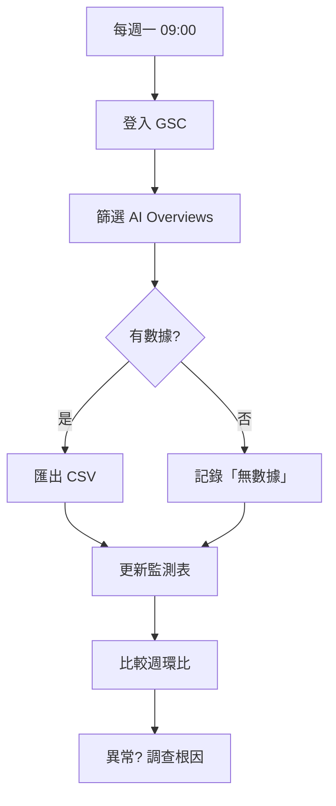

# GSC AI Overviews / AI Share of Voice 監測 SOP

## 文件控制

| 欄位     | 內容       |
| -------- | ---------- |
| 文件編號 | 042        |
| 狀態     | Active     |
| 建立日期 | 2026-04-20 |
| 最後更新 | 2026-04-20 |
| 相關任務 | P2-10      |

## 目的

本文件定義 HaoRate 站點的 AI 搜尋可見性（AI Share of Voice, AI SoV）監測標準作業程序，包含 Google Search Console AI Overviews 追蹤、第三方工具整合與可觀測性指標定義。

## 適用範圍

- Google AI Overviews（SGE）監測
- Perplexity、ChatGPT、Claude 等 LLM 引用追蹤
- AI 爬蟲存取行為分析

---

## 1. Google Search Console AI Overviews 監測

### 1.1 存取方式

```bash
# 登入 Google Search Console
https://search.google.com/search-console

# 選擇資源
property: https://app.haotool.org/ratewise/
```

### 1.2 AI Overviews 查詢篩選

1. 進入「成效」→「搜尋結果」
2. 點選「搜尋外觀」篩選器
3. 選擇「AI 概覽」（若可用）

> **注意**：Google 於 2026 年 Q1 開始在 GSC 提供 AI Overviews 相關數據，但可能有地區/帳戶延遲。

### 1.3 關鍵指標

| 指標               | 說明                         | 建議頻率 |
| ------------------ | ---------------------------- | -------- |
| AI Overview 曝光數 | 查詢結果中出現 AI 概覽的次數 | 每週     |
| AI Overview CTR    | 點擊率（AI 概覽來源流量）    | 每週     |
| 引用 URL           | 被 AI 概覽引用的具體頁面     | 每週     |
| 查詢詞             | 觸發 AI 概覽的搜尋關鍵字     | 每月     |

### 1.4 監測流程



---

## 2. AI 爬蟲存取監測

### 2.1 已允許 AI 爬蟲（robots.txt）

HaoRate robots.txt 已明確允許以下 AI 爬蟲：

- GPTBot（OpenAI）
- ClaudeBot（Anthropic）
- PerplexityBot
- Google-Extended
- GrokBot（xAI）
- Applebot-Extended
- cohere-ai
- AI2Bot
- Amazonbot
- anthropic-ai
- Bytespider
- CCBot
- ChatGLMBot
- Diffbot
- FacebookBot
- meta-externalagent
- OAI-SearchBot
- YouBot

### 2.2 Cloudflare Analytics 追蹤

透過 Cloudflare Dashboard 可追蹤 AI 爬蟲流量：

1. 登入 Cloudflare Dashboard
2. 選擇 `haotool.org` 網域
3. 進入「Analytics」→「流量」
4. 篩選 User-Agent 包含 AI 爬蟲關鍵字

```bash
# 常見 AI 爬蟲 User-Agent 關鍵字
GPTBot
ClaudeBot
PerplexityBot
Google-Extended
GrokBot
```

### 2.3 Server-Timing 診斷

P1-8 已實作 Server-Timing 標頭，可用於追蹤 AI 爬蟲請求效能：

```bash
curl -sI https://app.haotool.org/ratewise/ | grep -i server-timing
# 預期輸出: Server-Timing: fetch;dur=X.X;desc="upstream fetch", total;dur=Y.Y;desc="worker total"
```

---

## 3. 第三方 AI 可見性工具（選配）

### 3.1 Otterly AI

- **網站**：https://otterly.ai
- **功能**：AI Share of Voice 追蹤、LLM 引用監測
- **整合方式**：手動輸入目標網域，自動追蹤

### 3.2 Peec AI

- **網站**：https://peec.ai
- **功能**：AI 搜尋引擎可見性分析
- **整合方式**：API 整合或 Dashboard 監測

### 3.3 工具比較

| 功能                | Otterly AI | Peec AI |
| ------------------- | ---------- | ------- |
| ChatGPT 引用追蹤    | ✅         | ✅      |
| Perplexity 引用追蹤 | ✅         | ✅      |
| Claude 引用追蹤     | ✅         | ✅      |
| 競爭對手比較        | ✅         | ✅      |
| API 存取            | 付費版     | 付費版  |
| 免費試用            | 14 天      | 7 天    |

---

## 4. AI SoV 監測報表模板

### 4.1 週報格式

```markdown
# HaoRate AI SoV 週報

**報告週期**：YYYY-MM-DD ~ YYYY-MM-DD
**報告人**：[name]

## 摘要

| 指標                 | 本週 | 上週 | 變化 |
| -------------------- | ---- | ---- | ---- |
| GSC AI Overview 曝光 | X    | Y    | +Z%  |
| AI 爬蟲請求數        | X    | Y    | +Z%  |
| llms.txt 請求數      | X    | Y    | +Z%  |

## GSC AI Overviews

- **新增被引用頁面**：[list]
- **熱門查詢詞**：[list]
- **異常事項**：[description or "無"]

## AI 爬蟲存取

- **最活躍爬蟲**：[GPTBot/ClaudeBot/...]
- **新增爬蟲**：[list or "無"]
- **請求量異常**：[description or "正常"]

## 下週行動

1. [action item 1]
2. [action item 2]
```

### 4.2 月報追加項目

- LLM 引用品質評估（是否正確引用數據）
- Answer Capsule 引用率
- Schema.org 結構化資料驗證結果
- 競爭對手 AI SoV 比較（若有工具）

---

## 5. 異常處理流程

### 5.1 AI 爬蟲被封鎖

**症狀**：AI 爬蟲請求量驟降

**排查步驟**：

1. 檢查 robots.txt 是否正確
2. 檢查 Cloudflare WAF 規則
3. 檢查 rate limiting 設定
4. 驗證 security-headers Worker 無誤攔截

```bash
# 驗證 robots.txt
curl -s https://app.haotool.org/robots.txt | grep -A2 "GPTBot"

# 驗證 llms.txt 可達
curl -sI https://app.haotool.org/ratewise/llms.txt
```

### 5.2 AI Overviews 引用量下降

**可能原因**：

- 內容品質下降
- 結構化資料錯誤
- 競爭對手 E-E-A-T 提升
- Google 演算法調整

**排查步驟**：

1. 檢查 GSC 是否有新增錯誤
2. 執行 Rich Results Test
3. 檢查 Answer Capsule 品質
4. 比較競爭對手內容

---

## 6. 自動化監測（未來規劃）

### 6.1 GitHub Actions 排程

```yaml
# .github/workflows/ai-sov-monitor.yml (範例，未實作)
name: AI SoV Monitor
on:
  schedule:
    - cron: '0 1 * * 1' # 每週一 UTC 01:00
jobs:
  monitor:
    runs-on: ubuntu-latest
    steps:
      - name: Fetch GSC Data
        run: # GSC API 呼叫
      - name: Generate Report
        run: # 產生報表
      - name: Notify
        run: # 發送通知
```

### 6.2 Cloudflare Worker Metrics（P2-11）

詳見 P2-11 任務：llms.txt referral metrics

---

## 7. 參考資料

- [Google Search Console Help - AI Overviews](https://support.google.com/webmasters/)
- [Schema.org TechArticle](https://schema.org/TechArticle)
- [llms.txt 標準](https://llmstxt.org/)
- [SEO_MASTER_SSOT.md](/docs/SEO_MASTER_SSOT.md)

---

## 修訂紀錄

| 日期       | 版本 | 變更摘要          |
| ---------- | ---- | ----------------- |
| 2026-04-20 | v1.0 | 初版建立（P2-10） |
