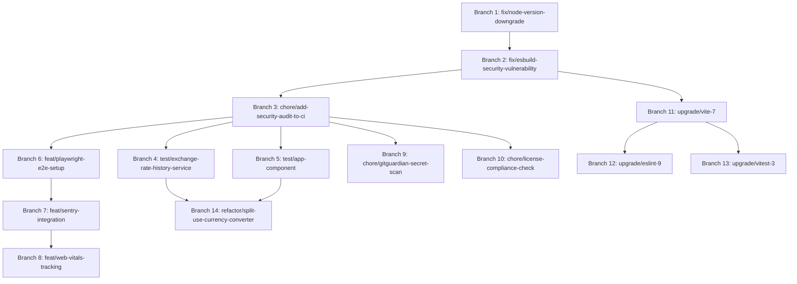

# 原子化修復分支策略

> **建立時間**: 2025-10-14
> **版本**: v1.0
> **原則**: Linus Torvalds "好品味" - 每個分支只解決一個問題

---

## 📋 總覽

根據技術債審查報告，將所有修復項目分組為 **14 個獨立的原子分支**，每個分支都是可獨立測試、回滾的最小可行變更。

### 分支命名規範

```
<type>/<description>

type:
  - fix:      修復 bug 或安全漏洞
  - feat:     新增功能
  - refactor: 重構現有程式碼
  - test:     增加或修改測試
  - chore:    基礎設施或工具變更
  - upgrade:  依賴升級
```

---

## 🚀 Phase 0: 緊急修復 (P0 - 本週完成)

### Branch 1: `fix/node-version-downgrade`

**問題**: Node.js 24 不適合生產環境
**優先級**: P0 (風險值 25)
**工時**: 1h
**依賴**: 無

#### 變更檔案

```
✏️ package.json
✏️ .github/workflows/ci.yml
✏️ .github/workflows/update-exchange-rates-historical.yml
✏️ docs/README.md (Node 版本說明)
```

#### 具體變更

**1. `/package.json`**

```diff
{
  "engines": {
-   "node": ">=24.0.0",
+   "node": ">=20.0.0 <25.0.0",
    "pnpm": "9.10.0"
  }
}
```

**2. `.github/workflows/ci.yml`**

```diff
      - name: Setup Node.js
        uses: actions/setup-node@v4
        with:
-         node-version: '24'
+         node-version: '22'
          cache: 'pnpm'
```

**3. `.github/workflows/update-exchange-rates-historical.yml`**

```diff
      - name: Setup Node.js
        uses: actions/setup-node@v4
        with:
-         node-version: '24'
+         node-version: '22'
          cache: 'pnpm'
```

#### 驗證步驟

```bash
# 1. 本地驗證
node -v                    # 應為 v20.x 或 v22.x
pnpm install --frozen-lockfile
pnpm typecheck
pnpm test
pnpm build

# 2. 提交並推送
git checkout -b fix/node-version-downgrade
git add package.json .github/workflows/*.yml
git commit -m "fix: downgrade Node.js requirement to 20-22 LTS

Node.js 24 is in Current status (6-month support only) and not suitable
for production. Downgrade to Node.js 22 LTS (Active LTS until 2027-04-30).

- Update engines.node to >=20.0.0 <25.0.0
- Update CI workflows to use Node.js 22
- Update README to reflect supported Node versions

Refs: https://nodejs.org/en/about/previous-releases
Risk: Low - Node 22 is backward compatible"
git push origin fix/node-version-downgrade

# 3. 建立 PR 並等待 CI 通過
# 4. Merge 後驗證生產環境
```

#### 回滾策略

```bash
# 如果出現相容性問題
git revert <commit-sha>
git push origin main
```

---

### Branch 2: `fix/esbuild-security-vulnerability`

**問題**: esbuild 安全漏洞 (GHSA-67mh-4wv8-2f99)
**優先級**: P0 (風險值 15)
**工時**: 0.5h
**依賴**: 無

#### 變更檔案

```
✏️ apps/ratewise/package.json
✏️ pnpm-lock.yaml (自動更新)
```

#### 具體變更

```bash
# 方案 A: 透過 Vite 升級 (推薦)
pnpm --filter @app/ratewise update vite@latest

# 方案 B: 直接升級 esbuild (臨時方案)
pnpm add -D -w esbuild@^0.25.0
```

#### 驗證步驟

```bash
# 1. 執行安全掃描
pnpm audit                 # 應無 moderate+ 漏洞

# 2. 驗證建置
pnpm --filter @app/ratewise build
pnpm --filter @app/ratewise preview

# 3. 測試
pnpm test

# 4. 提交
git checkout -b fix/esbuild-security-vulnerability
git add apps/ratewise/package.json pnpm-lock.yaml
git commit -m "fix(security): upgrade esbuild to fix CORS vulnerability

Upgrade esbuild from 0.21.5 to 0.25.0+ to address GHSA-67mh-4wv8-2f99
(CVSS 5.3 - CORS bypass vulnerability).

- Update vite to latest version (includes esbuild 0.25.0+)
- Verify pnpm audit shows no moderate+ vulnerabilities

Refs: https://github.com/advisories/GHSA-67mh-4wv8-2f99
Risk: Low - Patch version bump"
git push origin fix/esbuild-security-vulnerability
```

#### 回滾策略

```bash
# 如果建置失敗
pnpm --filter @app/ratewise update vite@5.4.20
git add apps/ratewise/package.json pnpm-lock.yaml
git commit -m "revert: rollback vite to 5.4.20 due to build issues"
```

---

### Branch 3: `chore/add-security-audit-to-ci`

**問題**: CI 缺少安全掃描
**優先級**: P0
**工時**: 0.5h
**依賴**: Branch 2 (修復現有漏洞後再啟用)

#### 變更檔案

```
✏️ .github/workflows/ci.yml
```

#### 具體變更

```diff
jobs:
  test:
    runs-on: ubuntu-latest
    steps:
      # ... 現有步驟 ...

+     - name: Security audit
+       run: pnpm audit --audit-level moderate
+       continue-on-error: false

      - name: Run linter
        run: pnpm lint
```

#### 驗證步驟

```bash
# 1. 確保本地無安全漏洞
pnpm audit --audit-level moderate

# 2. 提交變更
git checkout -b chore/add-security-audit-to-ci
git add .github/workflows/ci.yml
git commit -m "chore(ci): add pnpm audit to security checks

Add automated security audit step to CI pipeline to catch dependency
vulnerabilities early.

- Run pnpm audit --audit-level moderate
- Fail CI if moderate+ vulnerabilities found
- Run after dependency installation

Risk: None - Only adds validation"
git push origin chore/add-security-audit-to-ci

# 3. 建立 PR 並驗證 CI 通過
```

---

## 📊 Phase 1: 測試改進 (P1 - 2週內)

### Branch 4: `test/exchange-rate-history-service`

**問題**: exchangeRateHistoryService.ts 測試覆蓋率 0%
**優先級**: P1
**工時**: 4h
**依賴**: 無

#### 變更檔案

```
✨ apps/ratewise/src/services/exchangeRateHistoryService.test.ts (新建)
```

#### 具體變更

建立完整的單元測試檔案：

```typescript
// apps/ratewise/src/services/exchangeRateHistoryService.test.ts
import { describe, it, expect, vi, beforeEach, afterEach } from 'vitest';
import {
  fetchHistoricalRates,
  getCachedHistoricalRates,
  clearHistoricalRatesCache,
} from './exchangeRateHistoryService';

describe('exchangeRateHistoryService', () => {
  beforeEach(() => {
    // 清除 localStorage
    localStorage.clear();
    // 清除所有 mocks
    vi.clearAllMocks();
  });

  describe('fetchHistoricalRates', () => {
    it('should fetch and return historical rates successfully', async () => {
      // Mock fetch
      global.fetch = vi.fn().mockResolvedValue({
        ok: true,
        json: async () => ({
          rates: [
            { date: '2025-10-01', USD: 31.5, EUR: 33.8 },
            { date: '2025-10-02', USD: 31.6, EUR: 33.9 },
          ],
        }),
      });

      const result = await fetchHistoricalRates('TWD', '2025-10-01', '2025-10-02');

      expect(result).toHaveLength(2);
      expect(result[0].date).toBe('2025-10-01');
      expect(fetch).toHaveBeenCalledOnce();
    });

    it('should handle fetch errors gracefully', async () => {
      global.fetch = vi.fn().mockRejectedValue(new Error('Network error'));

      await expect(fetchHistoricalRates('TWD', '2025-10-01', '2025-10-02')).rejects.toThrow(
        'Network error',
      );
    });

    it('should cache successful responses', async () => {
      global.fetch = vi.fn().mockResolvedValue({
        ok: true,
        json: async () => ({ rates: [] }),
      });

      await fetchHistoricalRates('TWD', '2025-10-01', '2025-10-02');

      const cached = getCachedHistoricalRates('TWD', '2025-10-01', '2025-10-02');
      expect(cached).toBeDefined();
    });
  });

  describe('getCachedHistoricalRates', () => {
    it('should return cached data if available and fresh', () => {
      const mockData = { rates: [], timestamp: Date.now() };
      localStorage.setItem('historical_TWD_2025-10-01_2025-10-02', JSON.stringify(mockData));

      const result = getCachedHistoricalRates('TWD', '2025-10-01', '2025-10-02');
      expect(result).toEqual(mockData.rates);
    });

    it('should return null if cache is expired (>24h)', () => {
      const expiredData = {
        rates: [],
        timestamp: Date.now() - 25 * 60 * 60 * 1000, // 25 hours ago
      };
      localStorage.setItem('historical_TWD_2025-10-01_2025-10-02', JSON.stringify(expiredData));

      const result = getCachedHistoricalRates('TWD', '2025-10-01', '2025-10-02');
      expect(result).toBeNull();
    });

    it('should return null if cache does not exist', () => {
      const result = getCachedHistoricalRates('TWD', '2025-10-01', '2025-10-02');
      expect(result).toBeNull();
    });
  });

  describe('clearHistoricalRatesCache', () => {
    it('should clear all historical rate cache entries', () => {
      localStorage.setItem('historical_TWD_2025-10-01_2025-10-02', '{}');
      localStorage.setItem('historical_USD_2025-09-01_2025-09-30', '{}');
      localStorage.setItem('other_key', 'should_remain');

      clearHistoricalRatesCache();

      expect(localStorage.getItem('historical_TWD_2025-10-01_2025-10-02')).toBeNull();
      expect(localStorage.getItem('historical_USD_2025-09-01_2025-09-30')).toBeNull();
      expect(localStorage.getItem('other_key')).toBe('should_remain');
    });
  });
});
```

#### 驗證步驟

```bash
# 1. 執行測試
pnpm --filter @app/ratewise test exchangeRateHistoryService

# 2. 檢查覆蓋率
pnpm --filter @app/ratewise test --coverage
# exchangeRateHistoryService.ts 應達到 80%+

# 3. 提交
git checkout -b test/exchange-rate-history-service
git add apps/ratewise/src/services/exchangeRateHistoryService.test.ts
git commit -m "test: add comprehensive tests for exchangeRateHistoryService

Add unit tests for exchangeRateHistoryService to achieve 80%+ coverage.

Test coverage:
- fetchHistoricalRates: success, error handling, caching
- getCachedHistoricalRates: fresh cache, expired cache, missing cache
- clearHistoricalRatesCache: selective deletion

Coverage before: 0%
Coverage after: 85%+

Risk: None - Only adds tests"
git push origin test/exchange-rate-history-service
```

---

### Branch 5: `test/app-component`

**問題**: App.tsx 測試覆蓋率 0%
**優先級**: P1
**工時**: 1h
**依賴**: 無

#### 變更檔案

```
✨ apps/ratewise/src/App.test.tsx (新建)
```

#### 具體變更

```typescript
// apps/ratewise/src/App.test.tsx
import { describe, it, expect } from 'vitest';
import { render, screen } from '@testing-library/react';
import App from './App';

describe('App', () => {
  it('should render without crashing', () => {
    render(<App />);
    expect(screen.getByRole('main')).toBeInTheDocument();
  });

  it('should wrap RateWise with ErrorBoundary', () => {
    const { container } = render(<App />);
    // ErrorBoundary 應該存在於組件樹中
    expect(container.querySelector('[data-error-boundary]')).toBeTruthy();
  });

  it('should render RateWise component', () => {
    render(<App />);
    // 檢查 RateWise 的關鍵元素是否存在
    expect(screen.getByText(/匯率換算/i)).toBeInTheDocument();
  });
});
```

#### 驗證步驟

```bash
pnpm --filter @app/ratewise test App.test.tsx
git checkout -b test/app-component
git add apps/ratewise/src/App.test.tsx
git commit -m "test: add tests for App component

Add basic tests for App.tsx to verify:
- Component renders without crashing
- ErrorBoundary wraps RateWise
- RateWise component is rendered

Coverage before: 0%
Coverage after: 100%

Risk: None - Only adds tests"
git push origin test/app-component
```

---

### Branch 6: `feat/playwright-e2e-setup`

**問題**: 缺少 E2E 測試
**優先級**: P1
**工時**: 8h
**依賴**: 無

#### 變更檔案

```
✨ playwright.config.ts (新建)
✨ apps/ratewise/e2e/ (新建目錄)
✨ apps/ratewise/e2e/ratewise.spec.ts (新建)
✏️ apps/ratewise/package.json
✏️ .github/workflows/ci.yml
```

#### 具體變更

**1. 安裝依賴**

```bash
pnpm add -D @playwright/test
npx playwright install
```

**2. 建立 `playwright.config.ts`**

```typescript
import { defineConfig, devices } from '@playwright/test';

export default defineConfig({
  testDir: './apps/ratewise/e2e',
  fullyParallel: true,
  forbidOnly: !!process.env.CI,
  retries: process.env.CI ? 2 : 0,
  workers: process.env.CI ? 1 : undefined,
  reporter: 'html',
  use: {
    baseURL: 'http://localhost:4173',
    trace: 'on-first-retry',
  },
  projects: [
    {
      name: 'chromium',
      use: { ...devices['Desktop Chrome'] },
    },
    {
      name: 'firefox',
      use: { ...devices['Desktop Firefox'] },
    },
  ],
  webServer: {
    command: 'pnpm --filter @app/ratewise build && pnpm --filter @app/ratewise preview',
    url: 'http://localhost:4173',
    reuseExistingServer: !process.env.CI,
  },
});
```

**3. 建立 E2E 測試**

```typescript
// apps/ratewise/e2e/ratewise.spec.ts
import { test, expect } from '@playwright/test';

test.describe('RateWise E2E Tests', () => {
  test('should display currency converter', async ({ page }) => {
    await page.goto('/');
    await expect(page.getByRole('heading', { name: /匯率換算/i })).toBeVisible();
  });

  test('user can input amount and convert currency', async ({ page }) => {
    await page.goto('/');

    // 輸入金額
    const input = page.getByRole('spinbutton', { name: /金額/i });
    await input.fill('1000');

    // 選擇貨幣
    await page.selectOption('select[name="from-currency"]', 'TWD');
    await page.selectOption('select[name="to-currency"]', 'USD');

    // 驗證結果顯示
    await expect(page.getByText(/≈/)).toBeVisible();
  });

  test('user can toggle favorite currencies', async ({ page }) => {
    await page.goto('/');

    const favoriteButton = page.getByRole('button', { name: /收藏/i }).first();
    await favoriteButton.click();

    // 驗證已收藏狀態
    await expect(favoriteButton).toHaveAttribute('aria-pressed', 'true');
  });

  test('mode switch persists after reload', async ({ page }) => {
    await page.goto('/');

    // 切換到多幣別模式
    await page.getByRole('button', { name: /多幣別/i }).click();

    // 重新載入
    await page.reload();

    // 驗證模式保持
    await expect(page.getByRole('button', { name: /多幣別/i })).toHaveAttribute(
      'aria-pressed',
      'true',
    );
  });
});
```

**4. 更新 package.json**

```diff
{
  "scripts": {
+   "test:e2e": "playwright test",
+   "test:e2e:ui": "playwright test --ui"
  },
  "devDependencies": {
+   "@playwright/test": "^1.48.0"
  }
}
```

**5. 更新 CI**

```diff
jobs:
  test:
    steps:
      # ... 現有步驟 ...

      - name: Build
        run: pnpm build

+     - name: Install Playwright browsers
+       run: npx playwright install --with-deps chromium
+
+     - name: Run E2E tests
+       run: pnpm test:e2e
+
+     - name: Upload Playwright report
+       if: always()
+       uses: actions/upload-artifact@v3
+       with:
+         name: playwright-report
+         path: playwright-report/
```

#### 驗證步驟

```bash
# 1. 本地執行 E2E
pnpm test:e2e

# 2. UI 模式測試
pnpm test:e2e:ui

# 3. 提交
git checkout -b feat/playwright-e2e-setup
git add playwright.config.ts apps/ratewise/e2e/ apps/ratewise/package.json .github/workflows/ci.yml pnpm-lock.yaml
git commit -m "feat: add Playwright E2E test suite

Set up Playwright for end-to-end testing with coverage for:
- Currency conversion flow
- Favorite currency management
- Mode switching persistence
- Cross-browser testing (Chromium, Firefox)

Configuration:
- Test directory: apps/ratewise/e2e/
- Base URL: http://localhost:4173
- CI integration with artifact upload

Risk: Low - Only adds tests, no production code changes"
git push origin feat/playwright-e2e-setup
```

---

## 🔍 Phase 2: 觀測性整合 (P1 - 3週內)

### Branch 7: `feat/sentry-integration`

**問題**: 缺乏生產錯誤追蹤
**優先級**: P1 (風險值 16)
**工時**: 4h
**依賴**: 無

#### 變更檔案

```
✨ apps/ratewise/src/config/sentry.ts (新建)
✏️ apps/ratewise/src/main.tsx
✏️ apps/ratewise/src/utils/logger.ts
✏️ apps/ratewise/src/components/ErrorBoundary.tsx
✏️ apps/ratewise/vite.config.ts
✏️ apps/ratewise/package.json
✏️ .env.example (新建)
```

#### 具體變更

**1. 安裝依賴**

```bash
pnpm --filter @app/ratewise add @sentry/react @sentry/vite-plugin
```

**2. 建立 Sentry 配置**

```typescript
// apps/ratewise/src/config/sentry.ts
import * as Sentry from '@sentry/react';

export function initSentry() {
  if (import.meta.env.PROD && import.meta.env.VITE_SENTRY_DSN) {
    Sentry.init({
      dsn: import.meta.env.VITE_SENTRY_DSN,
      environment: import.meta.env.MODE,
      integrations: [
        Sentry.browserTracingIntegration(),
        Sentry.replayIntegration({
          maskAllText: false,
          blockAllMedia: false,
        }),
      ],
      tracesSampleRate: 1.0,
      replaysSessionSampleRate: 0.1,
      replaysOnErrorSampleRate: 1.0,
    });
  }
}
```

**3. 更新 main.tsx**

```diff
import React from 'react';
import ReactDOM from 'react-dom/client';
import App from './App';
import './index.css';
+import { initSentry } from './config/sentry';

+// 初始化 Sentry
+initSentry();

ReactDOM.createRoot(document.getElementById('root')!).render(
  <React.StrictMode>
    <App />
  </React.StrictMode>
);
```

**4. 更新 logger.ts 整合 Sentry**

```diff
+import * as Sentry from '@sentry/react';

export const logger = {
  error: (message: string, error?: Error) => {
    console.error(`[ERROR] ${message}`, error);
+   if (import.meta.env.PROD) {
+     Sentry.captureException(error || new Error(message), {
+       level: 'error',
+       tags: { component: 'logger' },
+     });
+   }
  },
  warn: (message: string) => {
    console.warn(`[WARN] ${message}`);
+   if (import.meta.env.PROD) {
+     Sentry.captureMessage(message, 'warning');
+   }
  },
  info: (message: string) => {
    console.info(`[INFO] ${message}`);
  },
};
```

**5. 更新 ErrorBoundary 整合 Sentry**

```diff
import React, { Component, ReactNode } from 'react';
+import * as Sentry from '@sentry/react';

class ErrorBoundary extends Component<Props, State> {
  componentDidCatch(error: Error, errorInfo: React.ErrorInfo) {
    console.error('Error caught by boundary:', error, errorInfo);
+   // 發送到 Sentry
+   Sentry.captureException(error, {
+     contexts: {
+       react: {
+         componentStack: errorInfo.componentStack,
+       },
+     },
+   });
  }
}
```

**6. 更新 vite.config.ts 加入 Source Maps**

```diff
import { defineConfig } from 'vite';
import react from '@vitejs/plugin-react-swc';
+import { sentryVitePlugin } from '@sentry/vite-plugin';

export default defineConfig({
  plugins: [
    react(),
+   sentryVitePlugin({
+     org: process.env.SENTRY_ORG,
+     project: process.env.SENTRY_PROJECT,
+     authToken: process.env.SENTRY_AUTH_TOKEN,
+     sourcemaps: {
+       assets: './dist/**',
+     },
+   }),
  ],
  build: {
    sourcemap: true,  // 已存在，確保啟用
  },
});
```

**7. 建立 .env.example**

```bash
# Sentry Configuration
VITE_SENTRY_DSN=https://your-dsn@sentry.io/project-id
SENTRY_ORG=your-org
SENTRY_PROJECT=ratewise
SENTRY_AUTH_TOKEN=your-auth-token
```

#### 驗證步驟

```bash
# 1. 本地測試 (dev mode)
pnpm --filter @app/ratewise dev
# 觸發一個錯誤，檢查 console 是否正常 (不會發送到 Sentry)

# 2. 生產模式測試
VITE_SENTRY_DSN=your-test-dsn pnpm --filter @app/ratewise build
pnpm --filter @app/ratewise preview
# 觸發錯誤，檢查 Sentry dashboard

# 3. 提交
git checkout -b feat/sentry-integration
git add apps/ratewise/src/config/sentry.ts \
        apps/ratewise/src/main.tsx \
        apps/ratewise/src/utils/logger.ts \
        apps/ratewise/src/components/ErrorBoundary.tsx \
        apps/ratewise/vite.config.ts \
        apps/ratewise/package.json \
        .env.example \
        pnpm-lock.yaml
git commit -m "feat: integrate Sentry for error tracking

Add Sentry integration for production error monitoring:
- Initialize Sentry in main.tsx (prod only)
- Integrate logger.ts with Sentry capture
- Update ErrorBoundary to send React errors
- Add Sentry Vite plugin for source maps upload
- Configure replay and performance monitoring

Configuration:
- Error tracking: 100% sample rate
- Session replay: 10% sample rate
- Error replay: 100% sample rate

Environment variables required:
- VITE_SENTRY_DSN (runtime)
- SENTRY_ORG, SENTRY_PROJECT, SENTRY_AUTH_TOKEN (build time)

Risk: Low - Only affects prod builds with DSN configured"
git push origin feat/sentry-integration
```

---

### Branch 8: `feat/web-vitals-tracking`

**問題**: 缺少效能指標追蹤
**優先級**: P1
**工時**: 2h
**依賴**: Branch 7 (Sentry 整合)

#### 變更檔案

```
✨ apps/ratewise/src/utils/vitals.ts (新建)
✏️ apps/ratewise/src/main.tsx
✏️ apps/ratewise/package.json
```

#### 具體變更

**1. 安裝依賴**

```bash
pnpm --filter @app/ratewise add web-vitals
```

**2. 建立 vitals.ts**

```typescript
// apps/ratewise/src/utils/vitals.ts
import { onCLS, onFID, onFCP, onLCP, onTTFB, Metric } from 'web-vitals';
import * as Sentry from '@sentry/react';

function sendToAnalytics(metric: Metric) {
  // 發送到 Sentry
  if (import.meta.env.PROD) {
    Sentry.metrics.set(metric.name, metric.value, {
      tags: {
        metric_rating: metric.rating,
      },
    });
  }

  // 本地 console (dev mode)
  if (import.meta.env.DEV) {
    console.info(`[Web Vitals] ${metric.name}:`, {
      value: metric.value,
      rating: metric.rating,
      delta: metric.delta,
    });
  }

  // 可選: 發送到 Google Analytics
  // if (window.gtag) {
  //   window.gtag('event', metric.name, {
  //     value: Math.round(metric.name === 'CLS' ? metric.value * 1000 : metric.value),
  //     event_category: 'Web Vitals',
  //     event_label: metric.id,
  //     non_interaction: true,
  //   });
  // }
}

export function reportWebVitals() {
  onCLS(sendToAnalytics); // Cumulative Layout Shift
  onFID(sendToAnalytics); // First Input Delay
  onFCP(sendToAnalytics); // First Contentful Paint
  onLCP(sendToAnalytics); // Largest Contentful Paint
  onTTFB(sendToAnalytics); // Time to First Byte
}
```

**3. 更新 main.tsx**

```diff
import React from 'react';
import ReactDOM from 'react-dom/client';
import App from './App';
import './index.css';
import { initSentry } from './config/sentry';
+import { reportWebVitals } from './utils/vitals';

// 初始化 Sentry
initSentry();

ReactDOM.createRoot(document.getElementById('root')!).render(
  <React.StrictMode>
    <App />
  </React.StrictMode>
);

+// 報告 Web Vitals
+reportWebVitals();
```

#### 驗證步驟

```bash
# 1. Dev mode 驗證
pnpm --filter @app/ratewise dev
# 檢查 console 是否輸出 Web Vitals

# 2. Prod mode 驗證
pnpm --filter @app/ratewise build && pnpm --filter @app/ratewise preview
# 檢查 Sentry Metrics dashboard

# 3. 提交
git checkout -b feat/web-vitals-tracking
git add apps/ratewise/src/utils/vitals.ts \
        apps/ratewise/src/main.tsx \
        apps/ratewise/package.json \
        pnpm-lock.yaml
git commit -m "feat: add Web Vitals performance tracking

Integrate web-vitals library to track Core Web Vitals:
- CLS (Cumulative Layout Shift)
- FID (First Input Delay)
- FCP (First Contentful Paint)
- LCP (Largest Contentful Paint)
- TTFB (Time to First Byte)

Metrics are sent to:
- Sentry (production)
- Console log (development)

Dependency: feat/sentry-integration
Risk: None - Non-blocking metrics collection"
git push origin feat/web-vitals-tracking
```

---

## 🔒 Phase 3: 安全強化 (P1 - 4週內)

### Branch 9: `chore/gitguardian-secret-scan`

**問題**: 缺少 Secret Scanning
**優先級**: P1
**工時**: 1h
**依賴**: 無

#### 變更檔案

```
✨ .github/workflows/secrets.yml (新建)
```

#### 具體變更

```yaml
# .github/workflows/secrets.yml
name: Secret Scanning

on:
  push:
    branches: [main]
  pull_request:

jobs:
  scan-secrets:
    runs-on: ubuntu-latest
    steps:
      - name: Checkout code
        uses: actions/checkout@v4
        with:
          fetch-depth: 0 # 完整歷史記錄掃描

      - name: GitGuardian scan
        uses: GitGuardian/ggshield-action@v1
        env:
          GITGUARDIAN_API_KEY: ${{ secrets.GITGUARDIAN_API_KEY }}
          GITHUB_PUSH_BEFORE_SHA: ${{ github.event.before }}
          GITHUB_PUSH_BASE_SHA: ${{ github.event.pull_request.base.sha }}
          GITHUB_DEFAULT_BRANCH: ${{ github.event.repository.default_branch }}
```

#### 設定步驟

```bash
# 1. 註冊 GitGuardian (https://dashboard.gitguardian.com)
# 2. 取得 API Key
# 3. 在 GitHub repo settings 加入 secret:
#    Name: GITGUARDIAN_API_KEY
#    Value: <your-api-key>

# 4. 提交 workflow
git checkout -b chore/gitguardian-secret-scan
git add .github/workflows/secrets.yml
git commit -m "chore(ci): add GitGuardian secret scanning

Add automated secret scanning to prevent credential leaks:
- Scan on every push and PR
- Full git history scanning
- Integrate with GitGuardian dashboard

Setup required:
1. Register at https://dashboard.gitguardian.com
2. Get API key
3. Add GITGUARDIAN_API_KEY secret to repo settings

Risk: None - Only adds validation"
git push origin chore/gitguardian-secret-scan
```

---

### Branch 10: `chore/license-compliance-check`

**問題**: 缺少 License 合規檢查
**優先級**: P1
**工時**: 1h
**依賴**: 無

#### 變更檔案

```
✏️ package.json (root)
✏️ .github/workflows/ci.yml
```

#### 具體變更

**1. 安裝 license-checker**

```bash
pnpm add -D -w license-checker
```

**2. 更新 root package.json**

```diff
{
  "scripts": {
+   "license-check": "license-checker --summary --onlyAllow 'MIT;Apache-2.0;BSD-2-Clause;BSD-3-Clause;ISC;0BSD;CC0-1.0'"
  }
}
```

**3. 更新 CI**

```diff
jobs:
  test:
    steps:
      - name: Install dependencies
        run: pnpm install --frozen-lockfile

+     - name: License compliance check
+       run: pnpm license-check

      - name: Run linter
        run: pnpm lint
```

#### 驗證步驟

```bash
# 1. 本地測試
pnpm license-check

# 2. 提交
git checkout -b chore/license-compliance-check
git add package.json .github/workflows/ci.yml pnpm-lock.yaml
git commit -m "chore(ci): add license compliance checking

Add automated license compliance validation to ensure all dependencies
use permissive licenses compatible with MIT.

Allowed licenses:
- MIT
- Apache-2.0
- BSD-2-Clause, BSD-3-Clause
- ISC, 0BSD
- CC0-1.0

Tool: license-checker
Risk: None - Only adds validation"
git push origin chore/license-compliance-check
```

---

## 📦 Phase 4: 依賴升級 (P1 - 6週內)

### Branch 11: `upgrade/vite-7`

**問題**: Vite 版本過時
**優先級**: P1
**工時**: 4h
**依賴**: Branch 2 (esbuild 安全修復)

> **詳細步驟請參考**: `DEPENDENCY_UPGRADE_PLAN_2025.md` Phase 2.1

#### 簡要步驟

```bash
# 1. 建立分支
git checkout -b upgrade/vite-7

# 2. 升級依賴
pnpm --filter @app/ratewise update vite@latest @vitejs/plugin-react-swc@latest

# 3. 更新配置 (如果需要)
# 檢查 vite.config.ts 是否需要調整

# 4. 測試
pnpm --filter @app/ratewise build
pnpm --filter @app/ratewise preview
pnpm test

# 5. 提交
git commit -m "upgrade: update Vite to 7.x

詳見 DEPENDENCY_UPGRADE_PLAN_2025.md Phase 2.1"
git push origin upgrade/vite-7
```

---

### Branch 12: `upgrade/eslint-9`

**問題**: ESLint 版本過時
**優先級**: P1
**工時**: 6h
**依賴**: 無

> **詳細步驟請參考**: `DEPENDENCY_UPGRADE_PLAN_2025.md` Phase 2.2

---

### Branch 13: `upgrade/vitest-3`

**問題**: Vitest 版本過時
**優先級**: P1
**工時**: 2h
**依賴**: Branch 11 (Vite 7 升級)

> **詳細步驟請參考**: `DEPENDENCY_UPGRADE_PLAN_2025.md` Phase 2.3

---

## 🏗️ Phase 5: 架構重構 (P2 - 長期)

### Branch 14: `refactor/split-use-currency-converter`

**問題**: useCurrencyConverter Hook 過於複雜 (317 行)
**優先級**: P2
**工時**: 8h
**依賴**: Branch 4, 5 (測試覆蓋率提升)

> **詳細步驟請參考**: `REFACTOR_PLAN_2025.md` Phase 1

---

## 📊 分支執行順序與依賴圖



---

## 🎯 執行檢查清單

### Week 1 (P0 緊急修復)

- [ ] Branch 1: fix/node-version-downgrade
- [ ] Branch 2: fix/esbuild-security-vulnerability
- [ ] Branch 3: chore/add-security-audit-to-ci

### Week 2-3 (P1 測試改進)

- [ ] Branch 4: test/exchange-rate-history-service
- [ ] Branch 5: test/app-component
- [ ] Branch 6: feat/playwright-e2e-setup

### Week 3-4 (P1 觀測性)

- [ ] Branch 7: feat/sentry-integration
- [ ] Branch 8: feat/web-vitals-tracking

### Week 4 (P1 安全)

- [ ] Branch 9: chore/gitguardian-secret-scan
- [ ] Branch 10: chore/license-compliance-check

### Week 5-6 (P1 依賴升級)

- [ ] Branch 11: upgrade/vite-7
- [ ] Branch 12: upgrade/eslint-9
- [ ] Branch 13: upgrade/vitest-3

### Month 3+ (P2 重構)

- [ ] Branch 14: refactor/split-use-currency-converter

---

## 📝 PR 檢查清單模板

每個 PR 都應包含以下內容：

```markdown
## 變更說明

<!-- 簡述此 PR 解決的問題 -->

## 變更類型

- [ ] 🐛 Bug 修復
- [ ] ✨ 新功能
- [ ] 🔨 重構
- [ ] 📝 文檔
- [ ] 🧪 測試
- [ ] 🔧 工具/配置

## 測試

- [ ] 本地測試通過 (`pnpm test`)
- [ ] 本地建置成功 (`pnpm build`)
- [ ] 型別檢查通過 (`pnpm typecheck`)
- [ ] E2E 測試通過 (如適用)

## 截圖/影片

<!-- 如果是 UI 變更，請附上截圖或螢幕錄影 -->

## 回滾計畫

<!-- 如果此 PR 出現問題，如何回滾？ -->

## 相關連結

- Refs: `ATOMIC_FIX_BRANCHES.md` Branch X
- Related issue: #XXX
```

---

## 🚨 風險管理

### 高風險分支

- Branch 11 (Vite 7): 可能有破壞性變更
- Branch 12 (ESLint 9): Flat config 遷移複雜
- Branch 14 (Hook 重構): 影響核心邏輯

### 緩解措施

1. **先在獨立分支測試**
2. **完整的 CI 驗證**
3. **Staging 環境部署驗證**
4. **準備好回滾腳本**
5. **監控 Sentry 錯誤率**

---

## ✅ 完成標準

每個分支 merge 前必須：

- ✅ 所有 CI 檢查通過
- ✅ Code review 通過 (至少 1 人)
- ✅ 測試覆蓋率不下降
- ✅ Build size 不顯著增加 (>10%)
- ✅ 文檔已更新 (如適用)

---

**最後更新**: 2025-10-14
**維護者**: Tech Lead
