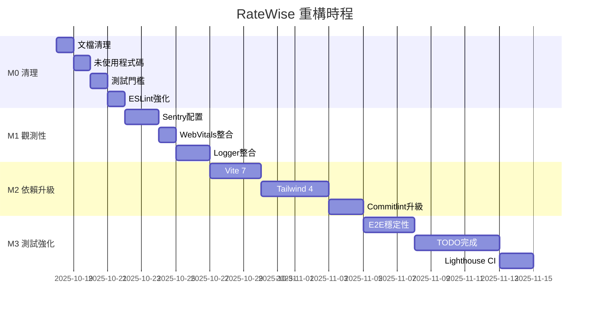

# 分階段重構計畫

> **建立時間**: 2025-10-18T03:13:53+08:00  
> **專案**: RateWise Monorepo  
> **依據**: TECH_DEBT_AUDIT.md + ARCHITECTURE_BASELINE.md  
> **目標**: 3 個月內完成核心重構，確保零技術債

---

## 使用方式

本文檔採用 **里程碑制**，每個里程碑包含：

- 明確的驗收標準
- Before/After 設計圖
- 回滾策略
- 驗證腳本

**執行順序**: 依 M0 → M1 → M2 → M3 順序執行，每個階段完成後才進入下一階段。

---

## 里程碑概覽

| 里程碑 | 名稱                 | 時程 | 優先級 | 狀態      |
| ------ | -------------------- | ---- | ------ | --------- |
| **M0** | 清理與基礎強化       | 1 週 | P0     | 🔄 進行中 |
| **M1** | 觀測性建立           | 1 週 | P0     | 📋 待開始 |
| **M2** | 依賴升級             | 2 週 | P1     | 📋 待開始 |
| **M3** | 測試強化與 TODO 清理 | 2 週 | P2     | 📋 待開始 |
| **M4** | 架構演進（可選）     | 4 週 | P3     | 📋 規劃中 |

---

## M0: 清理與基礎強化 【1 週】

### 目標

- 刪除臨時文檔與未使用程式碼
- 提升測試覆蓋率門檻至 80%
- 強化 ESLint 規則（`any` → `error`）
- 建立品質門檻自動化檢查

### 工作項目

#### 0.1 刪除臨時文檔 【0.5天】

**Before**:

```
/
├── E2E_FIXES_SUMMARY.md          # ❌ 臨時報告
├── PWA_SOLUTION_FINAL.md         # ❌ 臨時報告
├── PWA_SW_ISSUE_SUMMARY.md       # ❌ 臨時報告
└── docs/
    ├── PWA_IMPLEMENTATION.md     # ✅ 保留
    └── ...
```

**After**:

```
/
├── docs/
│   ├── PWA_IMPLEMENTATION.md     # ✅ 保留
│   └── archive/
│       └── 2025-10/              # 歸檔舊報告（可選）
```

**執行指令**:

```bash
# 方案 1: 直接刪除
git rm E2E_FIXES_SUMMARY.md PWA_SOLUTION_FINAL.md PWA_SW_ISSUE_SUMMARY.md
git commit -m "chore: remove temporary report documents"

# 方案 2: 歸檔保留
mkdir -p docs/archive/2025-10
git mv E2E_FIXES_SUMMARY.md docs/archive/2025-10/
git mv PWA_SOLUTION_FINAL.md docs/archive/2025-10/
git mv PWA_SW_ISSUE_SUMMARY.md docs/archive/2025-10/
git commit -m "chore: archive temporary reports to docs/archive/"
```

**驗收標準**:

- [ ] 專案根目錄無 `*_SUMMARY.md`, `*_FINAL.md`
- [ ] `README.md` 未引用已刪除文檔
- [ ] CI 綠燈

---

#### 0.2 刪除/修復未使用程式碼 【0.5天】

**問題**: `ReloadPrompt.tsx` 已註解不使用，測試覆蓋率 0%

**Before**:

```typescript
// App.tsx
import { ErrorBoundary } from './components/ErrorBoundary';
// ReloadPrompt 不需要 - autoUpdate 自動註冊並更新  # ❌ 註解保留
import { SEOHelmet } from './components/SEOHelmet';
```

**After**:

```typescript
// App.tsx
import { ErrorBoundary } from './components/ErrorBoundary';
import { SEOHelmet } from './components/SEOHelmet';
// PWA auto-update 由 vite-plugin-pwa 自動處理
```

**執行指令**:

```bash
# 刪除 ReloadPrompt.tsx 及其樣式
git rm apps/ratewise/src/components/ReloadPrompt.tsx
git rm apps/ratewise/src/components/ReloadPrompt.css

# 清理 App.tsx 註解
# (手動編輯)

git commit -m "chore: remove unused ReloadPrompt component"
```

**驗收標準**:

- [ ] `ReloadPrompt.tsx` 已刪除
- [ ] `App.tsx` 無無效註解
- [ ] `pnpm test` 通過

---

#### 0.3 提升測試覆蓋率門檻 【0.5天】

**Before**:

```typescript
// apps/ratewise/vitest.config.ts
thresholds: {
  lines: 60,
  functions: 60,
  branches: 60,
  statements: 60,
}
```

**After**:

```typescript
// apps/ratewise/vitest.config.ts
thresholds: {
  lines: 80,
  functions: 80,
  branches: 75,  // branches 通常較難達到 80%
  statements: 80,
}
```

**驗證**:

```bash
cd apps/ratewise
pnpm test:coverage

# 確認目前覆蓋率 > 新門檻
# 若未達標，需補充測試
```

**驗收標準**:

- [ ] 覆蓋率門檻已提升
- [ ] `pnpm test` 通過
- [ ] CI 中包含覆蓋率檢查

---

#### 0.4 強化 ESLint 規則 【0.5天】

**Before**:

```javascript
// eslint.config.js
'@typescript-eslint/no-explicit-any': 'warn',  // ⚠️
'@typescript-eslint/no-non-null-assertion': 'warn',  // ⚠️
```

**After**:

```javascript
// eslint.config.js
'@typescript-eslint/no-explicit-any': 'error',  // ✅
'@typescript-eslint/no-non-null-assertion': 'error',  // ✅

// 新增循環複雜度檢查
'complexity': ['error', { max: 10 }],
'max-depth': ['error', { max: 3 }],
```

**驗證**:

```bash
pnpm lint
# 若有錯誤，逐一修正後 commit
```

**驗收標準**:

- [ ] `any` 與 `!` 改為 `error`
- [ ] 新增 complexity 規則
- [ ] `pnpm lint` 通過

---

#### 0.5 建立品質門檻檢查腳本 【0.5天】

建立 `scripts/verify-quality.sh`:

```bash
#!/bin/bash
set -e

echo "🔍 RateWise 品質門檻檢查"
echo "========================================"

# 1. Lint
echo "1️⃣ ESLint..."
pnpm lint

# 2. Type Check
echo "2️⃣ TypeScript..."
pnpm typecheck

# 3. Unit Tests + Coverage
echo "3️⃣ 單元測試..."
pnpm test:coverage

# 4. Build
echo "4️⃣ 建置..."
pnpm build

# 5. Bundle Size Check
echo "5️⃣ Bundle 大小..."
BUNDLE_SIZE=$(du -sh apps/ratewise/dist/assets/*.js | awk '{sum+=$1} END {print sum}')
if [ "$BUNDLE_SIZE" -gt 500 ]; then
  echo "❌ Bundle 過大: ${BUNDLE_SIZE}KB (上限 500KB)"
  exit 1
fi

echo "✅ 所有檢查通過！"
```

**整合至 CI**:

```yaml
# .github/workflows/ci.yml
- name: Quality Gates
  run: bash scripts/verify-quality.sh
```

**驗收標準**:

- [ ] `scripts/verify-quality.sh` 可執行
- [ ] CI 整合完成
- [ ] 本地執行通過

---

### M0 驗收總表

- [ ] 臨時文檔已清理
- [ ] 未使用程式碼已刪除
- [ ] 測試覆蓋率門檻 ≥ 80%
- [ ] ESLint `any` 規則為 `error`
- [ ] 品質門檻腳本可執行
- [ ] CI 全綠

**時間估算**: 2.5 天（含 buffer）

**回滾策略**:

```bash
git revert <commit-sha-range>
pnpm install --frozen-lockfile
```

---

## M1: 觀測性建立 【1 週】

### 目標

- Sentry 正確配置並測試
- Web Vitals 整合並驗證
- Logger 整合遠端服務（Cloudflare Workers 或 Sentry）
- 建立觀測性儀表板

### 工作項目

#### 1.1 Sentry 正確配置 【2天】

**Before**:

- `initSentry()` 已呼叫但無 DSN
- 測試覆蓋率 0%

**After**:

- 環境變數配置完成
- 整合測試覆蓋率 ≥ 80%
- 錯誤追蹤可在 Sentry Dashboard 看到

**執行步驟**:

1. 建立 `.env.example`:

```bash
# apps/ratewise/.env.example
VITE_SENTRY_DSN=https://xxx@xxx.ingest.sentry.io/xxx
VITE_SENTRY_ENVIRONMENT=production
VITE_APP_VERSION=0.0.0
```

2. 更新 `sentry.ts`:

```typescript
// src/utils/sentry.ts
import * as Sentry from '@sentry/react';

export function initSentry(): void {
  const dsn = import.meta.env.VITE_SENTRY_DSN;

  if (!dsn) {
    console.warn('Sentry DSN not configured');
    return;
  }

  Sentry.init({
    dsn,
    environment: import.meta.env.VITE_SENTRY_ENVIRONMENT || 'development',
    release: import.meta.env.VITE_APP_VERSION,
    tracesSampleRate: 0.1, // 10% traces
    replaysSessionSampleRate: 0.1,
    replaysOnErrorSampleRate: 1.0,
  });
}
```

3. 撰寫整合測試:

```typescript
// src/utils/sentry.test.ts
import { describe, it, expect, vi } from 'vitest';
import * as Sentry from '@sentry/react';
import { initSentry } from './sentry';

vi.mock('@sentry/react');

describe('Sentry Integration', () => {
  it('should initialize when DSN is provided', () => {
    vi.stubEnv('VITE_SENTRY_DSN', 'https://test@sentry.io/123');
    initSentry();
    expect(Sentry.init).toHaveBeenCalled();
  });

  it('should not initialize when DSN is missing', () => {
    vi.unstubAllEnvs();
    initSentry();
    expect(Sentry.init).not.toHaveBeenCalled();
  });
});
```

**驗證**:

```bash
# 本地測試
VITE_SENTRY_DSN=test pnpm test sentry.test.ts

# 生產測試（手動觸發錯誤）
# 打開 Sentry Dashboard 確認錯誤出現
```

**驗收標準**:

- [ ] `.env.example` 已建立
- [ ] Sentry 測試覆蓋率 ≥ 80%
- [ ] 可在 Sentry Dashboard 看到測試錯誤
- [ ] CI 環境變數配置完成

---

#### 1.2 Web Vitals 整合 【1天】

**執行步驟**:

1. 更新 `webVitals.ts`:

```typescript
// src/utils/webVitals.ts
import { onCLS, onFID, onFCP, onLCP, onTTFB, type Metric } from 'web-vitals';
import { logger } from './logger';

export function initWebVitals(): void {
  const sendToAnalytics = (metric: Metric) => {
    // 方案 1: 送至 Sentry
    if (window.Sentry) {
      window.Sentry.captureMessage(`Web Vital: ${metric.name}`, {
        level: 'info',
        tags: {
          vitals: metric.name,
        },
        extra: {
          value: metric.value,
          rating: metric.rating,
        },
      });
    }

    // 方案 2: 送至 GA4
    if (window.gtag) {
      window.gtag('event', metric.name, {
        value: Math.round(metric.value),
        metric_id: metric.id,
        metric_rating: metric.rating,
      });
    }

    // 方案 3: 本地 logger
    logger.info(`Web Vital: ${metric.name}`, {
      value: metric.value,
      rating: metric.rating,
    });
  };

  onCLS(sendToAnalytics);
  onFID(sendToAnalytics);
  onFCP(sendToAnalytics);
  onLCP(sendToAnalytics);
  onTTFB(sendToAnalytics);
}
```

2. 撰寫測試:

```typescript
// src/utils/webVitals.test.ts
import { describe, it, expect, vi } from 'vitest';
import { initWebVitals } from './webVitals';

vi.mock('web-vitals');

describe('Web Vitals', () => {
  it('should register all vitals handlers', () => {
    const { onCLS, onFID, onLCP } = await import('web-vitals');

    initWebVitals();

    expect(onCLS).toHaveBeenCalled();
    expect(onFID).toHaveBeenCalled();
    expect(onLCP).toHaveBeenCalled();
  });
});
```

**驗收標準**:

- [ ] Web Vitals 測試覆蓋率 ≥ 80%
- [ ] 可在 Sentry/GA4 看到 vitals 數據
- [ ] Lighthouse 分數 ≥ 90

---

#### 1.3 Logger 整合遠端服務 【2天】

**選項**: Sentry Breadcrumbs（最簡單）

**Before**:

```typescript
// utils/logger.ts
console.info(message, metadata); // ❌ 僅本地
```

**After**:

```typescript
// utils/logger.ts
import * as Sentry from '@sentry/react';

export const logger = {
  info(message: string, metadata?: Record<string, unknown>) {
    console.info(message, metadata);
    Sentry.addBreadcrumb({
      message,
      level: 'info',
      data: metadata,
    });
  },

  warn(message: string, metadata?: Record<string, unknown>) {
    console.warn(message, metadata);
    Sentry.addBreadcrumb({
      message,
      level: 'warning',
      data: metadata,
    });
  },

  error(message: string, error: Error) {
    console.error(message, error);
    Sentry.captureException(error, {
      extra: { message },
    });
  },
};
```

**驗收標準**:

- [ ] Logger 呼叫會出現在 Sentry Breadcrumbs
- [ ] 錯誤會正確傳送至 Sentry
- [ ] 測試覆蓋率 100%（已有）

---

### M1 驗收總表

- [ ] Sentry 正確配置，測試覆蓋率 ≥ 80%
- [ ] Web Vitals 整合完成，可在 Dashboard 看到數據
- [ ] Logger 整合至 Sentry Breadcrumbs
- [ ] 建立觀測性文檔（監控面板使用指南）
- [ ] CI 全綠

**時間估算**: 5 天

**回滾策略**:

```bash
git revert <commit-range>
# Sentry 配置僅影響觀測，不影響功能
```

---

## M2: 依賴升級 【2 週】

### 目標

- Vite 6 → 7 升級完成
- Tailwind 3 → 4 升級完成
- Commitlint 18 → 20 升級完成
- Husky 8 → 9 升級完成

### 工作項目

詳見 `DEPENDENCY_UPGRADE_PLAN.md`，此處列出關鍵步驟。

#### 2.1 Vite 7 升級 【3天】

**執行步驟**:

1. 建立專屬分支:

```bash
git checkout -b feat/vite-7-upgrade
```

2. 升級依賴:

```bash
cd apps/ratewise
pnpm up vite@latest @vitejs/plugin-react-swc@latest vitest@latest
```

3. 檢查 `vite.config.ts`:

```typescript
// 可能需要更新 defineConfig 型別
import { defineConfig } from 'vite'; // 確認匯入路徑
```

4. 驗證建置:

```bash
pnpm build
ls -lh dist/assets/  # 檢查 bundle size
pnpm preview  # 手動測試
```

5. 執行測試:

```bash
pnpm test:coverage
pnpm test:e2e
```

**驗收標準**:

- [ ] 建置成功
- [ ] 測試全通過
- [ ] Bundle size 無顯著增加（<5%）
- [ ] CI 綠燈

**回滾**:

```bash
git revert <commit-sha>
cd apps/ratewise
pnpm up vite@6.4.0 @vitejs/plugin-react-swc@4.0.0
pnpm install --frozen-lockfile
```

---

#### 2.2 Tailwind 4 升級 【4天】

**執行步驟**:

1. 閱讀官方升級指南:
   - https://tailwindcss.com/blog/tailwindcss-v4

2. 更新配置（零配置模式）:

```css
/* src/index.css */
@import 'tailwindcss';

/* 自定義變數 */
@theme {
  --color-brand: #3b82f6;
}
```

3. 移除 `tailwind.config.ts`（可選）

4. 視覺回歸測試:

```bash
# 使用 Playwright 截圖比對
pnpm test:e2e
# 手動檢查所有頁面
```

**驗收標準**:

- [ ] 建置成功
- [ ] 所有 UI 元件樣式正確
- [ ] Playwright 截圖無差異
- [ ] Bundle size 縮小

**回滾**:

```bash
git revert <commit-range>
pnpm up tailwindcss@3.4.18
```

---

#### 2.3 Commitlint & Husky 升級 【2天】

```bash
pnpm -w up @commitlint/cli@latest @commitlint/config-conventional@latest husky@latest lint-staged@latest
```

**驗收標準**:

- [ ] `pnpm prepare` 正常執行
- [ ] Pre-commit hook 正常觸發
- [ ] Commit message 驗證正常

---

### M2 驗收總表

- [ ] Vite 7 升級完成
- [ ] Tailwind 4 升級完成
- [ ] Commitlint 20 & Husky 9 升級完成
- [ ] `DEPENDENCY_UPGRADE_PLAN.md` 更新
- [ ] `CHANGELOG.md` 記錄所有升級
- [ ] CI 全綠

**時間估算**: 9 天

---

## M3: 測試強化與 TODO 清理 【2 週】

### 目標

- E2E 測試穩定性提升
- TODO 項目全部完成
- 整合 Lighthouse CI
- 達成測試覆蓋率 90%+

### 工作項目

#### 3.1 E2E 測試穩定性 【3天】

**問題分析**:

- 目前設定 `retries: 2`，顯示測試不穩定
- 可能原因：timing issues, flaky selectors

**解決方案**:

1. 增加超時設定:

```typescript
// playwright.config.ts
use: {
  actionTimeout: 15000,  // 從 10s 增加至 15s
  navigationTimeout: 45000,  // 從 30s 增加至 45s
}
```

2. 使用穩定 selector:

```typescript
// ❌ Bad
await page.click('.button');

// ✅ Good
await page.getByRole('button', { name: '轉換' }).click();
```

3. 等待網路穩定:

```typescript
await page.waitForLoadState('networkidle');
```

4. 建立 Page Object Model:

```typescript
// tests/e2e/pages/RateWisePage.ts
export class RateWisePage {
  constructor(private page: Page) {}

  async fillAmount(value: string) {
    await this.page.getByRole('spinbutton').fill(value);
    await this.page.waitForTimeout(500); // Debounce
  }
}
```

**驗收標準**:

- [ ] CI 執行 10 次無 retry
- [ ] `retries` 可降為 0
- [ ] Playwright HTML Report 無紅色項目

---

#### 3.2 TODO 項目完成 【5天】

發現 5 個 TODO：

1. **Logger 整合** (已在 M1 完成)
2. **Safari 404 修復** (3天):

```typescript
// 問題：MiniTrendChart.tsx 嘗試載入不存在的歷史數據
// 解決方案 1: 修正 API endpoint
// 解決方案 2: 使用模擬數據並標註 (已實作)
// 解決方案 3: 整合 exchangeRateHistoryService
```

3. **整合 exchangeRateHistoryService** (2天):

```typescript
// hooks/useCurrencyConverter.ts
import { fetchHistoricalRates } from '@/services/exchangeRateHistoryService';

export function useCurrencyConverter() {
  const [trendData, setTrendData] = useState<HistoricalRate[]>([]);

  useEffect(() => {
    const fetchTrends = async () => {
      const data = await fetchHistoricalRates(baseCurrency, 30);
      setTrendData(data);
    };
    fetchTrends();
  }, [baseCurrency]);

  // 傳遞真實數據給 MiniTrendChart
  return { ...state, trendData };
}
```

**驗收標準**:

- [ ] 所有 TODO 註解已移除
- [ ] 對應功能已實作並測試
- [ ] GitHub Issues 已關閉

---

#### 3.3 Lighthouse CI 整合 【2天】

**目標**: 自動化效能監控

**執行步驟**:

1. 安裝 Lighthouse CI:

```bash
pnpm -w add -D @lhci/cli
```

2. 建立 `lighthouserc.json`:

```json
{
  "ci": {
    "collect": {
      "staticDistDir": "./apps/ratewise/dist",
      "url": ["http://localhost/"],
      "numberOfRuns": 3
    },
    "assert": {
      "preset": "lighthouse:recommended",
      "assertions": {
        "categories:performance": ["error", { "minScore": 0.9 }],
        "categories:accessibility": ["error", { "minScore": 0.9 }],
        "categories:best-practices": ["error", { "minScore": 0.9 }],
        "categories:seo": ["error", { "minScore": 0.9 }]
      }
    }
  }
}
```

3. 整合至 CI:

```yaml
# .github/workflows/ci.yml
- name: Run Lighthouse CI
  run: |
    pnpm exec lhci autorun
  env:
    LHCI_GITHUB_APP_TOKEN: ${{ secrets.LHCI_GITHUB_APP_TOKEN }}
```

**驗收標準**:

- [ ] Lighthouse 分數 ≥ 90（所有類別）
- [ ] CI 整合完成
- [ ] 分數追蹤儀表板建立

---

### M3 驗收總表

- [ ] E2E 測試零 retry
- [ ] 所有 TODO 完成
- [ ] Lighthouse CI 整合
- [ ] 測試覆蓋率 ≥ 90%
- [ ] CI 全綠

**時間估算**: 10 天

---

## M4: 架構演進（可選）【4 週】

**目標**: 遷移至目標架構（參考 `ARCHITECTURE_BASELINE.md`）

此階段為**可選**，目前架構已足夠清晰。僅在以下情況執行：

- 專案規模擴大（>10 features）
- 團隊成員增加（>5 人）
- 需要更嚴格的邊界隔離

**工作項目**:

- 建立 `src/shared/telemetry/`
- 建立 `src/shared/storage/`
- 遷移 `services/` 至 `features/ratewise/services/`
- 建立 `app/providers/`

**時間估算**: 20 天（非優先）

---

## 總時程規劃



**總時程**: 約 6 週（1.5 個月）

---

## 風險與緩解策略

| 風險                  | 可能性 | 影響 | 緩解策略                             |
| --------------------- | ------ | ---- | ------------------------------------ |
| Vite 7 破壞建置       | 中     | 高   | 建立專屬分支，完整測試後 merge       |
| Tailwind 4 樣式不相容 | 中     | 高   | Playwright 截圖比對，手動驗證        |
| E2E 測試仍不穩定      | 低     | 中   | 增加 timeout，使用 Page Object Model |
| Safari 404 無法修復   | 低     | 低   | 保持模擬數據，標註為已知問題         |
| 時程延誤              | 中     | 中   | 每個 milestone 包含 20% buffer       |

---

## 成功指標

### 量化指標

| 指標            | 基線   | 目標（3個月後） |
| --------------- | ------ | --------------- |
| 技術債項目      | 10     | 0               |
| TODO 數量       | 5      | 0               |
| 測試覆蓋率      | 89.8%  | 95%             |
| CI 通過率       | 85%    | 98%             |
| Lighthouse 分數 | 未測量 | 95+             |
| 依賴過時數      | 16     | 2               |

### 定性指標

- [ ] 開發者體驗提升（更快的建置、更穩定的測試）
- [ ] 可觀測性完整（錯誤追蹤、效能監控）
- [ ] 程式碼品質提升（嚴格 lint 規則、高覆蓋率）
- [ ] 文檔完整性（清晰的架構、完善的 README）

---

## 產出清單

完成所有 Milestone 後，應產出以下交付物：

- [x] `TECH_DEBT_AUDIT.md` (本報告)
- [ ] `REFACTOR_PLAN.md` (本文件)
- [x] `DEPENDENCY_UPGRADE_PLAN.md` (已存在，需更新)
- [x] `ARCHITECTURE_BASELINE.md` (已存在)
- [x] `CHECKLISTS.md` (已存在，需更新)
- [x] `CITATIONS.md` (已存在)
- [ ] `OBSERVABILITY_GUIDE.md` (新增，M1 產出)
- [ ] `LIGHTHOUSE_REPORT.md` (新增，M3 產出)
- [ ] 所有 PR 及其 review comments
- [ ] 更新後的 `CHANGELOG.md`

---

**建立時間**: 2025-10-18T03:13:53+08:00  
**最後更新**: 2025-10-18T03:13:53+08:00  
**負責人**: @s123104  
**版本**: v1.0
