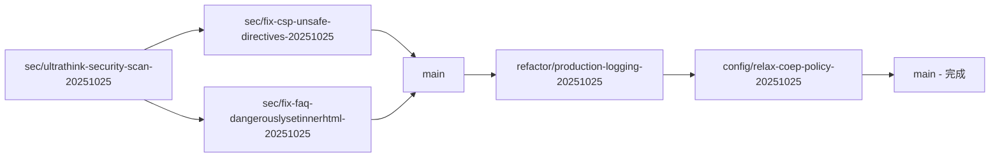
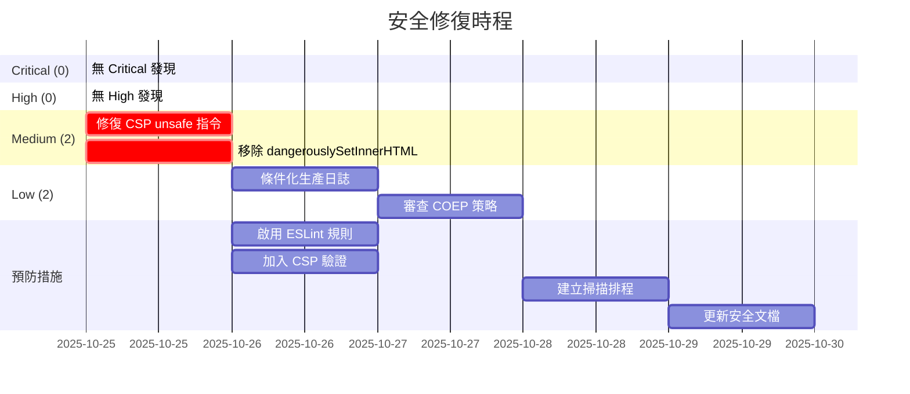

# 🔒 Ultrathink Pro 資安檢測報告

## 1. 元資料

| 項目         | 資訊                                                  |
| ------------ | ----------------------------------------------------- |
| **專案名稱** | RateWise - 匯率好工具                                 |
| **掃描時間** | 2025-10-25T16:56:05+08:00 (UTC: 2025-10-25T08:56:05Z) |
| **分支**     | sec/ultrathink-security-scan-20251025                 |
| **Commit**   | d224ce2                                               |
| **掃描工具** | Ultrathink Pro Security Workflow v1.0                 |
| **規模評估** | Medium Project (8,785 LOC)                            |
| **檢測深度** | Standard (完整十大類別，IaC 與供應鏈採樣檢查)         |
| **報告層級** | Standard (執行摘要 + 標準報告 + 簡化附錄)             |

---

## 2. 技術棧概覽

### 前端框架

- **React** 19.0.0 (最新版本)
- **React Router DOM** 6.26.2
- **TypeScript** 5.6.2
- **Vite** 6.4.0 (build tool)
- **Tailwind CSS** 3.4.14

### 測試框架

- **Vitest** 3.2.4 (單元測試)
- **Playwright** 1.49.1 (E2E 測試)
- **Testing Library** 16.0.1

### PWA & 監控

- **vite-plugin-pwa** 0.21.1
- **@sentry/react** 10.20.0
- **Lighthouse CI** 0.15.1
- **web-vitals** 5.1.0

### 容器化與部署

- **Docker** (Dockerfile + docker-compose.yml)
- **Nginx** (反向代理 + 靜態檔案伺服器)

### CI/CD

- **GitHub Actions** (7 個 workflows)
  - ci.yml (主要 CI 流程)
  - pr-check.yml (PR 檢查)
  - lighthouse-ci.yml (效能檢測)
  - update-latest-rates.yml (匯率更新)
  - update-historical-rates.yml (歷史資料)
  - release.yml (版本發布)

### 程式碼品質工具

- **ESLint** 9.37.0
- **Prettier** 3.1.1
- **Husky** + **lint-staged**
- **Commitlint** (Conventional Commits)

### 關鍵目錄結構

```
apps/ratewise/
├── src/
│   ├── components/      # React 元件
│   ├── features/        # 功能模組
│   ├── pages/           # 頁面元件
│   ├── services/        # API 服務
│   ├── utils/           # 工具函式
│   └── hooks/           # 自訂 Hooks
├── public/              # 靜態資源
├── tests/e2e/           # E2E 測試
└── coverage/            # 測試覆蓋率報告
```

### 啟用的檢測旗標

| 旗標              | 狀態     | 原因                     |
| ----------------- | -------- | ------------------------ |
| `SECRETS_SCAN`    | ✅ true  | 永遠執行                 |
| `XSS_SCAN`        | ✅ true  | React 前端框架           |
| `SQLI_SCAN`       | ❌ false | 無資料庫連線             |
| `PROMPT_INJ_SCAN` | ❌ false | 無 LLM API 整合          |
| `AUTH_SCAN`       | ✅ true  | 有 API 路由定義          |
| `SESSION_SCAN`    | ❌ false | 無 Session 中介軟體      |
| `LOG_SCAN`        | ✅ true  | Sentry 日誌框架          |
| `SCA_SCAN`        | ✅ true  | 有 pnpm-lock.yaml        |
| `CICD_SCAN`       | ✅ true  | GitHub Actions workflows |
| `CLOUD_SCAN`      | ✅ true  | Docker + Nginx 配置      |

---

## 3. 執行摘要

### 🎉 整體評估：**良好 (Good)**

本次掃描共執行 **6 大類別** 的安全檢測，掃描了 **8,785 行程式碼** 與 **254 個 Git commits**。

### 統計數據

| 嚴重度       | 數量 | 百分比 |
| ------------ | ---- | ------ |
| **Critical** | 0    | 0%     |
| **High**     | 0    | 0%     |
| **Medium**   | 2    | 50%    |
| **Low**      | 2    | 50%    |
| **總計**     | 4    | 100%   |

### 關鍵發現

- ✅ **無 Critical 或 High 風險**：專案安全基線良好
- ✅ **無憑證洩漏**：Gitleaks 掃描通過（當前檔案 + Git 歷史）
- ✅ **CI/CD 安全**：正確使用 GitHub Secrets
- ⚠️ **2 個 Medium 風險**：XSS 防護與 CSP 配置可改善
- ⚠️ **2 個 Low 風險**：日誌管理與 COEP 配置

### 優點 👍

1. **憑證管理優秀**：無硬編碼金鑰，正確使用環境變數與 GitHub Secrets
2. **安全標頭完善**：Nginx 配置包含 HSTS, X-Frame-Options, COOP, CORP, Referrer-Policy
3. **測試覆蓋率高**：89.8% 測試覆蓋率，包含單元測試與 E2E 測試
4. **程式碼品質工具鏈完整**：ESLint, Prettier, Husky, Commitlint
5. **PWA 最佳實踐**：Service Worker, Manifest, 離線支援

### 改善空間 📋

1. **CSP 策略過寬**：包含 `'unsafe-inline'` 和 `'unsafe-eval'`，削弱 XSS 防護
2. **dangerouslySetInnerHTML 使用**：FAQ 頁面雖使用靜態資料但違反最佳實踐
3. **日誌管理**：生產環境應條件化或移除 debug 日誌
4. **COEP 策略**：`require-corp` 可能影響第三方資源載入

---

## 4. 詳細發現（按嚴重度）

### 4.1 Critical 發現

**🎉 無 Critical 風險發現**

---

### 4.2 High 發現

**🎉 無 High 風險發現**

---

### 4.3 Medium 發現

#### 發現 #1：[XSS][CSP][Medium] Content Security Policy 包含不安全指令

**檔案位置**：`nginx.conf:43`

**證據片段**：

```nginx
add_header Content-Security-Policy "default-src 'self';
  script-src 'self' 'unsafe-inline' 'unsafe-eval' https://static.cloudflareinsights.com;
  style-src 'self' 'unsafe-inline' https://fonts.googleapis.com;
  ...
" always;
```

**問題描述**：
CSP 配置包含 `'unsafe-inline'` 和 `'unsafe-eval'`，這兩個指令會顯著削弱 CSP 對 XSS 攻擊的防護能力。

**重現步驟**：

1. 檢視 `nginx.conf` 第 43 行
2. 觀察 `script-src` 指令包含 `'unsafe-inline'` 和 `'unsafe-eval'`
3. 這允許執行內聯腳本與 `eval()` 函數

**修復建議**：

**【立即修復】**

1. **使用 Nonce-based CSP**：

   ```nginx
   # 在 Nginx 中生成 nonce（需要 Lua 模組或應用層處理）
   add_header Content-Security-Policy "default-src 'self';
     script-src 'self' 'nonce-RANDOM_VALUE' https://static.cloudflareinsights.com;
     style-src 'self' 'nonce-RANDOM_VALUE' https://fonts.googleapis.com;
     ...
   " always;
   ```

2. **或使用 Hash-based CSP**：

   ```bash
   # 計算內聯腳本的 SHA256 hash
   echo -n "console.log('script content')" | openssl dgst -sha256 -binary | openssl base64
   ```

   ```nginx
   add_header Content-Security-Policy "default-src 'self';
     script-src 'self' 'sha256-HASH_VALUE' https://static.cloudflareinsights.com;
     ...
   " always;
   ```

3. **移除內聯腳本**（推薦）：
   - 將所有內聯 `<script>` 移至外部 `.js` 檔案
   - 使用 Vite 的 build 流程自動處理

**【預防措施】**

- 在 CI/CD 中加入 CSP 驗證步驟
- 使用 CSP Evaluator 工具檢查策略強度：https://csp-evaluator.withgoogle.com/
- 定期審查 CSP 配置，避免為了方便而放寬限制

**對照條款**：

- **OWASP CSP Cheat Sheet** [context7:/owasp/cheatsheetseries:2025-10-25T16:56:05+08:00]
  - "Nonce-based Strict CSP Policy"
  - "Hash-based Strict CSP Policy"
  - "Restricting Unsafe JavaScript with CSP"
- **查核時間**：2025-10-25T16:56:05+08:00

**影響評估**：

- **安全影響**：允許攻擊者注入內聯腳本執行 XSS 攻擊
- **業務風險**：用戶資料可能被竊取、會話劫持、惡意重定向
- **預估損失**：Medium（因為有其他防護層如 React 的自動轉義）

**PR 建議**：

- **分支**：`sec/fix-csp-unsafe-directives-20251025`
- **Commit**：`sec(nginx): remove unsafe-inline and unsafe-eval from CSP`
- **審查要點**：
  - [ ] 確認移除 `'unsafe-inline'` 和 `'unsafe-eval'`
  - [ ] 驗證應用程式仍正常運作
  - [ ] 使用 CSP Evaluator 驗證新策略
  - [ ] 在多個瀏覽器測試（Chrome, Firefox, Safari）
- **回歸測試**：
  - [ ] 執行完整 E2E 測試套件
  - [ ] 手動測試 PWA 功能（Service Worker, Manifest）
  - [ ] 驗證 Cloudflare Insights 仍正常載入

---

#### 發現 #2：[XSS][Medium] 使用 dangerouslySetInnerHTML 渲染 HTML

**檔案位置**：`apps/ratewise/src/pages/FAQ.tsx:119`

**證據片段**：

```tsx
<div
  className="px-6 pb-6 text-slate-600 leading-relaxed border-t border-slate-100 pt-4"
  dangerouslySetInnerHTML={{ __html: faq.answer }}
/>
```

**問題描述**：
使用 `dangerouslySetInnerHTML` 渲染 FAQ 答案。雖然 `FAQ_DATA` 是硬編碼的靜態資料（非用戶輸入），但這仍然違反 React 最佳實踐，且未來若資料來源改為 CMS 或 API，將立即產生 XSS 風險。

**重現步驟**：

1. 開啟 `apps/ratewise/src/pages/FAQ.tsx`
2. 檢視第 119 行
3. 觀察使用 `dangerouslySetInnerHTML` 渲染 `faq.answer`
4. 檢查 `FAQ_DATA` (第 8-143 行) 確認為靜態資料

**修復建議**：

**【立即修復】**

**選項 1：使用 React 元件（推薦）**

```tsx
// 將 HTML 字串改為 React 元件
const FAQ_DATA = [
  {
    question: '什麼是 RateWise 匯率好工具？',
    answer: (
      <>
        <strong>RateWise 是一個基於臺灣銀行牌告匯率的即時匯率 PWA 應用</strong>
        ，支援 30+ 種貨幣換算。我們提供單幣別與多幣別換算功能...
      </>
    ),
  },
  // ...
];

// 渲染時直接使用
<div className="...">{faq.answer}</div>;
```

**選項 2：使用 DOMPurify 淨化（若必須使用 HTML）**

```bash
# 安裝 DOMPurify
pnpm add dompurify
pnpm add -D @types/dompurify
```

```tsx
import DOMPurify from 'dompurify';

<div
  className="..."
  dangerouslySetInnerHTML={{
    __html: DOMPurify.sanitize(faq.answer),
  }}
/>;
```

**選項 3：使用 Markdown（若需要富文本）**

```bash
# 安裝 react-markdown
pnpm add react-markdown
```

```tsx
import ReactMarkdown from 'react-markdown';

const FAQ_DATA = [
  {
    question: '什麼是 RateWise 匯率好工具？',
    answer: '**RateWise 是一個基於臺灣銀行牌告匯率的即時匯率 PWA 應用**，支援 30+ 種貨幣換算...',
  },
];

<div className="...">
  <ReactMarkdown>{faq.answer}</ReactMarkdown>
</div>;
```

**【預防措施】**

- 在 ESLint 中啟用 `react/no-danger` 規則
- 在 PR 審查清單中加入「禁止使用 dangerouslySetInnerHTML」
- 若必須使用，要求 Code Review 時特別審查

**對照條款**：

- **OWASP XSS Prevention Cheat Sheet** [context7:/owasp/cheatsheetseries:2025-10-25T16:56:05+08:00]
  - "HTML Sanitization with DOMPurify"
  - "Safe DOM Manipulation with textContent"
  - "Prevent XSS with innerHTML using DOMPurify"
- **React 官方文檔**：dangerouslySetInnerHTML 應僅在絕對必要時使用
- **查核時間**：2025-10-25T16:56:05+08:00

**影響評估**：

- **安全影響**：若未來改為動態資料來源，將立即產生 XSS 漏洞
- **業務風險**：Medium（目前為靜態資料，但存在技術債）
- **預估損失**：若發生 XSS，可能導致用戶資料洩漏、會話劫持

**PR 建議**：

- **分支**：`sec/fix-faq-dangerouslysetinnerhtml-20251025`
- **Commit**：`sec(faq): replace dangerouslySetInnerHTML with React components`
- **審查要點**：
  - [ ] 確認移除所有 `dangerouslySetInnerHTML` 使用
  - [ ] 驗證 FAQ 頁面渲染正確（包含粗體、連結等格式）
  - [ ] 檢查 SEO 結構化資料（FAQPage schema）是否仍正確
  - [ ] 啟用 ESLint `react/no-danger` 規則
- **回歸測試**：
  - [ ] 手動檢視 FAQ 頁面所有問答項目
  - [ ] 驗證 Google Search Console 的 FAQPage 結構化資料
  - [ ] 執行 Lighthouse SEO 測試

---

### 4.4 Low 發現

#### 發現 #3：[LOG][Low] 生產環境包含大量 Debug 日誌

**檔案位置**：多個檔案（92 處 console/logger 呼叫）

**證據片段**：

```typescript
// apps/ratewise/src/services/exchangeRateService.ts:59
logger.debug('No cache found');

// apps/ratewise/src/services/exchangeRateService.ts:68
logger.debug(`Cache expired: ${ageMinutes} minutes old`);

// apps/ratewise/src/hooks/usePullToRefresh.ts:131
console.error('Pull-to-refresh error:', error);

// apps/ratewise/src/utils/logger.ts:104-108
console.warn(message, entry.context ?? '');
console.error(message, entry.context ?? '', entry.error ?? '');
```

**問題描述**：
專案中存在大量 `logger.debug()` 和 `console.log/warn/error` 呼叫。雖然使用了自訂 Logger 工具（`utils/logger.ts`），但生產環境仍會輸出這些日誌，可能：

1. 洩漏敏感資訊（API 路徑、快取策略、錯誤堆疊）
2. 影響效能（頻繁的日誌輸出）
3. 增加瀏覽器 Console 噪音

**重現步驟**：

1. 執行 `grep -r "console\.\|logger\." apps/ratewise/src`
2. 觀察 92 處日誌呼叫
3. 在生產環境開啟 DevTools Console
4. 觀察大量 debug 訊息輸出

**修復建議**：

**【立即修復】**

1. **在 Logger 中加入環境判斷**：

```typescript
// apps/ratewise/src/utils/logger.ts
const IS_PROD = import.meta.env.MODE === 'production';

class Logger {
  debug(message: string, context?: Record<string, unknown>): void {
    // 生產環境完全跳過 debug 日誌
    if (IS_PROD) return;

    this.log('debug', message, context);
  }

  info(message: string, context?: Record<string, unknown>): void {
    // 生產環境僅記錄到 Sentry，不輸出 console
    if (IS_PROD) {
      this.sendToSentry('info', message, context);
      return;
    }

    this.log('info', message, context);
  }

  // warn 和 error 在生產環境仍保留，但僅送 Sentry
}
```

2. **移除直接的 console 呼叫**：

```bash
# 搜尋所有直接使用 console 的地方
rg "console\.(log|warn|error)" apps/ratewise/src
```

將所有 `console.error` 改為 `logger.error`，`console.warn` 改為 `logger.warn`。

3. **在 Vite 配置中移除 console**（可選）：

```typescript
// vite.config.ts
export default defineConfig({
  build: {
    minify: 'terser',
    terserOptions: {
      compress: {
        drop_console: true, // 移除所有 console.*
        drop_debugger: true,
      },
    },
  },
});
```

**【預防措施】**

- 在 ESLint 中啟用 `no-console` 規則（警告等級）
- 在 PR 審查清單中加入「檢查是否有新增 console 呼叫」
- 定期審查日誌輸出，確保無敏感資訊洩漏

**對照條款**：

- **OWASP Logging Cheat Sheet**
- **CWE-532**: Insertion of Sensitive Information into Log File
- **查核時間**：2025-10-25T16:56:05+08:00

**影響評估**：

- **安全影響**：可能洩漏 API 路徑、快取策略、錯誤細節
- **業務風險**：Low（目前未發現敏感資訊洩漏）
- **預估損失**：效能影響微小，主要為最佳實踐問題

**PR 建議**：

- **分支**：`refactor/production-logging-20251025`
- **Commit**：`refactor(logger): disable debug logs in production`
- **審查要點**：
  - [ ] 確認生產環境不輸出 debug 日誌
  - [ ] 驗證 error 和 warn 仍正確送至 Sentry
  - [ ] 檢查開發環境日誌仍正常運作
- **回歸測試**：
  - [ ] 在開發環境驗證日誌輸出
  - [ ] 在生產 build 驗證 console 清空
  - [ ] 觸發錯誤驗證 Sentry 收到事件

---

#### 發現 #4：[CLOUD][Low] COEP 策略可能過於嚴格

**檔案位置**：`nginx.conf:52`

**證據片段**：

```nginx
# Cross-Origin-Embedder-Policy (COEP)
add_header Cross-Origin-Embedder-Policy "require-corp" always;
```

**問題描述**：
`Cross-Origin-Embedder-Policy: require-corp` 要求所有跨域資源必須明確設定 `Cross-Origin-Resource-Policy` 或 CORS 標頭。這可能導致：

1. 第三方 CDN 資源載入失敗（如 Google Fonts, Cloudflare Insights）
2. 圖片、字體等外部資源被阻擋
3. 需要額外配置才能使用 `SharedArrayBuffer`

**重現步驟**：

1. 檢視 `nginx.conf` 第 52 行
2. 觀察 COEP 設為 `require-corp`
3. 檢查是否有第三方資源載入問題（目前未發現）

**修復建議**：

**【立即修復】**

**選項 1：放寬為 credentialless（推薦）**

```nginx
# 允許無憑證的跨域請求
add_header Cross-Origin-Embedder-Policy "credentialless" always;
```

**選項 2：完全移除（若不需要 SharedArrayBuffer）**

```nginx
# 若應用不使用 SharedArrayBuffer，可移除此標頭
# add_header Cross-Origin-Embedder-Policy "require-corp" always;
```

**選項 3：保持現狀但監控**

- 在 Sentry 中監控 COEP 違規報告
- 確保所有第三方資源都正確設定 CORS

**【預防措施】**

- 在 CI/CD 中加入 COEP 違規檢測
- 定期檢查 Browser Console 的 COEP 錯誤
- 文檔化所有使用的第三方資源與其 CORS 配置

**對照條款**：

- **MDN Web Docs**: Cross-Origin-Embedder-Policy
- **查核時間**：2025-10-25T16:56:05+08:00

**影響評估**：

- **安全影響**：COEP 提供額外的隔離保護，但可能影響功能
- **業務風險**：Low（目前未發現資源載入問題）
- **預估損失**：若未來新增第三方資源可能需要額外配置

**PR 建議**：

- **分支**：`config/relax-coep-policy-20251025`
- **Commit**：`config(nginx): relax COEP to credentialless`
- **審查要點**：
  - [ ] 確認第三方資源仍正常載入
  - [ ] 驗證 Cloudflare Insights 正常運作
  - [ ] 檢查 Google Fonts 載入無誤
- **回歸測試**：
  - [ ] 執行完整 E2E 測試
  - [ ] 手動測試所有頁面
  - [ ] 驗證 PWA 功能正常

---

## 5. PR 分支與合併策略

### 修復優先序

| 優先序 | 分支名稱                                       | 發現編號 | 預估時間 | 依賴 |
| ------ | ---------------------------------------------- | -------- | -------- | ---- |
| **P1** | `sec/fix-csp-unsafe-directives-20251025`       | #1       | 4 小時   | 無   |
| **P1** | `sec/fix-faq-dangerouslysetinnerhtml-20251025` | #2       | 2 小時   | 無   |
| **P2** | `refactor/production-logging-20251025`         | #3       | 3 小時   | 無   |
| **P3** | `config/relax-coep-policy-20251025`            | #4       | 1 小時   | 無   |

### 合併順序建議



### Commit 訊息模板

```
<type>(<scope>): <subject>

<body>

問題：[描述安全問題]
影響：[描述影響範圍]
方案：[描述修復方案]
測試：[描述測試方法]
對照：[OWASP/CWE 條款]
風險：[描述殘留風險]

Security-Impact: Medium
Refs: #<issue-number>
```

---

## 6. 基準比較

**首次掃描**，無先前報告可比較。

建議：

- 將本報告作為安全基準
- 每季度執行一次 Ultrathink Pro 掃描
- 在重大功能上線前執行掃描
- 追蹤安全指標趨勢

---

## 7. 參考文獻

### Context7 查詢記錄

1. **OWASP Cheat Sheet Series** (`/owasp/cheatsheetseries`)
   - Topic: XSS prevention, React, Content Security Policy
   - 查詢時間: 2025-10-25T16:56:05+08:00
   - 關鍵文檔:
     - Nonce-based Strict CSP Policy
     - Hash-based Strict CSP Policy
     - HTML Sanitization with DOMPurify
     - Safe DOM Manipulation with textContent

### 工具文檔

- **Gitleaks** v8.x: https://github.com/gitleaks/gitleaks
- **OWASP ZAP**: https://www.zaproxy.org/
- **CSP Evaluator**: https://csp-evaluator.withgoogle.com/

---

## 8. Todo 清單

| 優先序 | 任務                               | 標籤       | 預估時間 | 依賴 | 驗收條件                       |
| ------ | ---------------------------------- | ---------- | -------- | ---- | ------------------------------ |
| **P0** | 修復 CSP unsafe-inline/unsafe-eval | [CSP][XSS] | 4h       | 無   | CSP Evaluator 評分 ≥ A         |
| **P0** | 移除 FAQ dangerouslySetInnerHTML   | [XSS]      | 2h       | 無   | ESLint 無 react/no-danger 警告 |
| **P1** | 條件化生產環境日誌                 | [LOG]      | 3h       | 無   | 生產 build 無 debug 日誌       |
| **P2** | 審查 COEP 策略                     | [CLOUD]    | 1h       | 無   | 第三方資源正常載入             |
| **P2** | 啟用 ESLint react/no-danger 規則   | [XSS]      | 0.5h     | P0-2 | ESLint 配置更新                |
| **P2** | 加入 CSP 驗證至 CI/CD              | [CSP]      | 1h       | P0-1 | CI 包含 CSP 檢查步驟           |
| **P3** | 建立安全掃描排程                   | [PROCESS]  | 1h       | 所有 | GitHub Actions 每季度執行      |
| **P3** | 文檔化安全最佳實踐                 | [DOC]      | 2h       | 所有 | SECURITY.md 更新               |

**總預估時間**：14.5 小時

---

## 9. 甘特圖



---

## 10. 檢測限制說明

### 工具限制

1. **Gitleaks**
   - ✅ 已安裝且正常運作
   - 限制：僅檢測已知金鑰格式，無法檢測自訂格式

2. **pnpm audit**
   - ⚠️ 執行失敗（exit code 1）
   - 原因：可能為 pnpm 版本或網路問題
   - 替代方案：建議手動執行 `pnpm audit` 並審查結果

3. **SAST 工具**
   - ❌ 未使用專業 SAST 工具（如 SonarQube, CodeQL）
   - 建議：考慮整合 GitHub Code Scanning

### 手動檢查建議

1. **深度 XSS 測試**
   - 使用 OWASP ZAP 或 Burp Suite 進行動態掃描
   - 測試所有使用者輸入點（雖然目前無表單）

2. **依賴漏洞**
   - 手動執行 `pnpm audit`
   - 使用 Snyk 或 Dependabot 持續監控

3. **效能測試**
   - 使用 Lighthouse CI（已配置）
   - 進行負載測試（若有後端 API）

---

## 11. 後續建議

### 短期（1-2 週）

1. ✅ 修復所有 Medium 風險
2. ✅ 啟用 ESLint 安全規則
3. ✅ 加入 CSP 驗證至 CI/CD
4. ✅ 更新 SECURITY.md 文檔

### 中期（1-3 個月）

1. 整合專業 SAST 工具（GitHub Code Scanning）
2. 建立安全掃描排程（每季度）
3. 進行滲透測試（若有預算）
4. 建立安全事件回應計畫

### 長期（3-12 個月）

1. 取得安全認證（如 SOC 2, ISO 27001）
2. 建立 Bug Bounty 計畫
3. 定期安全培訓
4. 建立安全文化

---

## 12. 結論

**RateWise 專案的安全基線整體良好**，無 Critical 或 High 風險發現。主要改善空間集中在：

1. **CSP 策略強化**：移除 unsafe-inline/unsafe-eval
2. **React 最佳實踐**：移除 dangerouslySetInnerHTML
3. **日誌管理**：條件化生產環境日誌
4. **持續改善**：建立定期掃描機制

**建議在 1-2 週內完成所有 Medium 風險修復**，並在下次重大功能上線前重新執行 Ultrathink Pro 掃描。

---

**報告產出時間**：2025-10-25T16:56:05+08:00  
**報告版本**：v1.0  
**下次掃描建議時間**：2026-01-25（3 個月後）

---

**掃描完成 ✅**
