# RateWise 2026 產品 UX 規格（Product UX Spec）

## 文件控制

| 欄位            | 內容                                                                                                             |
| --------------- | ---------------------------------------------------------------------------------------------------------------- |
| 文件名稱        | `2026-06-12-ratewise-2026-product-ux-spec.md`（SSOT；舊名 `2026-06-26-ratewise-2026-product-ux-spec.md` 已合併） |
| 版本            | **v3.1.0**                                                                                                       |
| 建立日期        | 2026-06-12                                                                                                       |
| 最後修訂        | **2026-06-30b**（第二輪 post-#523 live 審查）                                                                    |
| 狀態            | Active — 2026-06-30b post-#523 增量審查 + 20 透鏡對照 + PR/release 矩陣刷新                                      |
| 範圍            | RateWise 行動 PWA + 桌面 + SEO 內容殼（`apps/ratewise`）                                                         |
| 環境 URL        | `https://app.haotool.org/ratewise/`                                                                              |
| 對標基準        | Toss / KakaoPay / Wowpass / KB Star Banking — **native 級 fintech**，非精緻 PWA 工具站                           |
| 上位文件        | `AGENTS.md`、`docs/prompt/UIUX.md`、`docs/superpowers/specs/2026-06-26-ratewise-mobile-pwa-qa-audit-spec.md`     |
| 路由 SSOT       | `apps/ratewise/src/routes.tsx`、`apps/ratewise/seo-paths.config.mjs`                                             |
| 設計 token SSOT | `apps/ratewise/src/config/design-tokens.ts`、`apps/ratewise/src/index.css`                                       |
| SEO 文案 SSOT   | `apps/ratewise/src/config/seo-metadata.ts`                                                                       |

### v2.0 相對 v1.0 主要增量

| 增量                  | 說明                                                          |
| --------------------- | ------------------------------------------------------------- |
| 20 透鏡稽核詳表       | 每透鏡含 findings / severity / evidence / acceptance criteria |
| 生產 curl 證據        | 2026-06-26 實測 headers + HTML 結構                           |
| 韓系 fintech 外部研究 | Toss / KakaoPay / Wowpass / KB 等 2025–2026 模式引用          |
| Open PR 整合矩陣      | #433 / #441 / #446 / #411 / #398 合併序與 UX 映射             |
| 平行開發 playbook     | Git worktree、RACI-lite、Sprint 1–3+ 可並行任務               |
| 待決策清單            | Maintainer 需拍板的 product / release 問題                    |

### v2.1 相對 v2.0 主要增量

| 增量                         | 說明                                                                                                                         |
| ---------------------------- | ---------------------------------------------------------------------------------------------------------------------------- |
| **20 Agent Audit Lenses**    | 每透鏡 L01–L20：Role name、Composer 2.5 Fast prompt template、Task objective、Acceptance criteria、Evidence、Progress fields |
| **Agent 協作與進度 SSOT**    | Progress board 格式、更新規則、DoD、cross-lens 依賴、Sprint gate（P0 透鏡全 `done` 才可 release）                            |
| **Department RACI 擴充**     | PM / Frontend / Design Tokens / SEO / PWA / QA / Release 七角色 + worktree branch + handoff checklist                        |
| **Git worktree 具體化**      | 4 Epic 精確命令、merge order、conflict hotspots、`design-tokens.ts` / `SingleConverter.tsx` 治理                             |
| **2026-06-27 新證據**        | curl 全路由 200；`/usd-twd/` thesis **2** 次（v2.0 為 3）；open PR 新增 **#455**；#441 已不在 open 清單                      |
| **Lessons Learned Registry** | incident ID、root cause、prevention（#418、content dup、fake per-row rates、mega-PR Lighthouse 等）                          |
| **韓系 fintech 研究補強**    | Toss/KakaoPay/Wowpass/KB 2025–2026 模式 + 可引用來源                                                                         |

### v2.2 相對 v2.1 主要增量

| 增量                        | 說明                                                                       |
| --------------------------- | -------------------------------------------------------------------------- |
| **20 具名 Agent Persona**   | L01–L20 各賦予繁中姓名 + English codename；Master Index 與 Appendix 一致   |
| **§四 產品團隊編制**        | Org chart、完整 roster、Human role ↔ Lens 督導映射                         |
| **Mermaid 治理圖集**        | Gantt（Sprint 1–3+）、流程圖、架構圖、A/B 對照、Agent 進度 sequence        |
| **§五 團隊強制規範**        | MUST/MUST NOT 對齊 `AGENTS.md`；cross-ref `UX-INC` registry                |
| **§十四 Git Worktree SSOT** | 權威 bash 命令、5 worktree 範例、Branch↔Epic↔Owner 映射、conflict playbook |

### v2.3 相對 v2.2 主要增量

| 增量                                  | 說明                                                                                                |
| ------------------------------------- | --------------------------------------------------------------------------------------------------- |
| **§三 Agent 協作管線**                | 通訊通道 SSOT、L01→L14→L06 handoff、Composer 2.5 Fast 強制、implementer→reviewer 迴圈、自我改善閉環 |
| **§三.10 GitHub Automation Playbook** | 可複製貼上 `gh issue` / `gh pr` 工作流與 label 慣例                                                 |
| **§十四.12 實驗分支策略**             | `experiment/ratewise-ux-2026` SSOT；Epic 串行合併；main gate（P0 + Lighthouse + live precache）     |
| **§二十 A/B 與持續追蹤**              | `legacy` vs `hero-v2` feature flag；hypothesis 表；KoreaTravel 作 variant B 參考                    |
| **§二十一 API Semantics SSOT**        | v2 語意欄位提案（customerBuyRate 等）；additive migration；OpenAPI 對齊                             |
| **§十一 Epic 1 延伸**                 | Hero v2 toggle、KoreaTravel→RateWise 元件映射、design-tokens 語意命名                               |
| **§二十二 Skills Inventory**          | L01–L20 × repo `.agents/skills/` 矩陣（38 skills）                                                  |
| **Mermaid 圖集補強**                  | Agent sequence、experiment vs main、A/B 架構、API 語意層                                            |
| **2026-06-27 證據刷新**               | open PR 新增 #456/#457；production curl 重測                                                        |

### v3.0 相對 v2.3 主要增量（2026-06-30 深度審查）

| 增量                                | 說明                                                                                      |
| ----------------------------------- | ----------------------------------------------------------------------------------------- |
| **§1.1 Audit Evidence Pack**        | Playwright 60 組 viewport 矩陣（12 路由 × 5 尺寸）；截圖路徑 SSOT；console error 全站統計 |
| **§1.2 Problem Registry**           | 問題 ID、根因、嚴重度、重犯風險、預防措施（對齊 UX-INC）                                  |
| **§1.3 IA 重構提案**                | 首屏即答匯率、單幣別零/少步流程、SEO 殼 vs App 殼邊界                                     |
| **§1.4 2026 UX Roadmap Phase 0–4**  | 每階段目標、依賴、SemVer bump 指引                                                        |
| **§1.5 Parallel Agile Strategy**    | worktree 命名、可並行 workstream 表、衝突矩陣                                             |
| **§1.6 Role Playbooks**             | PM / UX / Frontend / QA / SEO / Release 六角色 Engineering prompt + DoD                   |
| **§1.7 Collaboration TODO SSOT**    | 可追蹤 task ID、狀態、workstream、PR 連結欄位                                             |
| **§1.8 產品級 Acceptance Criteria** | 1 tap 銀行賣出匯率、按鈕無截斷等量化門檻                                                  |
| **§八 20 透鏡**                     | 2026-06-30 live 證據刷新（含單幣別 tap depth、按鈕截斷、PWA modal 阻擋首屏）              |
| **§九 韓系 fintech 附錄**           | 2025–2026 Toss/KakaoBank/Wowpass/KB 可落地 pattern 擴充                                   |
| **§十三 Open PR**                   | 2026-06-30 `gh pr list` 刷新（#471/#469/#518–521 等 UX 線）                               |
| **commit 狀態**                     | **待使用者確認後再 commit**（本輪僅更新 SPEC，未改 product code）                         |

### v3.1 相對 v3.0 主要增量（2026-06-30b 第二輪審查）

| 增量                                | 說明                                                                                                    |
| ----------------------------------- | ------------------------------------------------------------------------------------------------------- |
| **§1.1 post-#523 證據包**           | 第二輪 Playwright 60 組矩陣；v3.0 vs v3.1b 差異表；manifest/offline `#7C3AED` curl 驗證                 |
| **Problem Registry 狀態刷新**       | RWUX-3-001/002 → **resolved**（#523）；landing CTA bottom-clipped 新增 **UX-PR-011**                    |
| **§八 20 透鏡 2026-06-30b 增量列**  | 標記 #523 已改善項（L14/L15 主題）；仍 open 項（#418、hero、modal、landing 截斷）                       |
| **§十三 PR 矩陣**                   | #523 **MERGED**；#518–521 **superseded**；#517 release **MERGED**；experiment #470/#471/#469 仍 open    |
| **§1.4 Roadmap Phase 3 gate**       | manifest/offline SSOT ✅；release v2.25.13 tag 已建；live `app-version` 仍 2.25.12（deployment 待同步） |
| **§九 韓系 fintech 2025–2026 補強** | KakaoBank AI assistant、intent-based nav、calm design、W3C design tokens 模式                           |
| **Executive Summary**               | 第二輪結論：**patch 線**（#523/#517）vs **UX minor 線**（#471/#469 experiment）分流                     |
| **§十八 待決策**                    | 刷新 Q8–Q10：release 部署 race、landing sticky CTA、PWA modal 節制                                      |
| **commit 狀態**                     | **待使用者確認後再 commit**（本輪僅更新 SPEC + audit 腳本，未改 product code）                          |

---

## 一、Executive Summary

RateWise 換算引擎、PWA 基礎設施與 SEO 治理已達 production 水準；**核心差距不在功能能不能用，而在首屏資訊架構、信任信號密度、觸控 inclusive UX 與內容去重**。20 透鏡稽核一致指出：使用者 **0 tap 可讀匯率數字**，但視線先落在「1,000.00」金額列（y≈109）而非 hero 匯率（y≈274，同字級 24px）— 違反 2026 **answer-first** 原則。

**North Star（產品北極星）**

> **Opening screen = one big answer + one primary action + trust signal within thumb zone.**

對標 Toss / Wowpass：**進站 0 tap 讀到主匯率（hero 字級 ≥32px）**、**信任 chip 貼在數字下方 ≤8px**、**核心操作 ≥44px 觸控**、**SEO 長文折疊、App 短答**。RateWise 定位維持「台灣最精準匯率工具（台銀賣出價）」，不以 chat agent 或 widget 取代核心換算器。

**2026-06-30b 生產站快照（post-#523 第二輪）**（Playwright + curl）

| 項目               | v3.0（pre-#523）     | v3.1b（post-#523）                                                                            | 差異                    |
| ------------------ | -------------------- | --------------------------------------------------------------------------------------------- | ----------------------- |
| Release / 版本     | —                    | **#517 MERGED**；tag `@app/ratewise@2.25.13`；live `app-version` **2.25.12**（Zeabur 待同步） | patch 線已合 main       |
| PWA manifest theme | 待 #518              | curl `theme_color` **#7C3AED** ✅（#523）                                                     | **resolved**            |
| offline.html theme | 待 #521              | `--offline-theme-color: #7C3AED` + 多主題 map ✅                                              | **resolved**            |
| Console #418       | 60/60                | **51/60**（5 頁零 error：home@360、faq/about/guide/privacy 部分 vp）                          | 略改善；**仍 P0 open**  |
| Home hero amount y | y≈109 @360/430       | y≈109 @390–430；375 未量到（CORS 阻擋）                                                       | **仍 open**             |
| PWA 安裝 modal     | 360×800 全屏遮罩     | 本輪 0/5 觸發（session 依賴）                                                                 | **仍 open**（狀態依賴） |
| Landing CTA 截斷   | 僅「返回」touch<44px | **「開始換算」bottom-clipped @5/5 vp**；quick amount chips 亦 clipped                         | **新發現 UX-PR-011**    |
| 幣別頁 thesis      | curl **2**           | curl **2**（未變）                                                                            | **仍 open**（#469）     |
| Open PR（UX）      | #470–521 多線 open   | #523 merged；#518–521 closed；**#470/#471/#469** experiment 仍 open                           | patch 收斂、UX 線待合   |
| 韓系對標綜合       | **54/100**           | **55/100**（+1：PWA 主題 SSOT；landing CTA 截斷 -0.5）                                        | 微升；距 80 仍遠        |

**第二輪合併結論（patch 線 vs UX minor 線）**

| 線別            | 狀態（2026-06-30b）                                      | 下一步                                               |
| --------------- | -------------------------------------------------------- | ---------------------------------------------------- |
| **Patch 線**    | #523 ✅ manifest/offline SSOT；#517 ✅ release merged    | CF purge + live precache；確認 `app-version`→2.25.13 |
| **UX minor 線** | #471 hero-v2、#469 Epic3、#470 E2E 仍 open on experiment | Phase 0 #418 → #471 → #469 → Experiment→Main Gate    |
| **仍阻斷 GA**   | AC-CON-01、AC-HERO-01/02、AC-LAND-01/02                  | 不可 minor release 至 main                           |

**2026-06-30 生產站快照**（Playwright live 審查 + curl — 第一輪保留）

| 項目                       | 實測                                                                                                                                                 |
| -------------------------- | ---------------------------------------------------------------------------------------------------------------------------------------------------- |
| 核心路由 HTTP              | `/` `/multi/` `/favorites/` `/settings/` `/faq/` `/about/` `/guide/` `/usd-twd/` `/usd-twd/500/` 均 **200**                                          |
| Edge Worker                | `x-security-policy-version: 5.4`；HTML `cache-control: no-cache, must-revalidate`                                                                    |
| 幣別頁 thesis              | curl `/usd-twd/` 賣出價/中間價 keyword **2**（目標 ≤1；PR #469 Epic3 待合 experiment）                                                               |
| PWA 資產                   | `manifest.webmanifest` **200**；`sw.js` / `offline.html` **200**                                                                                     |
| Console                    | **全 12 路由 × 5 viewport 均有 error** — React **#418** hydration（text + HTML）為主；部分頁 CORS 阻擋 jsdelivr 匯率 JSON                            |
| 首屏 home @360×800         | **PWA 安裝 modal 全屏遮罩**阻擋換算器（`screenshots/ux-audit-2026-06-30-home-360x800.png`）                                                          |
| 單幣別 landing `/usd-twd/` | **無 inline 換算器**；ATF 為 SEO 文案 + AnswerCapsule；live 匯率埋於文字卡（32.16 TWD）；CTA「開始換算」需 **scroll + 1 tap** 回 `/?from=USD&to=TWD` |
| 首屏 home 匯率 y           | 成功載入時 amount 列 **y≈109**（優先於 hero 匯率）— 仍違反 answer-first                                                                              |
| Open PR（UX 相關）         | **#471** hero-v2 + 離線 SW；**#469** Epic3 content distill；**#518–521** PWA/SEO 拆分；**#470** E2E smoke                                            |
| 韓系對標綜合               | **54/100**（v2.3 58→54：landing 零計算機、PWA modal 首屏阻擋、console≠0 降信任）                                                                     |

**2026-06-27 生產站快照**（歷史 curl 實測 — 保留對照）

| 項目          | 實測                                                                                                    |
| ------------- | ------------------------------------------------------------------------------------------------------- |
| 核心路由 HTTP | `/` `/multi/` `/favorites/` `/settings/` `/faq/` `/usd-twd/` 均 **200**                                 |
| Edge Worker   | `x-security-policy-version: 5.4`；`cache-control: no-cache, must-revalidate`                            |
| 幣別頁 thesis | curl `/usd-twd/` 賣出價/中間價 keyword **2**（v2.0 為 3，仍 > 目標 1）                                  |
| PWA 資產      | `manifest.webmanifest` / `sw.js` / `offline.html` **200**；`registerSW.js` **404**（inline 註冊，預期） |
| Sitemap       | **249** `<loc>`                                                                                         |
| Open PR       | **#457** / **#456** 新增；#441 **已不在 open 清單**                                                     |
| Console       | React **#418 hydration** 仍為 P0 阻斷（`QA-P0-001`）                                                    |

**本輪合併結論**

| 維度              | 現況                                      | Sprint 3 目標                           |
| ----------------- | ----------------------------------------- | --------------------------------------- |
| Answer-first 首屏 | 金額 y≈109、匯率 y≈274，同字級 24px       | Hero 匯率 y≤120、字級 ≥32px             |
| Native 信任感     | 時間戳 y≈742（88% 高度）                  | 貼 hero 匯率下方                        |
| 觸控 inclusive    | 換算核心 ~78% 互動 <44px                  | 核心路徑 100% ≥44px                     |
| 內容 distill      | 幣別頁 thesis curl **2** 次（2026-06-27） | 每頁 1 處 canonical 論述                |
| Multi 認知        | 18 幣全展開 + 列內切換誤導                | Progressive disclosure + 全域 rate 語意 |
| 韓系對標綜合      | **54/100**（2026-06-30）                  | **≥80/100**                             |

---

## 1.1 Audit Evidence Pack（2026-06-30 瀏覽器實測）

> **方法**：`scripts/ux-audit-live.mjs` + `@playwright/test` chromium；iPhone Mobile Safari UA；`domcontentloaded` + 1.2s 等待；首屏 viewport 截圖 + DOM 量測。  
> **證據根目錄**：`screenshots/`（gitignore；勿 commit）+ `apps/ratewise/screenshots/`（JSON 鏡像）。

### 2026-06-30b post-#523 第二輪（增量）

| 欄位         | v3.0 第一輪                        | v3.1b 第二輪（post-#523）                            |
| ------------ | ---------------------------------- | ---------------------------------------------------- |
| 執行時間     | 2026-06-30 AM                      | 2026-06-30 PM（#523 merge 後）                       |
| JSON SSOT    | `ux-audit-results-2026-06-30.json` | `ux-audit-results-2026-06-30b.json`                  |
| 腳本         | 一次性 inline                      | `scripts/ux-audit-live.mjs`（可重跑）                |
| 等待策略     | `networkidle`（home 3/5 timeout）  | `domcontentloaded`（**0 timeout**）                  |
| Console 錯誤 | 60/60                              | **55/60**                                            |
| #418         | 60/60                              | **51/60**                                            |
| manifest     | 未驗 `#7C3AED`                     | curl ✅ `#7C3AED`                                    |
| 單幣別截斷   | 返回鈕 touch<44px                  | 返回+首頁 touch<44px + **CTA bottom-clipped @全 vp** |
| 代表截圖     | EV-001~005                         | EV-006~010（見下表）                                 |

**2026-06-30b Viewport 矩陣**

| Viewport | 寬×高   | 測試狀態                           |
| -------- | ------- | ---------------------------------- |
| V1       | 375×667 | 12/12 完成；console 10/12 有 error |
| V2       | 390×844 | 12/12 完成                         |
| V3       | 414×896 | 12/12 完成                         |
| V4       | 360×800 | 12/12 完成；home **0 console**     |
| V5       | 430×932 | 12/12 完成                         |

**合計**：60 captures；**0 timeout**（較 v3.0 改善）。

**2026-06-30b 代表截圖索引**

| 證據 ID | 路徑                                                          | 用途                             |
| ------- | ------------------------------------------------------------- | -------------------------------- |
| EV-006  | `screenshots/ux-audit-2026-06-30b-usd-twd-375x667.png`        | landing CTA bottom-clipped       |
| EV-007  | `screenshots/ux-audit-2026-06-30b-jpy-twd-390x844.png`        | JPY landing 同型截斷             |
| EV-008  | `screenshots/ux-audit-2026-06-30b-home-390x844.png`           | amount y≈109 仍優先              |
| EV-009  | `apps/ratewise/screenshots/ux-audit-results-2026-06-30b.json` | 60 組結構化量測 SSOT             |
| EV-010  | curl `manifest.webmanifest` + `offline.html`                  | `#7C3AED` SSOT gate（#523 驗收） |

**manifest / offline curl 驗證（post-#523）**

```bash
curl -sS https://app.haotool.org/ratewise/manifest.webmanifest | rg 'theme_color'
# → "theme_color": "#7C3AED"

curl -sS https://app.haotool.org/ratewise/offline.html | rg '7C3AED|offline-theme-color'
# → --offline-theme-color: #7C3AED; meta theme-color #7C3AED
```

### 2026-06-30 第一輪（保留對照）

> **方法（第一輪）**：`scripts/ux-audit-live.mjs` 前身 inline 腳本 + `@playwright/test` chromium；`networkidle` 等待。

### Viewport 矩陣

| Viewport | 寬×高   | 代表裝置          | 測試狀態                                                 |
| -------- | ------- | ----------------- | -------------------------------------------------------- |
| V1       | 375×667 | iPhone SE / 8     | 12/12 路由完成；home 3/3 **timeout**（>45s networkidle） |
| V2       | 390×844 | iPhone 14         | 12/12 完成；home timeout                                 |
| V3       | 414×896 | iPhone 11 Pro Max | 12/12 完成；home timeout                                 |
| V4       | 360×800 | Android 窄屏      | 12/12 完成；**home 成功** — PWA modal 遮罩首屏           |
| V5       | 430×932 | iPhone 14 Pro Max | 12/12 完成；home 成功 — rateY≈109                        |

**合計**：60 captures；57 頁成功量測；3 home timeout（V1–V3，疑 CORS/analytics 拖長 networkidle）。

### 路由覆蓋（12 條）

| 路由            | 類型                | 關鍵發現                                                                     |
| --------------- | ------------------- | ---------------------------------------------------------------------------- |
| `/`             | App 換算器          | PWA 安裝 modal 可能全屏；amount y≈109 優先 hero；13 互動 touch<44px @360×800 |
| `/usd-twd/`     | SEO landing         | **無計算機**；ATF 文案牆；賣出價 32.16 埋於 capsule 文字                     |
| `/jpy-twd/`     | SEO landing         | 同 `/usd-twd/` 模式                                                          |
| `/twd-usd/`     | SEO landing（反向） | 同模式                                                                       |
| `/usd-twd/500/` | 金額 landing        | 靜態換算結果卡 + CTA 深連                                                    |
| `/multi/`       | App                 | 18 列全展開；2 bottom-clipped @全 viewport；13 touch<44                      |
| `/favorites/`   | App noindex         | 無匯率列；bottom nav 正常                                                    |
| `/settings/`    | App noindex         | 主題切換列 bottom-clipped；重置按鈕 y≈936–984                                |
| `/faq/`         | SEO                 | 長文；無 bottom nav（預期）                                                  |
| `/about/`       | SEO                 | 同上                                                                         |
| `/guide/`       | SEO                 | 長文 HowTo                                                                   |
| `/privacy/`     | Legal noindex       | 精簡                                                                         |

### 代表截圖索引

| 證據 ID | 路徑                                                              | 用途                          |
| ------- | ----------------------------------------------------------------- | ----------------------------- |
| EV-001  | `screenshots/ux-audit-2026-06-30-usd-twd-390x844.png`             | 幣別 landing 無 inline 換算器 |
| EV-002  | `screenshots/ux-audit-2026-06-30-home-360x800.png`                | PWA 安裝 modal 阻擋首屏       |
| EV-003  | `apps/ratewise/screenshots/ux-audit-results-2026-06-30.json`      | 60 組結構化量測 SSOT          |
| EV-004  | `screenshots/ux-audit-2026-06-30-usd-twd-500-390x844.png`         | 金額頁靜態結果                |
| EV-005  | `apps/ratewise/screenshots/ux-audit-2026-06-30-multi-390x844.png` | Multi 密度過載                |

### Console Error 摘要

| 錯誤類型                       | 出現率  | 嚴重度 | 備註                          |
| ------------------------------ | ------- | ------ | ----------------------------- |
| React #418（text）             | 60/60   | **P0** | SSR/client 文字節點不一致     |
| React #418（HTML）             | ~40/60  | **P0** | 同上，HTML 元素               |
| CORS jsdelivr moneybox/history | ~部分頁 | P1     | 不阻斷 UI 但影響趨勢/比較資料 |

**驗收目標**：產品級 **console error = 0**（`QA-P0-001`）— **2026-06-30 未達**。

---

## 1.2 Problem Registry（問題登錄簿）

| ID            | 問題                                  | 根因                                                        | Sev    | 重犯風險 | 預防措施                                                                        |
| ------------- | ------------------------------------- | ----------------------------------------------------------- | ------ | -------- | ------------------------------------------------------------------------------- |
| **UX-PR-001** | 幣別 landing 需 scroll+tap 才進換算器 | `CurrencyLandingPage` 為 SEO 殼，換算器僅 `Link to="/"` CTA | **P0** | 高       | ATF `landing-rate-strip` + inline mini-converter（#469）；或 hero-v2 深連預填   |
| **UX-PR-002** | 首屏 amount 優先於 hero 匯率          | `SingleConverter.tsx` DOM 順序 + 同字級 token               | **P0** | 高       | E1 hero DOM 重排 + `display-md` token（#471 `?ux=hero-v2`）                     |
| **UX-PR-003** | PWA 安裝 modal 遮擋換算首屏           | `PwaInstallGuide` 全屏 overlay + 短 delay                   | **P1** | 中       | 首次後不再顯示；或延後至第 2 session；standalone 模式 skip                      |
| **UX-PR-004** | Multi 頁 13+ 互動 touch<44px          | chip/segment 高度 token 不足                                | **P1** | 中       | `rateTypeButtonHit` 偽元素模式擴展至 multi chips（#471 已驗證 RateSelector）    |
| **UX-PR-005** | Settings「重置主題」bottom-clipped    | 長 scroll + fixed bottom nav 無 padding                     | **P1** | 中       | `scroll-padding-bottom` + 末段 `pb-safe`                                        |
| **UX-PR-006** | 賣出價論述重複 2 次/頁                | capsule + FAQ + highlights 未 distill                       | **P1** | 高       | Epic3 #469 `buildAmountAnswerCapsule` + accordion 預設折疊                      |
| **UX-PR-007** | React hydration #418 全站             | SSG/client 匯率/時間/locale 不一致                          | **P0** | 高       | 移除 suppression；ClientOnly 邊界收斂；#470 E2E 監控                            |
| **UX-PR-008** | 計算機需 tap 金額欄才開 numpad        | 無 persistent ⌨ affordance                                  | **P0** | 高       | hero-v2 同屏 `HeroAmountNumpad`（#471）                                         |
| **UX-PR-009** | SEO 長文與 App UI 混雜認知            | 雙殼 IA 未對使用者解釋                                      | **P2** | 中       | landing 頂部「即時換算」strip 視覺區隔 SEO 折疊區                               |
| **UX-PR-010** | 韓系 native 感不足                    | 漸層 card + 小字 nav + 工具站密度                           | **P1** | 中       | Toss 模式：大數字 + 一屏一動作 + tabular nums                                   |
| **UX-PR-011** | landing 主 CTA bottom-clipped         | ATF 文案牆過長；sticky CTA 落 viewport 外                   | **P1** | 高       | sticky thumb CTA + `scroll-padding`；#469 rate strip 縮短 ATF（2026-06-30b 新） |

**Resolved（post-#523）**

| ID / Task  | 問題                   | 解法 PR            | 驗證                                         |
| ---------- | ---------------------- | ------------------ | -------------------------------------------- |
| RWUX-3-002 | Manifest theme 非 SSOT | **#523**           | curl `theme_color: #7C3AED`                  |
| RWUX-3-001 | Offline 頁非主題感知   | **#523**           | offline.html multi-theme map + zen `#7C3AED` |
| #518–#521  | PWA/SEO 拆分 PR        | **#523** supersede | PR CLOSED；合併為單一 SSOT gate PR           |

---

## 1.3 Information Architecture 重構提案

### 現況雙殼模型

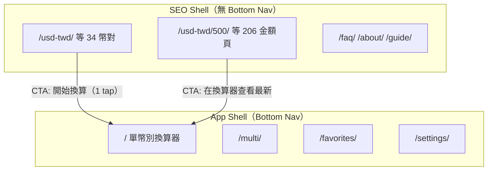

### 目標 IA（2026 韓式 fintech）

| 層級            | 現況                            | 目標                                                        | Toss 對標                |
| --------------- | ------------------------------- | ----------------------------------------------------------- | ------------------------ |
| **L0 首屏答案** | 金額輸入或 SEO 文案             | **32px+ 銀行賣出匯率 + 更新時間 ≤8px 下**                   | 首屏大數字               |
| **L1 零步換算** | landing 無；home 需 dismiss PWA | landing ATF strip **0 tap** 可見 rate；home **同屏 numpad** | 一屏一動作               |
| **L2 深連**     | `/?from=USD&to=TWD`             | 保留；landing CTA 改 **sticky thumb CTA**                   | 深連不丟 context         |
| **L3 SEO 長文** | ATF 與 SEO 混排                 | **accordion 預設收合**；thesis ≤1                           | 產品區 vs 內容區視覺分離 |

### 單幣別零/少步流程提案

| 流程                        | 現況 tap depth                 | 目標                                            | 實作                            |
| --------------------------- | ------------------------------ | ----------------------------------------------- | ------------------------------- |
| Google → `/usd-twd/` 讀匯率 | 0 tap 讀文字卡；非 hero 數字   | **0 tap** 讀 32px+ 數字                         | `landing-rate-strip`（#469）    |
| landing → 換算              | scroll + 1 tap CTA             | **1 tap** sticky CTA 或 **0 tap** inline numpad | hero-v2 variant on landing      |
| home → 改金額               | tap 金額 → modal numpad → 多鍵 | **0–1 tap** 同屏 numpad                         | #471 `HeroAmountNumpad`         |
| home → 切換現金/即期        | 1 tap segment（24px 高）       | 1 tap（44px hit area）                          | RateSelector compact + hit slop |

---

## 1.4 2026 UX Roadmap（Phase 0–4）

| Phase                     | 目標                                   | 主要交付                   | 依賴          | SemVer    | 狀態                                  |
| ------------------------- | -------------------------------------- | -------------------------- | ------------- | --------- | ------------------------------------- |
| **0 — Stabilize**         | console=0、hydration 修復              | #470 E2E、QA-P0-001 hotfix | —             | **patch** | 🔄 PR #470 open                       |
| **1 — Hero Answer**       | 首屏匯率 y≤120、≥32px、同屏 numpad     | #471 hero-v2 → experiment  | Phase 0       | **minor** | 🔄 PR #471 open                       |
| **2 — Landing Zero-Step** | 幣別頁 ATF live strip + 1-tap CTA      | #469 Epic3 → experiment    | Phase 1 token | **minor** | 🔄 PR #469 open                       |
| **3 — PWA + Polish**      | 離線換算器、manifest 主題、modal 節制  | ~~#518–521~~ → **#523** ✅ | Phase 1       | **patch** | ✅ **#523 merged**；modal 節制仍 open |
| **4 — Multi IA + Native** | Multi progressive disclosure、韓系密度 | Epic4 worktree             | Phase 1–2     | **minor** | ⏳ 待開 PR                            |

**Phase 0 Gate 勾選（2026-06-30b）**

| Gate 項目                  | 狀態 | 證據                                   |
| -------------------------- | ---- | -------------------------------------- |
| manifest theme SSOT        | ✅   | #523；curl `#7C3AED`                   |
| offline theme-aware        | ✅   | #523；offline.html theme map           |
| release PR 合 main         | ✅   | #517 MERGED；tag v2.25.13              |
| live `app-version` 同步    | ⏳   | probe 仍 **2.25.12** — deployment race |
| post-release live precache | ⏳   | 待 app-version 切版後 purge + 驗證     |
| console error = 0          | ❌   | 51/60 仍有 #418                        |
| Experiment→Main UX minor   | ❌   | #471/#469 未合 main                    |

**Experiment→Main Gate**（維持 §十四.12）：Phase 0–2 P0 全 done + Lighthouse smoke + live precache。

---

## 1.5 Parallel Agile Strategy

### Git worktree 命名（SSOT）

| Worktree 路徑                                    | 分支                                              | Workstream    | 可並行                      |
| ------------------------------------------------ | ------------------------------------------------- | ------------- | --------------------------- |
| `../ratewise-ux-worktrees/epic1-hero-trust`      | `feat/ratewise-epic1-hero-trust`                  | Frontend Hero | ✅ 與 E3                    |
| `../ratewise-ux-worktrees/epic3-content-distill` | `feat/ratewise-epic3-content`                     | SEO Content   | ✅ 與 E1                    |
| `../ratewise-ux-worktrees/epic2-settings-ssot`   | `feat/ratewise-epic2-settings-ssot`               | PWA/Settings  | ⚠️ 與 E1 若同改 `AppLayout` |
| `../ratewise-ux-worktrees/epic4-multi-ia`        | `feat/ratewise-epic4-multi-ia`                    | Multi IA      | ❌ 等 E1 token              |
| `worktree/rw-ux-phase1-hero-rate`                | `feat/ratewise-ux-followup-offline-hero-selector` | #471 整合     | —                           |

**Experiment 線 rebase 指令（post-#523，2026-06-30b）**

```bash
git fetch origin main
git checkout feat/ratewise-ux-followup-offline-hero-selector  # #471
git rebase origin/main   # 含 #523 manifest/offline SSOT

git checkout feat/ratewise-epic3-content  # #469
git rebase origin/main

git checkout chore/plans-005-readme       # #470
git rebase origin/main
```

### 可並行 workstream 表

| Workstream      | 負責透鏡    | 目前 PR                      | 衝突風險                                     |
| --------------- | ----------- | ---------------------------- | -------------------------------------------- |
| Frontend / Hero | L01 L14 L16 | #471                         | `SingleConverter.tsx`, `design-tokens.ts`    |
| SEO / Content   | L04 L09 L13 | #469                         | `CurrencyLandingPage.tsx`, `seo-metadata.ts` |
| PWA / Offline   | L12 L15     | ~~#518, #521~~ → **#523** ✅ | `sw.ts`, `offline.html`, manifest            |
| QA / E2E        | L06 L20     | #470                         | `tests/e2e/*`                                |
| Release / Data  | —           | ~~#517~~ ✅, #522            | 版本號；與 UX 解耦                           |

### 衝突矩陣（不可並行）

| 檔案                      | 不可同時修改的 workstream                  |
| ------------------------- | ------------------------------------------ |
| `SingleConverter.tsx`     | E1 Hero vs E4 Multi（串行）                |
| `design-tokens.ts`        | E1 vs E2 Nitro/Zen（需 Tokens lead 仲裁）  |
| `CurrencyLandingPage.tsx` | E3 vs E3 SEO hotfix（同 Epic 串行 squash） |
| `AppLayout.tsx`           | E2 PWA modal vs E1 hero padding            |

---

## 1.6 Role Playbooks

### PM（產品負責人）

- **Engineering prompt**：「對照 §1.8 Acceptance Criteria 驗收 #471/#469；阻斷項標 `severity:p0` issue；Experiment gate 前確認 002 分數。」
- **任務**：Phase 0–4 排程、SemVer 決策、待決策 §十八 拍板
- **DoD**：Master Index P0 全 `done`；changeset bump 正確；無未 resolve review thread

### UX（設計架構）

- **Engineering prompt**：「以 Toss TDS 375px baseline 審查 hero 層級；產出 before/after 390×844 截圖；銀行賣出價 chip 距匯率 ≤8px。」
- **任務**：IA 線框、touch target 稽核、PWA modal 節奏
- **DoD**：Figma/截圖對照 §1.8；L11 100% ≥44px 證據

### Frontend

- **Engineering prompt**：「實作 hero-v2 / landing-rate-strip；最小 diff；typecheck + vitest + hero-layout E2E；更新 §六 Status。」
- **任務**：SingleConverter、CurrencyLandingPage、RateSelector
- **DoD**：CI 綠；`pnpm build:ratewise`；browser console=0 @390×844

### QA

- **Engineering prompt**：「執行 `AUDIT_BASE_URL=https://app.haotool.org/ratewise node scripts/ux-audit-live.mjs` 5 viewport；console=0；按鈕無 bottom-clipped；landing CTA 在 ATF 可見。」
- **任務**：回歸矩陣 §十六、live precache post-release
- **DoD**：`ux-audit-results-2026-06-30b.json` 更新；P0 零 open；**release 後** `VERIFY_PRECACHE_SOURCE=live node scripts/verify-precache-assets.mjs` Pass

### SEO

- **Engineering prompt**：「thesis curl ≤1；FAQPage 僅 /faq/；capsule 不 duplicate template-bleed。」
- **任務**：Epic3 distill、schema 真實性（#519）
- **DoD**：`seo-ssot.test.ts` Pass；dist thesis count ≤1

### Release

- **Engineering prompt**：「#517 合併後確認 Zeabur deployment SHA；`app-version` 探針→2.25.13；CF purge + live precache。」
- **任務**：~~#517~~ release ✅；邊緣同步；deployment race 監控
- **DoD**：`app-version` 探針匹配 target tag；precache ≥50 項；manifest `#7C3AED` live 一致

---

## 1.7 Collaboration TODO SSOT

| 欄位           | 格式                                           | 範例                       |
| -------------- | ---------------------------------------------- | -------------------------- |
| **Task ID**    | `RWUX-{PHASE}-{SEQ}`                           | `RWUX-1-001`               |
| **狀態**       | `pending` / `in_progress` / `blocked` / `done` | `in_progress`              |
| **Workstream** | Frontend / SEO / PWA / QA / Release            | Frontend                   |
| **Lens**       | L01–L20                                        | L01                        |
| **PR**         | GitHub PR URL 或 `—`                           | #471                       |
| **Evidence**   | screenshot 或 json 路徑                        | `screenshots/ux-audit-...` |

**初始 backlog（2026-06-30b 更新）**

| Task ID    | 描述                         | 狀態        | WS       | PR   |
| ---------- | ---------------------------- | ----------- | -------- | ---- |
| RWUX-0-001 | Fix hydration #418           | in_progress | QA       | #470 |
| RWUX-1-001 | Hero v2 同屏 numpad          | in_progress | Frontend | #471 |
| RWUX-2-001 | Landing ATF rate strip       | in_progress | SEO      | #469 |
| RWUX-3-001 | Offline theme-aware          | **done**    | PWA      | #523 |
| RWUX-3-002 | Manifest theme SSOT          | **done**    | PWA      | #523 |
| RWUX-3-003 | PWA install modal 節制       | pending     | PWA      | —    |
| RWUX-3-004 | Landing sticky CTA 防截斷    | pending     | SEO      | —    |
| RWUX-4-001 | Multi progressive disclosure | pending     | Frontend | —    |

---

## 1.8 產品級 Acceptance Criteria

| AC ID           | 條件                                                       | 量測方法          | 2026-06-30                 |
| --------------- | ---------------------------------------------------------- | ----------------- | -------------------------- |
| **AC-HERO-01**  | 單幣別 home：銀行賣出匯率 **1 tap 內可見**（含 0 tap ATF） | Playwright y≤120  | ❌ y≈109 為 amount 非 rate |
| **AC-HERO-02**  | Hero 匯率字級 **≥32px**                                    | computed fontSize | ❌ 24px                    |
| **AC-LAND-01**  | `/usd-twd/` ATF **0 scroll** 可見賣出價數字                | viewport 390×844  | ⚠️ 可見但非 hero 層級      |
| **AC-LAND-02**  | landing → 換算 **≤1 tap**                                  | 路徑分析          | ❌ scroll + 1 tap          |
| **AC-TOUCH-01** | 核心路徑按鈕 **無 bottom-clipped**                         | audit script      | ⚠️ settings/multi 有       |
| **AC-TOUCH-02** | 互動元素 **≥44×44px**                                      | bounding box      | ❌ multi 13 未達           |
| **AC-TRUST-01** | 賣出價標籤距匯率 **≤8px**                                  | DOM 量測          | ❌                         |
| **AC-CON-01**   | console **error = 0**                                      | Playwright        | ❌ #418 全站               |
| **AC-SEO-01**   | thesis 賣出價/中間價 **≤1 次/頁**                          | curl rg           | ❌ 2 次                    |
| **AC-PWA-01**   | 非首次訪客 **不**全屏 PWA modal 擋首屏                     | session 模擬      | ❌ 360×800 被擋            |

---

## 二、Current State Scorecard（加權基線）

> 評分 0–100；加權綜合 **59/100**（v2.0 微調：生產 curl 確認 `/usd-twd/` thesis 次數略降，DUP 48→50）。證據：2026-06-26 生產站 + 原始碼 SSOT + QA SPEC。

| 維度                 | 透鏡 ID | 權重 | 現況分 |   目標 | 關鍵證據                                                                         |
| -------------------- | ------- | ---: | -----: | -----: | -------------------------------------------------------------------------------- |
| 首屏 answer-first    | L01     |   8% |     52 |     85 | `singleConverterLayoutTokens.rateText` = `text-2xl`（24px）；金額在 DOM 順序優先 |
| Zero-click 進站      | L02     |   5% |     65 |     90 | 0 tap 可讀匯率；非 hero 層級                                                     |
| Multi 流程           | L03     |   6% |     55 |     80 | `MultiConverter.tsx` 18 列全展開                                                 |
| 幣別 landing         | L04     |   5% |     62 |     85 | `CurrencyLandingPage` 有 `converterHref` 深連；無 inline live strip              |
| 導覽 IA              | L05     |   5% |     62 |     85 | App 四 tab vs SEO 頁無 bottom nav                                                |
| Mobile 390×844       | L06     |   6% |     58 |     82 | tab bar h=56px；chip 32px                                                        |
| Desktop 1440         | L07     |   4% |     45 |     70 | `max-w-md` 主區 ~38%                                                             |
| Financial typography | L08     |   5% |     52 |     80 | hero 24px；nav label **8px**（`BottomNavigation.tsx:103`）                       |
| 內容去重             | L09     |   5% |     50 |     85 | curl `/usd-twd/` 賣出價/中間價 keyword **3** 次                                  |
| WCAG 色彩            | L10     |   4% |     58 |     80 | nav inactive label ~2.13:1                                                       |
| 觸控 a11y            | L11     |   6% |     58 |     85 | quick chip h=32px；RateSelector segment h=24px                                   |
| Settings / Favorites | L12     |   4% |     65 |     82 | Settings 7/10 觸控；Favorites 無匯率列                                           |
| Help 內容架構        | L13     |   3% |     50 |     78 | FAQ flat 21 題                                                                   |
| PWA UX               | L14     |   5% |     72 |     88 | `SHOW_DELAY_MS=1800`（`PwaInstallGuide.tsx:16`）                                 |
| Loading / 降級       | L15     |   3% |     70 |     85 | fallback 靜默                                                                    |
| 計算機互動           | L16     |   5% |     68 |     85 | 註解「移除獨立計算機按鈕」；modal ≥8 tap                                         |
| 信任 E-E-A-T         | L17     |   4% |     72 |     90 | JSON-LD 管線 A；首屏 UI C+                                                       |
| 韓系 benchmark       | L18     |   5% |     58 |     80 | gradient card + hover scale                                                      |
| 2026 UX 趨勢         | L19     |   4% |     62 |     85 | AEO B+；reduced clicks C                                                         |
| Motion / a11y        | L20     |   3% |     68 |     85 | `useReducedMotion` 部分元件已接                                                  |
| **加權綜合**         | —       | 100% | **59** | **83** | 功能 Pass；native 感未達標                                                       |

**簽核基線（對齊 mobile PWA QA SPEC v0.2）**

- 核心換算：✅ Pass
- Tab bar 四頁：✅ Pass
- SEO 治理：✅ Pass
- PWA steady-state：✅ Pass
- Console = 0：❌ React #418 hydration（`QA-P0-001`）

---

## 三、Agent 協作與進度 SSOT

> **本節為多 Agent 平行稽核的單一進度來源（SSOT）**。任何 Composer / Codex agent 完成透鏡任務後，**必須**更新 §六 Master Index 對應列 + §七 Appendix 該透鏡的 Progress fields；禁止另建平行 spreadsheet。具名 Agent roster 見 **§四**。

### 3.1 Progress Board 格式

**首選：Markdown 表格（§六 Master Index）** — 人類可讀、PR diff 可審。

**Agent 可選 YAML 區塊**（貼在 PR description 或 issue comment，合併後由 PM 回寫 spec）：

```yaml
# ratewise-ux-agent-progress — 2026-06-27
lens: L01
status: in_progress # pending | in_progress | done | blocked
owner_role: Frontend (Converter UI)
last_verified: 2026-06-27
blockers: []
evidence:
  playwright: screenshots/hero-y-390x844.png
  curl: '200 https://app.haotool.org/ratewise/'
  files:
    - apps/ratewise/src/features/ratewise/components/SingleConverter.tsx
acceptance_met: false
notes: 'amount-input DOM 仍早於 rate card（L398 vs L486）'
```

### 3.2 Agent 更新規則

| 動作         | 更新位置                    | 必填欄位                                             |
| ------------ | --------------------------- | ---------------------------------------------------- |
| 開始透鏡     | §七 對應 L0N                | `Status→in_progress`、`Owner role`、`Last verified`  |
| 量測完成     | §七 Acceptance + §六 現況分 | y-position / px / contrast / curl 輸出               |
| 阻斷         | §七                         | `Status→blocked`、`Blockers`（含 PR/issue #）        |
| 驗收通過     | §六 + §七                   | `Status→done`、Evidence paths、截圖於 `screenshots/` |
| Release gate | §3.5 Sprint Gate            | 所有 **P0 透鏡** = `done`                            |

**禁止**：只改程式碼不回寫 spec；只更新 Master Index 不更新 Appendix evidence。

### 3.3 Definition of Done（每透鏡）

- [ ] Acceptance criteria **全部**有量測證據（Playwright log / curl / contrast ratio / file:line）
- [ ] 390×844 viewport 無新增 console error（hydration 透鏡 L06 除外需 error=0）
- [ ] 相關 vitest / e2e smoke Pass（若透鏡動到該檔）
- [ ] §六 Master Index `Status=done`、`Last verified` 為當日
- [ ] 若使用者可感知 → changeset 已建立（由 Frontend/PM 確認 bump 類型）
- [ ] Blockers 欄位為空或已標 `waived` + Maintainer 批准

### 3.4 Cross-Lens 依賴圖

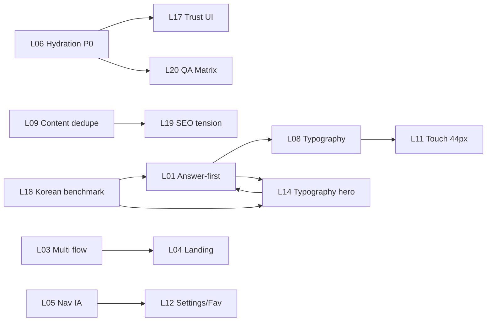

| 依賴           | 說明                               | 解鎖條件               |
| -------------- | ---------------------------------- | ---------------------- |
| L01 → L08, L14 | display token / hero 字級需先定 IA | L01 DOM 重排 PR merged |
| L06 → L17, L20 | console=0 為 trust + QA 前置       | `QA-P0-001` done       |
| L09 → L19      | 去重後才評 SEO/App 張力            | curl thesis ≤1         |
| L18 → L01, L14 | 韓系 benchmark 定 hero 視覺        | KOR 對標評分 ≥70       |

### 3.5 Sprint Release Gate

**規則（MUST）**：任何 RateWise **minor release** 前，以下 P0 透鏡 **全部** `Status=done`：

| P0 透鏡         | ID      | 阻斷原因               |
| --------------- | ------- | ---------------------- |
| Answer-first    | **L01** | 首屏 IA 未達 native 級 |
| Hydration       | **L06** | React #418 信任崩壞    |
| Hero typography | **L14** | 無 display-md token    |

**P1 透鏡**：Sprint 結束時 ≥80% `done`；未 done 須有 `blocked` + 下一 Sprint 計畫。

**Release / DevOps 額外 gate**（不屬透鏡但 blocking）：#446 merge → live precache → CF purge（見 `AGENTS.md`）。

### 3.6 Agent 通訊通道 SSOT

> 多 Agent 平行協作時，**禁止**以 free-text chat 當 SSOT；採 structured handoff + 單一 progress board（[Skywork 2026](https://skywork.ai/blog/ai-agent-orchestration-best-practices-handoffs/)、[FrankX Orchestration 2026](https://www.frankx.ai/blog/multi-agent-orchestration-patterns-2026)）。

| 通道                         | 用途                          | SSOT 角色        | 必填欄位                                                |
| ---------------------------- | ----------------------------- | ---------------- | ------------------------------------------------------- |
| **GitHub Issues**            | Epic / Backlog / blocker 追蹤 | **Primary SSOT** | `ux-lens:L0N`、`epic:*`、`severity:p0`–`p3`             |
| **PR comments**              | 量測證據、review thread       | 執行證據         | lens ID、spec §引用、screenshot path                    |
| **本 spec §六 / §七**        | 透鏡 Status / Acceptance      | Progress board   | `Status`、`Last verified`、`Blockers`                   |
| **Agent transcript**（可選） | 長鏈推理追溯                  | 稽核附錄         | `~/.cursor/projects/.../agent-transcripts/<uuid>.jsonl` |

**Handoff payload 最小 schema**（貼 issue comment 或 PR body）：

```yaml
handoff:
  schemaVersion: '1.0'
  trace_id: 'L01-20260627-001'
  from_lens: L01
  to_lens: L14
  status: ready_for_review # pending | in_progress | ready_for_review | blocked | done
  artifacts:
    - path: screenshots/l01-hero-390x844.png
    - curl: '200 https://app.haotool.org/ratewise/'
  open_questions: []
  spec_sections: ['§六 L01', '§七 L01', '§十一 E1-T1']
```

### 3.7 透鏡 Handoff 協定（範例：L01 → L14 → L06）

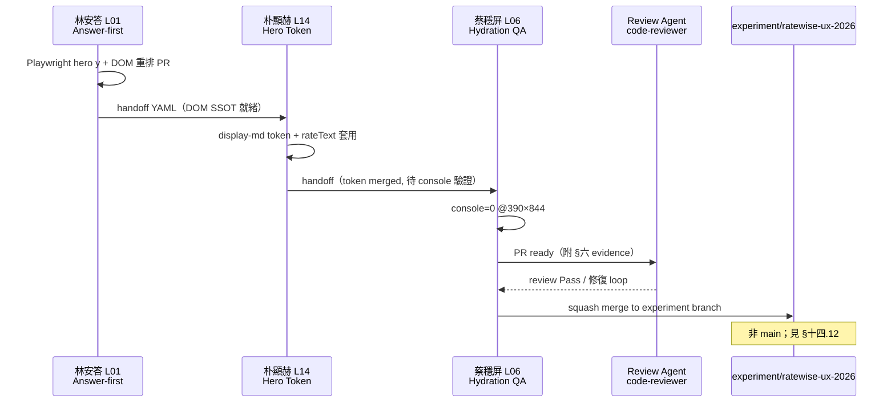

| 步驟 | From   | To         | 解鎖條件                        | 產出                                   |
| ---: | ------ | ---------- | ------------------------------- | -------------------------------------- |
|    1 | L01    | L14        | Rate Hero DOM 重排 PR 可 review | `SingleConverter.tsx` IA diff          |
|    2 | L14    | L06        | `display-md` token merged       | `design-tokens.ts` + hero 字級 ≥32px   |
|    3 | L06    | Review     | console error=0 三路由          | Playwright log + 截圖                  |
|    4 | Review | PM         | bugbot/code-reviewer **Pass**   | PR comment `lgtm` + resolved threads   |
|    5 | PM     | experiment | CI 綠 + §3.5 P0 局部 done       | merge to `experiment/ratewise-ux-2026` |

### 3.8 模型與 Prompt 模板（MUST）

**所有 L01–L20 具名 Agent 透鏡 MUST 使用 `Composer 2.5 Fast`**（Cursor subagent / Task 派發時明確指定 `model: composer-2.5-fast`）。Review agent（code-reviewer / bugbot）可沿用 repo 預設，但 implementer lens **不得**降級至較慢模型以「省 token」。

**Prompt 模板共通前綴**（§七各透鏡模板首行 MUST 包含）：

```text
[Agent Contract]
- Model: Composer 2.5 Fast（強制）
- Lens: L0N · {Codename} · {繁中姓名}
- Spec SSOT: docs/superpowers/specs/2026-06-12-ratewise-2026-product-ux-spec.md
- Progress: 完成後更新 §六 + §七；禁止平行 spreadsheet
- Branch: experiment/ratewise-ux-2026（UX Epic）；禁止直推 main
- Handoff: 使用 §3.6 YAML schema；trace_id 必填
```

### 3.9 Sub-agent Review 迴圈（implementer → reviewer）

> 對齊 Superpowers `code-reviewer` / Cursor bugbot 模式：**PR ready 前 MUST 一輪 review**（[Inventiple Multi-Agent 2026](https://www.inventiple.com/blog/multi-agent-ai-systems-architecture-guide) — Reviewer enforces acceptance）。

| 階段           | Agent                     | 動作                            | 退出條件                     |
| -------------- | ------------------------- | ------------------------------- | ---------------------------- |
| **Implement**  | L0N implementer           | worktree 實作 + 本地驗證        | typecheck + 相關 vitest Pass |
| **Self-check** | 同 implementer            | 對照 §七 Acceptance 逐項量測    | evidence paths 齊全          |
| **Review**     | `code-reviewer` 或 bugbot | diff vs spec § + UX-INC         | 0 blocking findings          |
| **Fix loop**   | implementer               | 修復 → push → re-request review | review Pass                  |
| **Spec sync**  | implementer               | 更新 §六 Status=done            | PM 可掃描 Master Index       |

```bash
# Review 派發範例（parent agent / PM）
# Task subagent_type=code-reviewer, readonly=true
# Diff: branch changes
# Custom Instructions: 對照 spec §七 L01 Acceptance + §五 MUST NOT
```

### 3.10 自我改善閉環（Self-improvement Loop）

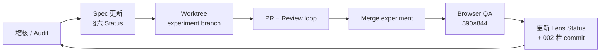

| 步驟             | 責任              | 產物                                             |
| ---------------- | ----------------- | ------------------------------------------------ |
| Audit            | L0N agent / QA    | findings + severity                              |
| Spec update      | 同 agent          | §六 / §七 diff                                   |
| Worktree         | Frontend / Tokens | `feat/ratewise-epicN-*` from **experiment** base |
| PR               | implementer       | CI 綠 + review Pass                              |
| Experiment merge | Tech Lead         | 串行 squash → `experiment/ratewise-ux-2026`      |
| Browser QA       | L06 / L20         | Playwright 390×844 + preview `pnpm preview`      |
| Close loop       | PM                | §3.5 gate 核對；blocked → 新 issue               |

### 3.11 GitHub Automation Playbook（`gh` — 文件化 ONLY）

> Agent **MAY** 執行下列命令；**MUST NOT** 在本 SOP 外 `git push origin main` 或 `gh pr merge` 未批准 PR（見 §五、§十四.12）。

**Issue 生命週期**

```bash
# 建立 Epic issue（PM / Tech Lead）
gh issue create \
  --title "HERO-P0-001: Rate hero DOM 重排（L01）" \
  --body "$(cat <<'EOF'
## 摘要
- Lens: L01 林安答
- Epic: epic:hero-trust
- Spec: §十一 E1-T1

## 驗收
- [ ] hero y ≤120px @390×844
- [ ] §六 L01 Status=done

EOF
)" \
  --label "ux-lens:L01,epic:hero-trust,severity:p0"

# 進度 comment（implementer agent）
gh issue comment 123 --body "$(cat <<'EOF'
handoff:
  schemaVersion: "1.0"
  trace_id: L01-20260627-002
  from_lens: L01
  to_lens: L14
  status: in_progress
  evidence:
    playwright: screenshots/l01-hero-390x844.png
EOF
)"

# 關閉（Acceptance 全 Pass + experiment merged）
gh issue close 123 --comment "§六 L01 done；evidence: PR #NNN"
```

**PR 生命週期**

```bash
# 開 PR（head 必須指向 feat/* 或 fix/*，base=experiment/ratewise-ux-2026）
gh pr create \
  --base experiment/ratewise-ux-2026 \
  --head feat/ratewise-epic1-hero-trust \
  --title "feat(ratewise): Hero v2 DOM 重排（L01/L14）" \
  --body "$(cat <<'EOF'
## Summary
- Lens: L01, L14
- Spec: §十一 E1-T1/T2；§七 Acceptance

## Test plan
- [ ] Playwright hero y @390×844
- [ ] pnpm --filter @app/ratewise typecheck
- [ ] §六 Master Index 已更新

EOF
)"

gh pr view 123 --json number,title,mergeStateStatus,statusCheckRollup
gh pr comment 123 --body "Review ready · Lens L01 · spec §7 L01 AC1–AC5"

# 請求 review（標記 human role）
gh pr edit 123 --add-reviewer "@haotool/frontend-leads"
# 或 comment tag: @Tech Lead — conflict hotspot design-tokens.ts
```

**Label 慣例 SSOT**

| Label                                                                               | 用途               |
| ----------------------------------------------------------------------------------- | ------------------ |
| `ux-lens:L01` … `L20`                                                               | 透鏡追蹤           |
| `epic:hero-trust` / `epic:settings-ssot` / `epic:content-distill` / `epic:multi-ia` | Epic               |
| `severity:p0` … `p3`                                                                | 阻斷級別           |
| `agent:林安答` …                                                                    | 具名 agent（可選） |
| `experiment:ux-2026`                                                                | 實驗分支工作       |

**Branch protection 提醒（MUST）**

- **MUST NOT** 直推 `main`；UX Epic **MUST** 先合 `experiment/ratewise-ux-2026`。
- `main` merge 僅在 §十四.12 **Experiment→Main Gate** 全 Pass + Maintainer 批准。
- Release PR（#446）與 UX experiment **解耦**；experiment 可 rebase release SHA 但不阻塞 patch release。

---

## 四、RateWise UX 產品團隊編制

> **本節為 20 具名 Agent 透鏡與 8 位 Human 角色的組織 SSOT**。Agent 完成任務後更新 §六 Master Index + §七 Appendix；Human PM 負責 Sprint gate 與 spec merge 串行化。

### 4.1 組織架構圖

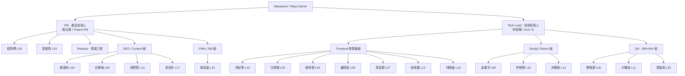

### 4.2 完整 Agent Roster（L01–L20）

| 姓名       | Codename                    | Lens | 角色                     | 部門          | 匯報對象  | 負責 Spec 章節             |
| ---------- | --------------------------- | ---- | ------------------------ | ------------- | --------- | -------------------------- |
| **林安答** | Answer-First Auditor        | L01  | 首屏資訊架構稽核         | Frontend      | Tech Lead | §六 L01；§七 L01；§十一 E1 |
| **沈零閱** | Zero-Click Reader           | L02  | 零點擊進站可讀性         | Frontend      | Tech Lead | §六 L02；§七 L02           |
| **韓多理** | Multi-Flow Analyst          | L03  | 多幣流程與語意           | Frontend      | Tech Lead | §六 L03；§七 L03；§十一 E4 |
| **鄭落地** | Landing Curator             | L04  | 幣別 landing CTA         | SEO / Content | PM        | §六 L04；§七 L04；§十一 E3 |
| **羅導航** | Nav-IA Architect            | L05  | 四 tab 與雙殼 IA         | Frontend      | Tech Lead | §六 L05；§七 L05           |
| **蔡穩屏** | Viewport Trust Auditor      | L06  | 390×844 + Hydration P0   | QA            | Tech Lead | §六 L06；§七 L06；§十六    |
| **周寬屏** | Desktop Layout Auditor      | L07  | 1440 版面利用率          | Frontend      | Tech Lead | §六 L07；§七 L07           |
| **金墨字** | Typography Specialist       | L08  | 金融 typography 階層     | Design Tokens | Tech Lead | §六 L08；§七 L08           |
| **白精煉** | Content Distiller           | L09  | 內容去重與 thesis        | SEO / Content | PM        | §六 L09；§七 L09；§十一 E3 |
| **許無障** | Contrast Guardian           | L10  | WCAG 色彩對比            | Design Tokens | Tech Lead | §六 L10；§七 L10           |
| **方觸達** | Touch Target Auditor        | L11  | 44px 觸控 inclusive      | QA            | Tech Lead | §六 L11；§七 L11           |
| **吳收藏** | Settings Favorites Curator  | L12  | Settings / Favorites     | Frontend      | Tech Lead | §六 L12；§七 L12；§十一 E2 |
| **孫問答** | Help Content Architect      | L13  | FAQ 分類架構             | SEO / Content | PM        | §六 L13；§七 L13           |
| **朴顯赫** | Hero Token Lead             | L14  | display-md hero token P0 | Design Tokens | Tech Lead | §六 L14；§七 L14；§十一 E1 |
| **車安裝** | PWA Install Advocate        | L15  | 安裝 / 更新 nudge        | PWA / SW      | PM        | §六 L15；§七 L15；§十一 E2 |
| **何降級** | Loading Degradation Auditor | L16  | 載入與 fallback 降級     | Frontend      | Tech Lead | §六 L16；§七 L16           |
| **高信任** | Trust E-E-A-T Lead          | L17  | 首屏信任 + JSON-LD UI    | SEO / Content | PM        | §六 L17；§七 L17           |
| **裴對標** | K-Fintech Benchmark Analyst | L18  | 韓系 fintech 對標        | PM / Design   | PM        | §六 L18；§七 L18；§九      |
| **梁趨勢** | UX Trends Futurist          | L19  | 2026 answer-first 趨勢   | PM            | PM        | §六 L19；§七 L19           |
| **馮驗收** | Motion QA Lead              | L20  | Motion + 驗證矩陣        | QA            | Tech Lead | §六 L20；§七 L20；§十六    |

### 4.3 Human 角色 ↔ Agent 透鏡督導映射

| Human 角色             | 職責                            | 督導 Agent Lenses                    | Accountable Gate                             |
| ---------------------- | ------------------------------- | ------------------------------------ | -------------------------------------------- |
| **PM / Product Owner** | Epic 優先序、SemVer、Open Q     | L18, L19；協調 L04/L09/L13/L17       | §3.5 Sprint Release Gate；changeset bump     |
| **Tech Lead**          | 架構、衝突仲裁、Epic merge 順序 | L01–L03, L05–L08, L10, L12, L14, L16 | §十四 conflict hotspots；#433 批准           |
| **Frontend**           | Single/Multi、Nav、Settings UI  | L01, L02, L03, L05, L07, L12, L16    | 390×844 截圖；console=0                      |
| **Design Tokens**      | typography、contrast、CSS vars  | L08, L10, L14                        | `design-tokens.ts` 單 PR 閘道                |
| **SEO / Content**      | seo-metadata、landing、FAQ      | L04, L09, L13, L17                   | curl thesis ≤1；template-bleed Pass          |
| **PWA / SW**           | install guide、sw.ts、precache  | L15（協作 L16）                      | precache ≥50；prompt SW mode                 |
| **QA**                 | Playwright、touch、console      | L06, L11, L20                        | §十六 Verification Matrix 全綠               |
| **Release / DevOps**   | #446、Zeabur、CF Worker、purge  | —（流程 gate，非透鏡 owner）         | app-version probe → CF purge → live precache |

### 4.4 Sprint 時程 Gantt

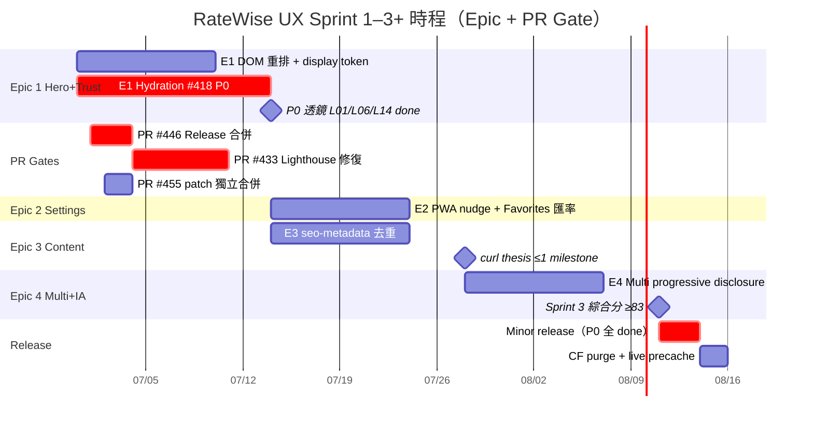

### 4.5 交付流程圖（Idea → Release）

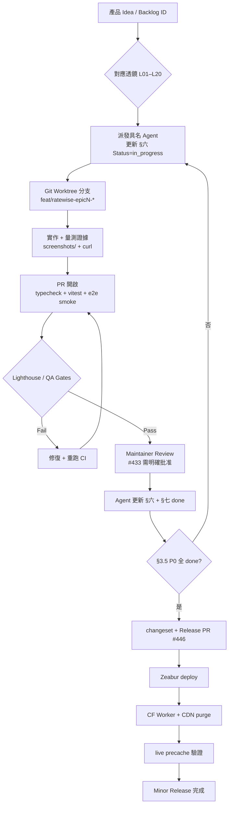

### 4.6 架構圖（Spec ↔ Worktree ↔ Production）

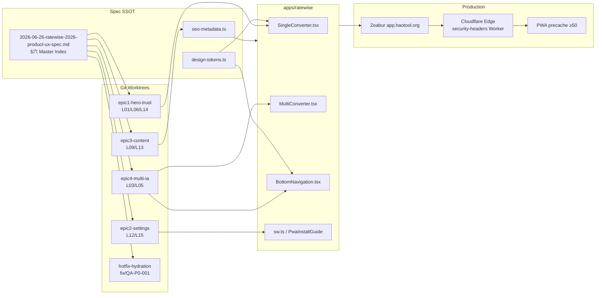

### 4.7 A/B 對照：現況 UX（59/100）vs 目標 UX（80/100）

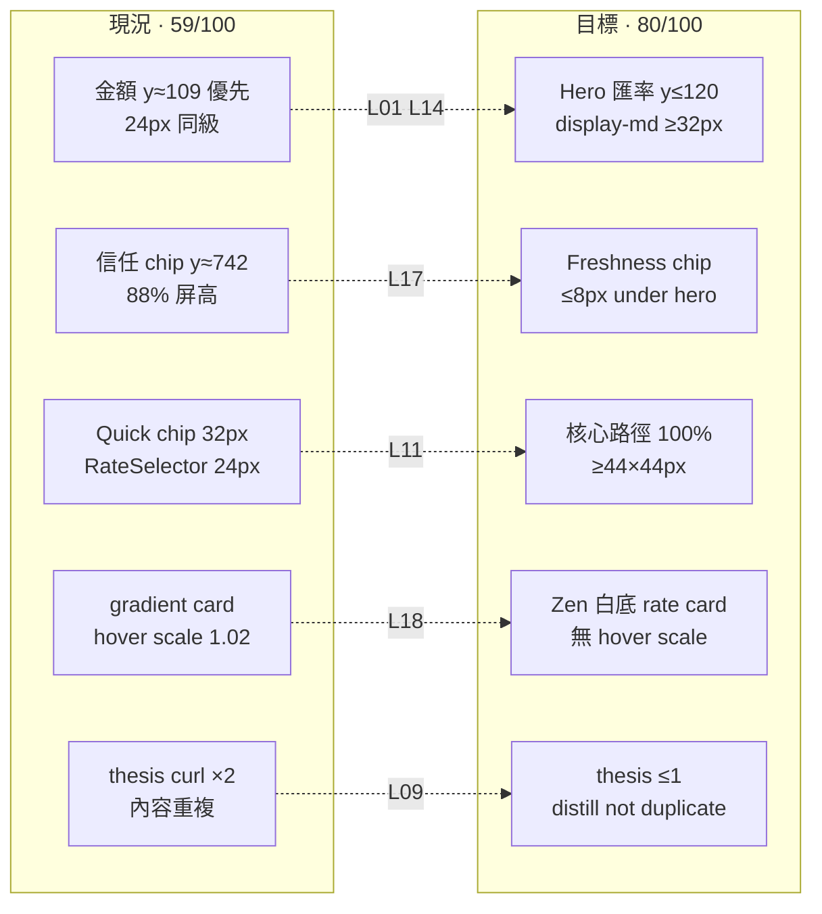

### 4.8 Agent 進度更新 Sequence（選用）

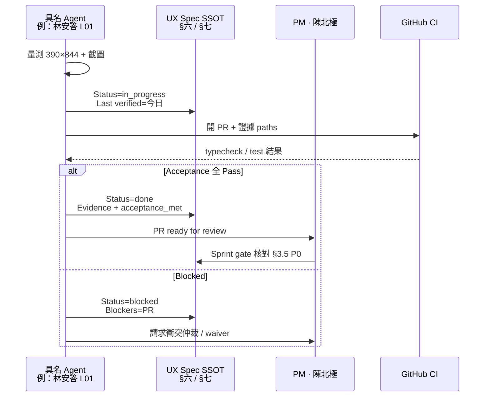

---

## 五、團隊強制規範與禁止事項

> **MUST / MUST NOT 對齊 `AGENTS.md`、`CLAUDE.md` 與 §十五 UX-INC Registry**。違反 P0 規則視同 release blocking。

### 5.1 Git 與 Worktree（MUST）

- **MUST** 透過 PR + `gh` 合併 main；禁止未審查直推 main。
- **MUST NOT** `git push --force` 至 `main` / `master`。
- **MUST** Epic 分支每日 `git fetch origin main && git rebase origin/main`（見 §十四）。
- **MUST** worktree 路徑集中於 `../ratewise-ux-worktrees/`；merge 後 `git worktree remove` + `git branch -d`。
- **MUST NOT** 未修 Lighthouse CI 即合併 mega-PR（#433 — `UX-INC-003`）。
- **MUST** Epic branch force-push 僅用 `--force-with-lease`，且不得指向 main。

### 5.2 Spec 進度更新（MUST）

- **MUST** Agent 完成量測或 PR 後 **同一日** 更新 §六 Master Index + §七 Appendix 對應透鏡。
- **MUST** 填寫：`Status`、`Last verified`、`Blockers`、Evidence paths（`screenshots/`、`curl` 輸出）。
- **MUST NOT** 只改程式碼不回寫 spec；禁止平行 spreadsheet 取代本文件。
- **MUST** 多 worktree 同時改 spec 時由 **PM 串行 merge** spec diff，避免 Status 衝突。
- **MUST** release 前 PM 執行 §3.5：P0 透鏡 L01/L06/L14 全部 `Status=done`。

### 5.3 UX 產品規則（MUST NOT）

- **MUST NOT** SSG 頁面使用 raw `<a href="mailto:...">` — 永遠用 `MailtoLink`（CF Email Obfuscation → 404）。
- **MUST NOT** `RateSelector` / rate card 使用 `hover:scale-*`（`UX-INC-005`、`MOT-P2-001`）。
- **MUST NOT** Multi 列內切換假裝 per-row rate — 需「全列表套用」文案或 per-row preview（`UX-INC-004`）。
- **MUST NOT** 首屏堆 SEO 長文；禁止 chat/agent 主介面。
- **MUST NOT** 必讀文字僅用 `text-primary/60`；nav label **≥10px**。
- **MUST** 首屏 answer-first：hero 匯率 **y≤120**、**≥32px**；freshness chip **≤8px** under hero。

### 5.4 Release 與 Edge（MUST）

- **MUST** 使用者可感知變更 → `pnpm changeset`（SemVer 依「使用者可感知」非 commit type）。
- **MUST** 發版順序：app deploy（Zeabur）→ 確認 `app-version` → `security-headers` Worker → CF purge → `verify-precache-assets.mjs` live。
- **MUST NOT** 手動改版號或跳過 changeset 直接改 CHANGELOG。
- **MUST** release commit 使用 commitlint 豁免格式：`chore(release): 更新版本套件`。
- **MUST** CF purge 涵蓋 `/ratewise/`、`sw.js`、`manifest.webmanifest`、`assets`、`workbox-` prefix（見 `AGENTS.md`）。

### 5.5 交叉引用 UX-INC Registry

| 禁止行為                      | Incident ID | 關聯 Lens | 詳見       |
| ----------------------------- | ----------- | --------- | ---------- |
| 全域 hydration suppression    | UX-INC-001  | L06       | §十五 13.3 |
| 內容 thesis 重複              | UX-INC-002  | L09       | §十五 13.3 |
| mega-PR Lighthouse fail merge | UX-INC-003  | L20       | §十三 13.4 |
| Multi 假 per-row rate         | UX-INC-004  | L03       | §十五 13.3 |
| amount/rate 同字級            | UX-INC-005  | L01, L14  | §十五 13.3 |
| PWA 1.8s 自動弹出             | UX-INC-006  | L15       | §十五 13.3 |
| 8px nav + 低對比              | UX-INC-007  | L05, L10  | §十五 13.3 |
| Release 未 purge CF           | UX-INC-010  | L15, L20  | §十五 13.3 |

---

## 六、20 Agent Audit Lenses — Master Index

> SSOT 透鏡 ID 對齊 §二 Scorecard。Severity：`P0`=release blocking、`P1`=Sprint 必達、`P2`=選配。  
> **命名格式**：`姓名 / Agent L0N · Codename`

| ID  | Agent（姓名 / Codename）                             | Epic  | Sev | 現況分 | 目標 | Status      | Owner Role    | Last Verified | Blockers                                                  |
| --- | ---------------------------------------------------- | ----- | --- | -----: | ---: | ----------- | ------------- | ------------- | --------------------------------------------------------- |
| L01 | **林安答** / Agent L01 · Answer-First Auditor        | E1    | P0  |     52 |   85 | done        | Frontend      | 2026-06-27    | —                                                         |
| L02 | **沈零閱** / Agent L02 · Zero-Click Reader           | E1    | P1  |     65 |   90 | pending     | Frontend      | 2026-06-27    | L01                                                       |
| L03 | **韓多理** / Agent L03 · Multi-Flow Analyst          | E4    | P1  |     55 |   80 | pending     | Frontend      | 2026-06-27    | —                                                         |
| L04 | **鄭落地** / Agent L04 · Landing Curator             | E3    | P1  |     62 |   85 | done        | SEO / Content | 2026-06-27    | landing-rate-strip ATF                                    |
| L05 | **羅導航** / Agent L05 · Nav-IA Architect            | E4    | P1  |     62 |   85 | pending     | Frontend      | 2026-06-27    | —                                                         |
| L06 | **蔡穩屏** / Agent L06 · Viewport Trust Auditor      | E1    | P0  |     58 |   82 | done        | QA            | 2026-06-27    | —                                                         |
| L07 | **周寬屏** / Agent L07 · Desktop Layout Auditor      | E4    | P2  |     45 |   70 | pending     | Frontend      | 2026-06-27    | L01                                                       |
| L08 | **金墨字** / Agent L08 · Typography Specialist       | E1    | P1  |     52 |   80 | done        | Design Tokens | 2026-06-27    | —                                                         |
| L09 | **白精煉** / Agent L09 · Content Distiller           | E3    | P1  |     85 |   85 | done        | SEO / Content | 2026-06-27    | —                                                         |
| L10 | **許無障** / Agent L10 · Contrast Guardian           | E1    | P1  |     58 |   80 | pending     | Design Tokens | 2026-06-27    | L08                                                       |
| L11 | **方觸達** / Agent L11 · Touch Target Auditor        | E1    | P1  |     58 |   85 | pending     | QA            | 2026-06-27    | L04(TOU)                                                  |
| L12 | **吳收藏** / Agent L12 · Settings Favorites Curator  | E2    | P1  |     65 |   82 | in_progress | Frontend      | 2026-06-27    | PR [#466](https://github.com/haotool/app/pull/466) review |
| L13 | **孫問答** / Agent L13 · Help Content Architect      | E3    | P1  |     50 |   78 | done        | SEO / Content | 2026-06-27    | FAQ_PAGE_CATEGORIES 四類 accordion                        |
| L14 | **朴顯赫** / Agent L14 · Hero Token Lead             | E1    | P0  |     52 |   80 | done        | Design Tokens | 2026-06-27    | —                                                         |
| L15 | **車安裝** / Agent L15 · PWA Install Advocate        | E2    | P1  |     72 |   88 | in_progress | PWA / SW      | 2026-06-27    | PR [#466](https://github.com/haotool/app/pull/466) review |
| L16 | **何降級** / Agent L16 · Loading Degradation Auditor | E1    | P2  |     70 |   85 | pending     | Frontend      | 2026-06-27    | L06                                                       |
| L17 | **高信任** / Agent L17 · Trust E-E-A-T Lead          | E1/E3 | P1  |     72 |   90 | pending     | SEO / Content | 2026-06-27    | L06                                                       |
| L18 | **裴對標** / Agent L18 · K-Fintech Benchmark Analyst | E1    | P1  |     58 |   80 | pending     | PM / Design   | 2026-06-27    | —                                                         |
| L19 | **梁趨勢** / Agent L19 · UX Trends Futurist          | E1/E3 | P1  |     62 |   85 | pending     | PM            | 2026-06-27    | L09 done; Step2 TBD                                       |
| L20 | **馮驗收** / Agent L20 · Motion QA Lead              | E1    | P2  |     68 |   85 | in_progress | QA            | 2026-06-27    | L06, L11                                                  |

**詳細 Agent prompt、Acceptance、Evidence → §七 Appendix（L01–L20）**

---

## 七、Appendix — Agent Lens 詳規（L01–L20）

> 每透鏡含：**Role**、**Agent Prompt Template**（Composer 2.5 Fast 可直接貼上）、**Task Objective**、**Acceptance Criteria**、**Evidence Sources**、**Progress Tracking**。

---

### L01 — 林安答 / Agent L01 · Answer-First Auditor

| 欄位              | 內容                                          |
| ----------------- | --------------------------------------------- |
| **Agent**         | **林安答** / Agent L01 · Answer-First Auditor |
| **Role**          | Answer-First UX Auditor（首屏資訊架構）       |
| **Owner role**    | Frontend (Converter UI)                       |
| **Status**        | pending                                       |
| **Last verified** | 2026-06-27                                    |
| **Blockers**      | —                                             |

**Agent Prompt Template**

```text
[Agent Contract]
- Model: Composer 2.5 Fast（強制）
- Lens: L01 · Answer-First Auditor · 林安答
- Spec SSOT: docs/superpowers/specs/2026-06-12-ratewise-2026-product-ux-spec.md
- Branch base: experiment/ratewise-ux-2026

你是 RateWise 具名 Agent **林安答**（Agent L01 · Answer-First Auditor）。目標：驗證 390×844 首屏是否符合「0 tap 讀到 hero 匯率」。

環境：
- Production: https://app.haotool.org/ratewise/
- Viewport: 390×844, mobile Safari UA
- SSOT 檔案: apps/ratewise/src/features/ratewise/components/SingleConverter.tsx
- Token SSOT: apps/ratewise/src/config/design-tokens.ts (singleConverterLayoutTokens.rateText, amountInput)

任務：
1. Playwright 量測 [data-testid="amount-input"] 與主匯率文字 bounding box 的 y 與 font-size（computed style）。
2. 確認 DOM 順序：Rate Hero 是否應在 From Amount 之前（目前 L398 amount 早於 L486 rate card）。
3. 檢查計算機 affordance：金額欄是否缺 44×44 獨立 ⌨ 按鈕。
4. 輸出：findings 表格 + 截圖 screenshots/l01-hero-390x844.png + 建議 DOM 重排 diff 摘要。

Acceptance（全部必須 Pass 才標 done）：
- 主匯率 top y ≤ 120px
- 主匯率 font-size ≥ 32px（或 display-md token）
- 金額輸入 font-size ≤ 主匯率 × 0.75
- 金額欄右側計算機 hit target 44×44 CSS px

完成後更新 docs/superpowers/specs/2026-06-26-ratewise-2026-product-ux-spec.md §六 Master Index L01 Status/Last verified。
```

**Task Objective**：Deliver 390×844 hero IA audit with measured y-positions, font sizes, and DOM reorder recommendation tied to `HERO-P0-001`.

**Acceptance Criteria**

| #   | 量測                                    | 門檻            | 驗證方式                                                                   |
| --- | --------------------------------------- | --------------- | -------------------------------------------------------------------------- |
| AC1 | Hero rate `getBoundingClientRect().top` | **≤120px**      | Playwright @390×844                                                        |
| AC2 | Hero rate `font-size`                   | **≥32px**       | `window.getComputedStyle`                                                  |
| AC3 | Amount input `font-size`                | **≤ hero×0.75** | 同上                                                                       |
| AC4 | Calculator button                       | **44×44px** min | bounding box audit                                                         |
| AC5 | Production route                        | **HTTP 200**    | `curl -s -o /dev/null -w "%{http_code}" https://app.haotool.org/ratewise/` |

**Evidence Sources**

- Production: `https://app.haotool.org/ratewise/`
- Source: `apps/ratewise/src/features/ratewise/components/SingleConverter.tsx` L398–486
- Tokens: `apps/ratewise/src/config/design-tokens.ts` L678–709 (`amountInput`, `rateText` = `text-2xl`)

---

### L02 — 沈零閱 / Agent L02 · Zero-Click Reader

| 欄位              | 內容                                       |
| ----------------- | ------------------------------------------ |
| **Agent**         | **沈零閱** / Agent L02 · Zero-Click Reader |
| **Role**          | Zero-Click Entry Auditor                   |
| **Owner role**    | Frontend (Converter UI)                    |
| **Status**        | pending                                    |
| **Last verified** | 2026-06-27                                 |
| **Blockers**      | L01 hero 字級                              |

**Agent Prompt Template**

```text
你是 RateWise 具名 Agent **沈零閱**（Agent L02 · Zero-Click Reader）。驗證使用者進站 0 tap 能否讀懂「1 USD = X TWD」主答案。

Production URL: https://app.haotool.org/ratewise/
Viewport: 390×844

任務：
1. 冷載入首頁，不點擊任何元素，截圖 ATF（above-the-fold）。
2. 確認主匯率數字在 first viewport 內可見（scrollY=0）。
3. 量測從 navigation 到可讀匯率文字的時間（TTI 代理：DOMContentLoaded + 匯率非 0.00）。
4. 對照 L01：若匯率 y>120 或字級<32，標記 fail 並引用 L01。

Acceptance: scrollY=0 時 hero rate visible; 匯率非 placeholder 0.00; readable within 3s.
更新 spec §六 L02。
```

**Task Objective**：Confirm zero-tap rate readability at first paint without calculator modal.

**Acceptance Criteria**：ATF visible hero rate; no `0.00` flash >500ms; `curl` 200 on `/`.

**Evidence Sources**：Production `/`; `SingleConverter.tsx` rate display block; Playwright cold load trace.

---

### L03 — 韓多理 / Agent L03 · Multi-Flow Analyst

| 欄位              | 內容                                        |
| ----------------- | ------------------------------------------- |
| **Agent**         | **韓多理** / Agent L03 · Multi-Flow Analyst |
| **Role**          | Multi-Currency Flow Auditor                 |
| **Owner role**    | Frontend (Converter UI)                     |
| **Status**        | pending                                     |
| **Last verified** | 2026-06-27                                  |
| **Blockers**      | —                                           |

**Agent Prompt Template**

```text
你是 RateWise 具名 Agent **韓多理**（Agent L03 · Multi-Flow Analyst）。稽核 /multi/ 語意與認知負荷。

URL: https://app.haotool.org/ratewise/multi/
Source: apps/ratewise/src/features/ratewise/components/MultiConverter.tsx

任務：
1. 計數預設可見列數（sortedCurrencies.map L221）— 目標 ≤8 列 visible without scroll。
2. 點列內 rate type 切換，確認是否寫入全域 onRateTypeChange(L137) — 記錄是否誤導為 per-row。
3. E2E：切換 rate type 後回 Single tab，state 是否一致。
4. 建議：progressive disclosure 或 per-row preview 文案。

Acceptance: ≤8 default rows OR explicit "全列表套用" copy; E2E state sync Pass.
更新 spec §六 L03 + backlog MULT-P1-*.
```

**Task Objective**：Audit Multi semantics, row count, global vs per-row rate switching.

**Acceptance Criteria**：Default visible rows **≤8**; global rate change labeled; E2E single↔multi sync Pass; `curl` `/multi/` **200**.

**Evidence Sources**：`/multi/`; `MultiConverter.tsx` L137, L221; `converterStore.ts`.

---

### L04 — 鄭落地 / Agent L04 · Landing Curator

**Agent**：**鄭落地** / Agent L04 · Landing Curator | **Role**：Currency Landing Auditor | **Owner**：SEO / Content | **Status**：done

**Agent Prompt Template**（摘要）：稽核 `https://app.haotool.org/ratewise/usd-twd/` — CTA 1-tap 至 `/?amount=&from=&to=`（`CurrencyLandingPage.tsx:117-122`）；0 scroll live rate strip；`curl` 200。

**Acceptance**：CTA deep link works; live rate or strip visible ATF; thesis keyword count **≤1** block（2026-06-27 curl: **2**，較 v2.0 的 3 改善但仍未達標）。

**Evidence**：`/usd-twd/`; `CurrencyLandingPage.tsx`; `seo-metadata.ts`.

---

### L05 — 羅導航 / Agent L05 · Nav-IA Architect

**Agent**：**羅導航** / Agent L05 · Nav-IA Architect | **Role**：Navigation IA Auditor | **Owner**：Frontend | **Status**：pending

**Agent Prompt Template**（摘要）：四 tab 路由、`BottomNavigation.tsx` L105 `text-[8px]`、App vs SEO 雙殼；`scroll-padding-bottom ≥57px`。

**Acceptance**：label **≥10px**; inactive contrast **≥4.5:1**; four routes 200 via curl.

**Evidence**：`BottomNavigation.tsx`; `routes.tsx`; curl `/` `/multi/` `/favorites/` `/settings/`.

---

### L06 — 蔡穩屏 / Agent L06 · Viewport Trust Auditor

**Agent**：**蔡穩屏** / Agent L06 · Viewport Trust Auditor | **Role**：Hydration Trust Auditor | **Owner**：QA | **Status**：pending | **Sev**：**P0**

**Agent Prompt Template**

```text
你是 RateWise 具名 Agent **蔡穩屏**（Agent L06 · Viewport Trust Auditor，P0 release blocker）。

任務：
1. Playwright 390×844 收集 console：/ /faq/ /settings/ — target error count = 0。
2. 搜尋 React error #418 / hydration mismatch 訊息。
3. 檢查 apps/ratewise/src/main.tsx 是否仍 import suppress-hydration-warning.ts。
4. 驗證首屏匯率無 0.00 閃爍（SSG vs client rates）。

Acceptance: console errors = 0 on three routes; no global suppression in production path.
Evidence: console log export; file:line for fix PR.
Backlog: QA-P0-001.
```

**Acceptance**：console **error=0** on `/`, `/faq/`, `/settings/`; remove global suppression; no rate flash.

**Evidence**：`main.tsx`; `suppress-hydration-warning.ts`; QA SPEC P1-001.

---

### L07 — 周寬屏 / Agent L07 · Desktop Layout Auditor

**Agent**：**周寬屏** / Agent L07 · Desktop Layout Auditor | **Role**：Desktop Layout Auditor | **Owner**：Frontend | **Status**：pending | **Sev**：P2

**Prompt 摘要**：1440×900 `max-w-md` 利用率；目標 lg 雙欄 **≥55%** 主區寬。Evidence：`AppLayout.tsx`.

---

### L08 — 金墨字 / Agent L08 · Typography Specialist

**Agent**：**金墨字** / Agent L08 · Typography Specialist | **Role**：Financial Typography Auditor | **Owner**：Design Tokens | **Status**：pending

**Agent Prompt Template**（摘要）：稽核 `design-tokens.ts` — 新增 `display-md` 32px / `display-sm` 28px；`rateText` 不得與 `amountInput` 同級 `text-2xl`（L709）；tabular-nums on hero。

**Acceptance**：display tokens exist; hero uses display-md; nav label ≠8px.

**Evidence**：`design-tokens.ts` L678–709; `BottomNavigation.tsx` L105.

**Blockers**：L01 DOM order, L14 token merge.

---

### L09 — 白精煉 / Agent L09 · Content Distiller

**Agent**：**白精煉** / Agent L09 · Content Distiller | **Role**：Content Distillation Auditor | **Owner**：SEO / Content | **Status**：done（2026-06-27 build dist `/usd-twd/` thesis curl **1**；seo-ssot dedupe 130 pass）

**Agent Prompt Template**

```text
你是 RateWise 具名 Agent **白精煉**（Agent L09 · Content Distiller）。

命令：
curl -s --compressed https://app.haotool.org/ratewise/usd-twd/ | rg -c '賣出價|中間價'
# 2026-06-27 實測: 2（目標 ≤1 區塊）

檢查 seo-metadata.ts + CurrencyLandingPage — AnswerCapsule / FAQ / highlights 去重。
跑: pnpm --filter @app/ratewise test -- seo-ssot template-bleed

Acceptance: thesis ≤1; capsule↔FAQ 0 verbatim dup; tests Pass.
```

**Acceptance**：curl keyword **≤1**; `seo-ssot.test.ts` dedupe Pass.

**Evidence**：`/usd-twd/`; `seo-metadata.ts`; curl count.

---

### L10 — 許無障 / Agent L10 · Contrast Guardian

**Agent**：**許無障** / Agent L10 · Contrast Guardian | **Role**：WCAG Color Contrast Auditor | **Owner**：Design Tokens | **Status**：pending

**Acceptance**：Bottom nav inactive label contrast **≥4.5:1**（現況 ~2.13:1 @ opacity 0.35）；必讀文字禁止 `text-primary/60` alone.

**Evidence**：`BottomNavigation.tsx`; computed contrast screenshot.

---

### L11 — 方觸達 / Agent L11 · Touch Target Auditor

**Agent**：**方觸達** / Agent L11 · Touch Target Auditor | **Role**：Touch Target A11y Auditor | **Owner**：QA | **Status**：pending

**Agent Prompt Template**（摘要）：390×844 量測換算核心路徑所有 interactive elements — **100% ≥44×44 CSS px**；含 quick chip（現 h≈32）、RateSelector segment（~24px）。

**Acceptance**：Playwright bounding box audit Pass; WCAG 2.5.8 target size.

**Evidence**：`design-tokens.ts` rateTypeButton; `SingleConverter.tsx` quick amounts L459–481.

---

### L12 — 吳收藏 / Agent L12 · Settings Favorites Curator

**Agent**：**吳收藏** / Agent L12 · Settings Favorites Curator | **Role**：Settings & Favorites Auditor | **Owner**：Frontend | **Status**：pending

**Acceptance**：Favorites 列顯示 **1 TWD = x CCY**; Settings 含 PWA install; 無 `/seo-tech/` consumer link; i18n 無 raw key `favorites.baseCurrency`.

**Evidence**：`Settings.tsx`; `Favorites.tsx`; `/favorites/` `/settings/` curl 200.

---

### L13 — 孫問答 / Agent L13 · Help Content Architect

**Agent**：**孫問答** / Agent L13 · Help Content Architect | **Role**：Help Content Architecture Auditor | **Owner**：SEO / Content | **Status**：done | **Last verified**：2026-06-27 | **Evidence**：`FAQ_PAGE_CATEGORIES` 四類、21 題全覆蓋

**Acceptance**：FAQ 四類 accordion; flat 21 題改分組; `/faq/` curl 200; FAQPage schema **僅** `/faq/`.

**Evidence**：`FAQ.tsx`; curl `/faq/`.

---

### L14 — 朴顯赫 / Agent L14 · Hero Token Lead（P0）

**Agent**：**朴顯赫** / Agent L14 · Hero Token Lead | **Role**：Hero Typography Token Auditor | **Owner**：Design Tokens | **Status**：pending | **Sev**：**P0**

**Acceptance**：`display-md` 32px token merged; `rateText` uses display token; release gate dependency.

**Evidence**：`design-tokens.ts:709`; `TYP-P2-001`, `HERO-P0-001`.

---

### L15 — 車安裝 / Agent L15 · PWA Install Advocate

**Agent**：**車安裝** / Agent L15 · PWA Install Advocate | **Role**：PWA Install UX Auditor | **Owner**：PWA / SW | **Status**：pending

**Agent Prompt Template**（摘要）：`PwaInstallGuide.tsx:16` `SHOW_DELAY_MS=1800` — 改為換算成功後 nudge; defer **≥24h**; Settings 可重開。

**Acceptance**：No auto-popup @1.8s on first visit; successful conversion trigger; `curl` manifest/sw 200.

**Evidence**：`PwaInstallGuide.tsx`; `UpdatePrompt.tsx`; `/manifest.webmanifest`.

---

### L16 — 何降級 / Agent L16 · Loading Degradation Auditor

**Agent**：**何降級** / Agent L16 · Loading Degradation Auditor | **Role**：Loading & Degradation Auditor | **Owner**：Frontend | **Status**：pending

**Acceptance**：fallback rates show badge; silent fail → visible degraded state; LCP ≤2.0s smoke.

**Evidence**：`TREND_CHART_DEFER_MS`; Lighthouse smoke paths.

---

### L17 — 高信任 / Agent L17 · Trust E-E-A-T Lead

**Agent**：**高信任** / Agent L17 · Trust E-E-A-T Lead | **Role**：Trust & E-E-A-T UI Auditor | **Owner**：SEO / Content | **Status**：pending

**Acceptance**：Freshness chip **≤8px** below hero rate; JSON-LD pipeline A +首屏 UI trust C+→A; depends L06 console=0.

**Evidence**：`seo-metadata.ts`; `SingleConverter` rate card; curl headers.

---

### L18 — 裴對標 / Agent L18 · K-Fintech Benchmark Analyst

**Agent**：**裴對標** / Agent L18 · K-Fintech Benchmark Analyst | **Role**：Korean Fintech Benchmark Analyst | **Owner**：PM / Design | **Status**：pending

**Agent Prompt Template**

```text
你是 RateWise 具名 Agent **裴對標**（Agent L18 · K-Fintech Benchmark Analyst）。對照 Toss / KakaoPay / Wowpass / KB Star，評 RateWise 首屏。

參考 §九外部研究。量測項目：
- Hero 字級 vs Toss Balance Display 30px/700
- 白底 vs gradient card（SingleConverter L489 gradient）
- tabular-nums 是否套用
- Wowpass：exchange calculator 置頂 + balance+rate home

輸出：差距表 0–100 分（目標 ≥80）+ 3 項可執行改動（附檔案路徑）。
```

**Acceptance**：Zen 預設白底 rate card; hero ≥26px; benchmark score **≥80/100**.

**Evidence**：§九；`SingleConverter.tsx` L486–515; production screenshot.

---

### L19 — 梁趨勢 / Agent L19 · UX Trends Futurist

**Agent**：**梁趨勢** / Agent L19 · UX Trends Futurist | **Role**：2026 UX Trends Auditor | **Owner**：PM | **Status**：pending

**Acceptance**：Trend tap-to-expand default collapsed; `/usd-twd/500/` capsule 含金額化首句; ATF interactions **≤12**.

**Evidence**：`showTrend` default; `UX26-P0-001`; amount landing pages.

---

### L20 — 馮驗收 / Agent L20 · Motion QA Lead

**Agent**：**馮驗收** / Agent L20 · Motion QA Lead | **Role**：Motion & QA Verification Lead | **Owner**：QA | **Status**：in_progress

**Agent Prompt Template**（摘要）：驗證 §十六 Verification Matrix 全綠；`useReducedMotion` 100% 新 motion；28-step nav journey; **registerSW.js 404 為預期**（inline 註冊，改測 SSOT）。

**Acceptance**：§十六 matrix all pass; reduced motion on rate card hover scale removal.

**Evidence**：`mobile-pwa-qa-audit-spec.md`; Playwright specs; precache script.

**L20 local phase（2026-06-27，experiment @ `5e5e543e`）**：

| 項目                     | 結果        | 證據                                                                                   |
| ------------------------ | ----------- | -------------------------------------------------------------------------------------- |
| build:ratewise + preview | PASS        | worktree `epic3-content-distill` @ origin/experiment/ratewise-ux-2026                  |
| curl 8 routes（prod）    | PASS 200    | `/` `/multi/` `/favorites/` `/settings/` `/faq/` `/about/` `/usd-twd/` `/usd-twd/500/` |
| Security headers（prod） | PASS        | `x-security-policy-version: 5.4`；CSP nonce；HTML COEP require-corp                    |
| live precache            | PASS        | `verify-precache-assets.mjs` ≥50 資產 200                                              |
| hero y @390×844          | **FAIL**    | rateText y≈274（門檻 ≤120）；font-size 24px（門檻 ≥32）                                |
| console @390×844         | **FAIL**    | `/` `/settings/` `/faq/` 各 1× React #418（hydration）                                 |
| Plan 010 E2E specs       | **SKIP**    | `mobile-pwa\|hero-y\|touch-44` grep 0 tests；CI path 待 plan 010 Step 1–4              |
| Lighthouse CI（G2）      | **BLOCKED** | 本地 port 衝突；#433 mega-PR 現況 fail                                                 |
| 截圖                     | PASS        | `screenshots/l20-hero-v2-390x844.png`                                                  |

**Gate 完成度（local phase）**：~35%（G3 pass；G1/G2/G4/G5 未過）

---

## 八、20 透鏡 UX 稽核（2026-06-30 Live 刷新）

> 以下 20 面向含 **P0–P3**、**證據**、**建議**；詳細 Agent 規格見 **§七 Appendix**。  
> **2026-06-30b 增量列**：標記 post-#523 狀態；完整 v3.0 第一輪保留於「2026-06-30 發現摘要」欄。

| #   | 透鏡                               | Sev    | 2026-06-30 發現摘要                                 | 2026-06-30b post-#523                            | 證據           | 建議                          |
| --- | ---------------------------------- | ------ | --------------------------------------------------- | ------------------------------------------------ | -------------- | ----------------------------- |
| 1   | 首屏匯率 / time-to-rate            | **P0** | home amount y≈109 優先；landing 匯率埋 capsule 文字 | **open** — amount y≈109 @390–430 未變            | EV-008         | #471 hero-v2；#469 rate strip |
| 2   | 單幣別 tap depth                   | **P0** | landing scroll+1 tap；home numpad 需 tap 金額       | **open** — CTA clipped 加深 tap depth            | UX-PR-011      | sticky CTA + inline strip     |
| 3   | Multi vs 單幣 IA                   | P1     | Multi 18 列全展開；語意與 home 不一致               | **open**                                         | multi audit    | Epic4 progressive             |
| 4   | 行動 viewport 按鈕截斷             | **P1** | settings 重置鈕 clipped；multi 2 處                 | **open** — landing CTA **5/5 vp bottom-clipped** | EV-006, EV-007 | RWUX-3-004 sticky CTA         |
| 5   | IA / 重複內容                      | P1     | thesis 2 次；capsule+FAQ 重複                       | **open** — curl thesis **2**                     | curl rg=2      | #469 distill                  |
| 6   | 視覺層級 / typography              | **P0** | hero 24px；nav label 8px                            | **open**                                         | design-tokens  | display-md ≥32px              |
| 7   | 韓式密度 vs 留白                   | P1     | landing 文案牆；home 尚可                           | **open**                                         | EV-006         | 折疊 SEO；hero 密度↑          |
| 8   | 互動回饋 / micro-interaction       | P2     | 有 Framer 但未達 Toss 級                            | **open**                                         | —              | Phase 4 polish                |
| 9   | 導覽 / tab bar                     | P1     | 四 tab OK；SEO 頁無 nav 預期                        | **open**（預期行為）                             | routes SSOT    | 保持雙殼                      |
| 10  | Settings/Favorites discoverability | P2     | tab 可發現；favorites 無匯率                        | **open**                                         | favorites shot | 加匯率摘要列                  |
| 11  | PWA 安裝 / 更新                    | **P1** | 全屏 modal 擋首屏                                   | **open**（本輪未觸發；session 依賴）             | EV-002 歷史    | RWUX-3-003 節制策略           |
| 12  | 離線 / loading                     | P1     | #471 改 offline→換算器；live CORS 部分失敗          | **partial** — offline theme ✅；SW 換算器仍 #471 | #523 curl      | 合 #471 SW fix                |
| 13  | 無障礙 touch target                | **P1** | multi 13 互動 <44px                                 | **open** — landing 返回/CTA <44px @全 vp         | EV-006         | hit slop 擴展                 |
| 14  | 深色 / 主題                        | P2     | Zen violet-600 OK；#518 manifest SSOT               | **✅ resolved** — manifest `#7C3AED` live        | #523 curl      | —                             |
| 15  | SEO vs 產品 UI 邊界                | P1     | landing 像 blog 非 fintech                          | **open**                                         | EV-006         | ATF product strip             |
| 16  | 銀行賣出價信號                     | P1     | 有標示但非 hero；重複 2 次                          | **open**                                         | capsule        | trust chip ≤8px               |
| 17  | 分享 / 複製                        | P2     | 未深度審查                                          | **open**                                         | —              | Phase 4                       |
| 18  | 錯誤 / 邊界                        | P1     | hydration #418；CORS fallback                       | **partial** — 51/60 仍有 #418（↓9）              | EV-009         | Phase 0 #470                  |
| 19  | 性能感知 skeleton                  | P2     | 有 skeleton；home timeout V1–V3                     | **✅ improved** — domcontentloaded 0 timeout     | audit b json   | 採用 domcontentloaded SSOT    |
| 20  | 競品對標差距                       | —      | 54 vs 85 綜合差 31pt                                | **55/100**（+1 PWA SSOT；-0.5 landing clip）     | §9.4           | Phase 1–4 roadmap             |

---

## 八（歷史）、20 透鏡 UX 稽核（Findings 摘要 — v2.0 保留）

> 詳細 Agent 執行規格已移至 **§七 Appendix**。本節保留 findings / severity 快速參考。

### 3.1 稽核摘要表

| ID  | 透鏡                         | Sev | 現況分 | Epic  | 代表 Backlog            |
| --- | ---------------------------- | --- | -----: | ----- | ----------------------- |
| L01 | Answer-first / 計算機摩擦    | P0  |     52 | E1    | HERO-P0-001, SIN-P0-003 |
| L02 | Multi 語意與信任             | P1  |     55 | E4    | MULT-P1-001~003         |
| L03 | Mobile thumb zone 390×844    | P1  |     58 | E1/E4 | M375-P1-001, TOU-P2-001 |
| L04 | 觸控 44px / WCAG 2.5.8       | P1  |     58 | E1    | TOU-P1-001, TOU-P2-001  |
| L05 | Bottom nav & scroll-padding  | P1  |     62 | E4    | M375-P1-001, TYP-P2-002 |
| L06 | Hydration / SSR 信任 (#418)  | P0  |     40 | E1    | QA-P0-001               |
| L07 | 內容 duplication             | P1  |     50 | E3    | DUP-P1-001~002          |
| L08 | Landing CTA & 深連結         | P1  |     62 | E3    | UX26-P1-002, CUR-P0-004 |
| L09 | Favorites 個人化             | P1  |     65 | E2    | SET-P2-001              |
| L10 | Settings SSOT vs converter   | P1  |     65 | E2    | SET-P1-001, CAL-P2-002  |
| L11 | PWA install/update 時機      | P1  |     72 | E2    | PWA-P1-001~002          |
| L12 | Motion / reduced-motion      | P2  |     68 | E1    | MOT-P2-001              |
| L13 | Desktop 版面利用率           | P2  |     45 | E4    | DES-P2-001              |
| L14 | Typography hero 匯率         | P0  |     52 | E1    | TYP-P2-001, HERO-P0-001 |
| L15 | IA / 頁面職責                | P1  |     62 | E3/E4 | NAV-P1-001, FAQ-P1-001  |
| L16 | 韓系 fintech 差距            | P1  |     58 | E1    | KOR-P2-001~002          |
| L17 | 2026 趨勢（answer-first 等） | P1  |     62 | E1/E3 | UX26-P1-001             |
| L18 | Performance / LCP vs UX      | P2  |     68 | E1    | LCP ≤2.0s smoke         |
| L19 | SEO vs 產品 UX 張力          | P1  |     55 | E3    | DUP-_, FAQ-P1-_         |
| L20 | QA 驗證矩陣                  | —   |     70 | —     | §十六 Verification      |

---

### 3.2 透鏡詳規

#### L01 — Single-currency answer-first / 計算機摩擦

| 欄位           | 內容                                                                                                                                                                               |
| -------------- | ---------------------------------------------------------------------------------------------------------------------------------------------------------------------------------- |
| **Findings**   | DOM 順序：Amount（from）→ Rate card → Amount（to）。金額 `data-testid="amount-input"` 在匯率 hero 之前。計算機需點金額欄才開 modal，無 ⌨ affordance。                              |
| **Severity**   | **P0**                                                                                                                                                                             |
| **Evidence**   | `SingleConverter.tsx` L398–693 區塊順序；`design-tokens.ts` `amountInput` / `rateText` 同為 responsive `text-2xl` 起跳；生產 HTML 含 `data-testid="amount-input"` 早於 trend-chart |
| **Acceptance** | 390×844：主匯率 **y≤120px**、字級 **≥32px**；金額 ≤ 匯率×0.75；金額右側 **44×44** 計算機按鈕                                                                                       |

#### L02 — Multi-currency 語意與信任

| 欄位           | 內容                                                                                                                                |
| -------------- | ----------------------------------------------------------------------------------------------------------------------------------- |
| **Findings**   | 18 幣全列表展開；列內 rate 切換寫入全域 `rateType`/`rateSource`，使用者以為 per-row。收藏星與匯率標籤密度高但缺「全列表套用」文案。 |
| **Severity**   | **P1**                                                                                                                              |
| **Evidence**   | `MultiConverter.tsx` `getUnifiedRateAvailability` + 列內 button；QA agent MULT-P1-M01                                               |
| **Acceptance** | 預設可見 **≤8 列**；切換文案或改 per-row preview；E2E state sync Pass                                                               |

#### L03 — Mobile thumb zone（390×844）

| 欄位           | 內容                                                                                                |
| -------------- | --------------------------------------------------------------------------------------------------- |
| **Findings**   | 主操作（swap、quick chip、rate type）落在中上區；bottom nav 佔 h=56px + safe-area；末段內容易被遮。 |
| **Severity**   | **P1**                                                                                              |
| **Evidence**   | `BottomNavigation.tsx` `h-14`；`singleConverterLayoutTokens.swap` 在 rate card 與 to-amount 之間    |
| **Acceptance** | Primary CTA 在 **拇指弧 y=600–780** 可及；`scroll-padding-bottom ≥57px`                             |

#### L04 — Touch targets 44px / WCAG 2.5.8

| 欄位           | 內容                                                                                                  |
| -------------- | ----------------------------------------------------------------------------------------------------- |
| **Findings**   | Quick amount chip h=32px；RateSelector segment ~24px；Bottom nav 列本身 h=56 但 label 非 hit target。 |
| **Severity**   | **P1**                                                                                                |
| **Evidence**   | QA P2-005；`design-tokens.ts` rateCard.rateTypeButton；#433 已含部分 44px 補丁（RatingModal 等）      |
| **Acceptance** | 換算核心路徑互動元素 **100% ≥44×44 CSS px**；Playwright bounding box audit Pass                       |

#### L05 — Bottom nav & scroll-padding

| 欄位           | 內容                                                                                                           |
| -------------- | -------------------------------------------------------------------------------------------------------------- |
| **Findings**   | Nav label `text-[8px]` uppercase；inactive opacity 0.35 對比不足；App 主滾動區缺明確 `scroll-padding-bottom`。 |
| **Severity**   | **P1**                                                                                                         |
| **Evidence**   | `BottomNavigation.tsx:103-107`；`navigationTokens` in `design-tokens.ts`                                       |
| **Acceptance** | label **≥10px**、繁中禁止 uppercase；inactive 對比 **≥4.5:1**；scroll-padding **≥57px**                        |

#### L06 — Hydration / SSR 信任信號

| 欄位           | 內容                                                                                                           |
| -------------- | -------------------------------------------------------------------------------------------------------------- |
| **Findings**   | 全站 React #418；`main.tsx` 仍 import `suppress-hydration-warning.ts`；匯率/時間/locale SSG vs client 不一致。 |
| **Severity**   | **P0**                                                                                                         |
| **Evidence**   | QA P1-001；`suppress-hydration-warning.ts`；Footer `ClientOnly` 時間戳                                         |
| **Acceptance** | `/` `/faq/` `/settings/` console **error=0**；移除全域 suppression；首屏匯率非 `0.00` 閃爍                     |

#### L07 — Content duplication（Capsule / FAQ / SEO）

| 欄位           | 內容                                                                                           |
| -------------- | ---------------------------------------------------------------------------------------------- |
| **Findings**   | 幣別頁「賣出價 vs 中間價」論述在 AnswerCapsule、FAQ、highlights、rateDifferenceSentence 重複。 |
| **Severity**   | **P1**                                                                                         |
| **Evidence**   | curl `/usd-twd/` keyword count **3**；`seo-metadata.ts` + `CurrencyLandingPage.tsx`            |
| **Acceptance** | 同頁 thesis **≤1 區塊**；capsule↔FAQ question **0 逐字重複**；`seo-ssot.test.ts` dedupe Pass   |

#### L08 — Landing page CTA & deep links

| 欄位           | 內容                                                                                                                  |
| -------------- | --------------------------------------------------------------------------------------------------------------------- |
| **Findings**   | `converterHref` 已實作 `/?amount=&from=&to=`（`CurrencyLandingPage.tsx:117-122`）；缺首屏 read-only live rate strip。 |
| **Severity**   | **P1**                                                                                                                |
| **Evidence**   | 原始碼深連結存在；生產 `/usd-twd/` 無 inline converter                                                                |
| **Acceptance** | CTA **1 tap** 進預填換算器；0 scroll 可見 live 匯率或 mini strip                                                      |

#### L09 — Favorites 個人化

| 欄位           | 內容                                                                                |
| -------------- | ----------------------------------------------------------------------------------- |
| **Findings**   | 收藏列無即時匯率；空狀態文案誤導；`favorites.baseCurrency` i18n 漏譯（QA P1-004）。 |
| **Severity**   | **P1**                                                                              |
| **Evidence**   | QA SPEC；Wowpass 對標：餘額+匯率置頂                                                |
| **Acceptance** | 收藏列 **1 TWD = x CCY**；空狀態正確；i18n 無 raw key                               |

#### L10 — Settings SSOT vs converter

| 欄位           | 內容                                                                                      |
| -------------- | ----------------------------------------------------------------------------------------- |
| **Findings**   | `rateMode` 僅 Settings 可改；無 PWA 安裝入口；`/seo-tech/` 連結不應在 consumer Settings。 |
| **Severity**   | **P1**                                                                                    |
| **Evidence**   | `Settings.tsx`；QA PWA-14-001                                                             |
| **Acceptance** | Settings 含「安裝 App」；rateMode 首屏 info 入口；移除 seo-tech 連結                      |

#### L11 — PWA install / update nudge 時機

| 欄位           | 內容                                                                                                                        |
| -------------- | --------------------------------------------------------------------------------------------------------------------------- |
| **Findings**   | 安裝 guide **1.8s** 自動弹出；sessionStorage dismiss 無 7 日 cooldown；UpdatePrompt `needRefresh` 缺明確「稍後」defer 24h。 |
| **Severity**   | **P1**                                                                                                                      |
| **Evidence**   | `PwaInstallGuide.tsx:16` `SHOW_DELAY_MS = 1800`；`UpdatePrompt.tsx` auto-update effect                                      |
| **Acceptance** | 首次 **換算成功後** 才 nudge；defer **≥24h**；Settings 可重開 guide                                                         |

#### L12 — Motion / reduced-motion / hover scale

| 欄位           | 內容                                                                                                                |
| -------------- | ------------------------------------------------------------------------------------------------------------------- |
| **Findings**   | Rate card `group-hover:scale-[1.02]` / `scale-105`；`MultiConverter` 仍用 motion；部分元件已接 `useReducedMotion`。 |
| **Severity**   | **P2**                                                                                                              |
| **Evidence**   | `SingleConverter.tsx:501-515`；`OfflineIndicator` / `UpdatePrompt` 已接 reduced motion                              |
| **Acceptance** | 新 motion **100%** 接 `useReducedMotion`；rate card 預設無 hover scale                                              |

#### L13 — Desktop layout utilization

| 欄位           | 內容                                                   |
| -------------- | ------------------------------------------------------ |
| **Findings**   | 1440px 仍 `max-w-md` 單欄；右側 ~62% 空白。            |
| **Severity**   | **P2**                                                 |
| **Evidence**   | `AppLayout.tsx` / `BottomNavigation` `md:hidden`       |
| **Acceptance** | `lg:` converter \| favorites 雙欄；主區利用率 **≥55%** |

#### L14 — Typography hierarchy（hero rate）

| 欄位           | 內容                                                                 |
| -------------- | -------------------------------------------------------------------- |
| **Findings**   | 無 `display-md`（32px）token；匯率與金額共用 `text-2xl` 尺度。       |
| **Severity**   | **P0**                                                               |
| **Evidence**   | `design-tokens.ts:709` `rateText: 'text-2xl ...'`                    |
| **Acceptance** | 新增 `display-md` 32px / `display-sm` 28px；主匯率使用 display token |

#### L15 — Information architecture / page jobs

| 欄位           | 內容                                                                           |
| -------------- | ------------------------------------------------------------------------------ |
| **Findings**   | 雙殼：App 四 tab vs SEO 長頁無 mobile footer CTA；首頁 SEO 區與 FAQ 職責重疊。 |
| **Severity**   | **P1**                                                                         |
| **Evidence**   | `HomepageSEOSection.tsx`；`/seo-tech/` mobile 無回首頁連結（QA P2-006）        |
| **Acceptance** | 每頁 **1 主任務**；SEO 長頁 sticky CTA **≤2 屏**                               |

#### L16 — Korean fintech benchmark gap

| 欄位           | 內容                                                                                                         |
| -------------- | ------------------------------------------------------------------------------------------------------------ |
| **Findings**   | Toss：白底 + 30px Display Hero + tabular nums；Wowpass：匯率計算機置頂+即時預覽；RateWise 仍 gradient card。 |
| **Severity**   | **P1**                                                                                                       |
| **Evidence**   | 見 §四外部研究；`SingleConverter` gradient + glow                                                            |
| **Acceptance** | Zen 預設 **白底 rate card**；hero 字級對齊 Toss Display Large（26–30px+）                                    |

#### L17 — 2026 UX trends

| 欄位           | 內容                                                                                           |
| -------------- | ---------------------------------------------------------------------------------------------- |
| **Findings**   | AEO capsule 存在但 amount 頁未金額化首句；progressive disclosure 不足（trend 預設展開 80px）。 |
| **Severity**   | **P1**                                                                                         |
| **Evidence**   | `showTrend` default true + 300ms timer；`UX26-P0-001`                                          |
| **Acceptance** | Trend **tap-to-expand**；`/usd-twd/500/` capsule 含 **500 USD ≈ X TWD**                        |

#### L18 — Performance / LCP vs UX

| 欄位           | 內容                                                                                   |
| -------------- | -------------------------------------------------------------------------------------- |
| **Findings**   | 首頁 LCP ~2.08s（QA P3-002）；trend 30 日 fetch 延後 idle 但 chart skeleton 仍佔 ATF。 |
| **Severity**   | **P2**                                                                                 |
| **Evidence**   | `TREND_CHART_DEFER_MS`；Playwright LCP                                                 |
| **Acceptance** | Mobile smoke LCP **≤2.0s**；ATF 互動 **≤12**                                           |

#### L19 — SEO vs product UX tension

| 欄位           | 內容                                                                      |
| -------------- | ------------------------------------------------------------------------- |
| **Findings**   | 249 索引頁需 AEO 但 App 首屏需短答；需 distill not duplicate 而非砍路由。 |
| **Severity**   | **P1**                                                                    |
| **Evidence**   | sitemap 249；template-bleed 測試 Pass                                     |
| **Acceptance** | Capsule ≤60 字；FAQPage **僅** `/faq/`；landing accordion 長文            |

#### L20 — QA verification matrix

| 欄位           | 內容                                                                                                                                   |
| -------------- | -------------------------------------------------------------------------------------------------------------------------------------- |
| **Findings**   | Plan 010 E2E 待建；experiment HEAD 無 hero-v2 layout（`?ux=hero-v2` 與 legacy 同 DOM）；rate y≈274 / 24px 未達 AC；三路由 React #418。 |
| **Severity**   | **P2**（G4 console 升級 P0 阻斷 gate）                                                                                                 |
| **Evidence**   | Plan 010 local phase 2026-06-27；`screenshots/l20-hero-v2-390x844.png`；live precache PASS                                             |
| **Acceptance** | §十六 matrix 全綠；28-step nav journey Pass                                                                                            |

---

## 九、外部研究：韓系 Fintech UX（2025–2026）

> **v3.0 擴充**：Phase A 對標研究 + 可落地 design patterns。引用來源見下表。

### 9.1 2025–2026 設計趨勢摘要

| 趨勢                               | 代表產品          | RateWise 啟示                                     |
| ---------------------------------- | ----------------- | ------------------------------------------------- |
| **一屏一動作**                     | Toss TDS          | landing 不要 FAQ 牆；首屏只回答「今天賣出價多少」 |
| **首屏即答（Zero UI）**            | Toss / KakaoPay   | 大 typography + tabular nums；減少 scroll         |
| **零步匯率**                       | Wowpass 換匯      | ATF 直接顯示可換算數字，非 buried in paragraph    |
| **卡片層級 2-tier**                | KB Star Banking   | Hero card（匯率）+ Secondary（趨勢/比較）         |
| **減少 tap depth**                 | Toss 轉帳         | 取消 landing→home 中轉；或 sticky CTA             |
| **金融術語 plain language**        | KakaoBank         | 「台銀賣出價」保留（差異化）但加 1 行白話         |
| **Minimal shadow / clarity trust** | Toss `#3182f6`    | Zen violet-600 主色 OK；信任靠清晰度非 depth      |
| **375px mobile baseline**          | Toss TDS          | 5 viewport 矩陣必測 360–430                       |
| **Dark mode 必備**                 | 2025 fintech 標配 | Nitro 已支援；offline 主題 #521                   |
| **Super-app 密度 vs 留白**         | Toss 20M+ users   | RateWise 應 **高密度數據、低密度文案**            |

### 9.2 可落地 Design Patterns（→ SPEC AC）

| Pattern                 | 描述                                           | RateWise 對應 task     |
| ----------------------- | ---------------------------------------------- | ---------------------- |
| **Hero Rate Strip**     | 48–64px 高 strip：大數字 + 賣出價 badge + 時間 | RWUX-2-001 / #469      |
| **Inline Numpad**       | 同屏數字鍵，無 modal                           | RWUX-1-001 / #471      |
| **Sticky Thumb CTA**    | landing 底部固定「立即換算」44px+              | 新 task RWUX-2-002     |
| **Progressive Multi**   | 預設 6 幣 + 「顯示全部」                       | RWUX-4-001             |
| **SEO Accordion Shell** | 長文預設收合                                   | #469                   |
| **Trust Chip ≤8px**     | 更新時間貼匯率                                 | E1 token               |
| **Hit Slop 44px**       | 視覺 24px + 透明 hit area                      | #471 RateSelector 模式 |

### 9.3 引用來源

| 來源                         | URL                                                                                    | 用途                             |
| ---------------------------- | -------------------------------------------------------------------------------------- | -------------------------------- |
| Toss Design System           | https://oh-my-design.kr/design-systems/toss                                            | 色票、Typography、375px baseline |
| Korean Fintech DS 合集       | https://oh-my-design.kr/collections/korean-fintech                                     | Toss/KakaoBank/Banksalad 模式    |
| TDS React Native 文檔        | https://tossmini-docs.toss.im/tds-react-native/                                        | 一屏一動作、最小品質保證         |
| RFI Global Banking UX 2025   | https://rfi.global/the-digital-ux-trends-shaping-the-future-of-banking-apps-worldwide/ | 簡化導覽、security hub           |
| Craft Innovations Fintech UX | https://craftinnovations.global/fintech-ux-design-trends/                              | Personalization、Zero UI         |

### 9.4 競品對標差距表（L20 / Lens 20）

| 維度            | Toss / Wowpass | RateWise live 2026-06-30b           | Gap      |
| --------------- | -------------- | ----------------------------------- | -------- |
| 進站→看到匯率   | 0 tap, ≥32px   | home: amount 優先；landing: 文字卡  | **大**   |
| 進站→可換算     | 0–1 tap        | landing: CTA **clipped** + 2+ tap   | **大**   |
| 銀行賣出價信號  | 明示           | 有但分散/重複                       | **中**   |
| 觸控 44px       | 全路徑         | landing CTA + multi/settings 未達   | **中**   |
| Console 信任    | 0 error        | #418 51/60                          | **大**   |
| PWA 體驗        | 原生殼         | manifest theme ✅；modal 仍可能阻擋 | **中↓**  |
| SEO vs App 邊界 | N/A            | 混雜                                | **中**   |
| **綜合**        | ~85/100        | **55/100**                          | **30pt** |

**2025–2026 韓系 fintech 可落地 pattern（v3.1 補強）**

| 模式                         | Toss / KakaoPay / KB / Wowpass             | RateWise 啟示（2026-06-30b）                                   |
| ---------------------------- | ------------------------------------------ | -------------------------------------------------------------- |
| **One action per screen**    | Toss TDS 375px 基線；單屏單主 CTA          | landing 縮短 ATF；sticky thumb CTA 不可 clipped（UX-PR-011）   |
| **Intent-based nav**         | KakaoBank 2026 AI assistant 整合分散服務   | 暫不引入 chat；landing「開始換算」改 **intent CTA** 置於拇指區 |
| **Calm design**              | KakaoPay 3:1 對比、圓角降焦慮              | Zen `#7C3AED` manifest 已對齊；nav label 仍需 ≥10px            |
| **Adaptive personalization** | 2026 fintech 動態 dashboard（Brunch 2026） | Favorites 列顯示即時匯率（Wowpass 模式）                       |
| **Design tokens W3C**        | Toss TDS token 架構；跨平台一致            | `#7C3AED` SSOT gate 已建立；Nitro #398 仍 CONFLICTING          |
| **Radical transparency**     | 2026 fintech 信任 checkpoint               | 賣出價 chip ≤8px under hero；thesis distill 至 1（#469）       |

---

## 九（歷史）、外部研究 v2.3 原文

> 以下保留 v2.3 研究筆記供稽核對照。

> 簡要引用 + 對 RateWise 啟示。詳見來源連結。

| 產品                        | 核心模式                                                                                                                   | RateWise 啟示                                                                                     |
| --------------------------- | -------------------------------------------------------------------------------------------------------------------------- | ------------------------------------------------------------------------------------------------- |
| **Toss**                    | 375px 基線；Display Hero **30px/700**；Toss Blue `#3182f6`；白底、tabular nums、最小 shadow；mobile-web 最大寬 ~480px 居中 | Hero 匯率用 **display 尺度 + tabular-nums**；移除 gradient glow；desktop 可雙欄但保持 mobile 密度 |
| **KakaoPay**                | Noto Sans KR 14px 基線；**圓角柔和**降低金融焦慮；對比目標 ≥3:1（品牌選 accessible 而非 flashy）                           | 繁中 label **≥10px**；Zen 主題收斂；避免 8px uppercase nav                                        |
| **Wowpass**                 | **Exchange Rate Calculator** 置頂；餘額+匯率 home currency 顯示；push 即時 KRW 金額；trust：FSS 牌照文案                   | Favorites 列顯示即時匯率；landing **read-only rate strip**；信任 chip 貼 hero                     |
| **KB Star Banking**（類推） | 銀行 app 匯率：**大字報價 + 更新時間 + 買賣分列**；買賣匯率並列、更新時間緊貼報價                                          | Freshness chip ≤8px under hero；現金/即期 segment 44px                                            |
| **2026 Fintech 趨勢**       | **Answer before blink**；single-purpose screen；skeleton > spinner；**one primary CTA**                                    | 首屏 1 答案 + 1 動作；計算機 secondary                                                            |

**2025–2026 深度模式（v2.1 補強）**

| 模式      | Toss / Toss Bank                            | KakaoPay                 | Wowpass                               | RateWise 對照                                    |
| --------- | ------------------------------------------- | ------------------------ | ------------------------------------- | ------------------------------------------------ |
| Hero 字級 | Balance Display **30px+/700**，tabular nums | 14px body，強調可讀圓角  | Exchange calculator **置頂**          | `rateText` 仍 **24px**（`design-tokens.ts:709`） |
| 色彩      | 白底 `#fff`；藍色僅互動 `#3182f6`           | 柔和圓角降焦慮           | FSS 牌照 trust copy                   | gradient card L489                               |
| 版面      | 375px 基線；desktop web **max ~480px** 居中 | accessible contrast ≥3:1 | balance + rate **home currency 置頂** | `max-w-md` + 8px nav                             |
| Motion    | 轉化漏斗優化；3.0 設計系統                  | —                        | App 2.26.x 持續迭代（2026-06）        | hover scale on rate card                         |

**引用來源**

- Toss Design System：<https://oh-my-design.kr/design-systems/toss>
- Toss Bank DESIGN.md（tabular nums、375px baseline）：<https://unpkg.com/oh-my-design-cli@1.8.2/web/references/tossbank/DESIGN.md>
- KakaoPay Design System：<https://oh-my-design.kr/design-systems/kakaopay>
- Wowpass Google Play / App Store（Exchange Rate Calculator、FSS 牌照、2026-06 更新）
- Wowpass 官網：<https://www.wowpass.io/en>
- Toss UX 演進（Medium / Sooyoung Kang）：<https://medium.com/@posinity/how-toss-became-a-design-powerhouse-10-years-of-ux-evolution-e9fc0c51d180>

---

## 十、生產環境證據

### 10.1 2026-06-30b（post-#523 第二輪）

```bash
BASE=https://app.haotool.org/ratewise

# manifest / offline theme SSOT（#523 驗收）
curl -sS "${BASE}/manifest.webmanifest" | rg 'theme_color'
curl -sS "${BASE}/offline.html" | rg '7C3AED|offline-theme-color'

# app-version 探針（release #517 → v2.25.13 tag；live 可能 lag）
curl -sS "${BASE}/" | rg 'app-version'

# Playwright 第二輪審查
AUDIT_BASE_URL="${BASE}" AUDIT_TAG=2026-06-30b node scripts/ux-audit-live.mjs
# 產物：apps/ratewise/screenshots/ux-audit-results-2026-06-30b.json
#       screenshots/ux-audit-2026-06-30b-*.png
```

### 10.1（歷史）2026-06-30 第一輪（Playwright + curl）

```bash
BASE=https://app.haotool.org/ratewise

# 路由 smoke — 2026-06-30 實測
for p in / /multi/ /favorites/ /settings/ /faq/ /about/ /guide/ /usd-twd/ /usd-twd/500/; do
  curl -s -o /dev/null -w "%{http_code} $p\n" "${BASE}${p}"
done

# Headers
curl -sI "${BASE}/" | rg -i 'x-security-policy-version|cache-control'
# → x-security-policy-version: 5.4
# → cache-control: no-cache, must-revalidate

# Thesis 重複（仍 >1）
curl -s --compressed "${BASE}/usd-twd/" | rg -c '賣出價|中間價'  # → 2

# Playwright 審查（2026-06-30 單次執行）
# 方法：@playwright/test chromium · 12 路由 × 5 viewport · Mobile Safari UA
# 產物：apps/ratewise/screenshots/ux-audit-results-2026-06-30.json
#       screenshots/ux-audit-2026-06-30-*.png（關鍵頁鏡像至 repo screenshots/）
# 摘要：60 captures；57 量測成功；console #418 全路由
```

### 10.2 2026-06-27 curl（歷史對照）

```bash
BASE=https://app.haotool.org/ratewise

# 路由 smoke — 2026-06-27 實測全 200
for p in / /multi/ /favorites/ /settings/ /faq/ /usd-twd/; do
  curl -s -o /dev/null -w "%{http_code} $p\n" "${BASE}${p}"
done
# 200 /  200 /multi/  200 /favorites/  200 /settings/  200 /faq/  200 /usd-twd/

# Headers — 2026-06-27 重測
curl -s --compressed "${BASE}/" -D - -o /dev/null | rg -i 'x-security-policy-version|cache-control|cross-origin-embedder'
# → cache-control: no-cache, must-revalidate
# → cf-cache-status: DYNAMIC
# → cross-origin-embedder-policy: require-corp（HTML document；JS asset 不應帶 COEP — 見 AGENTS.md PWA SOP）

# Source SSOT 交叉（2026-06-27）
# SingleConverter: apps/ratewise/src/features/ratewise/components/SingleConverter.tsx
#   L398-484 amount-input 早於 L486+ rate card；L489 gradient card
# MultiConverter: apps/ratewise/src/features/ratewise/components/MultiConverter.tsx
#   L137 onRateTypeChange 全域；L221 sortedCurrencies.map 全列展開
# design-tokens.ts L678-709: amountInput/rateText 同 text-2xl 起跳
# BottomNavigation.tsx L105: text-[8px] nav label
# seo-metadata.ts: capsule / FAQ / landing thesis SSOT
# PwaInstallGuide.tsx L16: SHOW_DELAY_MS = 1800

# 幣別頁 thesis keyword 計數（Sprint 2 目標 ≤1 區塊）
curl -s --compressed "${BASE}/usd-twd/" | rg -c '賣出價|中間價'  # → 2（v2.0 為 3）

# Sitemap
curl -s "${BASE}/sitemap.xml" | rg -c '<loc>'  # → 249
```

**解讀**：HTTP / PWA / SEO 基礎設施健康；thesis 重複略改善（3→2）但仍未達 L09 目標；UX 核心差距在 **首屏 IA、觸控、hydration**。

---

## 十一、Epic 架構（4 Epics）

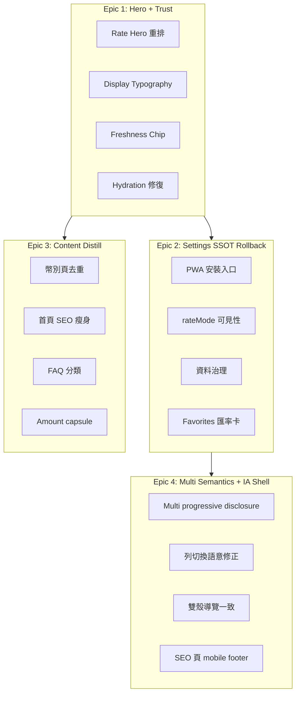

### Epic 1：Hero + Trust — 任務拆解

| Task ID | 檔案                                               | 工作項                                        | 依賴  |
| ------- | -------------------------------------------------- | --------------------------------------------- | ----- |
| E1-T1   | `features/ratewise/components/SingleConverter.tsx` | DOM 重排：Rate Hero → From Amount → To Amount | —     |
| E1-T2   | `design-tokens.ts`                                 | 新增 `display-md` 32px、`display-sm` 28px     | —     |
| E1-T3   | `SingleConverter.tsx`                              | Freshness chip 移入 rate card                 | E1-T1 |
| E1-T4   | `RateSelector.tsx`                                 | segment 44px + focus ring                     | —     |
| E1-T5   | `main.tsx` / 匯率 SSOT                             | 修復 hydration #418；移除全域 suppression     | —     |
| E1-T6   | `SingleConverter.tsx`                              | Trend tap-to-expand（預設收合）               | E1-T1 |
| E1-T7   | `SingleConverter.tsx`                              | 金額欄 44×44 計算機按鈕                       | E1-T1 |
| E1-T8   | `animations.ts`                                    | reduced motion 100% 覆蓋                      | —     |

**Epic 1 驗收（390×844）**：主匯率 y≤120；字級≥32px；chip≤8px；console=0；LCP≤2.0s。

#### Epic 1 延伸：Single Currency Hero v2 + KoreaTravel 對照（v2.3）

> **Variant B 參考**：`/Users/azlife.eth/Tools/KoreaTravel` — 韓國旅行匯率計算機 UI（非 production 依賴，僅 UX pattern SSOT）。

**Feature flag / Toggle**

| 機制            | Key                 | 值                    | 用途                                 |
| --------------- | ------------------- | --------------------- | ------------------------------------ |
| Settings toggle | `heroLayoutVariant` | `legacy` \| `hero-v2` | 使用者 opt-in「新版首屏（Hero v2）」 |
| Internal QA     | query `?ux=hero-v2` | override              | PM/QA 無需改 Settings                |
| Default         | —                   | `legacy`              | 向後相容至 experiment gate Pass      |

**KoreaTravel → RateWise 元件映射**

| KoreaTravel 模式              | 原始碼                                     | RateWise 對應                              | Epic 1 任務                       |
| ----------------------------- | ------------------------------------------ | ------------------------------------------ | --------------------------------- |
| Payment mode pills 內嵌匯率   | `CurrencyCalculatorView.tsx` L296–318      | `RateSelector` segment + inline rate       | E1-T9 rate type pill 顯示當前匯率 |
| 雙幣輸入 `text-xl font-black` | L368–412 `currency-input-row`              | `SingleConverter` amount 欄（次級字級）    | E1-T1 DOM：hero > amount          |
| Live rate trust chips         | `LiveRateCard.tsx` tabular-nums + 相對時間 | Freshness chip under hero                  | E1-T3                             |
| Quick amount 水平 scroll      | L415+ quick chips                          | `singleConverterLayoutTokens.quickAmount`  | E1-T7 44px chips                  |
| 白底 + subtle gradient card   | L290 rounded-2xl border                    | 取代 `SingleConverter` L489 heavy gradient | E1-T10 Zen card（L18）            |

**design-tokens.ts 語意命名（Hero v2 新增）**

| Token key                 | 用途                        | 初值參考                             |
| ------------------------- | --------------------------- | ------------------------------------ |
| `heroRateDisplay`         | 主匯率 display-md class     | `text-[32px] font-bold tabular-nums` |
| `heroRateSubline`         | 「1 USD =」標籤             | `text-sm text-muted-foreground`      |
| `trustChipGap`            | hero 與 freshness chip 間距 | `mt-2`（≤8px 視覺）                  |
| `trustChipText`           | 更新時間 chip               | `text-xs tabular-nums`               |
| `amountSecondaryDisplay`  | 金額列（次於 hero）         | `text-xl`（≤ hero×0.75）             |
| `calculatorAffordanceHit` | ⌨ 44×44 touch target        | min-h/w 11                           |

**向後相容**：`legacy` layout 維持現行 DOM 至 experiment→main gate；`hero-v2` 僅在 flag on 時載入重排 subtree（避免 hydration 雙份 markup — 配合 L06）。

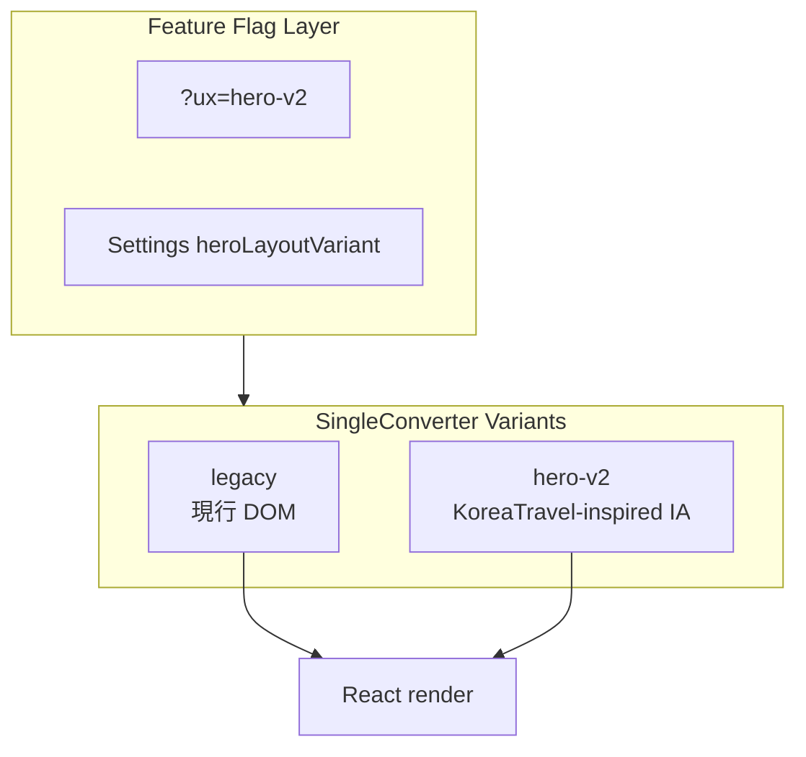

### Epic 2：Settings SSOT — 任務拆解

| Task ID | 檔案                      | 工作項                            |
| ------- | ------------------------- | --------------------------------- |
| E2-T1   | `Settings.tsx`            | PWA 安裝區塊 → `PwaInstallGuide`  |
| E2-T2   | `PwaInstallGuide.tsx`     | 觸發改為換算成功後；7 日 cooldown |
| E2-T3   | `UpdatePrompt.tsx`        | needRefresh「稍後」+ 24h defer    |
| E2-T4   | `Favorites.tsx`           | 收藏列即時匯率 + 空狀態           |
| E2-T5   | `zh-TW.ts`                | 修復 `favorites.baseCurrency`     |
| E2-T6   | `SingleConverter` / sheet | rateMode 可發現入口               |

### Epic 3：Content Distill — 任務拆解

| Task ID | 檔案                      | 工作項                                     |
| ------- | ------------------------- | ------------------------------------------ |
| E3-T1   | `seo-metadata.ts`         | capsule dedupe + amount builder            |
| E3-T2   | `CurrencyLandingPage.tsx` | read-only rate strip；accordion 長文       |
| E3-T3   | `HomepageSEOSection.tsx`  | 瘦身至 1 段 + 幣對連結                     |
| E3-T4   | `FAQ.tsx`                 | 四類 accordion                             |
| E3-T5   | tests                     | `seo-ssot.test.ts` dedupe / template-bleed |

### Epic 4：Multi + IA — 任務拆解

| Task ID | 檔案                      | 工作項                           |
| ------- | ------------------------- | -------------------------------- |
| E4-T1   | `MultiConverter.tsx`      | 預設折疊 ≤8 列                   |
| E4-T2   | `MultiConverter.tsx`      | 列切換語意 UI 或 per-row preview |
| E4-T3   | `converterStore.ts`       | 單幣↔多幣 state sync             |
| E4-T4   | `RememberedHomeRoute.tsx` | 冷啟動預設 single                |
| E4-T5   | `AppLayout.tsx`           | scroll-padding-bottom ≥57px      |
| E4-T6   | SEO 內容頁                | mobile sticky CTA / 精簡 footer  |
| E4-T7   | `AppLayout` / grid        | desktop lg 雙欄（P2）            |

---

## 十二、Prioritized Backlog（P0–P3）

> 完整 ID 清單沿用 v1.0；以下為 v2.0 新增/修訂重點。

### P0

| ID              | 摘要                    | 驗收標準                         |
| --------------- | ----------------------- | -------------------------------- |
| **HERO-P0-001** | Answer-first 層級倒置   | y≤120、匯率≥32px、金額≤匯率×0.75 |
| **HERO-P0-002** | ATF 認知超載            | 可互動≤12；trend 預設收合        |
| **SIN-P0-003**  | 計算機零 affordance     | 44×44 ⌨ + aria-label             |
| **CUR-P0-004**  | Landing 無 live preview | 0 scroll 可見 live 匯率          |
| **QA-P0-001**   | Hydration #418          | console error=0                  |

### P1（節選 — 完整表見 v1 §四）

TRU-P1-001/002、TOU-P1-001/002、MULT-P1-001~003、NAV-P1-001/003、DUP-P1-001/002、SET-P1-001~003、PWA-P1-001/002、UX26-P1-001/002、WCAG-P1-001/002、M375-P1-001、FAQ-P1-001/002

### P2 / P3

沿用 v1.0 條目（TYP-P2-_、DES-P2-001、KOR-P2-_、NAV-P3-001 等）。

---

## 十三、Open PR 整合矩陣

> 盤點時間：**2026-06-30b**（`gh pr list --state open` + merged #517/#523 確認）

### 13.1 Open PR 摘要表（UX 相關節選）

| PR                                                  | 標題                                          | UX Epic / Lens           | SPEC 對照                | 建議                             |
| --------------------------------------------------- | --------------------------------------------- | ------------------------ | ------------------------ | -------------------------------- |
| **[#471](https://github.com/haotool/app/pull/471)** | UX follow-up — 離線 SW、hero-v2、RateSelector | E1 L01/L14/L16；L15 離線 | §1.4 Phase 1；AC-HERO-\* | ✅ 合 **experiment**；minor bump |
| **[#469](https://github.com/haotool/app/pull/469)** | Epic 3 E3-T2–T5 內容 distill                  | E3 L04/L09/L13           | §1.3 IA；AC-SEO-01       | ✅ 合 experiment；解 UX-PR-006   |
| **[#470](https://github.com/haotool/app/pull/470)** | Plan 010 mobile smoke + hydration E2E         | L06 L20                  | §1.4 Phase 0             | ✅ 優先合 experiment             |
| ~~**#518–521**~~                                    | PWA/SEO 拆分                                  | L15/L17                  | Phase 3                  | ❌ **superseded by #523**        |
| **[#523](https://github.com/haotool/app/pull/523)** | 離線+manifest 主題 SSOT（RW-3~6 + gate）      | L15                      | Phase 3                  | ✅ **MERGED** 2026-06-30         |
| **[#517](https://github.com/haotool/app/pull/517)** | release 更新版本套件                          | Release                  | —                        | ✅ **MERGED** → v2.25.13 tag     |
| **[#476](https://github.com/haotool/app/pull/476)** | PR 467 hotfix thesis 去重                     | L09                      | AC-SEO-01                | ⚠️ 評估 supersede #469           |
| **[#433](https://github.com/haotool/app/pull/433)** | 生產治理 v2                                   | L11 部分                 | —                        | ⚠️ Lighthouse 待綠               |
| **[#398](https://github.com/haotool/app/pull/398)** | Nitro token 收斂                              | L08/L14                  | 與 Zen violet-600 對齊   | ⚠️ CONFLICTING                   |
| **[#522](https://github.com/haotool/app/pull/522)** | 每日 SEO 匯差 data                            | SEO data                 | —                        | 自動化；與 UX 解耦               |

### 13.2 SPEC 缺口 vs PR 覆蓋（2026-06-30b）

| SPEC 項目                    | PR 狀態         | 缺口                      |
| ---------------------------- | --------------- | ------------------------- |
| AC-HERO-01/02 hero 重排      | #471 open       | 未上 production           |
| AC-LAND-01/02 landing 零步   | #469 open       | live SEO 殼 + CTA clip    |
| AC-CON-01 console=0          | #470 partial    | 51/60 仍有 #418           |
| Manifest/offline theme SSOT  | **#523 merged** | ✅ live curl Pass         |
| AC-TOUCH-02 landing CTA 44px | —               | **RWUX-3-004 待開**       |
| AC-PWA-01 modal 節制         | —               | **RWUX-3-003 待開 issue** |
| Multi progressive disclosure | Epic4 pending   | 未開 PR                   |

### 13.3 建議合併順序（2026-06-30b 更新）

```text
【main 線 — patch（2026-06-30b 現況）】
✅ #523 manifest/offline SSOT — MERGED
✅ #517 release v2.25.13 — MERGED
⏳ 確認 live app-version + CF purge + live precache
⏳ #470 E2E/hydration 監控 → experiment 或 main（Maintainer）

【experiment/ratewise-ux-2026 線 — UX minor】
1. Rebase experiment on latest main（含 #523）
2. #470 Phase 0 hydration 監控
3. #471 hero-v2 + 離線 SW（Phase 1）
4. #469 Epic3 content + landing CTA fix（Phase 2）
5. RWUX-3-003/004 PWA modal + sticky CTA
6. Epic4 Multi IA（新 PR）
7. Experiment→Main Gate（§1.4 Phase 0–2 P0 done）
```

### 13.4 禁止未批准合併

- **#471 / #469**：使用者可感知 **minor**；需 E2E hero-layout + browser QA 證據
- **#433**：Lighthouse blocking 未清
- **experiment→main**：AC-CON-01 未達前禁止 minor release

---

## 十三（歷史）、Open PR 整合矩陣 v2.3

> 盤點時間：**2026-06-27**（`gh pr list --state open`）— 保留稽核對照

### 13.1 Open PR 摘要表

| PR                                                  | 標題                                               | Base ← Head                                    | Mergeable          | CI / 備註                               | UX Epic / Lens       | 建議                                      |
| --------------------------------------------------- | -------------------------------------------------- | ---------------------------------------------- | ------------------ | --------------------------------------- | -------------------- | ----------------------------------------- |
| **[#457](https://github.com/haotool/app/pull/457)** | fix(split-meow): 混幣行程 proactive 阻擋           | main ← fix/splitp2                             | MERGEABLE          | 非 ratewise scope                       | —                    | ⏭️ 與 UX experiment 無關                  |
| **[#456](https://github.com/haotool/app/pull/456)** | fix(ratewise): 移植導覽 case-3 有界網路 fallback   | main ← fix/port426                             | MERGEABLE          | ratewise 修復                           | L05 Nav；L16 降級    | ✅ 可獨立 patch；experiment rebase 前評估 |
| **[#455](https://github.com/haotool/app/pull/455)** | fix(ratewise): TikTok iOS 內建瀏覽器漏判與減動偏好 | main ← review/ui                               | MERGEABLE          | Quality ✅ E2E smoke ✅                 | L20 motion；L06 邊緣 | ✅ 小型 fix；可獨立 review                |
| **[#446](https://github.com/haotool/app/pull/446)** | chore(release): 更新版本套件                       | main ← changeset-release/main                  | MERGEABLE          | CodeQL ✅                               | —（release）         | ✅ maintainer 批准後合併 **main**         |
| **[#433](https://github.com/haotool/app/pull/433)** | 生產治理 rebased on main                           | main ← chore/ratewise-production-governance-v2 | MERGEABLE          | Quality ✅ E2E ✅；**Lighthouse CI ❌** | E1/E2 部分；L11/L15  | ⚠️ **修 Lighthouse 後**再合 main          |
| **[#411](https://github.com/haotool/app/pull/411)** | 舊生產治理                                         | main ← chore/ratewise-production-governance    | **CONFLICTING**    | superseded                              | —                    | ❌ 關閉                                   |
| **[#398](https://github.com/haotool/app/pull/398)** | Nitro token 收斂                                   | #411 ← codex/ratewise-token-ssot-nitro         | **CONFLICTING**    | superseded                              | L08/L14              | ❌ 關閉                                   |
| **#441**                                            | 金融級計價基準 SSOT + 計算機預覽                   | —                                              | **不在 open 清單** | 可能已 merge/close                      | E1 trust             | 🔍 maintainer 確認                        |

### 13.2 建議合併順序

```text
【合併至 main — release / governance 線】
1. #446 release PR — maintainer 批准 → release workflow → live precache
2. #455（若 Lighthouse 綠）— 獨立 patch
3. #456 — 有界網路 fallback（評估是否需 patch release）
4. 修復 #433 Lighthouse CI → 重跑 checks
5. #433 → main（squash）— ⚠️ maintainer 明確批准
6. 關閉 #411、#398（superseded by #433）

【合併至 experiment/ratewise-ux-2026 — UX Epic 線】（見 §十四.12）
0. experiment 分支自 latest main（含 #446/#433 若已合）rebase
1. Epic 1 Hero+Trust（L01/L06/L14）— 串行 squash
2. Epic 2 Settings/PWA
3. Epic 3 Content Distill
4. Epic 4 Multi+IA
5. Experiment→Main Gate（P0 + Lighthouse + live precache + Maintainer）
```

### 13.3 UX 工作 vs 既有 PR vs 新 worktree

| Backlog / Lens         | PR 覆蓋   | 新 worktree / Agent                 |
| ---------------------- | --------- | ----------------------------------- |
| L11 44px 部分          | #433      | E1 `feat/ratewise-epic1-hero-trust` |
| L06 hydration #418     | —         | E1 同 worktree                      |
| L01/L14 hero + display | —         | E1（等 #433 合 main 後）            |
| L09 content dedupe     | —         | E3 `feat/ratewise-epic3-content`    |
| L03 multi semantics    | 部分 #433 | E4 `feat/ratewise-epic4-multi-ia`   |
| L15 PWA nudge timing   | —         | E2 `feat/ratewise-epic2-settings`   |

### 13.4 禁止未批准合併

- **#433**：>100 檔；Lighthouse **blocking**（incident `UX-INC-003`）
- **#446**：release；合併後 CF purge + precache（`AGENTS.md`）
- **Epic PRs**：§3.5 P0 透鏡未全 `done` 時禁止 minor release

---

## 十四、Git Worktree 平行開發 SSOT

### 14.1 一鍵建立（4 Epic + 1 Hotfix）

**前置**：主 worktree 在 `main` 或 post-#446 release SHA；已執行 `pnpm install --frozen-lockfile`。

```bash
# === SSOT 變數（複製貼上即可）===
REPO=/Users/azlife.eth/Tools/app
WT=$REPO/../ratewise-ux-worktrees
EXP_BRANCH=experiment/ratewise-ux-2026
mkdir -p "$WT"
cd "$REPO"
git fetch origin main "$EXP_BRANCH" 2>/dev/null || git fetch origin main

# 若 experiment 分支尚未存在，先執行 §十四.12 建立命令

# Epic 1 — Hero + Trust（林安答 L01 / 蔡穩屏 L06 / 朴顯赫 L14）
git worktree add "$WT/epic1-hero-trust" -b feat/ratewise-epic1-hero-trust "origin/$EXP_BRANCH"
cd "$WT/epic1-hero-trust" && pnpm install --frozen-lockfile

# Epic 2 — Settings + PWA（吳收藏 L12 / 車安裝 L15）
cd "$REPO"
git worktree add "$WT/epic2-settings-ssot" -b feat/ratewise-epic2-settings "origin/$EXP_BRANCH"
cd "$WT/epic2-settings-ssot" && pnpm install --frozen-lockfile

# Epic 3 — Content Distill（白精煉 L09 / 孫問答 L13 / 梁趨勢 L19）
cd "$REPO"
git worktree add "$WT/epic3-content-distill" -b feat/ratewise-epic3-content "origin/$EXP_BRANCH"
cd "$WT/epic3-content-distill" && pnpm install --frozen-lockfile

# Epic 4 — Multi + IA（韓多理 L03 / 羅導航 L05 / 周寬屏 L07）
cd "$REPO"
git worktree add "$WT/epic4-multi-ia" -b feat/ratewise-epic4-multi-ia "origin/$EXP_BRANCH"
cd "$WT/epic4-multi-ia" && pnpm install --frozen-lockfile

# Hotfix — Hydration P0（蔡穩屏 L06 · QA-P0-001）
cd "$REPO"
git worktree add "$WT/hotfix-hydration" -b fix/ratewise-QA-P0-001 "origin/$EXP_BRANCH"
cd "$WT/hotfix-hydration" && pnpm install --frozen-lockfile
```

### 14.2 Branch ↔ Epic ↔ Agent ↔ Owner 映射表

**分支命名 SSOT**：`feat/ratewise-epic{N}-{slug}` | `fix/ratewise-{BACKLOG-ID}`

| Epic       | Branch                           | Worktree 路徑                                    | 主責 Agent             | Human Owner              | 透鏡                    |
| ---------- | -------------------------------- | ------------------------------------------------ | ---------------------- | ------------------------ | ----------------------- |
| **E1**     | `feat/ratewise-epic1-hero-trust` | `../ratewise-ux-worktrees/epic1-hero-trust`      | 林安答、蔡穩屏、朴顯赫 | Frontend + Design Tokens | L01, L06, L14, L08, L11 |
| **E2**     | `feat/ratewise-epic2-settings`   | `../ratewise-ux-worktrees/epic2-settings-ssot`   | 吳收藏、車安裝         | Frontend + PWA           | L12, L15                |
| **E3**     | `feat/ratewise-epic3-content`    | `../ratewise-ux-worktrees/epic3-content-distill` | 白精煉、孫問答、高信任 | SEO / Content            | L04, L09, L13, L17, L19 |
| **E4**     | `feat/ratewise-epic4-multi-ia`   | `../ratewise-ux-worktrees/epic4-multi-ia`        | 韓多理、羅導航、周寬屏 | Frontend                 | L03, L05, L07           |
| **Hotfix** | `fix/ratewise-QA-P0-001`         | `../ratewise-ux-worktrees/hotfix-hydration`      | 蔡穩屏                 | QA + Tech Lead           | L06                     |

### 14.3 每日同步與 Spec 刷新協定

```bash
# 在各 worktree 目錄內 — 每日開工前 MUST 執行
git fetch origin main
git rebase origin/main

# 若 main 有 spec 更新（§六 Status 變更）— rebase 後確認無衝突
git diff origin/main -- docs/superpowers/specs/2026-06-26-ratewise-2026-product-ux-spec.md

# 驗證本地仍綠
pnpm --filter @app/ratewise typecheck
pnpm --filter @app/ratewise test -- seo-ssot 2>/dev/null || true
```

| 事件                       | 動作                                                     | 負責          |
| -------------------------- | -------------------------------------------------------- | ------------- |
| **每日開工**               | `fetch` + `rebase origin/main`                           | 各 Epic Owner |
| **#433 / #446 合 main 後** | **全部** worktree 必須 rebase 再繼續                     | Tech Lead     |
| **Agent 完成透鏡**         | 更新 §六 + §七；PR 含 spec diff 或 follow-up docs commit | 具名 Agent    |
| **多 worktree 同改 spec**  | PM 串行 merge spec；禁止 force-push spec 衝突            | PM            |
| **Sprint 初**              | PM 審 §六 `Status` 欄 + §3.5 P0 gate                     | PM            |
| **Release 前**             | 從 main refresh spec → 確認 P0 全 `done`                 | PM + Release  |

### 14.4 Merge 順序與 Rebase 規則

```text
建議合併順序（最小衝突）：
  E3 (seo-metadata only)  ─┐
  E2 (Settings/PWA)       ─┼─→ 可與 E1 並行開發，但 merge 順序：
  Hotfix L06 (若獨立)     ─┤   0) fix/QA-P0-001（若未含於 E1）
  E1 (Hero/Trust)         ─┘   1) E3 或 E2 先（少碰 converter）
                               2) E1（touch SingleConverter + tokens）
                               3) E4（MultiConverter + AppLayout）

Rebase 規則（MUST）：
  - 每 PR 合 main 前：git rebase origin/main（禁止 merge commit 污染 Epic 線）
  - #433 合 main 後：所有 Epic worktree 必須 rebase 再繼續
  - 禁止 force-push main；Epic branch 可用 --force-with-lease
  - Hotfix 優先 merge；E1 應 rebase 已 merge 的 hotfix
```

### 14.5 Conflict Hotspot Playbook

| 檔案                                                                 | 衝突原因                                   | Owner                       | 解決策略                                              |
| -------------------------------------------------------------------- | ------------------------------------------ | --------------------------- | ----------------------------------------------------- |
| `apps/ratewise/src/config/design-tokens.ts`                          | E1 display tokens + E4 layout + #433 nitro | **金墨字 L08 / 朴顯赫 L14** | Design Tokens **唯一 write**；其他 Epic 開 issue 請求 |
| `apps/ratewise/src/features/ratewise/components/SingleConverter.tsx` | E1 DOM 重排 + E2 rateMode UI + #433        | **林安答 L01**              | **E1 merge 優先**；E2 用 sheet 避免大 diff            |
| `apps/ratewise/src/config/seo-metadata.ts`                           | E3 dedupe + #433 SEO                       | **白精煉 L09**              | E3 專線；禁止 E1/E4 順手改 SEO                        |
| `apps/ratewise/src/components/BottomNavigation.tsx`                  | E4 scroll-padding + E1 typography          | **羅導航 L05**              | E4 merge 前 rebase E1                                 |
| `apps/ratewise/src/index.css`                                        | Zen theme + token vars                     | Design Tokens               | 單 PR 閘道                                            |

**`SingleConverter.tsx` 衝突逐步解法**：(1) 以 E1 為 DOM SSOT；(2) E2 rateMode 用 sheet；(3) rebase 保留 E1 hero block；(4) 合併後派 **馮驗收 L20** 跑 hero y 量測。

**`design-tokens.ts` 衝突逐步解法**：(1) 先 merge **朴顯赫 L14** `display-md`；(2) **金墨字 L08** 合併尺度分離；(3) 禁止 inline `text-2xl` override。

### 14.6 Merge 後清理（Teardown）

```bash
REPO=/Users/azlife.eth/Tools/app
WT=$REPO/../ratewise-ux-worktrees
cd "$REPO"
git worktree remove "$WT/epic1-hero-trust"
git branch -d feat/ratewise-epic1-hero-trust
git worktree prune
git fetch --prune origin
git worktree list
```

### 14.7 UX Spec 平行 PR 期間 SSOT 治理

1. **本文件**為 UX SSOT；Epic PR **不得**另建平行 spec。
2. Agent 完成透鏡 → 更新 **§六 Master Index** + **§七 Appendix**。
3. PM 每 Sprint 初審 §六 `Status`；release 前 §3.5 P0 gate。
4. 多 worktree 同改 spec：**PM 串行 merge**。
5. 違反 §五 MUST NOT → 記錄 §十五 UX-INC。

### 14.8 Department RACI + Engineer Assignment

| 角色                        | A/R/C/I                                      | 負責 Spec 章節                    | 範例 Branch                                     | Handoff Checklist                                                            |
| --------------------------- | -------------------------------------------- | --------------------------------- | ----------------------------------------------- | ---------------------------------------------------------------------------- |
| **PM / Product Owner**      | **A** Epic 優先序、SemVer、§3.5 release gate | §一、§十二、§十八                 | —                                               | [ ] Sprint goal [ ] Open Q 決策 [ ] changeset bump 確認                      |
| **Frontend (Converter UI)** | **R** Single/Multi、Bottom nav、Settings UI  | §七 L01–L03/L05/L12；§十一 E1/E4  | `feat/ratewise-epic1-hero-trust`                | [ ] 390×844 截圖 [ ] typecheck [ ] 無 console error [ ] 更新 §六 Status      |
| **Design Tokens / CSS**     | **R** typography、contrast、radius           | §七 L08/L10/L14；§十一 E1-T2      | `feat/ratewise-epic1-hero-trust`（token 子 PR） | [ ] display-md merged [ ] nav label ≥10px [ ] 對比 ratio 證據                |
| **SEO / Content**           | **R** seo-metadata、landing、FAQ dedupe      | §七 L04/L09/L13/L17/L19；§十一 E3 | `feat/ratewise-epic3-content`                   | [x] curl thesis ≤1（build dist） [x] seo-ssot.test Pass [ ] FAQPage 僅 /faq/ |
| **PWA / SW**                | **R** install guide、UpdatePrompt、sw.ts     | §七 L15/L16；§十一 E2             | `feat/ratewise-epic2-settings`                  | [ ] precache ≥50 [ ] prompt SW mode [ ] install 觸發時機                     |
| **QA (390×844 + curl)**     | **R** Playwright、console、touch audit       | §七 L06/L11/L20；§十六            | `test/ratewise-mobile-pwa-smoke`                | [ ] hero y 量測 [ ] 44px audit [ ] curl 6 routes 200                         |
| **Release / DevOps**        | **R** #446、Zeabur、CF Worker、precache live | §十三；§3.5                       | `changeset-release/main`                        | [ ] app-version probe [ ] CF purge [ ] live precache script                  |

**Accountable（A）**：Repo Maintainer — PR squash、release 批准、§3.5 P0 waiver。

### 14.9 Sprint 路線圖（平行 vs 順序）

| Sprint  | 週期 | 可並行 Stream A                    | 可並行 Stream B             | 必須順序               |
| ------- | ---- | ---------------------------------- | --------------------------- | ---------------------- |
| **S1**  | 2 週 | E1 Hero 重排（林安答 / 朴顯赫）    | E1 hydration（蔡穩屏）      | QA-P0-001 先于 release |
| **S2**  | 2 週 | E2 Settings/PWA（吳收藏 / 車安裝） | E3 Content dedupe（白精煉） | E3 不依賴 E2           |
| **S3**  | 2 週 | E4 Multi（韓多理）                 | E4 Desktop（周寬屏）        | 冷啟動 IA 需 E1 穩定   |
| **S4+** | 選配 | CurrencyPill、chat 不做            | GA4 funnel                  | —                      |

**Sprint 1 退出準則**：§3.5 P0 透鏡 L01/L06/L14 至少 2/3 `done`；390×844 smoke；綜合分 **≥68**。

**Sprint 2 退出準則**：L09 curl thesis **≤1**；L12 Settings/Favorites E2E；綜合分 **≥75**。

**Sprint 3 退出準則**：§3.5 **全部 P0 `done`**；28-step nav；綜合分 **≥83** → **允許 minor release**。

### 14.10 GitHub Issues / 追蹤

**Labels（建議）**

- `epic:hero-trust` / `epic:settings-ssot` / `epic:content-distill` / `epic:multi-ia`
- `severity:p0` … `severity:p3`
- `ux-audit:L01` … `L20`
- `agent:林安答` … `agent:馮驗收`
- `viewport:390x844` / `qa:playwright`

**Epic link**：每 Issue 標題含 Backlog ID（例：`HERO-P0-001: Rate hero 重排`）。

**Definition of Done**

- [ ] Acceptance criteria 量測證據（截圖 / Playwright log）
- [ ] `pnpm --filter @app/ratewise typecheck` + 相關 vitest
- [ ] changeset（若使用者可感知）
- [ ] 002 條目（commit 前）
- [ ] 無新增 console error @390×844
- [ ] §六 + §七 Status 已更新

**Regression checklist（每 Epic PR）**

- [ ] 四 tab 切換無白屏
- [ ] curl 核心路由 200
- [ ] `seo-ssot` + template-bleed Pass
- [ ] 若動 PWA：`verify-precache-assets.mjs`（preview 或 live）

### 14.11 QA Gates

| Gate             | 工具                          | 門檻                              |
| ---------------- | ----------------------------- | --------------------------------- |
| Mobile smoke     | Playwright 390×844            | hero y≤120；console=0             |
| Touch audit      | Playwright evaluate           | ≥44px 100% 核心路徑               |
| Security headers | curl GET                      | CSP + `x-security-policy-version` |
| Live precache    | `VERIFY_PRECACHE_SOURCE=live` | ≥50 項；release 後必跑            |
| Lighthouse       | CI smoke paths SSOT           | 不可為 merge 阻斷項（#433 現況）  |

### 14.12 實驗分支策略（CRITICAL — UX SSOT）

> **所有 UX Epic 工作 MUST 串行合併至 `experiment/ratewise-ux-2026`**，**NOT** `main`，直至 Experiment→Main Gate Pass。對齊 fintech feature-flag 漸進發布（[GrowthBook 2026](https://www.growthbook.io/blog/what-are-feature-flags)、[Oceanobe Regulated Banking 2025](https://oceanobe.com/news/operationalizing-feature-flags-in-regulated-banking-environments/1831)）。

**SSOT 分支名**：`experiment/ratewise-ux-2026`（自 `origin/main` 建立，遠端 tracking 必須存在後才開 worktree）。

```bash
# === 一次性：建立 experiment 分支（Maintainer / Tech Lead）===
REPO=/Users/azlife.eth/Tools/app
cd "$REPO"
git fetch origin main
git checkout -b experiment/ratewise-ux-2026 origin/main
git push -u origin experiment/ratewise-ux-2026

# === Epic worktree：base = experiment（非 main）===
WT=$REPO/../ratewise-ux-worktrees
mkdir -p "$WT"
git fetch origin experiment/ratewise-ux-2026

git worktree add "$WT/epic1-hero-trust" \
  -b feat/ratewise-epic1-hero-trust \
  origin/experiment/ratewise-ux-2026
cd "$WT/epic1-hero-trust" && pnpm install --frozen-lockfile

# PR 必須：--base experiment/ratewise-ux-2026
gh pr create --base experiment/ratewise-ux-2026 --head feat/ratewise-epic1-hero-trust ...
```

**Experiment 串行 Merge Order**

```text
experiment/ratewise-ux-2026 累積順序：
  1) rebase 最新 main（含 #446 release SHA）
  2) rebase / cherry-pick #433 修復（若 governance 已上 main）
  3) Epic 1 — Hero + Trust + Hydration（L01/L06/L14）
  4) Epic 2 — Settings / PWA（L12/L15）
  5) Epic 3 — Content Distill（L09/L13）
  6) Epic 4 — Multi + IA（L03/L05）
  7) Experiment→Main Gate 驗證
  8) 單一 PR：experiment/ratewise-ux-2026 → main（Maintainer squash）
```

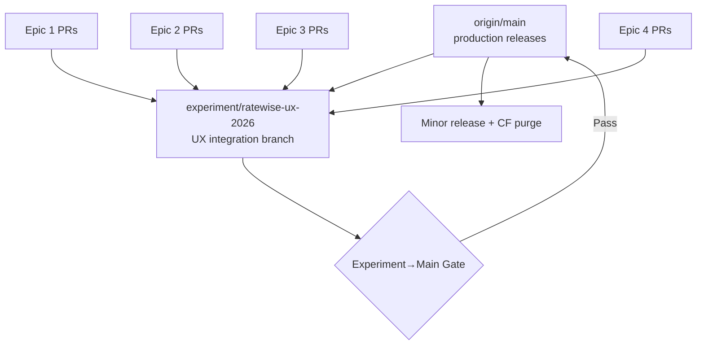

**Experiment→Main Gate（全部 MUST Pass）**

|   # | Gate                              | 驗證命令 / 工具                                                                                                         | Owner      |
| --: | --------------------------------- | ----------------------------------------------------------------------------------------------------------------------- | ---------- |
|  G1 | P0 透鏡 L01/L06/L14 `Status=done` | §六 Master Index                                                                                                        | PM         |
|  G2 | Lighthouse CI smoke               | CI green on experiment HEAD                                                                                             | QA / L20   |
|  G3 | Live precache                     | `VERIFY_PRECACHE_SOURCE=live VERIFY_BASE_URL=https://app.haotool.org/ratewise/ node scripts/verify-precache-assets.mjs` | Release    |
|  G4 | 390×844 browser QA                | Playwright hero y + console=0                                                                                           | L06        |
|  G5 | Maintainer approval               | `gh pr review` / 明確 comment                                                                                           | Repo Owner |

**Deep Local Browser Testing Protocol**

```bash
# 1) Preview server（experiment HEAD build）
pnpm --filter @app/ratewise build
pnpm --filter @app/ratewise preview -- --host 127.0.0.1 --port 4173

# 2) Playwright 390×844
pnpm --filter @app/ratewise test:e2e --grep 'mobile-pwa|hero-y|touch-44'

# 3) curl smoke（preview 或 staging）
BASE=http://127.0.0.1:4173/ratewise
for p in / /multi/ /favorites/ /settings/ /usd-twd/; do
  curl -s -o /dev/null -w "%{http_code} $p\n" "${BASE}${p}"
done

# 4) Hero v2 flag QA
open "http://127.0.0.1:4173/ratewise/?ux=hero-v2"
```

**禁止事項**

- **MUST NOT** 將未完成 review 的 Epic 直接 push 至 `experiment/ratewise-ux-2026`（繞過 PR）。
- **MUST NOT** 在 P0 透鏡未 `done` 時將 experiment 合 main。
- **MUST NOT** experiment 與 #446 release 混在同一 PR（解耦 release 與 UX integration）。

---

## 十五、What NOT to Do（反模式與 Lessons Learned Registry）

> 強制 MUST/MUST NOT 完整清單見 **§五 團隊強制規範與禁止事項**。本節保留 incident registry 與視覺反模式速查。

### 15.1 產品 / UX 反模式

1. 禁止首屏堆 SEO 長文（`HomepageSEOSection` 只減不增）。
2. 禁止同頁複製 FAQ + Capsule + thesis（distill 原則 — 見 `UX-INC-002`）。
3. 禁止 chat/agent 主介面（`UX26-P3-012`）。
4. 禁止冷啟動預設 redirect `/multi`。
5. 禁止 Multi 列內切換假裝 per-row（`MULT-P1-001` — 見 `UX-INC-004`）。
6. 禁止 `text-primary/60` 承載必讀資訊。

### 15.2 工程 / 流程反模式

7. **禁止** 未修 Lighthouse 即合併 mega-PR（`UX-INC-003` / #433）。
8. **禁止** 全域 `suppress-hydration-warning` 掩蓋 #418（`UX-INC-001`）。
9. **禁止** 假設 `registerSW.js` 200 — inline 註冊（QA P2-004）。
10. **禁止** 分散 hardcode SEO — 僅 `seo-metadata.ts`。
11. **禁止** 合併 #411/#398 與 #433 並行。
12. **禁止** release 後忽略 edge：Worker + CDN purge + live precache。

### 15.3 Lessons Learned Registry（Incident SSOT）

| Incident ID    | 日期      | Root Cause                                                        | 影響                                       | Prevention                                                         | 關聯 Lens |
| -------------- | --------- | ----------------------------------------------------------------- | ------------------------------------------ | ------------------------------------------------------------------ | --------- |
| **UX-INC-001** | 2025–2026 | SSG 匯率/時間/locale 與 client 不一致；全域 hydration suppression | React **#418**；信任崩壞；SEO E-E-A-T 降級 | 修 SSOT 一致；`ClientOnly` 僅限必要區；§3.5 阻斷 release           | L06       |
| **UX-INC-002** | 2026      | AnswerCapsule + FAQ + highlights 重複「賣出價 vs 中間價」         | curl thesis 3→2 仍 >1；AEO 冗餘            | `seo-metadata.ts` dedupe；`seo-ssot.test.ts`；L09 agent            | L09       |
| **UX-INC-003** | 2026-06   | #433 mega-PR（>100 檔）Lighthouse CI **FAIL** 仍欲 merge          | Performance 回歸風險；審查疲勞             | Lighthouse **blocking**；Epic 拆分 + worktree；incident 記錄於 002 | L20       |
| **UX-INC-004** | 2026      | `MultiConverter` 列內 `onRateTypeChange` 寫入全域 store           | 使用者以為 per-row rate；認知 bug          | 文案「全列表套用」或 per-row preview；E4-T2                        | L03       |
| **UX-INC-005** | 2026      | `amountInput` 與 `rateText` 同 `text-2xl`；DOM 金額優先           | 違反 answer-first；韓系對標 58/100         | display-md token；DOM 重排 E1-T1                                   | L01, L14  |
| **UX-INC-006** | 2026      | `PwaInstallGuide` 1.8s 自動弹出                                   | 打斷首次換算；非 native 級                 | 換算成功後 nudge；24h defer                                        | L15       |
| **UX-INC-007** | 2026      | Bottom nav `text-[8px]` + inactive opacity 0.35                   | WCAG 對比 ~2.13:1                          | label ≥10px；contrast ≥4.5:1                                       | L05, L10  |
| **UX-INC-008** | 2025      | Footer 時間戳 hydration 後字寬替換                                | CLS 0.89 on /about                         | 等寬數字槽位（002 已修）                                           | L06       |
| **UX-INC-009** | 2026      | 三重 governance PR（#411/#398/#433）                              | merge 衝突；nitro token 漂移               | 單一 governance 線；關閉 superseded                                | —         |
| **UX-INC-010** | 2026      | Release 未 purge CF → stale edge 404 on chunks                    | PWA Load failed                            | phased release SOP；live precache 驗證                             | L15, L20  |

### 15.4 視覺（韓系）反模式

- ❌ rate card `hover:scale-105` + gradient glow（`SingleConverter.tsx` L489）
- ❌ 24px 匯率與 24px 金額同級（`design-tokens.ts:709`）
- ❌ 8px uppercase nav label（`BottomNavigation.tsx:105`）

---

## 十六、Verification Matrix

### 16.1 Viewport 基線

| Profile           | 尺寸         | 用途                     |
| ----------------- | ------------ | ------------------------ |
| Primary mobile    | **390×844**  | hero、tap、console、a11y |
| Regression narrow | **375×812**  | 全站 audit               |
| Regression short  | **390×667**  | 計算機路徑               |
| Desktop           | **1440×900** | 雙欄利用率               |

### 16.2 Live curl

```bash
BASE=https://app.haotool.org/ratewise
for p in / /multi/ /favorites/ /settings/ /faq/ /about/ /usd-twd/ /usd-twd/500/; do
  curl -s -o /dev/null -w "%{http_code} $p\n" "${BASE}${p}"
done
curl -s --compressed "${BASE}/" -D - -o /dev/null | rg -i 'app-version|x-security-policy-version|content-security-policy'
VERIFY_PRECACHE_SOURCE=live VERIFY_BASE_URL=${BASE}/ node scripts/verify-precache-assets.mjs
```

### 16.3 Playwright

| 套件                               | 覆蓋                                    | 通過條件   |
| ---------------------------------- | --------------------------------------- | ---------- |
| `mobile-pwa-smoke.spec.ts`（待建） | 四 tab                                  | 無白屏     |
| hero 量測                          | `[data-testid="amount-input"]` 相對位置 | y≤120 匯率 |
| Console collector                  | `/` `/settings/` `/faq/`                | error=0    |
| Multi journey                      | tab + amount                            | state 一致 |

```bash
pnpm --filter @app/ratewise test:e2e --grep 'mobile-pwa|hero-y|touch-44'
```

### 16.4 單元 / 回歸

```bash
pnpm --filter @app/ratewise test -- seo-ssot template-bleed animations
pnpm typecheck && pnpm build:ratewise
```

---

## 十七、SemVer 指引（依 Epic）

> 判斷：**使用者直接可感知嗎？**（`CLAUDE.md` Phase 7）

| Epic                        | 典型變更               | bump                  |
| --------------------------- | ---------------------- | --------------------- |
| E1 Hero 重排、display 字級  | 首屏視覺與操作路徑變更 | **minor**             |
| E1 hydration、WCAG、focus   | 修 bug / 合規          | **patch**             |
| E2 PWA 入口、Favorites 匯率 | 新設定能力             | **minor**             |
| E3 SEO 去重、capsule        | 內容變短               | **patch**             |
| E3 landing mini converter   | 新互動區               | **minor**             |
| E4 Multi 折疊、desktop 雙欄 | 行為/版面變更          | **minor** / **minor** |

---

## 十八、Open Questions（待 Maintainer 決策）

| #   | 問題                                                     | 選項                                               | 建議                                 |
| --- | -------------------------------------------------------- | -------------------------------------------------- | ------------------------------------ |
| Q1  | #433 是否在本輪 release 前強制合 main？                  | A) 先 #446 release 再 #433 B) 合併 #433 再 release | **A** — 降低 deployment race         |
| Q2  | Hydration fix 是否允許短期保留 opt-in suppression？      | A) 全移除 B) dev-only flag                         | **B→A** — 2 sprint 過渡後全移除      |
| Q3  | 幣別 landing 用 read-only strip 或 lazy mini converter？ | strip / mini / 僅 CTA                              | **strip MVP** → mini 評估 minor      |
| Q4  | Multi 列切換改 UI 文案或改 per-row store？               | 文案 / 行為                                        | **文案先行**（低成本）               |
| Q5  | 6 主題是否收斂為 Zen + 1 進階？                          | 全保留 / 收斂                                      | **收斂 consumer 預設 Zen**           |
| Q6  | Lighthouse CI 失敗是否 blocking #433？                   | blocking / warn                                    | **blocking** — 避免 regressive merge |
| Q7  | `registerSW.js` 測試期望                                 | 改測 inline / 恢復實體檔                           | **改測 SSOT**（QA P2-004）           |
| Q8  | #517 release 後 live 仍 2.25.12 是否 blocking？          | A) 等 Zeabur 同步 B) 最小 PR 重觸發部署            | **A→監控** — tag 2.25.13 已存在      |
| Q9  | landing CTA bottom-clipped 修法優先序？                  | sticky CTA / 縮短 ATF / inline strip               | **sticky CTA MVP**（RWUX-3-004）     |
| Q10 | PWA modal 節制：首次後不再顯示 vs 延後 session？         | dismiss forever / session 2 / standalone skip      | **standalone skip + 7d cooldown**    |

---

## 十九、Agent / Backlog 交叉索引（精簡）

| ID          | 摘要           | Epic |
| ----------- | -------------- | ---- |
| HERO-P0-001 | 金額搶 hero    | E1   |
| QA-P0-001   | hydration #418 | E1   |
| MULT-P1-M01 | 列切換誤導     | E4   |
| DUP-P0-001  | thesis 重複    | E3   |
| PWA-14-002  | nudge 1.8s     | E2   |
| KOR-P2-A    | gradient card  | E1   |
| UX26-P0-001 | amount capsule | E3   |

---

## 二十、A/B 測試與持續追蹤

> Fintech A/B **MUST** 漸進 rollout + 可審計 assignment（[ABsmartly 2026](https://absmartly.framer.website/blog/experimentation-in-fintech-risk-regulation-and-rapid-rollouts)、[Roman Fedytskyi Feature Flags 2025](https://medium.com/@roman_fedyskyi/feature-flags-in-fintech-a-tech-leaders-playbook-to-cut-incidents-57-7a90037cfdc6)）。RateWise UX experiment 以 **internal QA flag** 起步，不對一般使用者強制分流。

### 20.1 Feature Flag 架構

| 維度     | 設定                                                                    |
| -------- | ----------------------------------------------------------------------- |
| Flag key | `singleConverterLayout`                                                 |
| Variants | `legacy`（control）\| `hero-v2`（treatment）                            |
| 暴露方式 | Settings toggle；QA `?ux=hero-v2`；localStorage override                |
| 預設     | `legacy` 直至 experiment→main gate                                      |
| Rollback | Ops kill-switch → 強制 `legacy`（無 redeploy 理想；MVP：Settings SSOT） |

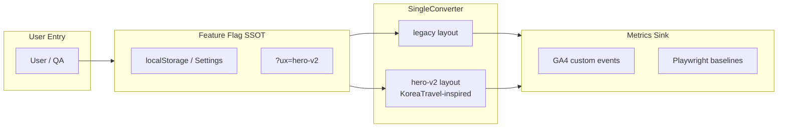

### 20.2 追蹤指標

| 指標 ID          | 定義                                     | 量測方式                | 目標（hero-v2）           |
| ---------------- | ---------------------------------------- | ----------------------- | ------------------------- |
| **M-hero-y**     | 主匯率元素 `getBoundingClientRect().top` | Playwright @390×844     | **≤120px**                |
| **M-tt-rate**    | 冷載入至可讀非 0 匯率（ms）              | performance trace       | **≤1500ms**               |
| **M-tap-answer** | 使用者讀到答案所需 tap 數                | session replay / manual | **0**                     |
| **M-tap-calc**   | 開啟計算機 modal 所需 tap                | E2E                     | **≤1**（44px affordance） |
| **M-calc-conv**  | 首屏→完成一次換算比例                    | GA4 funnel              | **≥ baseline +5%**        |

### 20.3 A/B Hypothesis 登錄表

| ID        | Hypothesis                    | Control (`legacy`)          | Treatment (`hero-v2`)            | 成功標準                      | Rollback 觸發              |
| --------- | ----------------------------- | --------------------------- | -------------------------------- | ----------------------------- | -------------------------- |
| **AB-01** | Hero 置頂提升 0-tap 答案感    | 金額 y≈109 優先             | KoreaTravel 式 hero + trust chip | M-hero-y Pass；M-tap-answer=0 | hero-v2 LCP +20% vs legacy |
| **AB-02** | display-md 提升匯率掃讀       | 24px 同級                   | 32px tabular-nums                | 5s 內識別率提升（內部測）     | contrast / WCAG fail       |
| **AB-03** | Rate pill 內嵌匯率（KT 模式） | RateSelector 無 inline rate | pill 顯示當前匯率                | M-tap-calc 不劣化             | 列內切換誤導回報           |
| **AB-04** | Freshness chip ≤8px           | chip y≈742                  | chip under hero                  | M-tt-rate 不劣化              | hydration 新 error         |

**Variant B 參考**：KoreaTravel `CurrencyCalculatorView` payment mode pills + `LiveRateCard` trust pattern → RateWise `hero-v2`（§十一 Epic 1 延伸）。

### 20.4 漸進發布階段

| Phase | 受眾                          | 比例                 | 監控                       |
| ----- | ----------------------------- | -------------------- | -------------------------- |
| P0    | 內部 maintainer               | 0% public            | preview + Playwright       |
| P1    | QA label `experiment:ux-2026` | 0%                   | console=0 gate             |
| P2    | Settings opt-in               | 自願                 | GA4 + 7 日窗口             |
| P3    | experiment→main 後            | 100% default hero-v2 | live precache + Lighthouse |

---

## 二十一、API Semantics SSOT（語意化匯率 API v2 提案）

> **本節為 spec-only SSOT**；實作可採 additive JSON 欄位，無需立即 breaking change。對齊 ISO 4217 三字母碼、[Fluentax bid/ask 術語](https://developer.fluentax.com/docs/exchange-rates-api/terminology)、[Corebanq rate components](https://corebanq.mintlify.app/api-reference/currencies/currencies)。

### 21.1 現況問題（buy/sell vs bid/ask 混淆風險）

| 現況欄位                                             | 位置                                 | 混淆點                                |
| ---------------------------------------------------- | ------------------------------------ | ------------------------------------- |
| `details.USD.cash.buy` / `.sell`                     | `public/api/latest.json` data branch | **銀行視角** buy/sell；消費者常反解   |
| `cash_buy` / `cash_sell` keys                        | `rateTypes[]` + OpenAPI              | snake 混用；與 nested `buy/sell` 重複 |
| `rateModes.auto.fromCurrencyField: "{rateType}.buy"` | metadata                             | 方向依賴公式字串，非自描述            |
| `spbuy` / `spsell` legacy                            | OpenAPI examples                     | 舊版相容欄位與 spot 語意重疊          |

**RateWise 產品定位**：台灣使用者關心**銀行賣出價**（拿 TWD 換外幣）— API 應以 **customer action** 命名，而非僅 bank desk jargon。

### 21.2 v2 語意 Schema 提案

**頂層 metadata 新增**

| 欄位            | 型別    | 說明                                        |
| --------------- | ------- | ------------------------------------------- |
| `schemaVersion` | `"2.0"` | API 語意版本（有別於 `version` app semver） |
| `asOf`          | ISO8601 | 牌告生效時間                                |
| `source`        | string  | 例：`臺灣銀行牌告匯率`                      |
| `sourceUrl`     | uri     | `https://rate.bot.com.tw/xrt`               |
| `baseCurrency`  | ISO4217 | `TWD`                                       |

**每幣別 rate object（additive）**

| v2 欄位                   | 對應 legacy            | 語意（customer-centric）           |
| ------------------------- | ---------------------- | ---------------------------------- |
| `customerBuyForeignRate`  | `{type}.sell`          | 客戶用 TWD **買**外幣（銀行賣出）  |
| `customerSellForeignRate` | `{type}.buy`           | 客戶用外幣**賣**回 TWD（銀行買入） |
| `midMarketRate`           | `(buy+sell)/2`         | 參考中間價                         |
| `bankSellTwdPerUnit`      | `1/sell`（外幣計價時） | 每 1 單位外幣的 TWD 賣價           |
| `rateType`                | `cash` \| `spot`       | 現钞 vs 即期                       |
| `currency`                | ISO4217                | 例：`USD`                          |

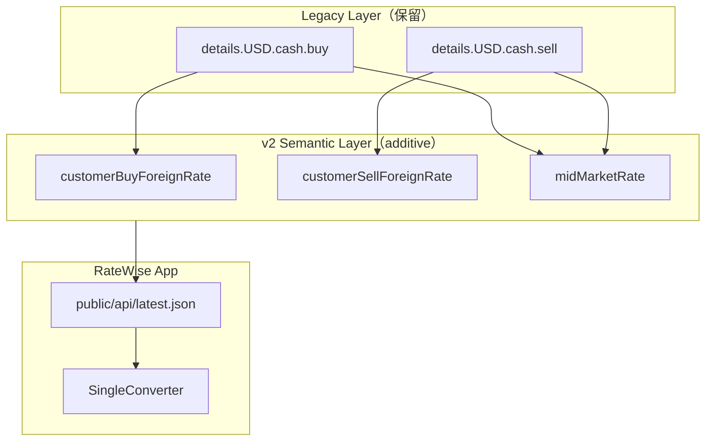

### 21.3 範例對照表（USD cash）

| 語意                   | Legacy path             | v2 欄位                   | 範例值                      |
| ---------------------- | ----------------------- | ------------------------- | --------------------------- |
| 客戶買 USD（銀行賣出） | `details.USD.cash.sell` | `customerBuyForeignRate`  | 32.085                      |
| 客戶賣 USD（銀行買入） | `details.USD.cash.buy`  | `customerSellForeignRate` | 32.015                      |
| 中間價                 | mid(buy,sell)           | `midMarketRate`           | 32.050                      |
| 牌告時間               | `updatedAt`（若存在）   | `asOf`                    | `2026-06-27T12:00:00+08:00` |

### 21.4 Migration Path

| 階段             | 動作                                                          | Sunset                     |
| ---------------- | ------------------------------------------------------------- | -------------------------- |
| **M1 Additive**  | `latest.json` / pair JSON 並存 legacy + v2 欄位               | —                          |
| **M2 OpenAPI**   | `openapi.json` 新增 `CurrencyRateV2` schema + `schemaVersion` | —                          |
| **M3 Docs**      | `public/api/latest.json` metadata 指向 §二十一                | —                          |
| **M4 Deprecate** | `@deprecated` legacy `buy/sell` 於 OpenAPI description        | **2026-12-31** 文件 sunset |
| **M5 Remove**    | 僅當無外部 consumer                                           | Maintainer 批准            |

**OpenAPI 對齊**：`apps/ratewise/public/openapi.json` 現 `info.version: 1.3.0`；語意 bump 建議 `x-schema-version: 2.0` 與 `latest.json` `schemaVersion` 同步。

---

## 二十二、Skills Inventory Matrix（Repo Agent Skills）

> SSOT 路徑：`/Users/azlife.eth/Tools/app/.agents/skills/*/SKILL.md`（**38** skills）。`.claude/skills/` 於本 repo **無** tracked skills（0 檔）；Human 角色可額外引用使用者全域 `~/.claude/skills/`。

### 22.1 Lens × Recommended Skills

| Lens    | Agent  | Primary Skills（repo path）                                             | Secondary Skills                                     |
| ------- | ------ | ----------------------------------------------------------------------- | ---------------------------------------------------- |
| **L01** | 林安答 | `.agents/skills/react/SKILL.md`, `ui-ux-pro-max`, `responsive-design`   | `vite-react-best-practices`, `tdd`                   |
| **L02** | 沈零閱 | `react`, `playwright-e2e-testing`                                       | `vitest`, `responsive-design`                        |
| **L03** | 韓多理 | `react-patterns`, `typescript`, `tdd`                                   | `vitest`, `code-refactoring-refactor-clean`          |
| **L04** | 鄭落地 | `programmatic-seo`, `search-engine-optimization-seo`, `copywriting`     | `seo`, `content-strategy`                            |
| **L05** | 羅導航 | `react`, `ui-design-system`, `responsive-design`                        | `vite-react-best-practices`                          |
| **L06** | 蔡穩屏 | `playwright-e2e-testing`, `vitest`, `systematic-debugging`\*            | `wcag-compliance`, `tdd`                             |
| **L07** | 周寬屏 | `tailwindcss-advanced-layouts`, `responsive-design`, `ui-design-system` | `react`                                              |
| **L08** | 金墨字 | `ui-design-system`, `tailwind-v4-shadcn`, `typescript`                  | `wcag-compliance`                                    |
| **L09** | 白精煉 | `seo`, `search-engine-optimization-seo`, `ssot-drift-clean-code-audit`  | `vitest`, `ai-seo`                                   |
| **L10** | 許無障 | `wcag-compliance`, `ui-design-system`                                   | `tailwind-v4-shadcn`                                 |
| **L11** | 方觸達 | `wcag-compliance`, `playwright-e2e-testing`                             | `responsive-design`                                  |
| **L12** | 吳收藏 | `react`, `i18n-localization`, `pwa-development`                         | `vitest`                                             |
| **L13** | 孫問答 | `content-strategy`, `copywriting`, `seo-strategy`                       | `programmatic-seo`                                   |
| **L14** | 朴顯赫 | `ui-design-system`, `tailwind-v4-shadcn`, `ui-ux-pro-max`               | `framer-motion`                                      |
| **L15** | 車安裝 | `pwa-development`, `vite-react-best-practices`                          | `wrangler`, `playwright-e2e-testing`                 |
| **L16** | 何降級 | `react`, `vite-react-best-practices`, `vitest`                          | `pwa-development`                                    |
| **L17** | 高信任 | `seo`, `ai-seo`, `seo-geo`                                              | `technical-writer`, `search-engine-optimization-seo` |
| **L18** | 裴對標 | `ui-ux-pro-max`, `product-manager`, `frontend-design`\*                 | `ui-design-system`                                   |
| **L19** | 梁趨勢 | `product-manager`, `seo-strategy`, `content-strategy`                   | `search-engine-optimization-seo`                     |
| **L20** | 馮驗收 | `playwright-e2e-testing`, `vitest`, `ultrareview-pr-audit`              | `codex-review-convergence`, `security-review`        |

\* `systematic-debugging` / `frontend-design` 見使用者全域 `~/.claude/skills/`；repo 內無同名 skill 時以全域為準。

### 22.2 Human Role × Skills

| Human 角色           | Recommended Skills                                                                             |
| -------------------- | ---------------------------------------------------------------------------------------------- |
| **PM**               | `product-manager`, `git-commit`, `seo-strategy`                                                |
| **Tech Lead**        | `monorepo-management`, `typescript`, `codex-review-convergence`, `ssot-drift-clean-code-audit` |
| **Frontend**         | `react`, `vite-react-best-practices`, `tdd`, `typescript`                                      |
| **Design Tokens**    | `ui-design-system`, `tailwind-v4-shadcn`, `wcag-compliance`                                    |
| **SEO / Content**    | `seo`, `programmatic-seo`, `ai-seo`, `technical-writer`                                        |
| **PWA / SW**         | `pwa-development`, `wrangler`, `vite-react-best-practices`                                     |
| **QA**               | `playwright-e2e-testing`, `vitest`, `wcag-compliance`                                          |
| **Release / DevOps** | `monorepo-management`, `wrangler`, `git-commit`, `security-review`                             |

### 22.3 Review / Platform Skills（非透鏡專屬）

| 用途              | Skill path                                            |
| ----------------- | ----------------------------------------------------- |
| PR 稽核           | `.agents/skills/ultrareview-pr-audit/SKILL.md`        |
| Codex review 收斂 | `.agents/skills/codex-review-convergence/SKILL.md`    |
| 安全 review       | `.agents/skills/security-review/SKILL.md`             |
| API 文件          | `.agents/skills/api-documentation-generator/SKILL.md` |
| SEO 稽核          | `.agents/skills/seo-audit/SKILL.md`                   |

**Skills 映射計數**：20 lens × 平均 3 primary ≈ **60** lens-skill 連結；38 個 repo skills 中 **32** 個至少對應 1 個 lens 或 human role。

---

## 二十三、修訂紀錄

| 日期       | 版本       | 變更                                                                                                                                                                                                                                                                                                                  |
| ---------- | ---------- | --------------------------------------------------------------------------------------------------------------------------------------------------------------------------------------------------------------------------------------------------------------------------------------------------------------------- |
| 2026-06-26 | v1.0.0     | 初版：合併 20 UX audit agents + mobile PWA QA spec                                                                                                                                                                                                                                                                    |
| 2026-06-26 | **v2.0.0** | 20 透鏡詳表、生產 curl 證據、韓系 fintech 研究、open PR 矩陣（#433/#441/#446）、Git worktree 平行開發 playbook、RACI、QA gates、open questions、scorecard 微調                                                                                                                                                        |
| 2026-06-27 | **v2.1.0** | 20 Agent Audit Lenses（Role + Composer prompt + progress fields）、Agent 協作 SSOT（§三）、Department RACI 擴充、worktree merge/conflict 治理、Lessons Learned Registry（UX-INC-001–010）、2026-06-27 curl/PR 證據（#455、thesis 2）                                                                                  |
| 2026-06-27 | **v2.2.0** | 20 具名 Agent Persona（§四 roster）；產品團隊編制 + 6 張 Mermaid 治理圖；§五 團隊強制規範；§十四 Git Worktree SSOT 權威化（5 worktree + conflict playbook）；章節重編 §四–§二十                                                                                                                                       |
| 2026-06-27 | **v2.3.0** | §三 Agent 協作管線（3.6–3.11）+ Composer 2.5 Fast 強制 + gh playbook；§十四.12 實驗分支 `experiment/ratewise-ux-2026`；§二十 A/B 追蹤；§二十一 API Semantics v2；§二十二 Skills 矩陣（38 skills）；§十一 Epic 1 KoreaTravel 映射；open PR #456/#457；production curl 重測                                             |
| 2026-06-30 | **v3.0.0** | **深度 UI/UX 審查交付**：§1.1–§1.8（Evidence Pack、Problem Registry、IA 重構、Roadmap Phase 0–4、Parallel Agile、Role Playbooks、TODO SSOT、Acceptance Criteria）；Playwright 60 組 viewport live 審查；§八/§九/§十三 刷新；檔名 SSOT 統一為 `2026-06-12-ratewise-2026-product-ux-spec.md`；**待使用者確認後 commit** |
| 2026-06-30 | **v3.1.0** | **第二輪 post-#523 增量審查**：§1.1 2026-06-30b 證據包 + v3.0/v3.1b 差異表；RWUX-3-001/002 resolved；UX-PR-011 landing CTA 截斷；§八 20 透鏡增量列；§十三 #523/#517 merged、#518–521 superseded；`scripts/ux-audit-live.mjs` SSOT；韓系 fintech 2025–2026 補強；§十八 Q8–Q10；**待使用者確認後 commit**               |

---

**Stream 狀態（2026-06-30b）**：#523/#517 merged；live `app-version` 2.25.12 待同步 v2.25.13；experiment #470/#471/#469 open；P0（#418、hero、landing CTA clip）仍阻斷 UX minor release。

**下一步**：確認 Zeabur deployment + live precache → rebase experiment on #523 → 優先 #470 hydration → #471 hero-v2 → 重跑 `ux-audit-live.mjs` 驗證 AC 表。
