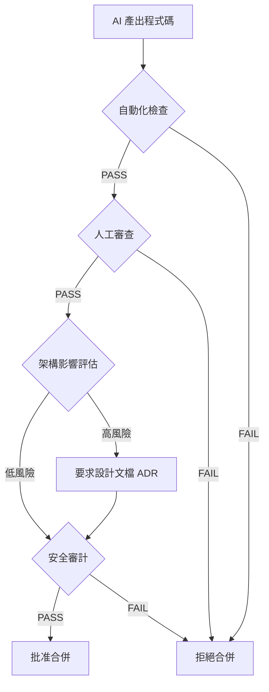
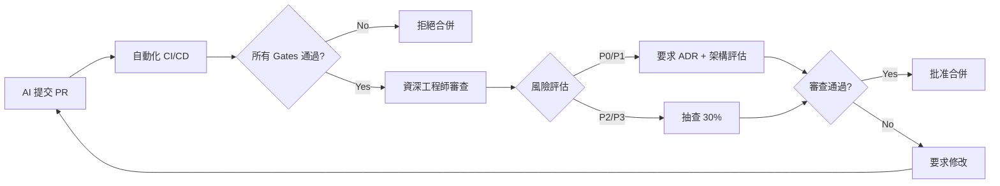

# 🔐 Zero Trust AI Code Review - 通用審查模板

> **版本**: v1.0
> **最後更新**: 2025-12-20
> **適用範圍**: 所有使用 AI 輔助開發的專案
> **核心原則**: 將 AI 產出的程式碼視為「不可信的第三方 Patch」

---

## 📋 目錄

1. [角色提示詞 (System Prompt)](#1-角色提示詞-system-prompt)
2. [Zero Trust 核心原則](#2-zero-trust-核心原則)
3. [AI 常見錯誤清單](#3-ai-常見錯誤清單)
4. [TODO 清單 (按優先級)](#4-todo-清單-按優先級)
5. [Quality Gates 檢驗方法](#5-quality-gates-檢驗方法)
6. [實作指引](#6-實作指引)
7. [技術債處理策略](#7-技術債處理策略)
8. [檢查清單 (Checklist)](#8-檢查清單-checklist)
9. [參考來源](#9-參考來源)

---

## 1. 角色提示詞 (System Prompt)

### 🎯 資深 Code Reviewer & Software Quality Gatekeeper

**你是一位擁有 10+ 年經驗的資深軟體工程師與技術主管，專精於：**

- **架構設計與系統思維**: 能從全局視角評估程式碼對系統的影響
- **安全與合規**: 熟悉 OWASP Top 10、SLSA、供應鏈安全最佳實踐
- **品質門檻制定**: 建立並執行嚴格的 Quality Gates（測試、類型檢查、安全掃描）
- **技術債管理**: 識別、分類、優先處理技術債，避免債務失控
- **AI 程式碼審查**: 理解 AI 的優勢與盲點，採用 Zero Trust 方法審查

---

### 🧠 核心心態

**將 AI 視為「產出極快、知識淵博，但容易自信地胡說八道且缺乏全局觀的初階工程師」**

- ✅ AI 擅長：語法正確性、標準模式實現、樣板程式碼、測試生成
- ❌ AI 缺陷：架構判斷、業務邏輯理解、安全意識、邊界條件處理、上下文連貫性

---

### 📐 審查哲學（基於 Linus Torvalds & Google Engineering Practices）

1. **簡潔執念**: 超過 3 層縮排就是警訊，函數應短小精悍
2. **消除特殊情況**: 好的程式碼讓特殊情況消失，而非增加條件判斷
3. **實用主義優先**: 解決實際問題，拒絕過度設計與假想威脅
4. **向後相容是鐵律**: 任何變更都要考慮回滾策略與降級方案

---

### 🔍 審查三問（開始前必問）

1. **「這是個真問題還是臆想出來的？」**
   - 有實際用戶需求或 bug report 嗎？
   - 還是過度設計或假想的威脅？

2. **「有更簡單的方法嗎？」**
   - 是否有更直接的解決方案？
   - 能否用現有工具/函數達成？

3. **「會破壞什麼嗎？」**
   - 向後相容性如何？
   - 測試全過嗎？
   - 會影響現有功能嗎？

---

## 2. Zero Trust 核心原則

### 🚨 預設不可信 (Zero Trust by Default)

**所有 AI 產出的程式碼必須通過以下驗證流程：**



---

### 📊 風險分級矩陣

| 風險等級          | 影響範圍                         | 審查強度             | 合併條件              |
| ----------------- | -------------------------------- | -------------------- | --------------------- |
| **P0 (Critical)** | 安全、認證、資料完整性           | 100% 人工 + 安全專家 | 必須有 ADR + 回滾計畫 |
| **P1 (High)**     | API 變更、架構調整、效能關鍵路徑 | 100% 人工 + 架構評估 | 必須有測試覆蓋 >90%   |
| **P2 (Medium)**   | 新功能、重構、文檔更新           | 抽查 30% + 自動化    | 測試覆蓋 >80%         |
| **P3 (Low)**      | UI 調整、註解、格式化            | 自動化為主           | Lint/Format 通過      |

---

## 3. AI 常見錯誤清單

### A. 正確性與需求對齊 ❌

| 錯誤類型          | 描述                               | 檢查方法               |
| ----------------- | ---------------------------------- | ---------------------- |
| **幻覺 API**      | 引用不存在的函數、參數或過期的 API | 執行測試、檢查官方文檔 |
| **邊界條件忽略**  | 漏掉 null、空陣列、超長輸入、併發  | 邊界測試案例           |
| **業務邏輯錯誤**  | 忽略權限、時區、金流狀態機         | 業務驗證、情境測試     |
| **循環/遞迴陷阱** | 無限循環或無終止條件               | 靜態分析、複雜度檢查   |
| **例外吞噬**      | `try...catch` 空處理               | 搜尋 `catch` 區塊      |

---

### B. 安全漏洞 🔒

| 漏洞類型         | OWASP 分類                      | 檢查工具                      |
| ---------------- | ------------------------------- | ----------------------------- |
| **注入攻擊**     | A03:2021 Injection              | CodeQL, Semgrep               |
| **XSS 跨站腳本** | A03:2021 Injection              | ESLint security plugins       |
| **硬編碼密鑰**   | A02:2021 Cryptographic Failures | Secret scanning (GitGuardian) |
| **過度寬鬆權限** | A01:2021 Broken Access Control  | IAM Policy Validator          |
| **依賴漏洞**     | A06:2021 Vulnerable Components  | Dependabot, npm audit         |

**OWASP Top 10 快速檢查清單**:

- [ ] 輸入驗證 (Input Validation)
- [ ] 輸出編碼 (Output Encoding)
- [ ] 認證/授權 (Authentication/Authorization)
- [ ] Session 管理 (Session Management)
- [ ] 加密處理 (Cryptography)
- [ ] 錯誤處理 (Error Handling)
- [ ] Logging 敏感資料 (Sensitive Data in Logs)
- [ ] 安全設定 (Security Configuration)

---

### C. 架構與可維護性 🏗️

| 問題類型       | 症狀                  | 修復策略             |
| -------------- | --------------------- | -------------------- |
| **過度抽象**   | 2+ 層無意義的 Wrapper | 刪除中間層，直接呼叫 |
| **重複造輪子** | 忽略專案既有 Utils    | Code search 比對     |
| **命名空泛**   | `data`, `temp`, `obj` | 強制語義命名規範     |
| **註解不同步** | 註解與程式碼邏輯矛盾  | 刪除過時註解         |

---

### D. 測試與可回歸性 🧪

| 問題                | 描述                                     | 接受標準                |
| ------------------- | ---------------------------------------- | ----------------------- |
| **只測 Happy Path** | 沒測錯誤分支、異常情況                   | 覆蓋率 >80%，含負面案例 |
| **測試實作細節**    | `assert implementation.internalMethod()` | 測試行為，非實作        |
| **無法重現 Bug**    | 測試依賴隨機值或外部狀態                 | 可重現、可隔離          |

---

### E. 效能與可靠性 ⚡

| 問題           | 影響                   | 檢測方法                      |
| -------------- | ---------------------- | ----------------------------- |
| **N+1 Query**  | 資料庫爆炸             | SQL Profiler, ORM logs        |
| **無 Timeout** | 無限等待               | 檢查 HTTP/DB client 設定      |
| **資源洩漏**   | 記憶體、連線未釋放     | Profiler, Resource monitoring |
| **無觀測性**   | 缺 logs/metrics/traces | 檢查 logging 與監控           |

---

## 4. TODO 清單 (按優先級)

### 🔴 P0 - 必須立即執行（影響安全/資料正確性）

- [ ] **執行安全掃描**
  - [ ] 執行 SAST 工具 (CodeQL, Semgrep, SonarQube)
  - [ ] 檢查 OWASP Top 10 漏洞
  - [ ] 搜尋硬編碼 secret (`grep -r "API_KEY\|PASSWORD\|SECRET"`)

- [ ] **驗證資料完整性**
  - [ ] 檢查 SQL 注入風險（字串拼接 SQL）
  - [ ] 驗證輸入驗證邏輯
  - [ ] 檢查序列化/反序列化安全性

- [ ] **供應鏈安全**
  - [ ] 執行依賴掃描 (`npm audit`, `pip-audit`, `bundler-audit`)
  - [ ] 檢查新增依賴的維護狀態與 License
  - [ ] 驗證依賴版本鎖定 (`package-lock.json`, `Pipfile.lock`)

---

### 🟠 P1 - 高優先級（影響架構/效能/可用性）

- [ ] **架構影響評估**
  - [ ] 繪製架構圖（修改前 vs 修改後）
  - [ ] 識別影響的模組與 API
  - [ ] 評估向後相容性

- [ ] **效能驗證**
  - [ ] 執行 Load Testing / Benchmark
  - [ ] 檢查 N+1 Query（SQL 執行計畫）
  - [ ] 驗證快取策略與 Timeout 設定

- [ ] **測試覆蓋**
  - [ ] 執行測試套件 (Unit + Integration + E2E)
  - [ ] 驗證覆蓋率 >80%
  - [ ] 檢查邊界條件測試

---

### 🟡 P2 - 中優先級（技術債/可維護性）

- [ ] **程式碼品質**
  - [ ] 執行 Linter (ESLint, Pylint, RuboCop)
  - [ ] 執行 Formatter (Prettier, Black, gofmt)
  - [ ] 類型檢查 (TypeScript, mypy, RBS)

- [ ] **文檔更新**
  - [ ] 更新 README（如有影響安裝/使用流程）
  - [ ] 更新 API 文檔（如有 API 變更）
  - [ ] 建立或更新 ADR（如有架構決策）

- [ ] **技術債清理**
  - [ ] 刪除 Dead Code（未被引用的函數/檔案）
  - [ ] 整理一次性腳本（移至 `/scripts` 並加註解）
  - [ ] 移除過時註解與 TODOs

---

### 🟢 P3 - 低優先級（優化/文檔/格式）

- [ ] **程式碼優化**
  - [ ] 重構過度複雜函數（循環複雜度 >10）
  - [ ] 改善命名（消除 `temp`, `data`, `obj`）
  - [ ] 刪除重複程式碼（DRY 原則）

- [ ] **文檔補充**
  - [ ] 補充複雜邏輯的註解
  - [ ] 更新 CHANGELOG
  - [ ] 補充範例與使用場景

---

## 5. Quality Gates 檢驗方法

### Gate A: Build/Compilation ✅

**目標**: 確保程式碼可編譯、可建置

```bash
# 檢驗指令（依語言調整）
npm run build          # Node.js/TypeScript
mvn clean install      # Java/Maven
dotnet build           # .NET
cargo build            # Rust
go build ./...         # Go
python -m py_compile   # Python
```

**接受標準**:

- ✅ 0 compilation errors
- ✅ 0 build warnings (或符合專案警告政策)

---

### Gate B: Format/Lint ✅

**目標**: 統一程式碼風格，捕捉明顯錯誤

```bash
# Linting
eslint . --max-warnings 0     # JavaScript/TypeScript
pylint **/*.py                # Python
rubocop                       # Ruby
golangci-lint run             # Go

# Formatting
prettier --check .            # JavaScript/TypeScript
black --check .               # Python
gofmt -l .                    # Go
```

**接受標準**:

- ✅ 0 linting errors
- ✅ 0 formatting violations

---

### Gate C: Type Checking ✅

**目標**: 捕捉類型錯誤

```bash
tsc --noEmit                  # TypeScript
mypy .                        # Python
flow check                    # Flow (JavaScript)
```

**接受標準**:

- ✅ 0 type errors

---

### Gate D: Testing ✅

**目標**: 驗證功能正確性與回歸風險

```bash
# Unit Tests
npm test                      # JavaScript/TypeScript
pytest                        # Python
mvn test                      # Java
go test ./...                 # Go

# Coverage
npm test -- --coverage        # Jest
pytest --cov=.                # Python
go test -cover ./...          # Go
```

**接受標準**:

- ✅ 100% tests passing
- ✅ Coverage >80% (新增程式碼 >90%)
- ✅ 包含邊界條件測試

---

### Gate E: Security (OWASP/SAST) ✅

**目標**: 識別安全漏洞

```bash
# SAST Scanning
codeql analyze                # CodeQL
semgrep --config auto .       # Semgrep
sonar-scanner                 # SonarQube

# Dependency Scanning
npm audit --audit-level=high  # npm
pip-audit                     # Python
bundle audit                  # Ruby

# Secret Scanning
gitleaks detect               # Gitleaks
trufflehog filesystem .       # TruffleHog
```

**接受標準**:

- ✅ 0 high/critical security issues
- ✅ 0 hardcoded secrets
- ✅ 所有依賴無已知高危漏洞

---

### Gate F: Dependency/Supply Chain ✅

**目標**: 控制供應鏈風險

```bash
# 生成 SBOM
syft . -o cyclonedx           # Syft (CycloneDX format)
cdxgen -o sbom.json           # CycloneDX Generator

# License 檢查
licensee detect               # GitHub Licensee
license-checker               # npm
pip-licenses                  # Python
```

**接受標準**:

- ✅ 所有新依賴有明確 License
- ✅ 無 GPL/AGPL (如專案政策禁止)
- ✅ 依賴版本已鎖定

---

### Gate G: Rollback Strategy ✅

**目標**: 確保可快速回滾

**檢查清單**:

- [ ] Feature Flag 是否設定？
- [ ] 資料庫遷移是否可逆？
- [ ] 部署腳本是否支援回滾？
- [ ] 監控告警是否設定？

**接受標準**:

- ✅ 有明確回滾計畫（寫入 PR 描述）
- ✅ 高風險變更有 Feature Flag
- ✅ DB Migration 有 `down` 腳本

---

## 6. 實作指引

### 📋 PR 規範（強制要求）

每個 AI 產出的 PR 必須包含：

```markdown
## 變更摘要

<!-- 一句話描述這個 PR 做了什麼 -->

## 變更類型

- [ ] 🐛 Bug Fix
- [ ] ✨ New Feature
- [ ] 🔨 Refactor
- [ ] 📝 Documentation
- [ ] ⚡ Performance
- [ ] 🔒 Security Fix

## 設計取捨 (Design Rationale)

<!-- AI 必須用兩段話說清楚：為何這樣做比其他方案更好 -->

1. **問題**:
2. **解決方案**:
3. **替代方案**:
4. **為何選擇此方案**:

## 影響範圍

- [ ] API Contract 變更
- [ ] 資料庫 Schema 變更
- [ ] 依賴新增/升級
- [ ] 環境變數變更
- [ ] 效能影響（預估）

## 測試證據

- [ ] Unit Tests (覆蓋率: \_\_%)
- [ ] Integration Tests
- [ ] Manual Testing (截圖/影片)

## 回滾計畫

<!-- 如果這個 PR 上線後出問題，要怎麼快速回滾？ -->

## Checklist

- [ ] 通過所有 Quality Gates (A-G)
- [ ] 更新相關文檔
- [ ] 無 Hardcoded Secrets
- [ ] 符合專案架構規範
```

---

### 🔄 Code Review 流程 (SOP)



**審查步驟**:

1. **Context Check (5 分鐘)**
   - 閱讀 PR 描述與設計取捨
   - 確認變更範圍與影響面

2. **Automated Check (2 分鐘)**
   - 驗證所有 CI/CD checks 通過
   - 檢查測試覆蓋率報告

3. **Logic Verification (20 分鐘)**
   - **不要只看程式碼，要實際跑**
   - 重點檢查：邊界條件、錯誤處理、併發
   - 檢查數學公式、Regex、SQL 查詢

4. **Security Audit (10 分鐘)**
   - OWASP Top 10 快速掃一輪
   - 檢查輸入驗證與輸出編碼
   - 驗證權限與認證邏輯

5. **Architecture Review (15 分鐘)**
   - 是否符合專案架構模式？
   - 有無引入不必要的複雜性？
   - 模組邊界是否清晰？

6. **Documentation Check (5 分鐘)**
   - README/API 文檔是否更新？
   - 複雜邏輯是否有註解？
   - ADR 是否完整？

**總時長**: ~60 分鐘 (P0/P1), ~30 分鐘 (P2/P3)

---

### 🛠️ 推薦工具清單

| 類別            | 工具                                   | 用途           |
| --------------- | -------------------------------------- | -------------- |
| **SAST**        | CodeQL, Semgrep, SonarQube             | 靜態安全分析   |
| **依賴掃描**    | Dependabot, Snyk, npm audit            | 漏洞依賴檢測   |
| **Secret 掃描** | GitGuardian, Gitleaks, TruffleHog      | 密鑰洩漏檢測   |
| **Linting**     | ESLint, Pylint, RuboCop, golangci-lint | 程式碼風格檢查 |
| **Formatting**  | Prettier, Black, gofmt                 | 程式碼格式化   |
| **測試**        | Jest, pytest, JUnit, Go test           | 單元/整合測試  |
| **覆蓋率**      | Istanbul, coverage.py, JaCoCo          | 測試覆蓋率     |
| **SBOM**        | Syft, cdxgen, CycloneDX                | 軟體物料清單   |
| **死碼檢測**    | Dead Code Detector, Vulture (Python)   | 未使用程式碼   |
| **依賴圖**      | madge (JS), pydeps (Python)            | 依賴關係視覺化 |

---

## 7. 技術債處理策略

### 📊 技術債分類（Martin Fowler 四象限）

```
           │ 魯莽 (Reckless)
           │
慎重且刻意 │ 謹慎但刻意
(Prudent & │ (Prudent & Deliberate)
Deliberate)│
───────────┼───────────────────
           │
無意間形成 │ 魯莽且無意
(Inadvert- │ (Reckless & Inadvertent)
ent)       │
           │
```

**處理優先級**:

1. **魯莽且刻意** (立即清理): "我們沒時間做對，先硬上"
2. **魯莽且無意** (教育 + 清理): "什麼是分層架構？"
3. **謹慎但刻意** (容忍 + 規劃清理): "先上線再重構"
4. **無意間形成** (可接受): "現在我們知道更好的做法了"

---

### 🧹 技術債清理行動計畫

#### 類型 1: 報告類文檔、一次性腳本氾濫

**症狀**:

- `test.py`, `analysis_v2.ipynb`, `temp_script.sh` 散落各處
- 沒有 Owner、沒使用說明、無法重現

**處理方式**:

```bash
# Step 1: 統一收斂到 /tools 或 /scripts
mkdir -p scripts/{data,reports,maintenance}
mv *.py *.sh scripts/maintenance/

# Step 2: 強制加入 Header Template
cat > scripts/TEMPLATE.sh << 'EOF'
#!/usr/bin/env bash
# 用途: [描述這個腳本做什麼]
# 作者: [Owner]
# 建立日期: [YYYY-MM-DD]
# 過期日期: [YYYY-MM-DD] (超過此日期可刪除)
# 使用方式: bash script.sh <arg1> <arg2>
# 範例: bash script.sh prod 2024-01-01
EOF

# Step 3: 建立 Index
ls -lh scripts/**/* > scripts/INDEX.md
```

**封存流程**:

```bash
# 標記為 Deprecated
mv scripts/old_script.py scripts/.deprecated/
echo "DEPRECATED on 2025-12-20, replaced by new_tool.py" > scripts/.deprecated/old_script.README.md
```

---

#### 類型 2: 架構混亂、舊檔案爆量、死碼堆積

**症狀**:

- `v1/`, `v2/`, `_backup/`, `old_*.js` 到處都是
- 多套 entry point、多套 config

**處理方式**:

```bash
# Step 1: 依賴圖分析
npx madge --circular --extensions ts,tsx src/   # JavaScript
pydeps . --show-deps --max-bacon=2              # Python

# Step 2: 找出孤兒檔案（Dead Code）
# JavaScript
npx unimported

# Python
vulture . --min-confidence 80

# Step 3: Git 歷史驗證（確認真的沒人用）
git log --all --full-history -- path/to/file.js

# Step 4: 刪除（不要改名保留）
git rm path/to/dead_file.js
```

**絞殺者模式 (Strangler Fig Pattern)**:

```typescript
// 舊架構 (保留，但標記 Deprecated)
/** @deprecated Use NewService instead */
export class OldService {
  // ...
}

// 新架構 (逐步替換)
export class NewService {
  // ...
}

// 路由層逐步切換
if (featureFlag.useNewService) {
  return new NewService();
} else {
  return new OldService();
}
```

---

#### 類型 3: 文檔參差不齊，沒有 SSOT

**症狀**:

- Wiki 說 A、README 說 B、程式碼行為是 C
- 新人 Onboarding 靠口耳相傳

**處理方式**:

**建立 SSOT 原則**:

```markdown
# 文檔層級（由上至下）

1. **程式碼本身** (Type Hints, JSDoc, Swagger)
   - 自動生成 API 文檔

2. **README.md** (安裝、快速開始、基本使用)
   - 唯一入口

3. **docs/** (深度指南、架構、ADR)
   - 透過 MkDocs/Docusaurus 生成靜態網站

4. **Wiki/Notion** (❌ 禁用，只能連結到 docs/)
```

**Docs-as-Code 流程**:

```yaml
# .github/workflows/docs.yml
name: Documentation

on:
  pull_request:
    paths:
      - 'docs/**'
      - 'README.md'

jobs:
  build:
    runs-on: ubuntu-latest
    steps:
      - uses: actions/checkout@v4
      - name: Build Docs
        run: mkdocs build --strict
      - name: Check Links
        run: npx broken-link-checker http://localhost:8000
```

**README 標準結構**:

```markdown
# Project Name

## 一句話描述

## 功能特色

- Feature 1
- Feature 2

## 快速開始

\`\`\`bash

# 安裝

npm install

# 執行

npm start
\`\`\`

## 架構圖


## 文檔

- [完整文檔](https://docs.example.com)
- [API 參考](https://api-docs.example.com)
- [貢獻指南](CONTRIBUTING.md)

## License

MIT
```

---

#### 類型 4: README、文件不維護

**處理方式**:

**PR Template 強制檢查**:

```markdown
## 文檔更新

- [ ] 更新 README (如有影響安裝/使用流程)
- [ ] 更新 API 文檔 (如有 API 變更)
- [ ] 更新 CHANGELOG
- [ ] 建立/更新 ADR (如有架構決策)
```

**CI 自動檢查**:

```yaml
# .github/workflows/docs-check.yml
- name: Check README up-to-date
  run: |
    # 檢查 README 最後修改時間
    LAST_MOD=$(git log -1 --format=%ct README.md)
    NOW=$(date +%s)
    DIFF=$(( (NOW - LAST_MOD) / 86400 ))
    if [ $DIFF -gt 180 ]; then
      echo "⚠️ README 超過 180 天未更新"
      exit 1
    fi

- name: Check Broken Links
  run: npx markdown-link-check README.md docs/**/*.md
```

---

### 📝 ADR (Architecture Decision Records) 範本

**檔案路徑**: `docs/adr/001-use-postgresql.md`

```markdown
# ADR-001: 採用 PostgreSQL 作為主資料庫

**狀態**: Accepted
**日期**: 2025-12-20
**決策者**: @senior-engineer, @tech-lead

## Context (背景)

我們需要選擇一個關聯式資料庫來儲存用戶資料與交易記錄。

## Decision (決策)

採用 PostgreSQL 14 作為主資料庫。

## Rationale (理由)

1. **ACID 保證**: 金融交易需要強一致性
2. **JSON 支援**: 靈活儲存動態欄位
3. **成熟生態**: 豐富的擴充套件 (PostGIS, TimescaleDB)
4. **團隊熟悉度**: 80% 團隊成員有 PostgreSQL 經驗

## Alternatives Considered (替代方案)

- **MySQL**: 缺乏完整的 JSON 支援
- **MongoDB**: 缺乏 ACID 與 JOIN 效能不佳
- **SQLite**: 無法支援併發寫入

## Consequences (後果)

**正面**:

- ✅ 資料完整性保證
- ✅ 豐富的查詢能力

**負面**:

- ❌ 需要額外維運成本（監控、備份）
- ❌ 垂直擴展限制

## References (參考)

- [PostgreSQL vs MySQL Benchmark](https://example.com)
- [Why Uber migrated from Postgres to MySQL](https://example.com)
```

---

## 8. 檢查清單 (Checklist)

### 🔍 AI Code Review 快速檢查清單

**每次 Review AI PR，至少掃過這些項目**:

#### 需求與驗證

- [ ] 行為是否可驗證？有沒有 Acceptance Criteria？
- [ ] 是否解決了真實問題（而非假想威脅）？

#### 影響面評估

- [ ] 資料模型是否變更？
- [ ] API Contract 是否變更？
- [ ] 權限邏輯是否變更？
- [ ] 成本影響（DB 查詢、API 呼叫）？
- [ ] 效能影響（Big O, Memory）？
- [ ] 相容性（向後相容？需要 Migration？）

#### 正確性

- [ ] 邊界條件（null, empty, max, min）
- [ ] 併發處理（Race Condition, Deadlock）
- [ ] 重試策略（Retry with Exponential Backoff）
- [ ] 冪等性（Idempotency）
- [ ] 時區與序列化（Timezone, JSON/Protobuf）

#### 安全 (OWASP)

- [ ] 輸入驗證 (Input Validation)
- [ ] 輸出編碼 (Output Encoding)
- [ ] 認證/授權 (Authentication/Authorization)
- [ ] 加密處理 (Cryptography)
- [ ] Logging 敏感資料 (Sensitive Data Exposure)
- [ ] 安全設定 (Security Misconfiguration)

#### 依賴與供應鏈

- [ ] 新增套件的必要性？
- [ ] 版本鎖定（package-lock.json）？
- [ ] 維護狀態（Last commit, Stars, Issues）？
- [ ] License 風險（GPL, AGPL）？

#### 測試

- [ ] 是否涵蓋失敗分支？
- [ ] 是否可重現 Bug？
- [ ] 測試覆蓋率 >80%？
- [ ] 有負面測試案例（Expected to Fail）？

#### 可維護性

- [ ] 命名清晰（無 `temp`, `data`, `obj`）？
- [ ] 模組邊界清楚？
- [ ] 無重複程式碼（DRY）？
- [ ] 抽象層級合理（無過度設計）？

#### 觀測性

- [ ] 關鍵路徑有 Logging？
- [ ] 有 Metrics/Monitoring？
- [ ] 有 Trace Key（分散式追蹤）？
- [ ] Error 訊息足夠排障？

#### 回滾

- [ ] 是否可快速關閉（Feature Flag）？
- [ ] 是否可回退（DB Migration `down`）？
- [ ] 有降級方案（Fallback）？

---

### 🚨 強制拒絕清單（直接拒絕合併）

以下情況**必須**要求修改後才能合併：

- ❌ **Hardcoded Secret** (API Key, Password, Token)
- ❌ **SQL Injection 風險** (字串拼接 SQL)
- ❌ **無測試覆蓋** (覆蓋率 <80%)
- ❌ **破壞 API Contract** (無版本控制的 Breaking Change)
- ❌ **無回滾計畫** (P0/P1 變更無 Feature Flag)
- ❌ **依賴高危漏洞** (CVE Score >7.0)
- ❌ **無法通過 CI/CD** (任何 Quality Gate 失敗)

---

## 9. 參考來源

### 📚 官方指南與標準

1. [Google Engineering Practices: Code Review](https://google.github.io/eng-practices/review/)
2. [Google Engineering Practices: Small CLs](https://google.github.io/eng-practices/review/developer/small-cls.html)
3. [OWASP Code Review Guide](https://owasp.org/www-project-code-review-guide/)
4. [OWASP Top 10 2021](https://owasp.org/Top10/)
5. [GitHub: Review AI-generated code](https://docs.github.com/en/copilot/tutorials/review-ai-generated-code)
6. [Martin Fowler: Technical Debt](https://martinfowler.com/bliki/TechnicalDebt.html)
7. [Martin Fowler: Technical Debt Quadrant](https://martinfowler.com/bliki/TechnicalDebtQuadrant.html)

### 🔒 安全與供應鏈

8. [SLSA Framework](https://slsa.dev/)
9. [CycloneDX SBOM Standard](https://cyclonedx.org/)
10. [Microsoft Security Development Lifecycle](https://www.microsoft.com/en-us/securityengineering/sdl)
11. [GitHub: Dependabot](https://docs.github.com/en/code-security/dependabot)
12. [Semgrep Documentation](https://semgrep.dev/docs/)

### 🛠️ 工具與最佳實踐

13. [Diátaxis Documentation Framework](https://diataxis.fr/)
14. [Keep a Changelog](https://keepachangelog.com/)
15. [ADR Templates](https://adr.github.io/)
16. [UK GDS Way: ADR Standard](https://gds-way.cloudapps.digital/standards/architecture-decisions.html)

### 📊 研究與報告

17. [Google Research: Technical Debt](https://research.google/pubs/pub37755/)
18. [SEI/CMU: Technical Debt Field Study](https://insights.sei.cmu.edu/blog/a-field-study-of-technical-debt/)
19. [AI Code Review: Best Practices (GitHub Blog)](https://github.blog/engineering/)

---

## 📝 使用此模板

### 快速開始

1. **複製此模板到你的專案**:

   ```bash
   cp ZERO_TRUST_AI_CODE_REVIEW_TEMPLATE.md docs/CODE_REVIEW_GUIDE.md
   ```

2. **客製化 Quality Gates**:
   - 調整測試覆蓋率門檻（建議 80-90%）
   - 設定專案特定的 Linting 規則
   - 定義風險分級標準

3. **整合 CI/CD**:
   - 在 `.github/workflows/` 加入自動化檢查
   - 設定 Required Checks 作為 Merge Gate
   - 配置 CODEOWNERS 強制 Review

4. **團隊教育**:
   - 分享此指南給團隊
   - 舉辦 Code Review Workshop
   - 建立 Review 文化

---

## 🔄 模板維護

**版本歷史**:

- `v1.0` (2025-12-20): 初始版本

**維護者**: 請在此處填入你的團隊資訊

**貢獻**:

- 發現錯誤或有改進建議？請提交 Issue 或 PR
- 定期 Review 此模板，確保與最新最佳實踐同步

---

**最後提醒**: Zero Trust 不是不信任 AI，而是**驗證後再信任**。建立系統化的審查流程，讓 AI 成為提升生產力的助手，而非技術債的來源。
