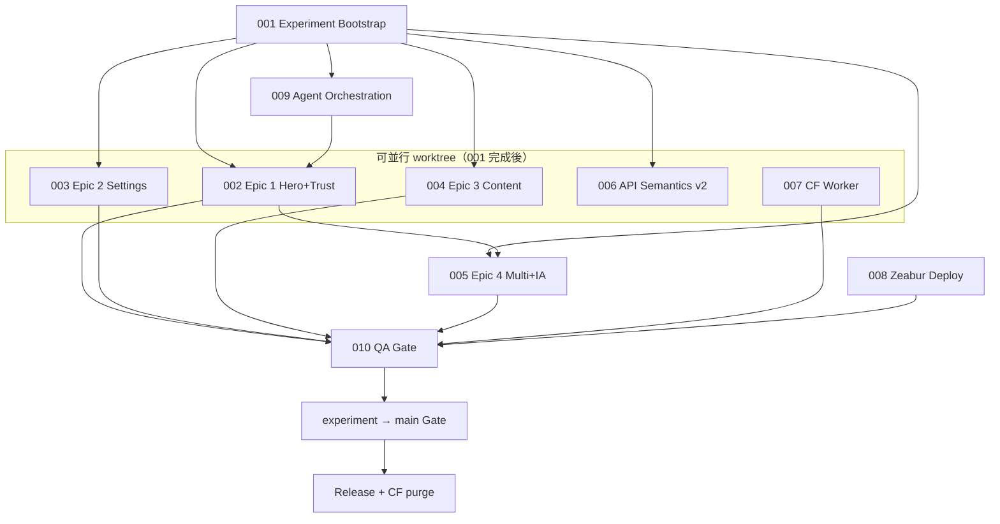

# RateWise UX 2026 實作計畫索引

由 **improve skill** 於 **2026-06-27** 產生，對齊 commit **`e7b7f1ec`** 與 UX spec **v2.3.0**（`docs/superpowers/specs/2026-06-26-ratewise-2026-product-ux-spec.md`）。

**執行方式**：每份計畫為獨立 handoff；executor 僅需該 plan 檔 + repo。完成後更新本表 Status 欄。實作請用 `execute plans/NNN-*.md` 或手動依步驟執行——**本 improve 回合不修改原始碼**。

## 建議執行順序與狀態

| Plan                                        | 標題                      | Priority | Effort | Depends on        | Spec Epic             | Status      |
| ------------------------------------------- | ------------------------- | -------- | ------ | ----------------- | --------------------- | ----------- |
| [001](./001-experiment-branch-bootstrap.md) | 實驗分支 bootstrap        | P1       | S      | —                 | §十四.12              | DONE        |
| [009](./009-agent-orchestration.md)         | Agent 編排與 gh playbook  | P1       | M      | 001               | §三                   | IN PROGRESS |
| [002](./002-epic1-hero-trust.md)            | Epic 1 Hero + Trust       | P1       | L      | 001, 009          | E1 / L01,L06,L14      | IN PROGRESS |
| [003](./003-epic2-settings-ssot.md)         | Epic 2 Settings SSOT      | P1       | M      | 001               | E2 / L12,L15          | TODO        |
| [004](./004-epic3-content-distill.md)       | Epic 3 Content Distill    | P1       | M      | 001               | E3 / L09,L13          | IN PROGRESS |
| [005](./005-epic4-multi-ia.md)              | Epic 4 Multi + IA         | P2       | M      | 001, 002          | E4 / L03,L05          | TODO        |
| [006](./006-api-semantics-v2.md)            | API 語意 v2 加法遷移      | P2       | M      | 001               | §二十一               | DONE        |
| [007](./007-cf-security-headers.md)         | CF Worker 可維護性        | P2       | M      | —                 | Release gate          | AUDIT DONE  |
| [008](./008-zeabur-deployment.md)           | Zeabur 部署與 race 防護   | P2       | M      | —                 | §3.5 / Release        | AUDIT DONE  |
| [010](./010-qa-gate.md)                     | QA 閘門（390×844 + live） | P1       | M      | 002–005, 007, 008 | §十六 / §十四.12 Gate | TODO        |

Status 值：`TODO` | `IN PROGRESS` | `DONE` | `BLOCKED` | `REJECTED`

## 依賴關係圖

## Plan ↔ Spec ↔ Agent ↔ Experiment 合併序

| 合併序 | experiment 累積                   | Plan         | Spec Epic      | 主責 Agent Lenses                  |
| ------ | --------------------------------- | ------------ | -------------- | ---------------------------------- |
| 0      | rebase `main`                     | 001          | §十四.12       | Tech Lead                          |
| 1      | hotfix hydration（若獨立 PR）     | 002（E1-T5） | E1             | L06 蔡穩屏                         |
| 2      | Epic 1 squash                     | 002          | E1             | L01 林安答、L14 朴顯赫、L08 金墨字 |
| 3      | Epic 2 或 Epic 3（少衝突優先 E3） | 003 / 004    | E2 / E3        | L12/L15、L09/L13                   |
| 4      | Epic 4                            | 005          | E4             | L03 韓多理、L05 羅導航             |
| 5      | API v2（可與 E3 並行開發）        | 006          | §二十一        | Release / Backend                  |
| 6      | Infra 驗證                        | 007, 008     | §3.5 Release   | Release / DevOps                   |
| 7      | Experiment→Main Gate              | 010          | §十四.12 G1–G5 | L06, L20, PM                       |

## 平行 worktree 建議

| Worktree 路徑                                    | Plan          | 分支                             | 可與誰並行                                       |
| ------------------------------------------------ | ------------- | -------------------------------- | ------------------------------------------------ |
| `../ratewise-ux-worktrees/epic1-hero-trust`      | 002           | `feat/ratewise-epic1-hero-trust` | E3、E6、CF（007）                                |
| `../ratewise-ux-worktrees/epic2-settings-ssot`   | 003           | `feat/ratewise-epic2-settings`   | E3、E6；**避免**與 E1 同改 `SingleConverter.tsx` |
| `../ratewise-ux-worktrees/epic3-content-distill` | 004           | `feat/ratewise-epic3-content`    | E1、E2、E6                                       |
| `../ratewise-ux-worktrees/epic4-multi-ia`        | 005           | `feat/ratewise-epic4-multi-ia`   | 需 E1 token 就緒後開工                           |
| `../ratewise-ux-worktrees/api-semantics-v2`      | 006           | `feat/ratewise-api-semantics-v2` | 全 Epic（無 UI 衝突）                            |
| `../ratewise-ux-worktrees/hotfix-hydration`      | 002（子任務） | `fix/ratewise-QA-P0-001`         | 優先 merge 至 experiment                         |

**衝突熱點 SSOT**：`design-tokens.ts`、`SingleConverter.tsx`、`seo-metadata.ts`、`BottomNavigation.tsx`（spec §十四.5）。

## 稽核摘要（vetted findings — commit e7b7f1ec）

| #   | Finding                                | Category       | Impact                                                | Effort | Risk | Evidence                                                                             |
| --- | -------------------------------------- | -------------- | ----------------------------------------------------- | ------ | ---- | ------------------------------------------------------------------------------------ |
| F1  | ~~實驗分支尚未建立~~ **已 bootstrap**  | direction      | experiment @ `567ebd4d`；worktrees epic1/epic3/api/cf | S      | LOW  | `git ls-remote origin experiment/ratewise-ux-2026` 有 ref                            |
| F2  | 首屏 answer-first 倒置                 | direction      | 0 tap 可讀匯率但視線先落金額列                        | L      | MED  | `SingleConverter.tsx:398-422` 早於 `:486+`；`design-tokens.ts:678-709` 同 `text-2xl` |
| F3  | Hydration P0 未解                      | correctness    | React #418 阻斷 trust / release gate                  | M      | MED  | `main.tsx:9-10` import `suppress-hydration-warning`                                  |
| F4  | ~~API buy/sell 銀行視角~~ **006 DONE** | correctness    | v2 additive 欄位 + OpenAPI CurrencyRateV2             | M      | LOW  | `api-semantics-v2.ts`；`latest.json` `schemaVersion: "2.0"`                          |
| F5  | Release 邊界分散                       | architecture   | Zeabur→CF→precache 順序錯易 stale 404                 | M      | MED  | `release.yml:213-241`；`Dockerfile:73-78` 多 app 單映像                              |
| F6  | 觸控 / nav 未達 44px                   | direction      | WCAG 2.5.8、韓系對標 gap                              | M      | LOW  | `BottomNavigation.tsx:105` `text-[8px]`；`PwaInstallGuide.tsx:16` `1800ms`           |
| F7  | 內容 thesis 重複                       | docs/direction | curl 賣出價/中間價 keyword=2（目標 ≤1）               | M      | LOW  | spec §十；`seo-metadata.ts` SSOT                                                     |
| F8  | CF observability 已取樣 10%            | dx             | 符合 044 治理；deploy SOP 需與 UX gate 綁定           | S      | LOW  | `wrangler.jsonc:23-36` `head_sampling_rate: 0.1`                                     |

## Infra 稽核摘要（Plan 007 + 008 — read-only，2026-06-27）

**Verdict**：可維護性 **conditional pass**（Worker/Zeabur 基線健全；release 順序與文件 SSOT 有 gap）

| 項目                                   | 狀態        | 證據 / gap                                                                                                                                                                             |
| -------------------------------------- | ----------- | -------------------------------------------------------------------------------------------------------------------------------------------------------------------------------------- |
| Worker v5.4 四處版本同步               | **PASS**    | `worker.js` JSDoc、`SECURITY_POLICY_VERSION`、`X-Security-Policy-Version` 一致                                                                                                         |
| wrangler observability 10%             | **PASS**    | `wrangler.jsonc` `head_sampling_rate: 0.1` 對齊 044                                                                                                                                    |
| COEP HTML-only 邊界                    | **PASS**    | `DEPLOY.md` §已知例外；v3.9 PWA precache 修法已文件化                                                                                                                                  |
| release.yml 邊緣順序                   | **GAP**     | 現序：Worker deploy（L209）→ Zeabur wait（L213）→ purge；AGENTS.md SOP 建議 app-version probe **後**再 purge（purge 步驟正確），Worker 與 Zeabur 先後需 Tech Lead 確認是否 intentional |
| CF UX release checklist 文件           | **GAP**     | plan 007 Step 2 尚未落地（無 `045_cf_worker_ux_release_checklist.md`）                                                                                                                 |
| `ratewise-production-release.mjs` wait | **PASS**    | cache-busting probe + `RATEWISE_EXPECTED_VERSION`；exit 1 on timeout                                                                                                                   |
| Dockerfile ↔ Zeabur 文件               | **GAP**     | `docs/ZEABUR_DEPLOYMENT.md` 仍偏模板；`Dockerfile:121-125` symlink 機制未完整鏡像                                                                                                      |
| HEALTHCHECK 測 `/` 非 `/ratewise/`     | **LOW GAP** | `Dockerfile:139-140` wget `:8080/`；ratewise 子路徑回歸風險低但 plan 008 Step 4 可改                                                                                                   |
| Context7 wrangler                      | **NOTE**    | 官方 wrangler-action / observability 文件存在；維持 ≤10% 取樣符合 CF Workers 配額最佳實踐                                                                                              |

**007/008 下一步 owner**：Release/DevOps lens → 補 checklist 文件 + 對齊 release.yml 註解；**不阻塞** Epic 1 UX worktree。

## Plan 001 / 009 執行證據（2026-06-27）

| 項目                                 | 結果                                                                                                          |
| ------------------------------------ | ------------------------------------------------------------------------------------------------------------- |
| `origin/experiment/ratewise-ux-2026` | `567ebd4d`（= origin/main @ push 時）                                                                         |
| Worktrees                            | `../ratewise-ux-worktrees/epic1-hero-trust`（002）、`epic3-content-distill`（004）、`api-semantics-v2`（006） |
| gh labels                            | `experiment:ux-2026`、`epic:*`、`ux-lens:L01–L20` 已存在                                                      |
| gh issues                            | #458 HERO-P0-001、#459 QA-P0-001、#460 Epic 3；**缺** Epic 2/4 umbrella、TYP-P2-001                           |
| Agent 4ef4e173                       | 已完成 001 push + labels/issues + worktrees；002 SingleConverter 中途變更未保留，需 master executor 續作      |

## Plan 006 執行證據（2026-06-27）

| 項目      | 結果                                                                       |
| --------- | -------------------------------------------------------------------------- |
| 分支      | `feat/ratewise-api-semantics-v2`                                           |
| SSOT      | `apps/ratewise/src/config/api-semantics-v2.ts`                             |
| 測試      | `api-semantics-v2.test.ts` 5 passed；typecheck pass；verify:artifacts pass |
| changeset | `.changeset/ratewise-api-semantics-v2.md`（patch）                         |

## 已考慮並拒絕

- **全面重寫 SingleConverter 為 KoreaTravel fork**：spec §十一 要求 feature flag `legacy|hero-v2`，禁止一次性替換（UX-INC-005）。
- **experiment 直接合 main 跳過 Gate**：違反 §十四.12 G1–G5 與 §3.5 P0 透鏡規則。
- **移除 legacy API buy/sell（M5）**：§二十一 明確 M1–M4 為 additive；breaking 需 Maintainer 另案批准。

## 未稽核範圍

- 各 app 非 ratewise 的 UX（nihonname、split-meow 等）
- 完整 Dependabot / secret scan 細項（CI 已有 gitleaks）
- KoreaTravel 原始碼本體（僅 spec 引用路徑，未納入 repo）
